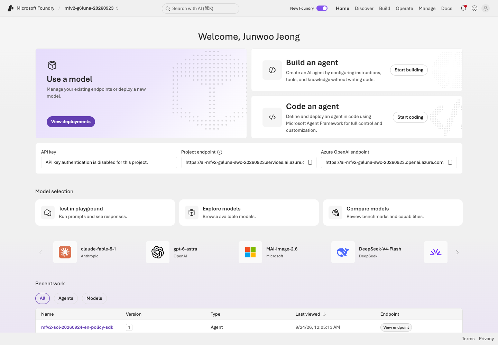
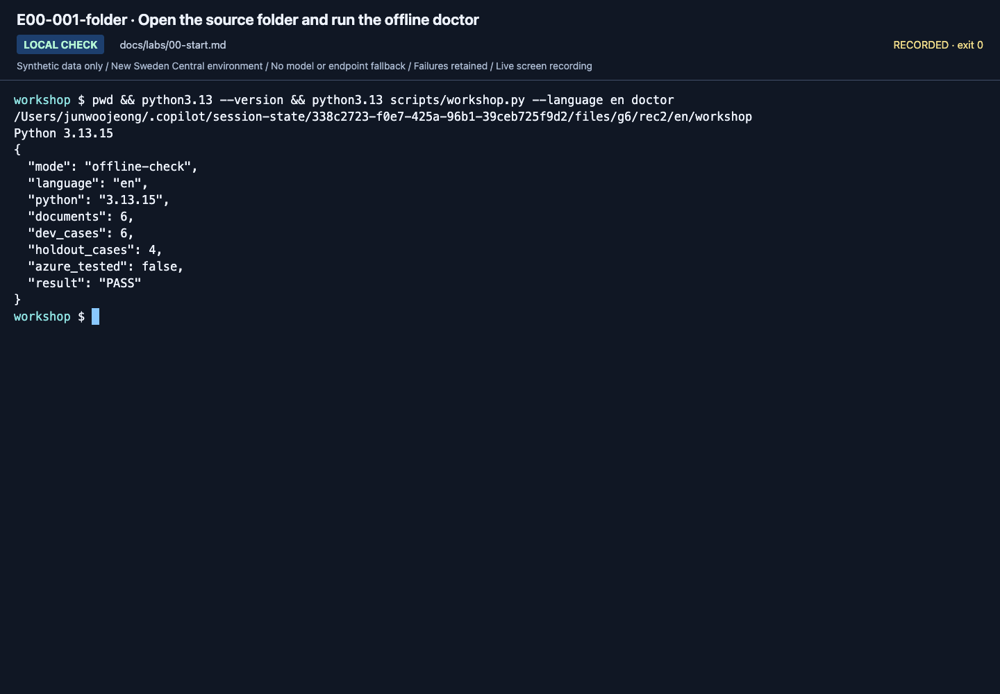
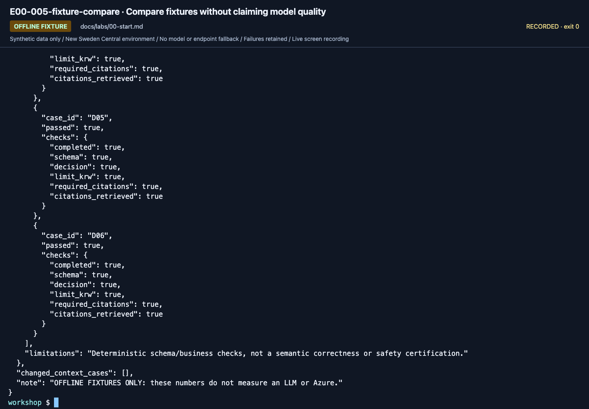
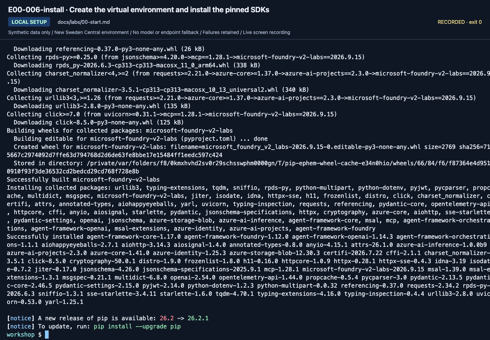
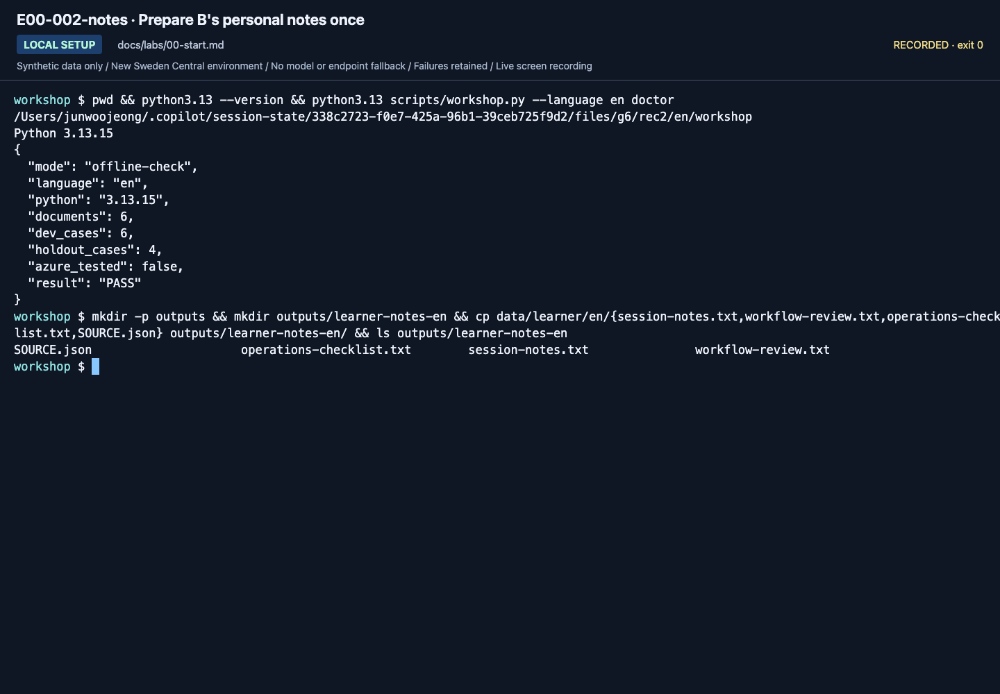
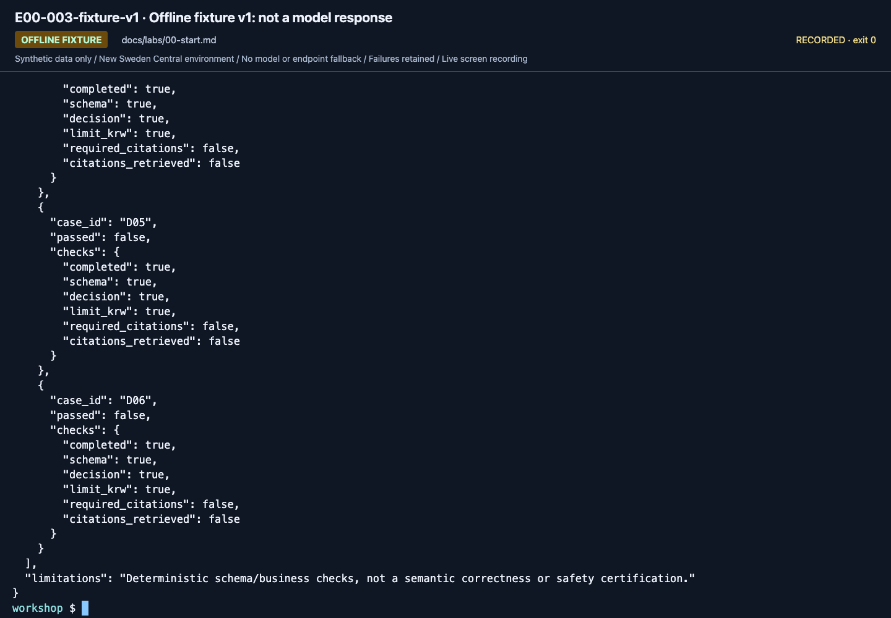
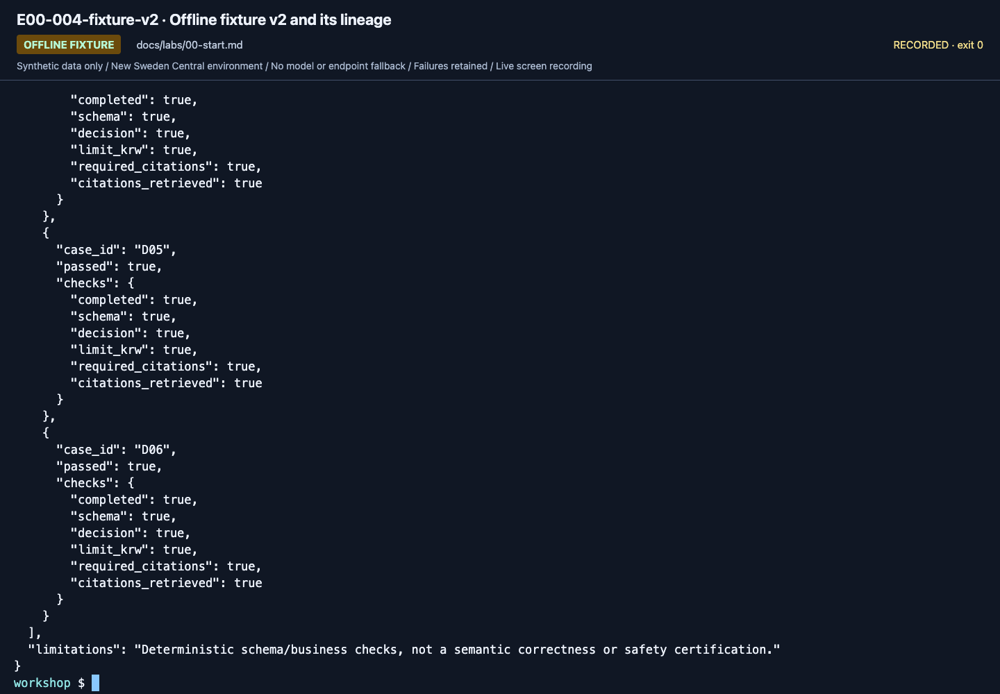
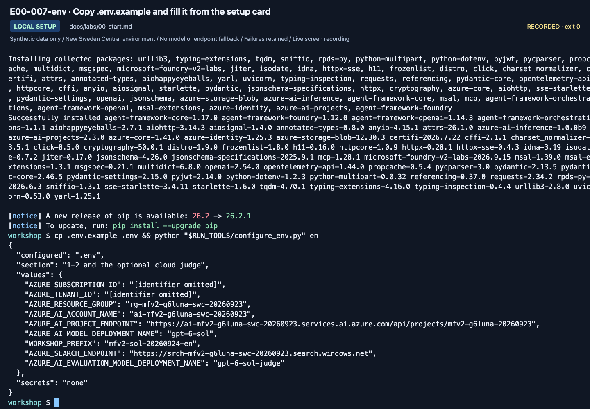

# Lab 00. Getting started and shared setup

**English** | [한국어](../ko/labs/00-start.md)

**Goal:** Identify your account, project, and learning path, and verify the starting point for the next lab.

**Open your section:** [A — browser](#path-a) · [B — code](#path-b) · [Offline only](#offline-rehearsal) · [Paths](../paths.md)

## Before you start

**This pass:** Read the setup card. A uses the browser and learner ZIP; B uses the source repository and its included notes.

**Need:** Your own account, prepared project and model; B additionally needs Python 3.13 and a terminal.

**Continue when:** A: the right project is open and the values are recorded. B: offline checks and cloud preflight are understood.

**If blocked:** Stop and ask the owner to confirm the tenant, the project name, your **Foundry User** role on the project and access to `gpt-6-sol`. Do not pick another resource.

[One-time setup and learner files](../setup.md).

## How to read this guide

<details>
<summary>Optional screenshot help — execute the current text, not the recording</summary>

Reference images come from the **September 24, 2026 English recording with `gpt-6-sol`** and dated September 25 checks/supplements.
Each caption identifies its source; these used a separate training project and synthetic learner files.
[Recordings and scope](../video-summary.md) distinguish actual calls, fixtures, observations, and what was not recorded.
Click to enlarge. Compare account, project, model, and prefix with your instructor's
values; do not copy identifiers from images.

In terminal images, read the **last entered command** (the line with text after `workshop $`)
and its output. Earlier output can remain above it. An empty prompt at the bottom means
the command finished. Distinguish `OFFLINE FIXTURE` from `LIVE AZURE`.
`RUN_TOOLS/configure_env.py` in the `.env` step is a recording helper that wrote the setup-card values; edit `.env` yourself.
**Execute the code blocks in the guide**, not text transcribed from screenshots.
More before/after views are in the [action index](../action-captures.md).

Use `--language en` for the separately frozen English policies, prompts, dev/holdout/calibration data, and fixtures.
Korean originals remain unchanged. [Language-specific hashes and labels](../reference/languages.md)
prevent translated datasets from being presented as the same-input experiment.

</details>

<a id="path-a"></a>

## A. Browser: no coding required

**Learning alone?** Finish [the self-study preparation](../setup-owner.md#self-study) first; it creates the project and model used below.

1. Open `https://ai.azure.com` in Edge or Chrome.
2. Sign in with the instructor-specified **Microsoft Entra account and directory (tenant)**.
   Personal Microsoft, GitHub, and Azure work-account sign-ins are different.
   A successful sign-in to your usual work account does not establish access to the training tenant.
   If the portal URL shows `tid=`, compare it with the setup card's tenant ID before changing permissions;
   use [the tenant check](../reference/troubleshooting.md#portal-tenant) when they differ.
3. Select the training project, not a similarly named production project.
   If the project picker is hard to use, choose **View all resources**, search for the project name,
   and check its name, parent resource and region before opening it.
4. If not already done during setup, download and extract [the learner ZIP](../../data/learner/en/learner-materials.zip) and keep `START-HERE.txt` open.
   [Lab 05](05-workflows.md) later runs one prepared option, by default a command in a prepared terminal;
   you will not write Python or build a portal workflow.
5. Open the ZIP's `session-notes.txt`. In its **Lab 00 - setup card** section, check each line you filled during setup and complete any blank one.
   Do not post whole screens or personal information in shared chat.

| Line in `session-notes.txt` | What to write |
|---|---|
| `Language / path:` | `English / A` |
| `Tenant / subscription:` | The owner's values; they match the directory you signed in to |
| `Resource group / Foundry account / project:` | The owner's values; the project matches the one you opened |
| `Full project endpoint:` | The owner's value; Lab 01 checks it on **Home** |
| `Answer deployment / model version:` | `gpt-6-sol` / `2026-09-22` |
| `Personal prefix:` | Your own, for example `mfv2-team01-en` |
| `Cost and permission owner:` | The person who approves costs and roles; yourself when learning alone |
| `Prepared MAF terminal location:` | Where to open the terminal prepared for Lab 05 (learning alone: your source folder), or `not used` for the Playground option |
| `Optional IQ Chat selected or not selected:` | `not selected`, unless the owner prepared it for you |



**What to check:** The project name at the top is your training project. The **Project endpoint** on **Home**
belongs on the `Full project endpoint:` line; it is not the browser's `ai.azure.com` address.

If the project is missing, check that you signed in to the intended tenant, then ask the owner to confirm the project name
and your **Foundry User** role. Do not create another resource. See [Troubleshooting](../reference/troubleshooting.md) for tenant and role errors.

**A done:** your intended project is open and `session-notes.txt` contains your setup values.
Continue to [Lab 01 A](01-foundry.md#path-a); the B installation instructions are not an extra A exercise.

<a id="path-b"></a>

## B. Code: one folder, one environment

Use macOS/Linux or WSL on Windows ([install WSL](https://learn.microsoft.com/windows/wsl/install)), Bash/zsh, and Python 3.13. Steps 1–3 call `python3.13`; once step 3 activates `.venv`, later commands use its `python`. The Hosted runtime also uses 3.13.
For the offline rehearsal only, Python 3.14 also works; replace `python3.13` with `python3.14` in steps 1–2.
Every workshop command in this guide passes `--language en`; without it, the CLI uses the Korean bundle.
Do not install into global Python or change the system's default Azure subscription.

If an activated, configured terminal was supplied, keep **that repository and terminal** and complete steps **1, 2 and 5**.
Do not download another copy, reinstall SDKs or replace its `.env`. Otherwise complete **1–5** in order.

<a id="reading-code-blocks"></a>

### What to copy, and where

| Block or notation | Your action |
|---|---|
| `bash` | Run in the repository terminal, not the browser console or Python's `>>>` prompt. Copy commands without the surrounding backticks |
| `dotenv` / `.env` values | Edit the named file in your editor; do not run or shell-`source` it |
| Python, JSON or YAML example | Read the surrounding instruction: it identifies explanatory code, expected output or the file to edit. It is not another terminal command |
| `<your-...>` | Replace the entire placeholder, including angle brackets, with your verified value |
| `read -r NAME` | Enter the requested value, without extra quote characters, then press Enter. Keep `$NAME` and `${NAME:?...}` unchanged in later commands |
| `outputs/...` / `.build/...` | A file path relative to the source repository root, not a command. Open it in the editor's file list; enable hidden folders if `.build` is not visible |

Run one block and inspect its result before the next. Lines joined by `\` form one command;
`&&` runs the next command only after success. A returned shell prompt means **finished**, not **passed**.
`${NAME:?...}` stops before a command if a required value is missing. Restore it from your notes, not a recording.
New terminals do not inherit values entered with `read`.

<a id="offline-rehearsal"></a>

<a id="source-folder"></a>

### 1. Open the folder

**Waiting for Azure approval?** Complete only steps 1–2 below. Neither requires Azure credentials or external Python packages.

**Already have a prepared source folder?** Use it; skip the download. Keep its `.env`, `.venv` and `outputs/`,
including any existing `outputs/azure-objects.json` ownership record.
For later Azure steps, this must be a copy prepared for **this route, language and setup card**, not merely a folder that worked in an older edition.
If its project/model differs, preserve that copy and have the owner supply the current values for a fresh copy;
do not repoint a Search-owning copy or treat the older model's successful preflight as readiness for this guide.

**No source folder yet?** Open [this repository](https://github.com/junwoojeong100/microsoft-foundry-v2-labs)
with a GitHub account that has access, then **Code → Download ZIP**, extract it and open the folder in VS Code.
This is the **source repository ZIP**, not the small learner-materials ZIP.

<a id="terminal-check"></a>

**Check the terminal before copying commands:**

- **macOS/Linux:** in VS Code, open **Terminal → New Terminal** and use Bash or zsh.
- **Windows:** use a WSL-connected VS Code window, not PowerShell or Command Prompt.
  With the [WSL extension](https://code.visualstudio.com/docs/remote/wsl) prepared, press **F1 → WSL: Reopen Folder in WSL**.
  Check that the bottom-left indicator says **WSL: …**, then open **Terminal → New Terminal** there.
  Python 3.13 and, later, Azure CLI must be available **inside WSL**; a Windows installation alone does not provide them there.

If the prompt is `>>>`, you are inside Python: enter `exit()` first to return to the terminal.
Do not paste the workshop's Bash blocks into that Python prompt.

<details>
<summary>Optional alternative: Git download without the large screenshots and videos</summary>

Use this **instead of** the ZIP download, not after it. Git must already be installed.
Run this block in the **parent directory where you want the new source folder**, not inside an existing workshop copy.
The `microsoft-foundry-v2-labs` destination must not already exist; keep older copies and their evidence.

```bash
git clone --depth 1 --filter=blob:none --sparse https://github.com/junwoojeong100/microsoft-foundry-v2-labs.git microsoft-foundry-v2-labs &&
cd microsoft-foundry-v2-labs &&
git sparse-checkout set --no-cone '/*' '!docs/assets/' '!videos/'
```

**Check:** the terminal is now inside the new `microsoft-foundry-v2-labs` folder, with `scripts/` and `pyproject.toml`.
`docs/assets/` and `videos/` are intentionally absent; view screenshots on GitHub.
If cloning or changing folders fails, `&&` prevents the next command from changing another checkout.
Stop at that error; do not run the remaining lines separately. Continue with the folder check below.

</details>

In either case, the terminal's directory must contain `README.md`, `pyproject.toml`, and `scripts/`.
If Python is missing, install [Python 3.13](https://www.python.org/downloads/) first; do not continue past a `command not found` error.

```bash
pwd
python3.13 --version
python3.13 scripts/workshop.py --language en doctor
```

Expected fields include `documents: 6`, `dev_cases: 6`, `holdout_cases: 4`,
`azure_tested: false`, and `result: PASS`. **PASS does not mean Azure sign-in succeeded.**




**What to check:** Read all three counts and `azure_tested: false`. This checks files
and the local runtime, not a successful Azure call.

**Offline only?** Skip B's personal-notes preparation below and go directly to
[step 2: fixed examples](#offline-fixtures). No setup-card values, `.env`, SDK installation or Azure sign-in are needed.
B learners and people preparing A's Lab 05 terminal complete the notes preparation before step 2.

<a id="prepare-notes"></a>

#### Prepare B's personal notes once

The source ZIP already contains the blank worksheets; **B does not need another learner ZIP or the [Lab 03 A browser agent](03-prompt-agent.md#path-a)**.
B creates its own managed agent in [Lab 03 B](03-prompt-agent.md#path-b); that is a required core step, not an optional browser exercise.
Create a separate, Git-ignored working directory. The `&&` chain stops if it exists, so it cannot overwrite earlier notes:

```bash
mkdir -p outputs &&
mkdir outputs/learner-notes-en &&
cp data/learner/en/{session-notes.txt,workflow-review.txt,operations-checklist.txt,SOURCE.json} outputs/learner-notes-en/
```

If this folder already belongs to your current pass, keep it and resume without running the copy block.
For a new pass, choose a new notes-directory name and use it consistently. Never fill files under `data/learner/`.
Open the copied `session-notes.txt` and fill its **Lab 00 - setup card** with the owner's values (path: `English / B`).
After that, use only **B - code evidence and handoff** and **Pause / resume**; skip the entire **A - browser notes only** section,
including its Playground and source-check fields. The B section has its own lab-by-lab review lines.
If an older personal copy lacks a named line, append that line there; do not replace your filled notes with the new blank template.
**Preparing only A's Lab 05 terminal?** Run the block anyway, because Lab 02 B saves `model.json` and `answer-local.json` there,
but leave this copy blank: your notes stay in the learner ZIP's `session-notes.txt`.

The B commands in Labs 02/03/04/05/06 include **`--output`**, which saves the complete JSON to this notes directory
and still prints it. **No terminal-to-editor copying is needed.** Open the saved file at each **Save** checkpoint.
The parent directory must exist; an existing file or an out-of-scope path stops before the request.
If you chose another notes directory, change every `--output` path consistently. Keep an earlier result instead of repeating a paid call.
Without `--output`, these commands still only print JSON. On a request failure, record the actual error and failed step;
no successful-response file is created. [Save behavior and recovery](../reference/commands.md#saving-json).
`collect`/`evaluate` already write `outputs/<label>/`; keep those generated folders in place and do not edit their responses.

<a id="offline-fixtures"></a>

### 2. Learn the output format without Azure

```bash
python3.13 scripts/workshop.py --language en demo --label rehearsal-v1 --prompt v1
python3.13 scripts/workshop.py --language en demo --label rehearsal-v2 --prompt v2
python3.13 scripts/workshop.py --language en compare --baseline rehearsal-v1 --candidate rehearsal-v2
```

Open `manifest.json`, `responses.jsonl`, and `business-evaluation.json` in
`outputs/rehearsal-v2/`. v1 removes citations from **fixed answers** to exercise the
checker; v2 uses the original fixture. Their score difference is **not a measured
prompt improvement**. Use fresh labels such as `rehearsal2-v1` to rerun.




**What to check:** Read `OFFLINE FIXTURE` and the final warning. No model was called
with two prompts to obtain this difference.

**Offline-only stop:** keep the two fixture folders and record cloud labs **not run**.
The following SDK/sign-in steps are for the code route, not required to finish this rehearsal.

### 3. Install a virtual environment and SDKs

```bash
python3.13 -m venv .venv &&
source .venv/bin/activate &&
python -m pip install -e ".[cloud,agents]"
```

Keep the `&&` separators: installation runs only after the virtual environment is created and activated successfully.
If either step fails, fix that first error; do not run the `pip install` line separately against global Python.

Versions are pinned in `pyproject.toml`. Do not add the entire `agent-framework`
metapackage. Add `.[hosted]` only for [selected Hosted/Toolbox SDK work](extensions/developer-toolkit.md#hosted-sdk), not for B's package-only Lab 08. Never bypass download errors by
disabling certificate validation or using an untrusted mirror.

In each new terminal, return to the repository root and reactivate the venv.
Do not paste Bash into a browser developer console or Python's `>>>` prompt.




**What to check:** The output ends with `Successfully installed …`; a following `[notice]` about a newer pip is not an error, and you do not upgrade pip.
A line starting with `ERROR` means stop and resolve the installation first. Installation is not Azure connectivity.

### 4. Sign in and configure `.env`

Use the [official Azure CLI installation guide](https://learn.microsoft.com/cli/azure/install-azure-cli).
**Already signed in with your own training account? Keep that sign-in.** Prepare `.env` below, then use step 5 to check
the configured subscription and tenant. Opening a new terminal or preparing `.env` does not require another login.
If you have not signed in, use the [sign-in block](#azure-sign-in) below before step 5.

```bash
if [ -e .env ] || [ -L .env ]; then
  printf '%s\n' '.env exists; edit it without replacing it.'
else
  cp .env.example .env
fi
```

**What to check:** `.env` now exists, or the block printed `.env exists`, so you inspect the existing file.
This file-preparation block neither signs in nor changes the Azure CLI default subscription.

Open `.env` in VS Code and fill **section 1** with the setup-card values. Keep its local defaults;
add **section 2's Search endpoint only for Lab 06**. Leave the advanced fields alone unless that module is selected.
If `.env` already exists, inspect it instead of overwriting it with the copy command.

| Required setting | Source |
|---|---|
| `AZURE_SUBSCRIPTION_ID`, `AZURE_TENANT_ID` | IDs of the designated subscription/directory |
| `AZURE_RESOURCE_GROUP`, `AZURE_AI_ACCOUNT_NAME` | Prepared training resources |
| `AZURE_AI_PROJECT_ENDPOINT` | **Full** project endpoint |
| `AZURE_AI_MODEL_DEPLOYMENT_NAME` | `gpt-6-sol`; owner verifies model version `2026-09-22` |
| `WORKSHOP_PREFIX` | Must start with `mfv2-`; lowercase letters/digits and single hyphens, no trailing hyphen, at most 32 characters total |
| `WORKSHOP_AUTH_MODE` | `cli` locally; `managed-identity` only in an actual Azure runtime |

Scripts read `.env` without replacing existing process variables. Old endpoint
variables in a terminal can therefore take precedence. Check again in a fresh terminal.
Do not store API keys, passwords, or access tokens in this file.
No Microsoft 365 account or real customer document is needed.

<a id="azure-sign-in"></a>

<details>
<summary>First sign-in or expired authentication only — not a routine setup or 403 recovery step</summary>

Learners sign in themselves. **`az login --tenant` can still select/change the Azure CLI default subscription**
([official behavior, checked 2026-09-25](https://learn.microsoft.com/cli/azure/authenticate-azure-cli-interactively#subscription-selector)).
If an existing shared profile's default must remain unchanged, stop and ask the owner for an isolated, learner-signed-in
environment rather than running this block there. Do not use `az account set`, `az logout` or `az account clear` as a shortcut.

Only in your own profile or the owner-prepared isolated environment:

```bash
printf 'Azure tenant ID from your setup card: '
read -r AZURE_TENANT_ID
az login --tenant "${AZURE_TENANT_ID:?Enter the tenant ID from your setup card}"
```

Verify that the sign-in lists your own account in the intended tenant and subscription, then return to step 5.
The workshop uses `.env`'s `AZURE_SUBSCRIPTION_ID` without changing the default; login alone does not establish model permissions.
For a 403, have the owner check the actual caller and required role instead of repeatedly signing in.

</details>

### 5. Run the read-only Azure preflight

```bash
python scripts/workshop.py --language en doctor --cloud
```

Verify the setup card's subscription, tenant and full project endpoint. For this core route, require
**deployment name `gpt-6-sol`, underlying model `gpt-6-sol`, version `2026-09-22`, and state `Succeeded` together**.
`doctor --cloud` reports the configured deployment; `Succeeded` on an older model is not a pass for this preset.
This command creates no resources and does not change the default subscription.
If it reports an authorization error, ask the owner for **Reader** on the training Foundry account; the preflight reads the deployment through Azure Resource Manager.
Preflight does not prove data-plane permissions or Structured Outputs support;
[Lab 02](02-models.md) tests an actual request.


**What to check:** Read `deployment.name`, `deployment.model.name`, `deployment.model.version`,
`deployment.state: Succeeded`, `inference_tested: false`, and `note`.
Only an actual response verifies inference. If preparing A's terminal, complete Lab 02 B's actual response checks,
then use [its A return choices](02-models.md#a-terminal-ready): start A from Lab 00, or resume Lab 05 only if you paused there.

**B done:** the local checks pass and the intended deployment passes read-only preflight.
Continue to [Lab 02 B](02-models.md#path-b) for actual inference. Keep all later terminal commands at this repository root with `.venv` active.

<details>
<summary>More September 24 gpt-6-sol captures (reference; not steps to repeat)</summary>

These captures come from the September 24, 2026 English recording with `gpt-6-sol` / `2026-09-22`. Use your own resource names, versions and results.



**What to check:** B prepares the personal notes folder once; later commands save their JSON there. Nothing here calls Azure.



**What to check:** `OFFLINE FIXTURE` v1 is a fixed sample file, not a model response. Its failed checks are part of the exercise.



**What to check:** v2 changes only the fixture. Read its lineage fields; do not treat the result as model quality.



**What to check:** The recording's `RUN_TOOLS/configure_env.py` helper wrote the setup-card values into `.env`; edit yours by hand. Compare the project endpoint, `gpt-6-sol`, the judge deployment and your prefix with your own card.

[Full action index](../action-captures.md) · [Recordings](../video-summary.md)

</details>

## Completion

- A: Open the correct project and explain the deployment name and chosen path.
- B: Complete offline checks and SDK installation, and understand cloud preflight results.
- Waiting for approval: record **Azure labs not run** if you completed only the offline exercise.

Next: A → [Lab 01](01-foundry.md#path-a) · B → [Lab 02](02-models.md#path-b)
