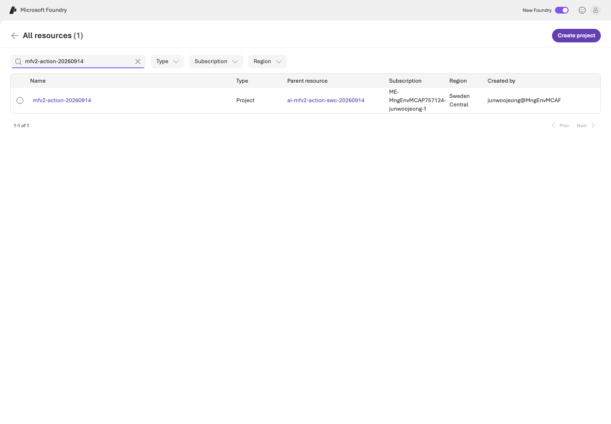
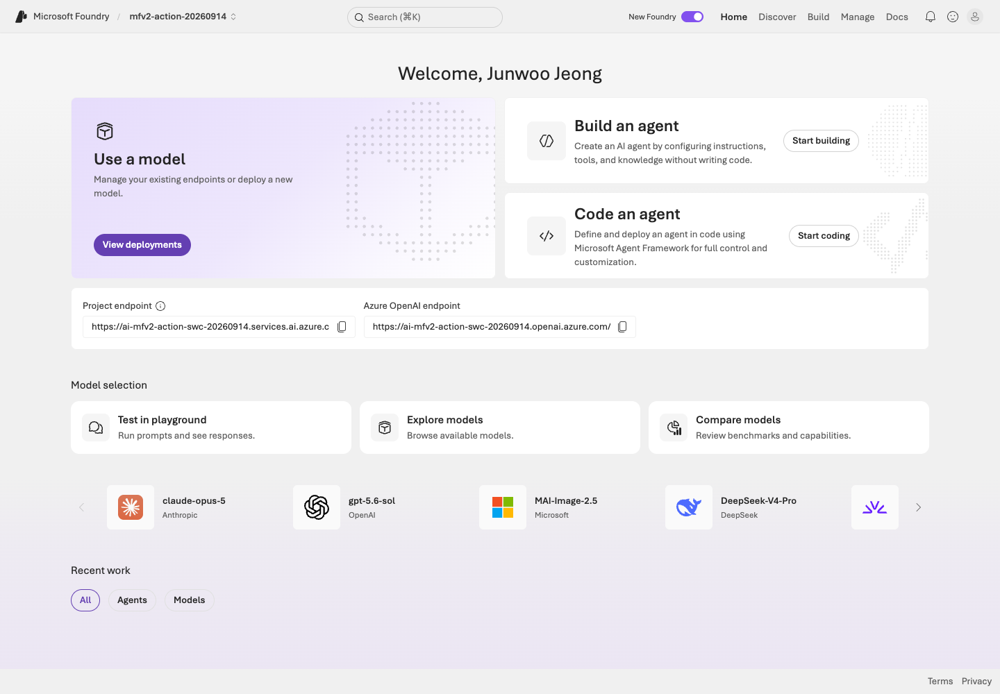
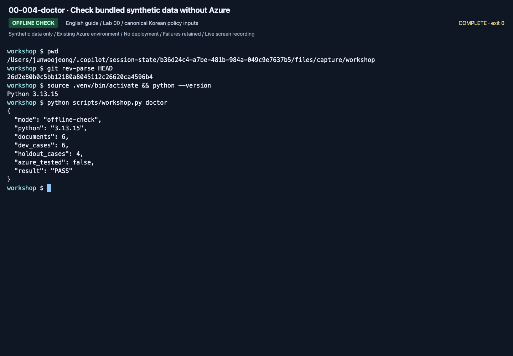
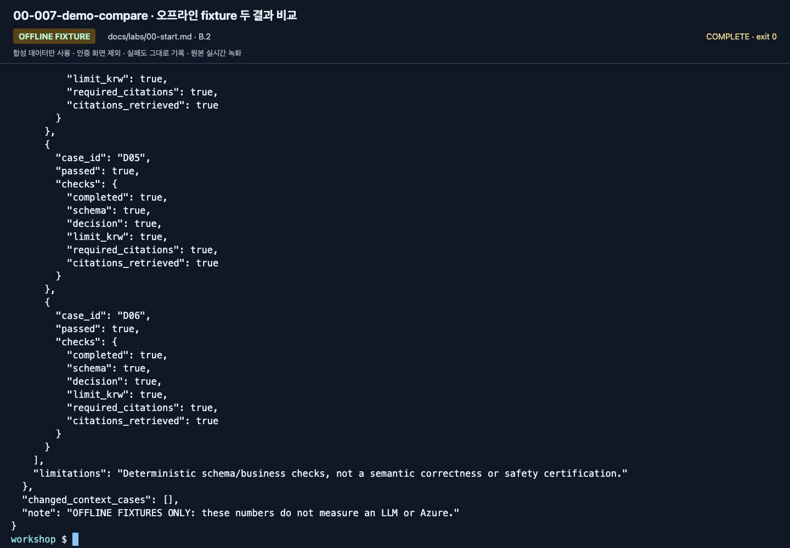
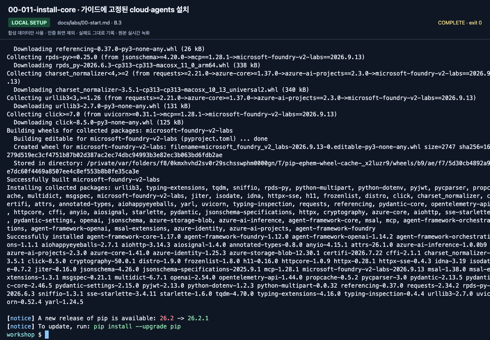
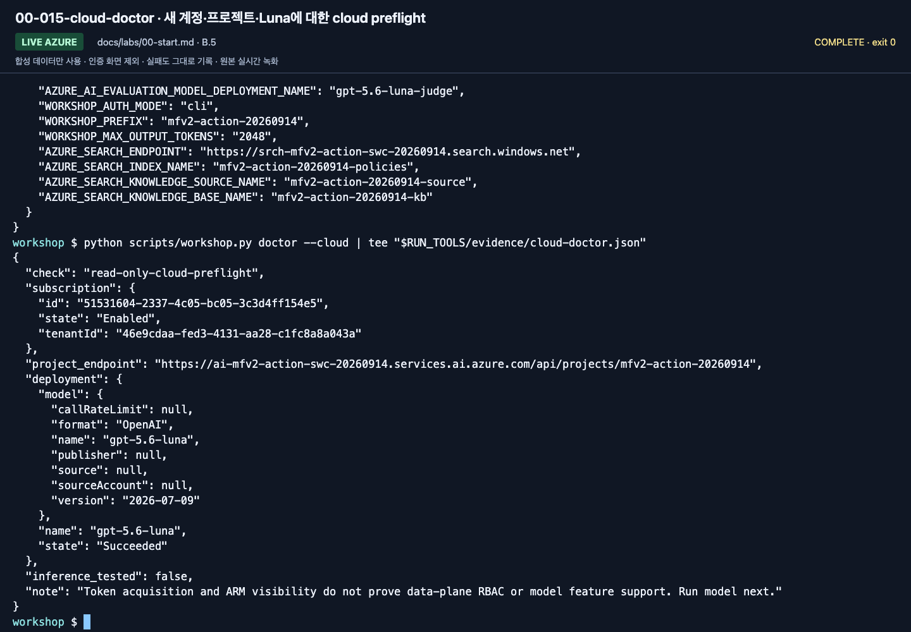

# Lab 00. Getting started and shared setup

**English** | [한국어](../ko/labs/00-start.md)

**Goal:** Identify your account, project, and learning path, and verify the starting point for the next lab.

Parent: [Learning paths](../paths.md) · Next: [Lab 01](01-foundry.md)

## How to read this guide

Reference images include **September 14 source captures** and individually dated
**September 15 English-guide captures**. [New recordings and scope](../english-recordings.md)
separate actual calls, local document views, and historical reports.
Click to enlarge. Compare account, project, model, and prefix with your instructor's
values; do not copy identifiers from images.

In terminal images, read the **last entered command** (the line with text after `workshop $`)
and its output. Earlier output can remain above it. An empty prompt at the bottom means
the command finished. Distinguish `OFFLINE FIXTURE` from `LIVE AZURE`.
`RUN_TOOLS` and extra `tee` paths are recording helpers, not learner commands.
**Execute the code blocks in the guide**, not text transcribed from screenshots.
More before/after views are in the [action index](../action-captures.md).

Both languages use unchanged Korean synthetic policies, prompts, and policy questions.
Copy those inputs exactly for a comparable run; use the [English meanings](../reference/languages.md)
to interpret them. An English-language model evaluation would require a separately versioned dataset.

## A. Browser: no coding required

1. Open `https://ai.azure.com` in Edge or Chrome.
2. Sign in with the instructor-specified **Microsoft Entra account and directory (tenant)**.
   Personal Microsoft, GitHub, and Azure work-account sign-ins are different.
3. Select the training project, not a similarly named production project.
4. Fill the first four worksheet rows below. Do not post whole screens or personal information in shared chat.
5. Continue to [Lab 01](01-foundry.md). The instructor handles installation.
   In [Lab 05](05-workflows.md), copy commands into the prepared MAF terminal;
   you will not write Python or build a portal workflow.



**What to check:** If the project picker is hard to use, choose **View all resources**,
enter the training project name, and verify the result's name, parent resource, and region before opening it.



**What to check:** The project name at the top must change. **Project endpoint** is the
value for `.env`; it is not the browser's `ai.azure.com` address. Authentication/PIN screens were not recorded.

| Item | Your value |
|---|---|
| Training tenant/subscription | Supplied by the instructor |
| Foundry resource/project | Supplied by the instructor |
| Model **deployment name** | Distinct from its catalog name |
| Personal/team agent prefix | Example: `mfv2-team01-0913` |
| Path | A / B |
| Execution status | Personally run / instructor observation / not run |

If the project is missing, **do not create another resource with a random account**.
Use the tenant/RBAC section of [Troubleshooting](../reference/troubleshooting.md).

## B. Code: one folder, one environment

Use macOS/Linux or WSL on Windows, Bash/zsh, and preferably Python 3.13.
Offline code also targets Python 3.14, but the hosted runtime uses 3.13.
Do not install into global Python or change the system's default Azure subscription.

### 1. Open the folder

Extract the supplied ZIP or open this repository in VS Code. The terminal directory
must contain `README.md`, `pyproject.toml`, and `scripts/`. Use the actual repository
URL rather than guessing a clone URL. For Hosted, use a standalone directory outside
other azd projects.

```bash
pwd
python3.13 --version
python3.13 scripts/workshop.py doctor
```

Expected fields include `documents: 6`, `dev_cases: 6`, `holdout_cases: 4`,
`azure_tested: false`, and `result: PASS`. **PASS does not mean Azure sign-in succeeded.**

**New English-guide capture: September 15, 2026.** ▶ [Watch this action](https://github.com/user-attachments/assets/082ede4b-d363-474c-ad47-598b20f593e9#t=58.68)



**What to check:** Read all three counts and `azure_tested: false`. This checks files
and the local runtime, not a successful Azure call.

### 2. Learn the output format without Azure

```bash
python3.13 scripts/workshop.py demo --label rehearsal-v1 --prompt v1
python3.13 scripts/workshop.py demo --label rehearsal-v2 --prompt v2
python3.13 scripts/workshop.py compare --baseline rehearsal-v1 --candidate rehearsal-v2
```

Open `manifest.json`, `responses.jsonl`, and `business-evaluation.json` in
`outputs/rehearsal-v2/`. v1 removes citations from **fixed answers** to exercise the
checker; v2 uses the original fixture. Their score difference is **not a measured
prompt improvement**. Use fresh labels such as `rehearsal2-v1` to rerun.



**What to check:** Read `OFFLINE FIXTURE` and the final warning. No model was called
with two prompts to obtain this difference.

### 3. Install a virtual environment and SDKs

```bash
python3.13 -m venv .venv
source .venv/bin/activate
python -m pip install -e ".[cloud,agents]"
```

Versions are pinned in `pyproject.toml`. Do not add the entire `agent-framework`
metapackage. Add `.[hosted]` only for that lab. Never bypass download errors by
disabling certificate validation or using an untrusted mirror.

In each new terminal, return to the repository root and reactivate the venv.
Do not paste Bash into a browser developer console or Python's `>>>` prompt.



**What to check:** The command has ended and the shell prompt returned. Resolve any
installation errors; matching the final screen is not sufficient. Installation is not Azure connectivity.

### 4. Sign in and configure `.env`

Use the [official Azure CLI installation guide](https://learn.microsoft.com/cli/azure/install-azure-cli).
Learners sign in themselves.

```bash
az login
cp .env.example .env
```

Open `.env` in VS Code and enter instructor-provided values. If it already exists,
inspect it instead of overwriting it with the copy command.

| Required setting | Source |
|---|---|
| `AZURE_SUBSCRIPTION_ID`, `AZURE_TENANT_ID` | IDs of the designated subscription/directory |
| `AZURE_RESOURCE_GROUP`, `AZURE_AI_ACCOUNT_NAME` | Prepared training resources |
| `AZURE_AI_PROJECT_ENDPOINT` | **Full** project endpoint |
| `AZURE_AI_MODEL_DEPLOYMENT_NAME` | Actual model deployment name |
| `WORKSHOP_PREFIX` | Unique personal/team `mfv2-...` prefix |
| `WORKSHOP_AUTH_MODE` | `cli` locally; `managed-identity` only in an actual Azure runtime |

Scripts read `.env` without replacing existing process variables. Old endpoint
variables in a terminal can therefore take precedence. Check again in a fresh terminal.
Do not store API keys, passwords, or access tokens in this file.
No Microsoft 365 account or real customer document is needed.

### 5. Read-only Azure preflight

```bash
python scripts/workshop.py doctor --cloud
```

Verify subscription, tenant, underlying model/version, and deployment state `Succeeded`.
This command creates no resources and does not change the default subscription.
Ask the instructor if you cannot read ARM.
Preflight does not prove data-plane permissions or Structured Outputs support;
[Lab 02](02-models.md) tests an actual request.



**What to check:** Read `model`, `version`, `provisioningState: Succeeded`,
`inference_tested: false`, and `next_step`. Only an actual response verifies inference.

## Completion

- A: Open the correct project and explain the deployment name and chosen path.
- B: Complete offline checks and SDK installation, and understand cloud preflight results.
- Waiting for approval: record **Azure labs not run** if you completed only the offline exercise.
