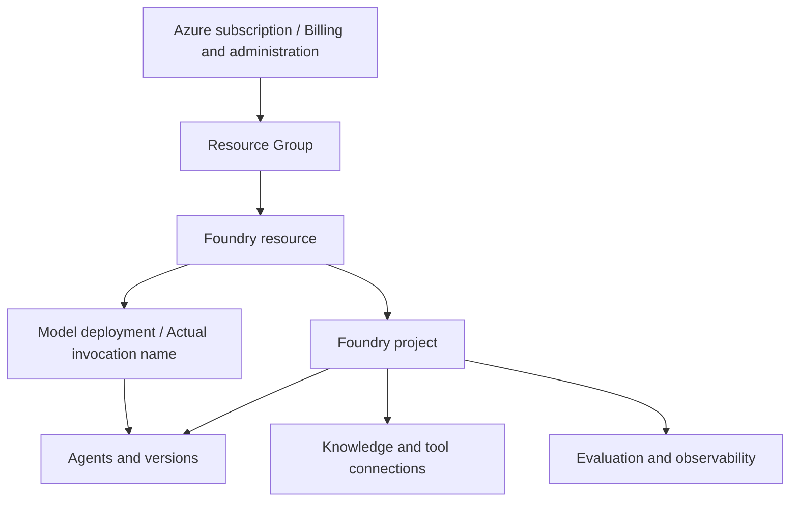
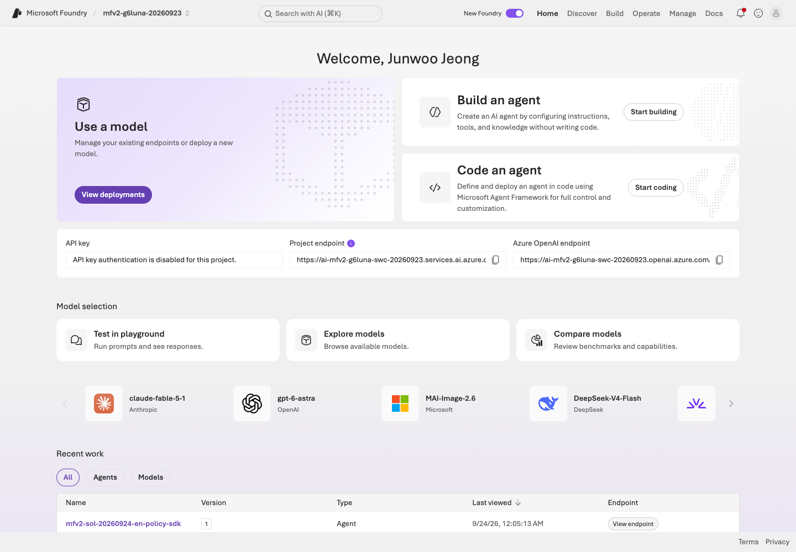

# Lab 01. Understand Foundry and prepare a project

**English** | [한국어](../ko/labs/01-foundry.md)

**Goal:** Explain the relationship between Foundry, Agent Framework, model deployments, and agents.

**Open your section:** [A — prepared project](#path-a) · B: [skip to Lab 02 B](02-models.md#path-b) · [Paths](../paths.md)

## Before you start

**This pass:** A verifies the prepared project; environment owners use section 2 only if it is not prepared.

**Need:** The setup card's tenant, project, account and gpt-6-sol deployment.

**Continue when:** You can distinguish account, project, deployment and agent, and identify your own endpoint.

**If blocked:** Stop and ask the owner to confirm the tenant, project name, your **Foundry User** role and `gpt-6-sol` access. Do not open a similarly named project.

[One-time setup and learner files](../setup.md).

## Distinguish four concepts

| Concept | Plain-language meaning | Workshop example |
|---|---|---|
| Foundry resource | Azure resource operating AI services | Training Foundry account |
| Project | Workspace for agents, connections, and evaluations | Hanbit Technology training project |
| Model deployment | Configuration exposing a model/version/SKU for calls | This preset's invocation name: `gpt-6-sol` |
| Agent | Model plus instructions, tools, and execution behavior | Travel-policy assistant |

**Foundry is the cloud platform. Microsoft Agent Framework (MAF) is the open-source
SDK for building agents and workflows in code.** Local MAF can still make billable Azure model calls.

## 1. Check the prepared environment

1. Open `https://ai.azure.com` and select your training project. Its name appears at the top, next to **Microsoft Foundry**.
2. On **Home**, find **Project endpoint** and select its copy icon. Paste it into the `Full project endpoint:` line of `session-notes.txt`.
3. On the same page, select **View deployments** and find the **`gpt-6-sol`** row. Close the list when you have seen it.
4. Select **Build** in the top bar (not the **Start building** button). In the left menu, find **Agents**, **Models**, **Knowledge** and **Evaluations**:
   they all belong to this one project. Menu labels can differ by language or rollout; look for the same objects.
   Continue when you see them under your project's name; if they are missing, check that you opened the training project,
   not the Foundry account or another project.

**What to check:** the **Project endpoint** ends with `/api/projects/<project>`; the **Azure OpenAI endpoint** beside it
ends with `.openai.azure.com` and is a different endpoint. **View deployments** opens model deployments and
**Start building** creates an agent: they are different assets in the same project.
The `gpt-6-sol` row shows version **`2026-09-22`** and **Succeeded**; `gpt-6-sol-judge` is the separate evaluation deployment.

If you see a classic Hub project or threads/runs code instead, stop and use the [migration map](../reference/migration.md).

## Check the endpoint on your setup card

| Purpose | Shape |
|---|---|
| Project SDK | `https://<account>.services.ai.azure.com/api/projects/<project>` |
| Account Azure OpenAI API | `https://<account>.openai.azure.com/openai/v1/` |
| Azure AI Search | `https://<search>.search.windows.net` |
| Browser portal | `https://ai.azure.com` — **not an SDK endpoint** |

Keep `/api/projects/<project>` in the project endpoint. The project SDK handles
authentication and endpoints for default inference. Do not silently redirect to
another endpoint or guess a different token audience.

## Write your sketch and explanation

In the **Lab 01** section of `session-notes.txt`, write:

1. The chain with your own names: `Foundry resource <account> → project <project> → deployment gpt-6-sol → agent (Lab 03)`.
2. This sentence: `Replacing the model means rechecking the agent's instructions, knowledge, evaluation and permissions.`

**A done:** the **Lab 01** section has your chain and sentence, and the `Full project endpoint:` line is filled in.
Continue to [Lab 02 A](02-models.md#path-a). You do not create resources or assign roles in this prepared-project exercise.

Owner reference only — resource creation and role assignments are not learner steps

## 2. No environment yet: instructor/administrator preparation

These steps are outside participant class time and require separate authorization.

1. Select a training subscription and dedicated resource group.
2. Create a Foundry resource and current project following the
   [official quickstart](https://learn.microsoft.com/azure/foundry/quickstarts/get-started-code).
3. Verify **model/SKU/quota** before choosing a region. If using Hosted, separately
   check [Hosted regions](https://learn.microsoft.com/azure/foundry/agents/concepts/hosted-agents);
   the region lists need not match.
4. Prepare `gpt-6-sol`, model version `2026-09-22`, with the exact deployment name `gpt-6-sol`.
   Check availability rather than copying a recording's region/SKU/capacity.
5. Assign necessary project roles and wait for propagation.
6. Verify an actual model request with a learner account.
7. Prepare Search, Application Insights, and Hosted only for selected modules.

Resource-creation permission does not imply model-invocation permission.
**Management-plane and data-plane permissions differ.** Do not give every learner subscription Owner.

The September 24 recording used a training project prepared before recording; the recording did not create it.
Use [the environment-owner checklist](../setup.md#4-environment-owner-checklist) for preparation, not commands transcribed from a recording.

## 3. Starting points for least privilege

| Actor | Starting role | Scope |
|---|---|---|
| Learner developing agents/evaluations | `Foundry User` | Training project |
| Caller of an existing agent | `Foundry Agent Consumer` | Relevant agent |
| Hosted deployer to an existing project | Deployment-guide roles such as `Foundry Project Manager` | Relevant project |
| Resource/role preparer | Creation and required role-assignment permissions | Dedicated training scope |
| Log reader | Such as `Log Analytics Reader` | Connected observability resource |

Names may still display as `Azure AI User`; renaming does not change existing role IDs.
Check additional permissions and IDs in [official RBAC guidance](https://learn.microsoft.com/azure/foundry/concepts/rbac-foundry).
The user, Search managed identity, and Hosted agent identity are separate principals.

**What to check:** Compare the deployment returned by `doctor --cloud` with your
settings. ARM read access does not establish inference permission; complete [Lab 02](02-models.md).

[Full action index](../action-captures.md) · [Recordings](../video-summary.md)

## Completion

Explain whether knowledge and evaluation criteria can remain when a model is replaced.
A deployment can change, but that does not automatically revalidate knowledge,
instructions, evaluation, or permissions. Later modules deliberately reuse the same data and criteria.

Next: A → [Lab 02](02-models.md#path-a) · B: [skip to Lab 02](02-models.md#path-b)
