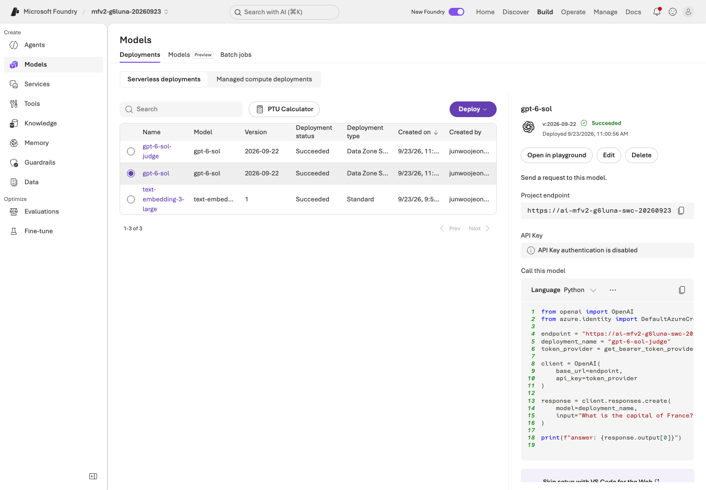
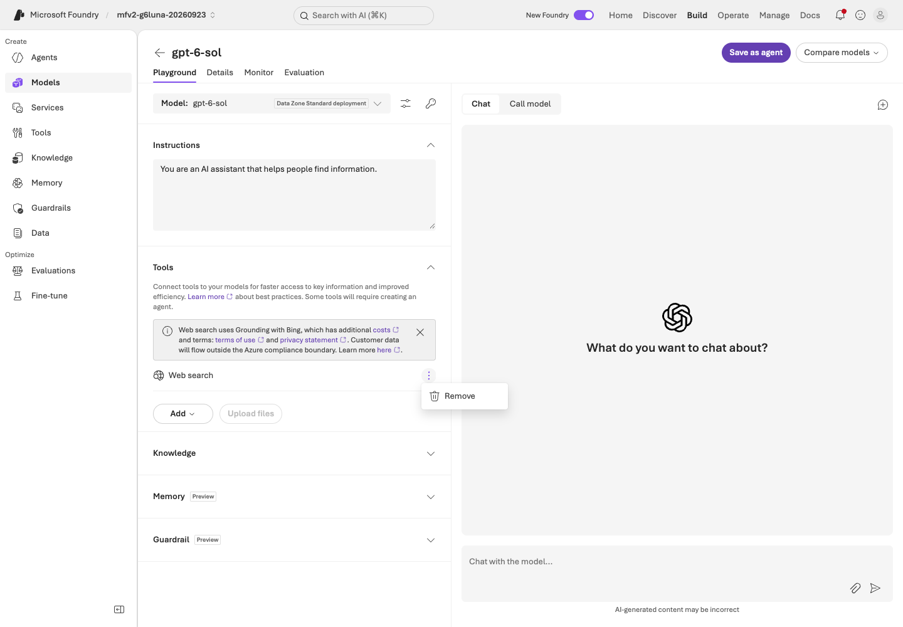
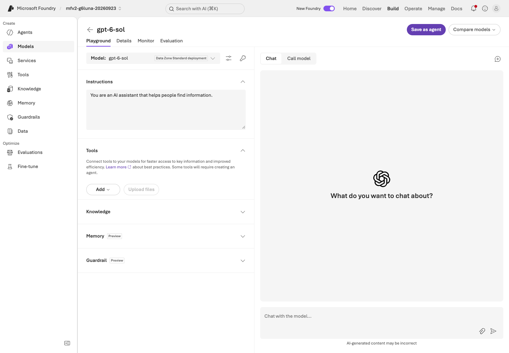
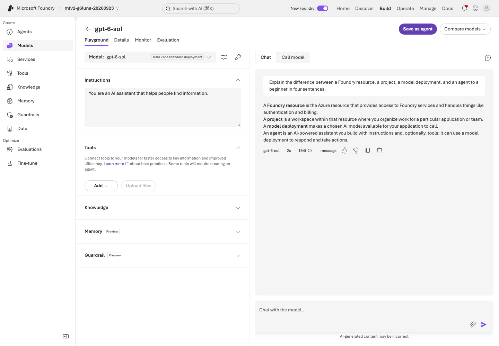
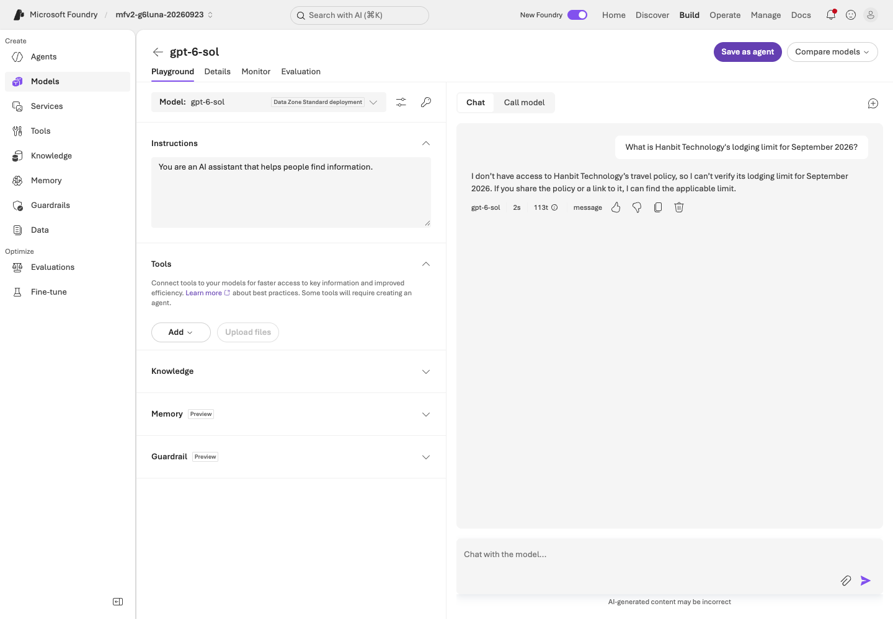
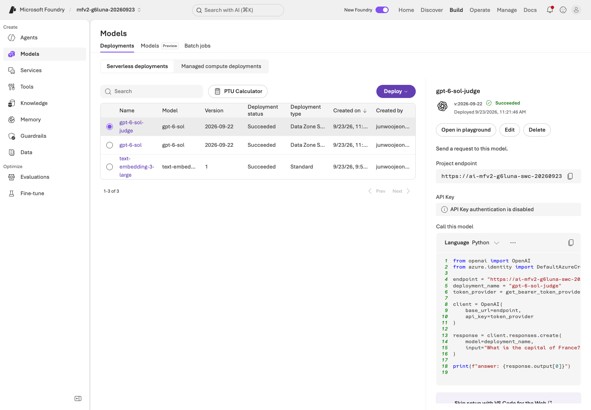
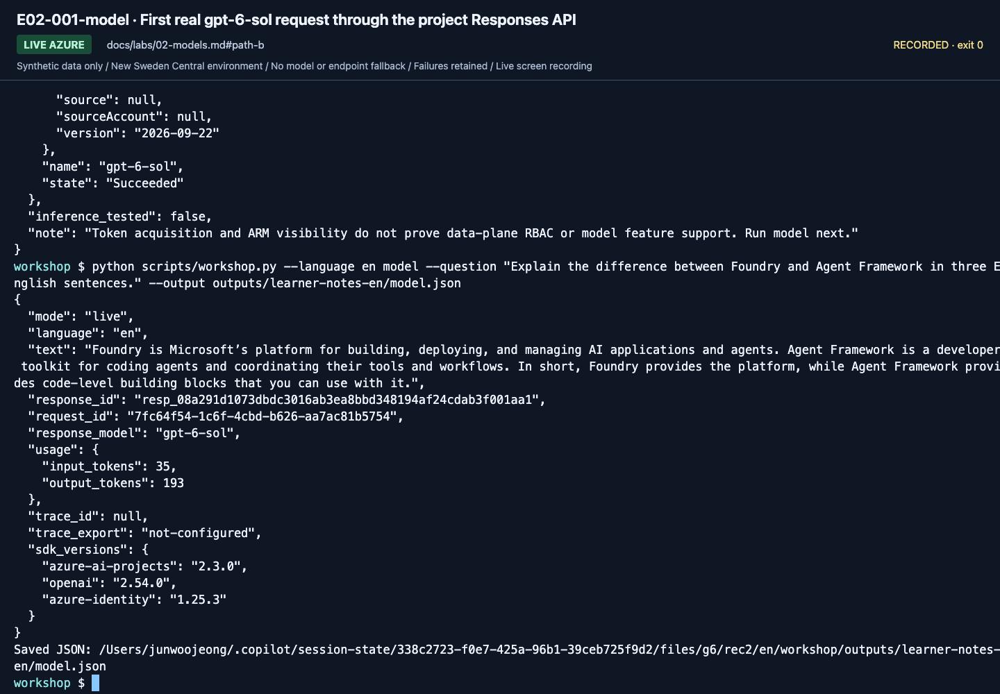
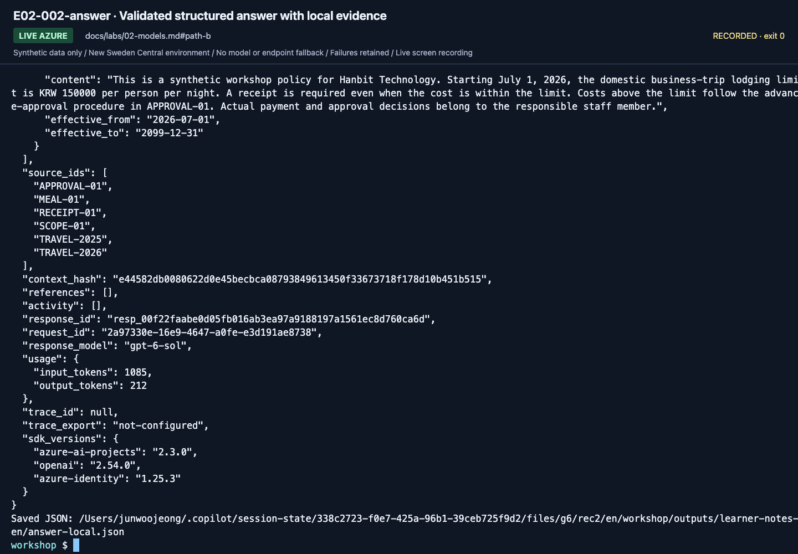

# Lab 02. Use the prepared model and make a real request

**English** | [한국어](../ko/labs/02-models.md)

**Goal:** Distinguish model names from deployment names and obtain one actual response.

**Open your section:** [A — Playground](#path-a) · [B — SDK](#path-b) · [Paths](../paths.md)

## Before you start

**This pass:** A uses the Playground; B checks the deployment and saves two real responses. Model comparison is optional.

**Need:** The prepared gpt-6-sol deployment; B needs Lab 00's activated environment and .env.

**Continue when:** A real response and the actual deployment are recorded. B also has a validated structured answer.

**If blocked:** Stop and tell the owner the error. For 401/403, ask them to check your **Foundry User** role on the project; for 429, ask them to check the deployment's quota (TPM). For a missing deployment, ask them to prepare `gpt-6-sol`. Do not switch models.

[One-time setup and learner files](../setup.md).

<a id="path-a"></a>

## A. Browser: start in the Playground

These requests call the real model and use the approved training budget. Save both actual observations in `session-notes.txt`.

### 1. Identify the deployment

On the project **Home** page, select **View deployments**, then select the **`gpt-6-sol`** row.
Check model **`gpt-6-sol`** and version **`2026-09-22`** against the `Answer deployment / model version:` line of `session-notes.txt`
(here the deployment and model names match, but they are different things).




**What to check:** **Name** is the invocation name; **Model** and **Version** identify the
underlying model. The list also has `gpt-6-sol-judge`, which only scores optional evaluations.
Even if the right panel's sample code shows the judge, send questions in the `gpt-6-sol` Playground.

### 2. Disable external web tools

Select the **`gpt-6-sol`** name link to open its Playground. In **Tools**, find **Web search**,
open its **⋮** menu and select **Remove**. The core workshop does not query the external web.




**What to check:** the **⋮** menu of the **Web search** row shows **Remove**.
The **X** on the notice above it only closes the notice; it does not remove the tool.




**What to check:** Verify that the Web search row is gone before entering a question.
Recheck tools whenever you switch Playgrounds or create an agent.

### 3. Enter a question and inspect the response

Select **Chat with the model...** at the lower right (not **Instructions** on the left), paste this question and select the send arrow:

> Explain the difference between a Foundry resource, a project, a model deployment,
> and an agent to a beginner in four sentences.


**What to check:** the question is in the chat box at the lower right.
**Instructions** on the left is a system-instruction field; leave it unchanged.




**What to check:** in the **Lab 02** section of `session-notes.txt`, fill `Deployment / time / usage:` and
paste the full answer on `Actual concept-explanation response:`. The recording is a separate run, not your own response.

### 4. Compare a question without evidence

Select **New chat** (the + icon at the top right of the chat), then ask the canonical question:
`What is Hanbit Technology's lodging limit for September 2026?`

**No synthetic policies have been supplied yet, so the model should not pretend to
know an amount.** This is not a test of knowledge about an actual company.




**What to check:** Does it request evidence or clarification? A plausible invented
amount is an ungrounded response, not a success. Paste the answer on
`Actual response to the question without policy evidence:` and write your conclusion on `My finding:`.

A model alone does not supply company policy, effective dates, or approval rules.
When you select the back arrow (←) or another menu, **Leave without saving?** can appear.
Choose **Leave without saving**: these temporary Playground settings are not needed and do not apply to new agents.




**What to check:** If navigation seems stuck, look for the confirmation dialog.
Discard only the temporary settings you intended to leave unsaved.

### If no deployment exists

Stop and ask the owner to prepare **`gpt-6-sol`** (version `2026-09-22`) as described on [the setup card](../setup.md).
Do not select `gpt-6-sol-judge`, a router or another model to get past it ([why this model](../reference/model-choice.md)).

**A done:** you have the actual deployment/version, one concept response and one observation without policy evidence.
Continue to [Lab 03 A](03-prompt-agent.md#path-a). Do not run B's SDK calls unless preparing your own Lab 05 terminal.

<a id="path-b"></a>

## B. Code: call the same project through Responses

Use the repository root and activated `.venv`. The preflight is read-only; the model and structured-answer requests are billable.
In `session-notes.txt`'s B section, use `Lab 02 model.json / answer-local.json findings:` for one finding per saved file.
The A-only Playground fields are not required for these SDK calls.

### 1. Check the deployment

```bash
python scripts/workshop.py --language en doctor --cloud
```

Continue only after preflight identifies the intended deployment in `Succeeded` state. This does not test inference.

### 2. Save one actual model response

```bash
python scripts/workshop.py --language en model \
  --question "Explain the difference between Foundry and Agent Framework in three English sentences." \
  --output outputs/learner-notes-en/model.json
```

Results retain `response_id`, actual `response_model`, and token usage.
`trace_id: null` means no Application Insights trace has been collected;
do not relabel a response ID as a trace ID.
In the 2026-09-24 check, direct Responses calls such as `model`, `answer`, `maf` and `collect` produced no server-side spans
in the project's connected Application Insights; managed agent calls do (Lab 03 B, checked in [Lab 09](09-operations.md#path-b)).




**What to check:** Read `text`, `response_model`, `response_id`, and `usage` below
the last command. `usage` shows `input_tokens` and `output_tokens`; with `gpt-6-sol` the output count includes reasoning, so it can be larger than the short answer suggests. Preserve `trace_id: null` and `trace_export: not-configured` honestly.

**Save:** `model.json` is written to your Lab 00 notes directory by `--output`. Open the complete saved response before the next request.

<a id="verify-structured-outputs"></a>

### 3. Save a validated structured answer

```bash
python scripts/workshop.py --language en answer --prompt v2 --retrieval local \
  --output outputs/learner-notes-en/answer-local.json
```

The command performs local keyword retrieval over synthetic documents, then calls a
**real Azure model**. Inspect `answer`, `decision`, `limit_krw`, and `citations`.
`local` describes retrieval, **not an offline model**.




**What to check:** Read the complete output: answer fields, `source_ids`, `response_id`,
`usage`, and `trace_export`. A correct amount without its sources is not enough.

**Save:** `answer-local.json` is written to the same notes directory. Check its source and response metadata, not just the answer.

Stop if the model rejects `json_schema`. The code does not silently switch to plain
text or repair invalid JSON. Explicitly configure an instructor-verified deployment
and record a new run after resolving support.

<a id="a-terminal-ready"></a>

**Preparing A's terminal rather than taking B?** The terminal is now ready; the browser labs are not completed by these SDK calls.
Choose your return point and stop the B route here:

| Your place in A | Go next |
|---|---|
| Preparing before starting A | [Lab 00 A](00-start.md#path-a), then follow A's checklist; do not skip the Lab 03 agent |
| Paused at Lab 05 A to prepare its terminal | [Lab 05 A](05-workflows.md#path-a), keeping your existing agent and notes |

**B done:** save the complete outputs as `model.json` and `answer-local.json` in your Lab 00 notes directory,
including response IDs, usage and source IDs.
Continue to [Lab 03 B](03-prompt-agent.md#path-b) to create the managed Prompt Agent before local MAF tools.

<details>
<summary>Minimal SDK recipe (optional, reuse outside this repo)</summary>

See [`examples/recipes/02_responses.py`](../../examples/recipes/02_responses.py) for the small standalone version. Key lines:

```python
subscription = os.environ.get("AZURE_SUBSCRIPTION_ID") or None  # pin the lab subscription
credential = AzureCliCredential(subscription=subscription)
with (
    AIProjectClient(endpoint=endpoint, credential=credential) as project,
    project.get_openai_client() as client,
):
    response = client.responses.create(model=deployment, input=question, store=False)
    print(response.output_text, response.id, response._request_id)
```

**Write it yourself:** change only the question string, run it against the same deployment, and record the response ID and request ID separately.
The recipe pins `AZURE_SUBSCRIPTION_ID`: in the 2026-09-24 live check, an unpinned `AzureCliCredential()` used another signed-in tenant's default account and the request failed with 403.

</details>

## Practitioner extension: compare models correctly

<details>
<summary>Optional model comparison and Router — not part of this first request</summary>

A single question cannot establish a model ranking. In [Lab 07](07-evaluation.md),
hold **dev data, knowledge, instructions, output limit, and concurrency** fixed and
change only the deployment. Distinguish the judge from the answer model.
Calculate costs from actual token categories, deployment pricing, cache/reasoning
tokens, and tool/search charges; this repository does not invent currency estimates.

### Model Router: optional observation

If available, inspect how a Router configuration handles the same question.
Router usage is not the same experiment as evaluating two fixed deployments.
Without routing policy, candidate models, and the actual response model, do not
present a fixed-model ranking. Verify access and the model list immediately before
class. This lab can be completed without Router.

</details>

<details>
<summary>More September 24 gpt-6-sol captures (reference; not steps to repeat)</summary>

These captures come from the September 24, 2026 English recording with `gpt-6-sol` / `2026-09-22`. Use your own resource names, versions and results.


**What to check:** The inventory lists the answer deployment `gpt-6-sol`, the separate `gpt-6-sol-judge` and the portal-created `text-embedding-3-large`. Ask questions only through the answer deployment.


**What to check:** The selector lists existing deployments separately from catalog models. Keep `gpt-6-sol`; do not pick the judge or a catalog model.

[Full action index](../action-captures.md) · [Recordings](../video-summary.md)

</details>

## Completion and recovery

[Execution records](../live-run.md) separate models, deployments, and evaluation scope.

- Complete: an actual model response, its deployment name, and an explanation of unsupported policy questions.
- 401/403: run `az login` again; if it persists, ask the owner for **Foundry User** on the project ([roles](../reference/troubleshooting.md)), not Owner.
- 404: check the full project endpoint and the **deployment name** `gpt-6-sol`.
- 429: stop repeated calls and ask the owner to check the `gpt-6-sol` quota (TPM); do not retry in a loop.

Next: A → [Lab 03](03-prompt-agent.md#path-a) · B → [Lab 03](03-prompt-agent.md#path-b)
