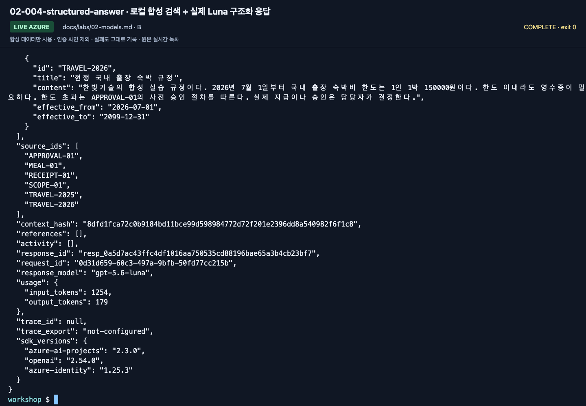

# Lab 02. Deploy a model and make a real request

**English** | [한국어](../ko/labs/02-models.md)

**Goal:** Distinguish model names from deployment names and obtain one actual response.

Previous: [Lab 01](01-foundry.md) · Next: [Lab 03](03-prompt-agent.md)

## A. Browser: start in the Playground

### 1. Identify the deployment

Open the training project's model/deployment list. Select the prepared deployment
and record its catalog model, version, and deployment name separately.


**What to check:** **Name** is the invocation name; **Model / Version** identifies the
underlying model. The source run used `gpt-5.6-luna` for answers and
`gpt-5.6-luna-judge` for evaluation. Send questions to the instructor-selected answer deployment.

### 2. Disable external web tools

Open that model's Playground. If Tools includes Web Search by default, use
**Actions → Remove**. The core workshop does not query the external web.


**What to check:** Open the Web search row's Actions menu and select **Remove**.
**Dismiss** only closes a banner; it does not remove the tool.


**What to check:** Verify that the Web search row is gone before entering a question.
Recheck tools whenever you switch Playgrounds or create an agent.

### 3. Enter a question and inspect the response

> Explain the difference between a Foundry resource, a project, a model deployment,
> and an agent to a beginner in four sentences.


**What to check:** Enter the question in **Chat with the model...** at the lower right.
**Instructions** on the left is a system-instruction field, not the chat input.


**What to check:** Record the model name, time, and token information as well as the
answer. The source screenshot used the Korean equivalent; it is not your own response.

### 4. Compare a question without evidence

Start **New chat**, then ask the canonical question:
`한빛기술의 2026년 9월 숙박비 한도는?`
(What is Hanbit Technology's lodging limit in September 2026?)

**No synthetic policies have been supplied yet, so the model should not pretend to
know an amount.** This is not a test of knowledge about an actual company.


**What to check:** Does it request evidence or clarification? A plausible invented
amount is an ungrounded response, not a success.

A model alone does not supply company policy, effective dates, or approval rules.
In the September 14 UI, leaving the model tab after removing a tool displayed
**Leave without saving?** Choose **Leave without saving** only if you do not need the
temporary Playground settings. Those settings do not automatically apply to new agents.


**What to check:** If navigation seems stuck, look for the confirmation dialog.
Discard only the temporary settings you intended to leave unsaved.

### If no deployment exists

An authorized instructor selects a deployable model supporting **text input, tools,
and Structured Outputs**. Review deployment name, SKU, capacity, region, pricing,
and quota before creating it. Access to a particular new model is not a prerequisite.

`workshop-chat` is an illustrative name, not a resource that already exists.
Do not force-create resources using model versions, regions, or TPM numbers copied from this guide.

## B. Code: call the same project through Responses

```bash
python scripts/workshop.py doctor --cloud
python scripts/workshop.py model --question "Foundry와 Agent Framework의 차이를 한국어로 세 문장으로 설명해 주세요."
```

The question asks for a three-sentence Korean explanation of Foundry versus Agent
Framework. Model-only questions may be translated freely; canonical policy/evaluation
questions should remain unchanged for comparison.

Read `project_clients` and `call_model` in `src/foundry_workshop/cloud.py`.

```python
with AIProjectClient(endpoint=project_endpoint, credential=credential) as project:
    with project.get_openai_client() as client:
        response = client.responses.create(
            model=deployment_name,
            input="Explain the difference between Foundry and MAF.",
            store=False,
        )
```

This block explains the flow. Execute the CLI using your actual `.env` values.
Results retain `response_id`, actual `response_model`, and token usage.
`trace_id: null` means no Application Insights trace has been collected;
do not relabel a response ID as a trace ID.


**What to check:** Read `text`, `response_model`, `response_id`, and `usage` below
the last command. Preserve `trace_id: null` and `trace_export: not-configured` honestly.

### Verify Structured Outputs

```bash
python scripts/workshop.py answer --prompt v2 --retrieval local
```

The command performs local keyword retrieval over synthetic documents, then calls a
**real Azure model**. Inspect `answer`, `decision`, `limit_krw`, and `citations`.
`local` describes retrieval, **not an offline model**.



**What to check:** The screenshot shows the bottom of a long output. Read `source_ids`,
`response_id`, `usage`, and `trace_export` together with the answer fields above.
Do not retain only the answer and discard its lineage.

Stop if the model rejects `json_schema`. The code does not silently switch to plain
text or repair invalid JSON. Explicitly configure an instructor-verified deployment
and record a new run after resolving support.

## Practitioner extension: compare models correctly

A single question cannot establish a model ranking. In [Lab 07](07-evaluation.md),
hold **dev data, knowledge, instructions, output limit, and concurrency** fixed and
change only the deployment. Distinguish the judge from the answer model.
Calculate costs from actual token categories, deployment pricing, cache/reasoning
tokens, and tool/search charges; this repository does not invent currency estimates.

### Model Router: optional observation

If available, inspect how a Router configuration handles the same question.
Router usage is not the same experiment as evaluating two fixed deployments.
Without routing policy, candidate models, and the actual response model, do not
present a fixed-model ranking. Verify access and the model list immediately before
class. This lab can be completed without Router.

## Completion and recovery

[Execution records](../live-run.md) separate models, deployments, and evaluation scope.

- Complete: an actual model response, its deployment name, and an explanation of unsupported policy questions.
- 401/403: check [authentication and roles](../reference/troubleshooting.md), not blanket Owner access.
- 404: check the full project endpoint and **deployment name** first.
- 429: stop concurrent calls and inspect quota/TPM; no endless retries.
