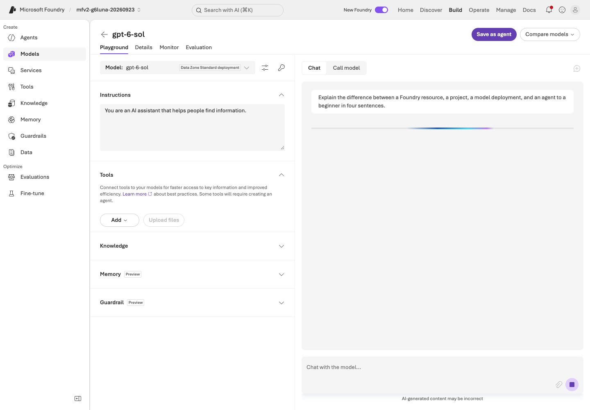
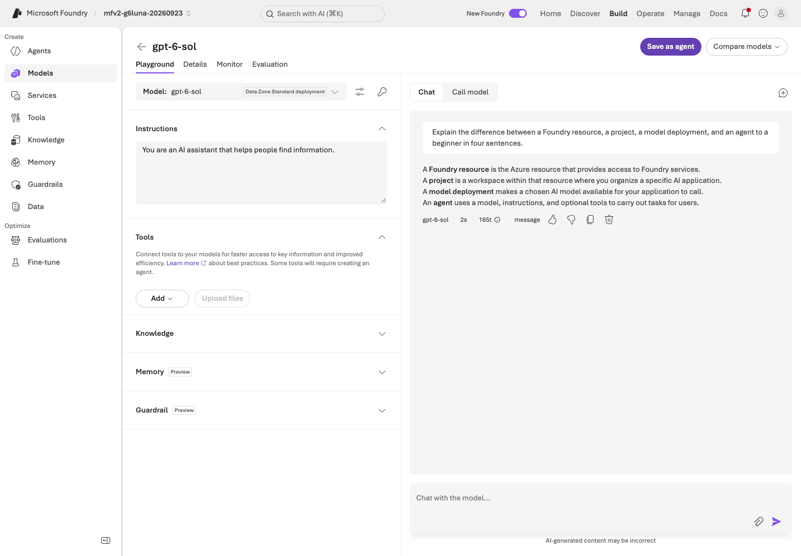
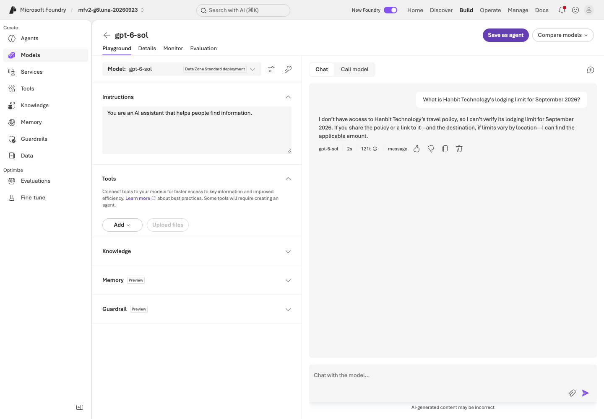
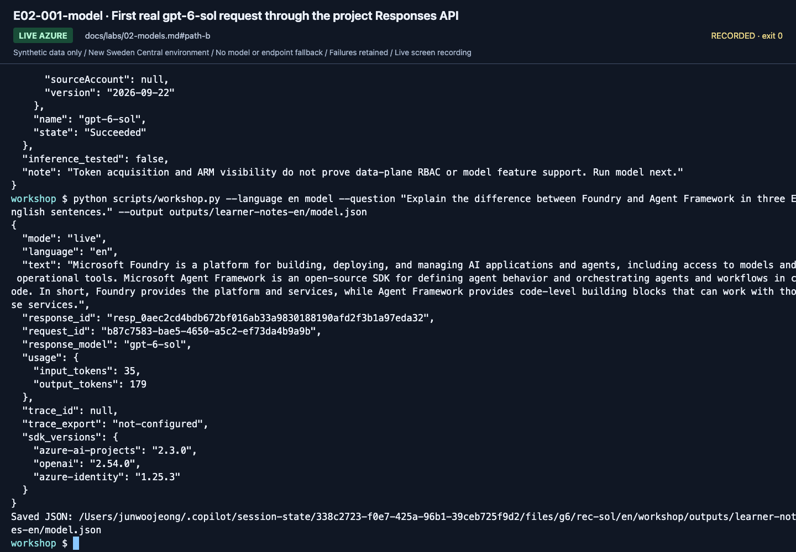
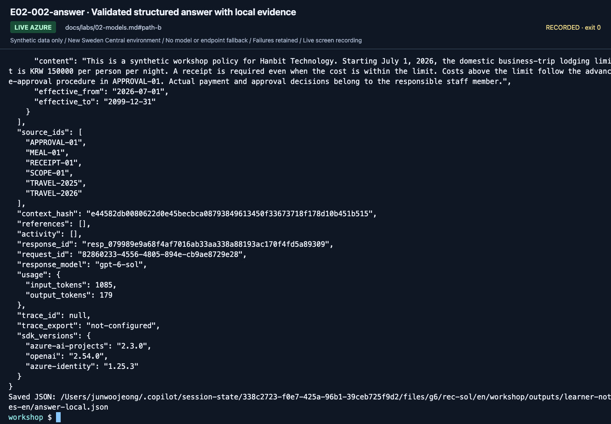
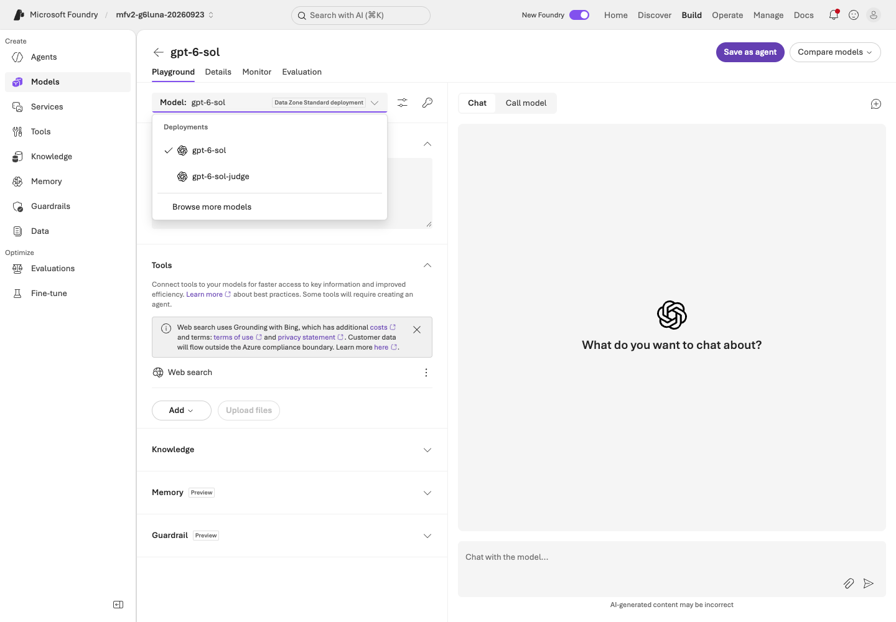

# Lab 02. Use the prepared model and make a real request

**English** | [한국어](../ko/labs/02-models.md)

**Goal:** Distinguish model names from deployment names and obtain one actual response.

**Open your section:** [A — Playground](#path-a) · [B — SDK](#path-b) · [Paths](../paths.md)

## Before you start

**This pass:** A runs the Playground steps; B runs the two CLI checks and Structured Outputs. Skip model comparison on the first pass.

**Need:** The prepared gpt-6-sol deployment; B needs Lab 00's activated environment and .env.

**Continue when:** A real response and the actual deployment are recorded. B also has a validated structured answer.

**If blocked:** A missing model, 403 or 429 is a setup/access/capacity issue. Do not switch models silently.

[One-time setup and learner files](../setup.md).

<a id="path-a"></a>

## A. Browser: start in the Playground

These requests call the real model and use the approved training budget. Save both actual observations in `session-notes.txt`.

### 1. Identify the deployment

Open the training project's model/deployment list. Select **`gpt-6-sol`**
and verify model **`gpt-6-sol`**, version **`2026-09-22`**.
Record catalog model, version, and deployment name separately even though the two names match here.


**What to check:** **Name** is the invocation name; **Model / Version** identifies the
underlying model. The September 23 environment deploys `gpt-6-sol` for answers and
`gpt-6-sol-judge` for evaluation. Send questions to the instructor-selected answer deployment.

### 2. Disable external web tools

Open that model's Playground. If Tools includes Web Search by default, use
**Actions → Remove**. The core workshop does not query the external web.


**What to check:** Open the Web search row's Actions menu and select **Remove**.
**Dismiss** only closes a banner; it does not remove the tool.


**What to check:** Verify that the Web search row is gone before entering a question.
Recheck tools whenever you switch Playgrounds or create an agent.

### 3. Enter a question and inspect the response

> Explain the difference between a Foundry resource, a project, a model deployment,
> and an agent to a beginner in four sentences.




**What to check:** Enter the question in **Chat with the model...** at the lower right.
**Instructions** on the left is a system-instruction field, not the chat input.




**What to check:** Record the model name, time, and token information as well as the
answer. The recording is a separate run, not your own response.

### 4. Compare a question without evidence

Start **New chat**, then ask the canonical question:
`What is Hanbit Technology's lodging limit for September 2026?`

**No synthetic policies have been supplied yet, so the model should not pretend to
know an amount.** This is not a test of knowledge about an actual company.




**What to check:** Does it request evidence or clarification? A plausible invented
amount is an ungrounded response, not a success.

A model alone does not supply company policy, effective dates, or approval rules.
Leaving the model tab after removing a tool can display
**Leave without saving?** Choose **Leave without saving** only if you do not need the
temporary Playground settings. Those settings do not automatically apply to new agents.


**What to check:** If navigation seems stuck, look for the confirmation dialog.
Discard only the temporary settings you intended to leave unsaved.

### If no deployment exists

Stop and complete [the setup card](../setup.md) with the authorized environment owner.
This dated first-pass route uses **`gpt-6-sol`**, whose text, tools and Structured Outputs were verified on September 23, 2026
([model choice](../reference/model-choice.md)); the optional IQ Chat branch uses its own `gpt-5.6-luna` deployment.
Do not select `-judge`, a router, or another available model to get past a missing deployment.
Another model is an explicitly revalidated variant, not the same preset. Review quota/SKU/region/pricing before any authorized creation.

**A done:** you have the actual deployment/version, one concept response and one observation without policy evidence.
Continue to [Lab 03 A](03-prompt-agent.md#path-a). Do not run B's SDK calls unless preparing your own Lab 05 terminal.

<a id="path-b"></a>

## B. Code: call the same project through Responses

Use the repository root and activated `.venv`. The preflight is read-only; the model and structured-answer requests are billable.

```bash
python scripts/workshop.py --language en doctor --cloud
```

Continue only after preflight identifies the intended deployment in `Succeeded` state. Then make one actual request:

```bash
python scripts/workshop.py --language en model \
  --question "Explain the difference between Foundry and Agent Framework in three English sentences." \
  --output outputs/learner-notes-en/model.json
```

The question requests three English sentences. Model-only questions may be translated freely;
keep the selected language's canonical policy/evaluation questions unchanged during a comparison.

Read `project_clients` and `call_model` in `src/foundry_workshop/cloud.py`.

```python
with AIProjectClient(endpoint=project_endpoint, credential=credential) as project:
    with project.get_openai_client() as client:
        response = client.responses.create(
            model=deployment_name,
            input="Explain the difference between Foundry and MAF.",
            store=False,
        )
```

This block explains the flow. Execute the CLI using your actual `.env` values.
Results retain `response_id`, actual `response_model`, and token usage.
`trace_id: null` means no Application Insights trace has been collected;
do not relabel a response ID as a trace ID.




**What to check:** Read `text`, `response_model`, `response_id`, and `usage` below
the last command. `gpt-6-sol` reports reasoning tokens in `usage` even for a short answer. Preserve `trace_id: null` and `trace_export: not-configured` honestly.

**Save:** `model.json` is written to your Lab 00 notes directory by `--output`. Open the complete saved response before the next request.

### Verify Structured Outputs

```bash
python scripts/workshop.py --language en answer --prompt v2 --retrieval local \
  --output outputs/learner-notes-en/answer-local.json
```

The command performs local keyword retrieval over synthetic documents, then calls a
**real Azure model**. Inspect `answer`, `decision`, `limit_krw`, and `citations`.
`local` describes retrieval, **not an offline model**.




**What to check:** Read the complete output: answer fields, `source_ids`, `response_id`,
`usage`, and `trace_export`. A correct amount without its sources is not enough.

**Save:** `answer-local.json` is written to the same notes directory. Check its source and response metadata, not just the answer.

Stop if the model rejects `json_schema`. The code does not silently switch to plain
text or repair invalid JSON. Explicitly configure an instructor-verified deployment
and record a new run after resolving support.

**B done:** save the complete outputs as `model.json` and `answer-local.json` in your Lab 00 notes directory,
including response IDs, usage and source IDs.
Continue to [Lab 04 B](04-agents-tools.md#path-b). If you came only to prepare A's terminal, return to [Lab 05 A](05-workflows.md#path-a).

## Practitioner extension: compare models correctly

<details>
<summary>Optional model comparison and Router — not part of this first request</summary>

A single question cannot establish a model ranking. In [Lab 07](07-evaluation.md),
hold **dev data, knowledge, instructions, output limit, and concurrency** fixed and
change only the deployment. Distinguish the judge from the answer model.
Calculate costs from actual token categories, deployment pricing, cache/reasoning
tokens, and tool/search charges; this repository does not invent currency estimates.

### Model Router: optional observation

If available, inspect how a Router configuration handles the same question.
Router usage is not the same experiment as evaluating two fixed deployments.
Without routing policy, candidate models, and the actual response model, do not
present a fixed-model ranking. Verify access and the model list immediately before
class. This lab can be completed without Router.

</details>

<details>
<summary>More September 23 gpt-6-sol captures (reference; not steps to repeat)</summary>

These captures come from the September 23, 2026 English recording with `gpt-6-sol` / `2026-09-22`. Use your own resource names, versions and results.


**What to check:** The inventory lists the answer deployment `gpt-6-sol`, the separate `gpt-6-sol-judge` and the portal-created `text-embedding-3-large`. Ask questions only through the answer deployment.



**What to check:** The selector lists existing deployments separately from catalog models. Keep `gpt-6-sol`; do not pick the judge or a catalog model.

[Full action index](../action-captures.md) · [Recordings](../video-summary.md)

</details>

## Completion and recovery

[Execution records](../live-run.md) separate models, deployments, and evaluation scope.

- Complete: an actual model response, its deployment name, and an explanation of unsupported policy questions.
- 401/403: check [authentication and roles](../reference/troubleshooting.md), not blanket Owner access.
- 404: check the full project endpoint and **deployment name** first.
- 429: stop concurrent calls and inspect quota/TPM; no endless retries.

Next: A → [Lab 03](03-prompt-agent.md#path-a) · B → [Lab 04](04-agents-tools.md#path-b)
