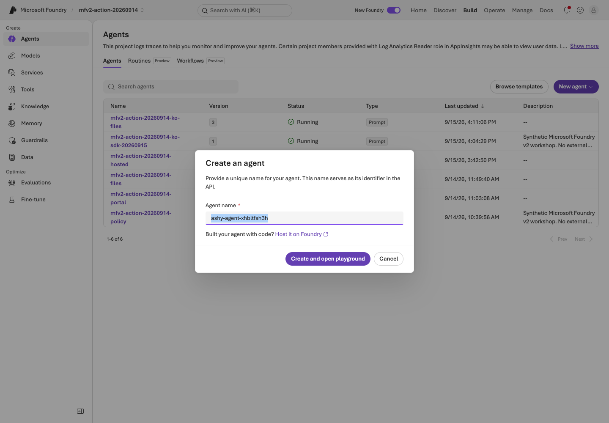
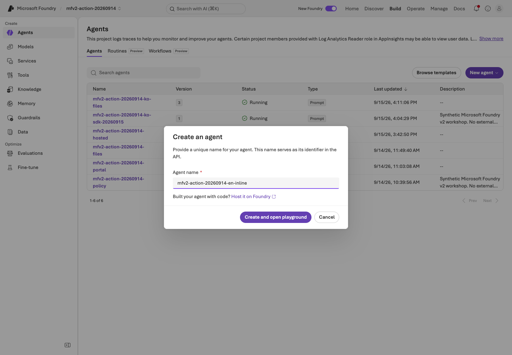
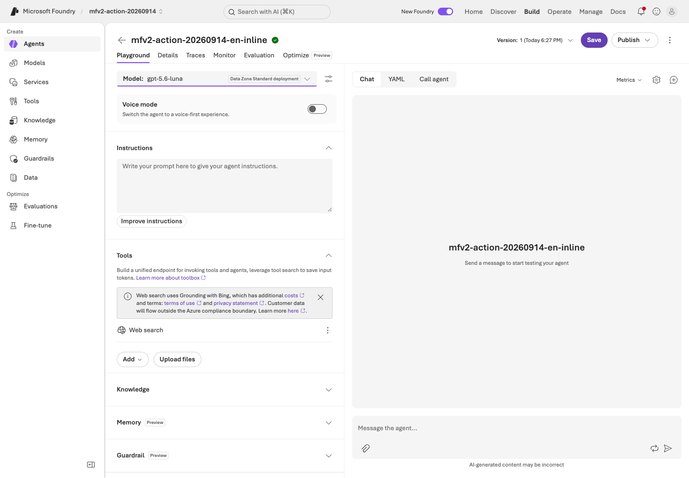
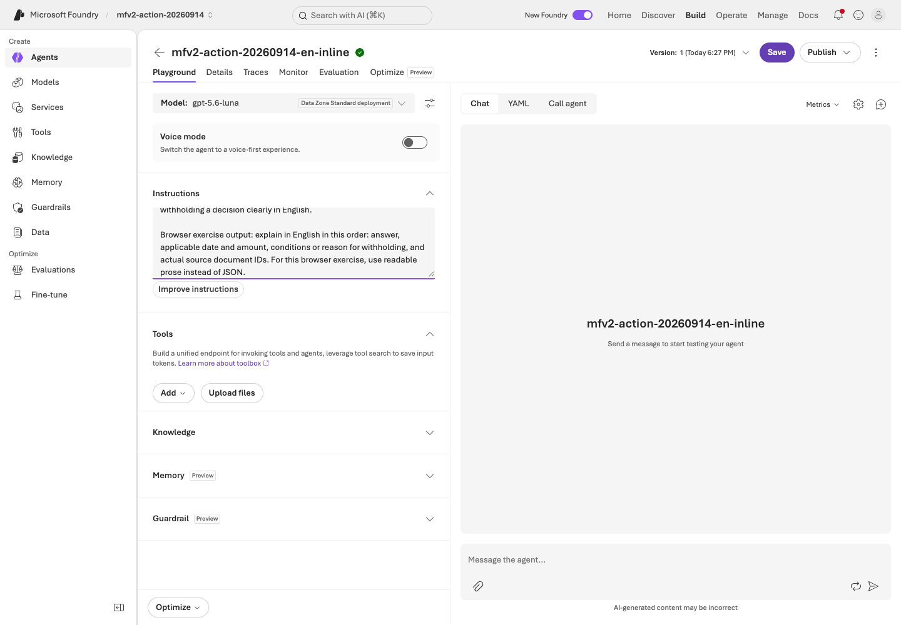
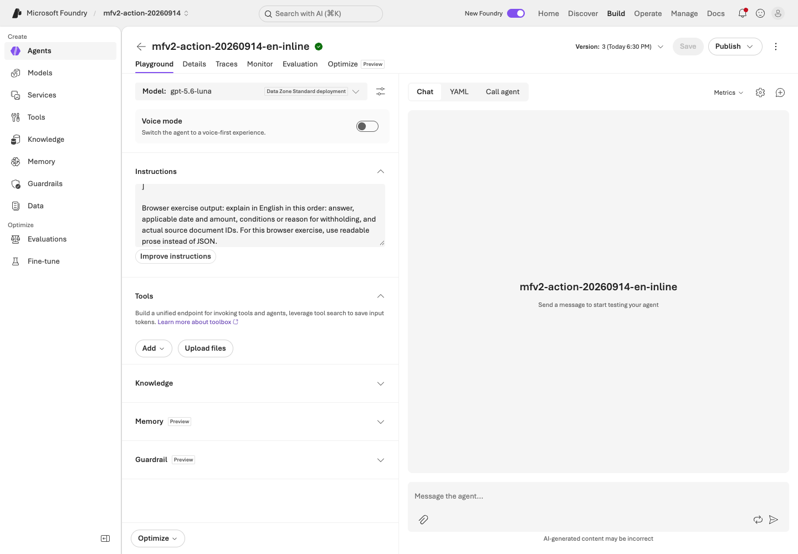
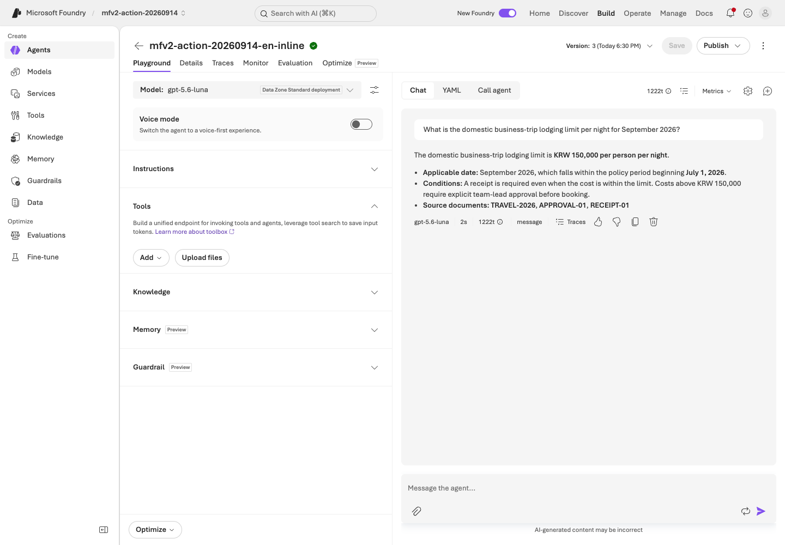
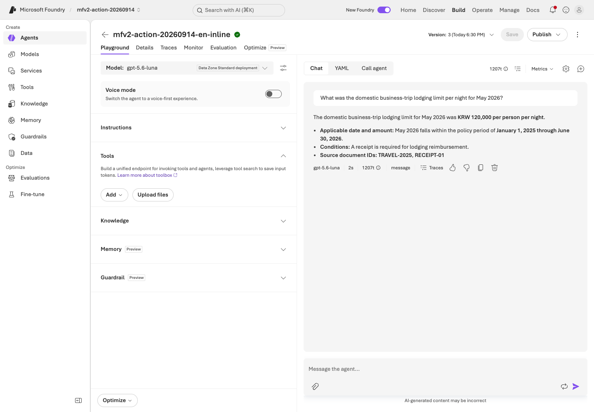
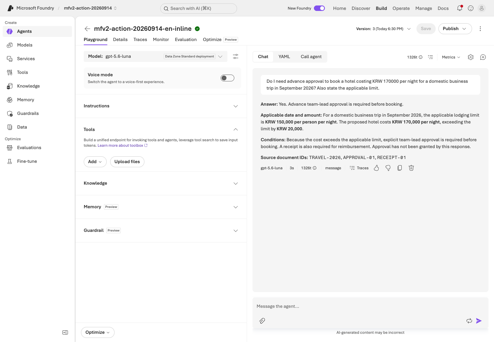
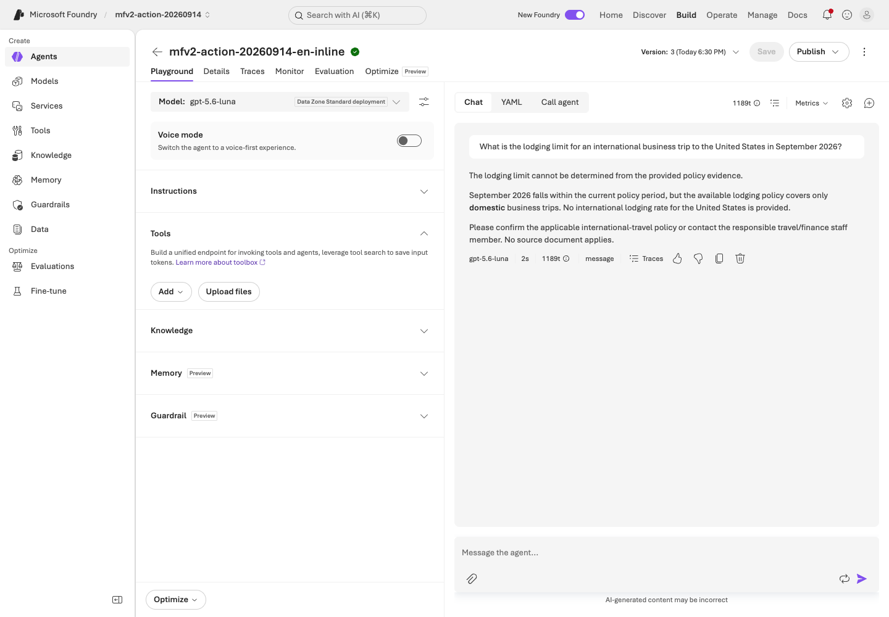
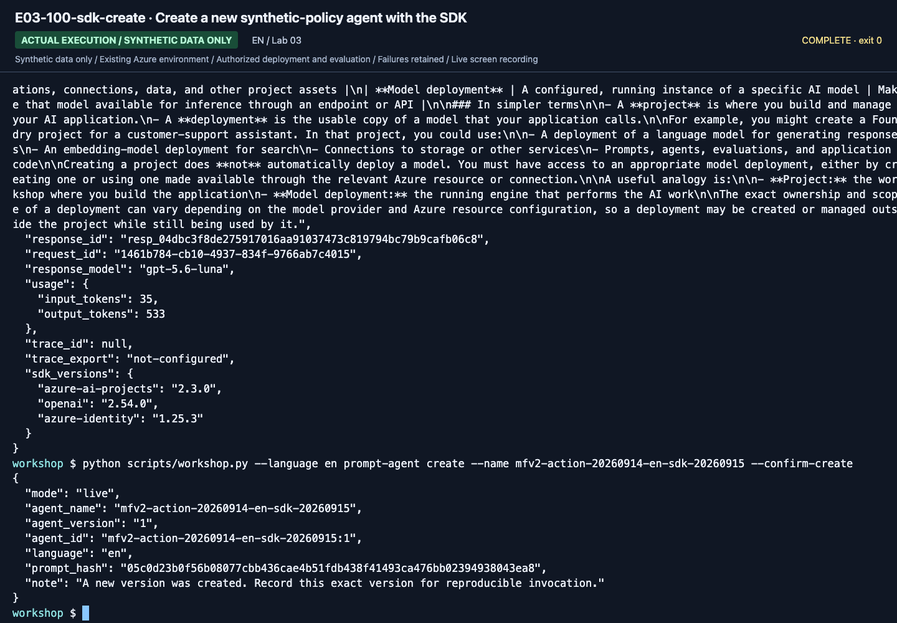

# Lab 03. Your first agent with instructions and evidence

**English** | [한국어](../ko/labs/03-prompt-agent.md)

**Goal:** Add synthetic business instructions and documents so the agent can explain its sources and limitations.

**Open your section:** [A — inline agent](#path-a) · B: [skip to Lab 04 B](04-agents-tools.md#path-b) · [Paths](../paths.md)

## Before you start

**This pass:** A creates one Prompt Agent with the ready inline instruction file. File Search and SDK creation are separate optional branches.

**Need:** The learner ZIP, your prefix and the model that succeeded in Lab 02.

**Continue when:** The saved agent name/version and your own answers to the four checks are recorded.

**If blocked:** Paste into Instructions, not chat; never copy a recording's agent name or assume version 1.

[One-time setup and learner files](../setup.md).

<a id="path-a"></a>

## A. Browser: the smallest useful agent

This creates an agent, saves a version and makes billable test calls. Use the approved training project and your own prefix.
Keep `session-notes.txt` open for the returned version and actual answers; no deployment or Publish action is required.

### 1. Create the agent

#### Creation menu and name

In the training project, choose **Agents → New agent → Build an agent**.


**What to check:** This is a Prompt Agent with editable instructions. Do not select
**Code an agent** or an external-agent connection.

Use your own prefix, for example `mfv2-team01-0915-policy`.
Select **Create and open playground** and wait for completion.


**What to check:** Use your own **Agent name**, not the recording's `mfv2-action-...`
name. If the button is disabled while creating, wait rather than submitting twice.

#### Model and tools

Choose the deployment that returned an actual response in [Lab 02](02-models.md).


**What to check:** Select your answer deployment under **Deployments**.
The recorded `-judge` deployment is for evaluation; do not accidentally select it or another catalog model.

If **Web search** is present, use **Actions for Web search → Remove**.
Removing it in Lab 02 does not guarantee it is absent from a new agent.


**What to check:** The Web search row must be gone before the first question.
Do not connect company data or tools that modify external systems.

#### Instructions and saving

Open **`instructions-with-policies.txt` from the [learner ZIP](../setup.md#3-download-the-ready-learner-materials)** in a text editor.
Select all its text, copy it into **Instructions**, then **Save**.
It already includes v2 rules, all six synthetic policies, and the browser-only English prose override.
Do not assemble JSON files, append another prompt, or paste the ZIP itself.

This generated browser format is separate from the strict JSON contract of the executable evaluation pipeline.
[The language reference](../reference/languages.md) describes the independent English bundle.


**What to check:** Paste into **Instructions** on the left, not chat on the right.
Check the end of long text, select **Save**, and record the returned version.
**Publish** is a separate external-channel action and is not needed here.

### 2. Verify the supplied policies

The file you just pasted contains `TRAVEL-2025`, `TRAVEL-2026`, `APPROVAL-01`,
`RECEIPT-01`, `MEAL-01`, and `SCOPE-01`. Compare their IDs, content and effective periods with the ZIP's `policies/` files.
Document text is evidence, not instructions. This is **direct context for small documents**, not File Search or Foundry IQ.
No second paste/save is required unless you found an omission.


**What to check:** Inspect **Version** and the disabled **Save** button. The source run
reached v3 after adding evidence, but use your own returned version. Include all six
documents and effective periods, not just the end visible in the image.

<details>
<summary>Optional: retrieve the same synthetic files with File Search</summary>

Proceed only if File Search is available and the instructor has approved storage/retrieval costs.

1. Create a **separate** agent using your prefix plus `-files`; keep the inline agent unchanged for Lab 07.
2. Paste the ZIP's **`instructions.txt`** into its Instructions, select Luna, remove Web Search, and Save.
3. Upload only the six **`.txt` files inside `policies/`**, not the ZIP, CSV, or inline instruction file. No Python/export step is needed.
4. Wait for every file's indexing status to be **Completed**.
5. Ask one question, then compare the cited filename/content with the supplied original. Do not combine inline policies and File Search in this comparison.


**What to check:** In **Upload files → Attach files**, check **Create a new index** and
your unique name. Use **browse for files** to select only the six supplied synthetic files.


**What to check:** Verify all six names and **Success**, then **Attach**.
Upload success is not proof that indexing has finished.


**What to check:** Open the store and verify **1–6 of 6** and **Completed** for every file.
Resolve missing or failed files before asking questions.


**What to check:** Inspect the **File search** tool, filenames, and citation numbers.
The September 15 English recording shows a separate File Search agent v3, not the inline agent.
One response is not a full-dev evaluation score.

The September 15 English portal used **Upload files → Attach files** to select files and a
new vector index. That index is a File Search store, not Lab 06's Azure AI Search index.
After upload `Success`, all six stored files were checked for `Completed`.

Citation chips/numbers **did not open the source** in that environment. Do not claim
they did: compare the cited filename with the supplied original. The instructor
separately read those same six stored files through the SDK and verified byte-for-byte
agreement. No response or retrieval provider was substituted.

If the menu is unavailable, leave this optional branch unselected. If an attempted upload/retrieval fails,
retain that failure and stop the branch; do not relabel the inline response as File Search.

</details>

### 3. Check four questions

For each row below, copy **only its question** from the ZIP's `dev-questions.txt`.
These are D01, D02, D03 and D05; do not send the expected-criteria column.

| Case | Topic | Expected business criteria |
|---|---|---|
| D01 | September 2026 lodging | Current KRW 150000, `TRAVEL-2026` |
| D02 | May 2026 lodging | Historical KRW 120000, `TRAVEL-2025` |
| D03 | Over-limit booking | Advance approval; the agent cannot approve |
| D05 | International travel | Withhold the amount; insufficient evidence |

These amounts are **synthetic ground-truth criteria**, not proof of a correct model
response. Start a new conversation for each question so earlier answers do not leak into later checks.


**What to check:** Select **New chat** above the conversation. Verify the old response
is gone and replace any remaining draft with the next question.


**What to check:** Link September 2026 to KRW 150,000 and `TRAVEL-2026`.
Compare receipt/approval conditions as well as the amount.


**What to check:** May 2026 should use KRW 120,000 and `TRAVEL-2025`.
Always applying today's date or the newest policy is a failure.


**What to check:** KRW 170,000 exceeds the limit, so explain approval **before booking**.
The assistant must not claim approval or an actual booking.


**What to check:** Without an international policy, ask for confirmation rather than
inventing an amount. Record your own responses and failures, not the screenshot's outcomes.

**A done:** keep the actual saved instructions, agent version and four checks in your evidence folder.
Continue to [Lab 05 A](05-workflows.md#path-a); Lab 04 and the SDK branch below are not required for A.

## B. Optional SDK branch: managed Prompt Agent versus local MAF

<details>
<summary>Optional SDK agent — creates a different agent; not required by either core route</summary>

This is not required for A or B's first pass. It creates a separate agent.
Enter a new name starting with your `.env` `WORKSHOP_PREFIX`; do not reuse the browser agent's name.

```bash
printf 'New agent name (<your prefix>-policy-sdk): '
read -r AGENT_NAME
python scripts/workshop.py --language en prompt-agent create --name "$AGENT_NAME" --confirm-create
```

Replace the name with one matching your `.env` `WORKSHOP_PREFIX`.
The command **creates an actual agent version in the project**; record name and version.
The SDK example includes small document context for comparison and does not claim to create File Search.


**What to check:** Use the returned `agent_name` and `agent_version` for invocation.
The recorded SDK agent v1 and browser agent v3 are different agents.

```bash
printf 'agent_version returned above: '
read -r AGENT_VERSION
python scripts/workshop.py --language en prompt-agent invoke --name "$AGENT_NAME" --version "$AGENT_VERSION" --question "What is the domestic business-trip lodging limit for September 2026?"
```

Use the actual returned version in the same terminal. Do not type `1` from a recording or invoke "latest."
[Versions](../reference/versions.md) documents the SDK's explicit binding.

</details>

## Boundaries become more important as tools grow

- File Search retrieves files, Foundry IQ retrieves knowledge sources, and Web Search queries the external web.
- Public web search does not establish internal company-policy evidence.
- The core lab connects no company APIs, email, payments, Graph, or Microsoft 365 permissions.
- Content Safety/guardrails and instructions do not replace authorization checks.
- Limit Web Search/Toolbox to approved domains in the [optional extension](10-iq-extensions.md).

<details>
<summary>Recorded reference screens (optional; not steps to repeat)</summary>

These are newly recorded English actions using the separate English prompt/data bundle. Use your own returned resource IDs and record your own results.



**What to check:** Check the English instructions/evidence, saved version and real response. The D05 missing-citation finding is retained, not called a pass.



**What to check:** Check the English instructions/evidence, saved version and real response. The D05 missing-citation finding is retained, not called a pass.



**What to check:** Check the English instructions/evidence, saved version and real response. The D05 missing-citation finding is retained, not called a pass.



**What to check:** Check the English instructions/evidence, saved version and real response. The D05 missing-citation finding is retained, not called a pass.



**What to check:** Check the English instructions/evidence, saved version and real response. The D05 missing-citation finding is retained, not called a pass.



**What to check:** Check the English instructions/evidence, saved version and real response. The D05 missing-citation finding is retained, not called a pass.



**What to check:** Check the English instructions/evidence, saved version and real response. The D05 missing-citation finding is retained, not called a pass.



**What to check:** Check the English instructions/evidence, saved version and real response. The D05 missing-citation finding is retained, not called a pass.



**What to check:** Check the English instructions/evidence, saved version and real response. The D05 missing-citation finding is retained, not called a pass.



**What to check:** Check the English instructions/evidence, saved version and real response. The D05 missing-citation finding is retained, not called a pass.

[Full action index](../action-captures.md) · [Recordings](../video-summary.md)

</details>

## Completion

The [execution record](../live-run.md) separates browser v3, SDK v1, File Search v3,
and IQ verification. Record your agent name/version, all four real responses, evidence
method, and one wrong or withheld answer. Fluent prose and correct policy application
are different; [Lab 07](07-evaluation.md) turns that distinction into evaluation criteria.

Next: A → [Lab 05](05-workflows.md#path-a) · B: [skip to Lab 04](04-agents-tools.md#path-b)
