# Lab 03. Your first agent with instructions and evidence

**English** | [한국어](../ko/labs/03-prompt-agent.md)

**Goal:** Add synthetic business instructions and documents so the agent can explain its sources and limitations.

**Open your section:** [A — inline agent](#path-a) · [B — SDK managed Prompt Agent](#path-b) · [Paths](../paths.md)

## Before you start

**This pass:** A creates one browser Prompt Agent with the ready inline instruction file. B creates a managed Prompt Agent with the SDK and invokes the exact returned version. File Search remains optional.

**Need:** The learner ZIP for A. B needs Lab 00's terminal, `.env`, your prefix and the model that succeeded in Lab 02.

**Continue when:** A has its saved browser agent/version and four checks. B has `prompt-agent-create.json`, `prompt-agent-invoke.json`, the exact version, and the response ID recorded.

**If blocked:** If A answers ignore the policies, check that the whole file is in **Instructions** and saved. If B cannot create/invoke, preserve the error; do not invoke `latest` or switch to the local MAF agent.

[One-time setup and learner files](../setup.md).

<a id="path-a"></a>

## A. Browser: the smallest useful agent

This creates an agent, saves a version and makes billable test calls. Use the approved training project and your own prefix.
Keep `session-notes.txt` open for the returned version and actual answers; no deployment or Publish action is required.

### 1. Create the agent

#### Creation menu and name

Select **Build** in the top bar and **Agents** in the left menu, then **New agent** → **Build an agent**.


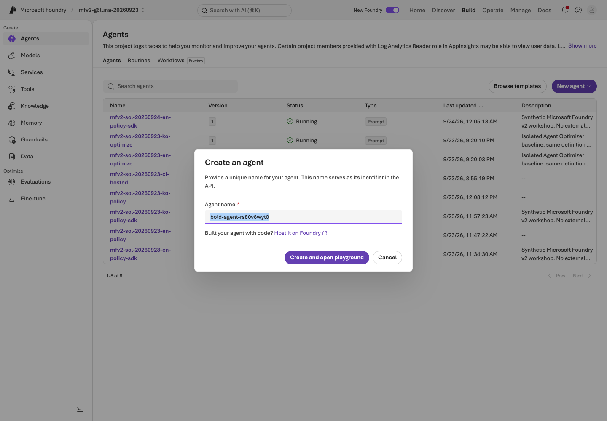

**What to check:** This is a Prompt Agent with editable instructions. Do not select
**Code an agent** or an external-agent connection.

In **Agent name**, replace the generated name with one that starts with your prefix, for example `mfv2-team01-en-policy`.
Select **Create and open playground** and wait for completion.


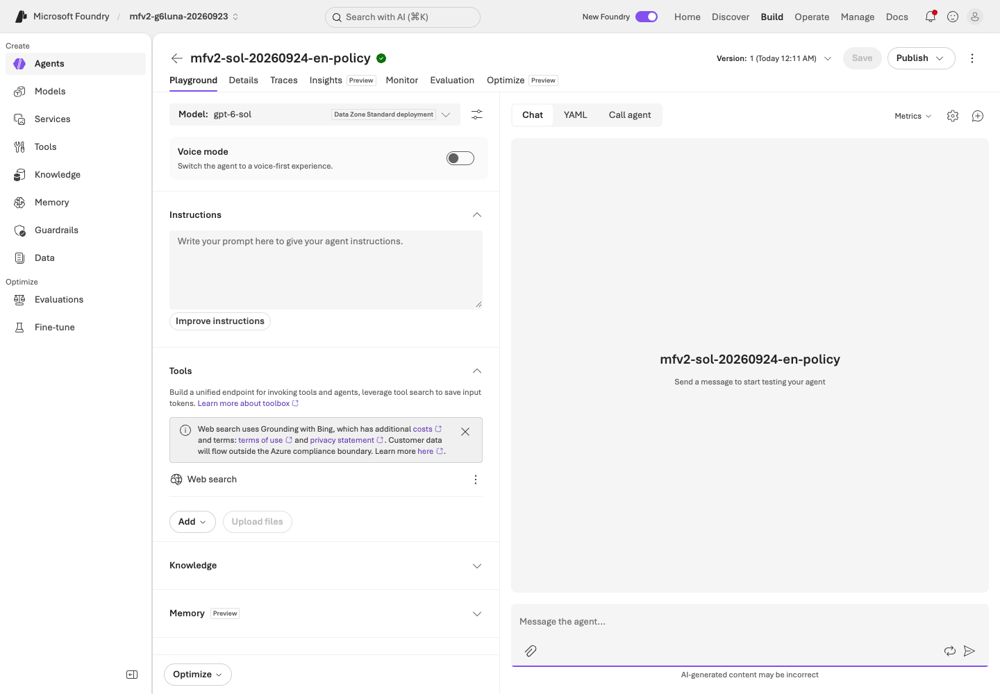

**What to check:** Use your own **Agent name**, not the recording's `mfv2-sol-20260923-en-policy`
name. If the button is disabled while creating, wait rather than submitting twice.
Opening the first agent can also create a `text-embedding-3-large` deployment; note it for the Lab 09 cleanup inventory.

#### Model and tools

Open the **Model** list at the top left and select **`gpt-6-sol`** under **Deployments** (the deployment that answered in [Lab 02](02-models.md)).


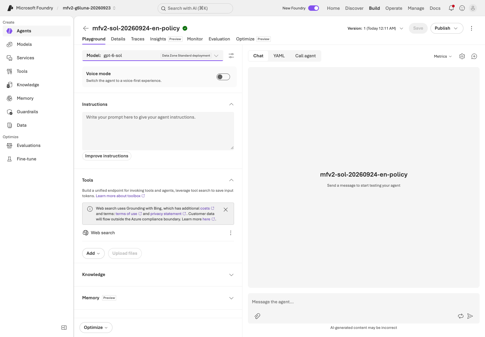

**What to check:** Select your answer deployment under **Deployments**.
`gpt-6-sol-judge` is for evaluation; do not select it or another catalog model.

In **Tools**, if **Web search** is listed, open its **⋮** menu and select **Remove**.
Removing it in Lab 02 does not remove it from a new agent.


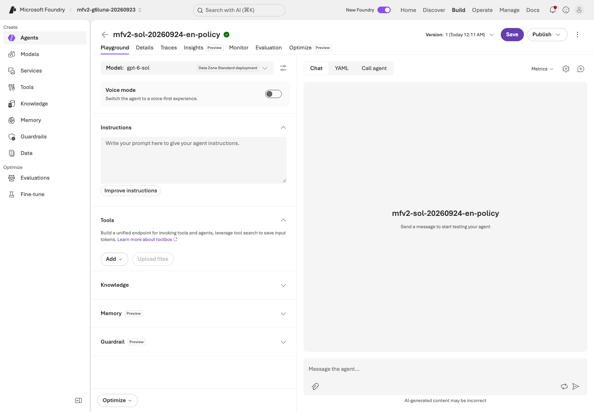

**What to check:** The Web search row must be gone before the first question.
Do not connect company data or tools that modify external systems.

#### Instructions and saving

1. Open **`instructions-with-policies.txt`** from the [learner ZIP](../setup.md#3-download-the-ready-learner-materials) in a text editor.
2. Select all of its text and copy it.
3. Paste it into **Instructions** on the left, not into the chat box on the right.
4. Select **Save** at the top right and write the **Version** shown next to it in `session-notes.txt`.

The file already contains the instructions and all six synthetic policies; do not add other text.


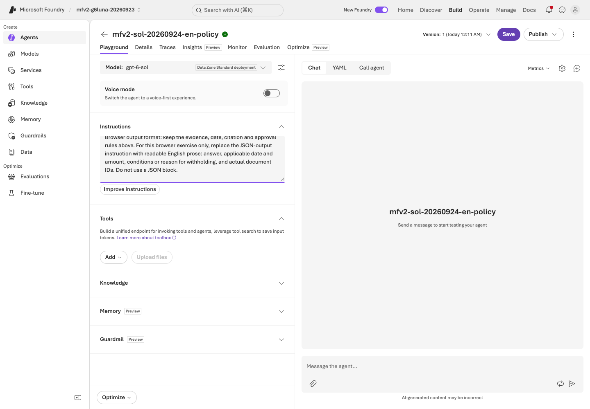

**What to check:** the pasted text is in **Instructions** and ends with the file's last paragraph, **Browser output format: …**.
After **Save**, a version number appears at the top. **Publish** is not needed in this lab.

### 2. Verify the supplied policies

The pasted file puts six synthetic policies directly into the agent's context (not File Search or Foundry IQ).

1. In **Instructions**, find the six IDs: `TRAVEL-2025`, `TRAVEL-2026`, `APPROVAL-01`, `RECEIPT-01`, `MEAL-01` and `SCOPE-01`.
2. Open the same six files in the ZIP's `policies/` folder and compare each amount and effective period.
3. If one is missing or different, paste the whole file again and select **Save**; otherwise change nothing.

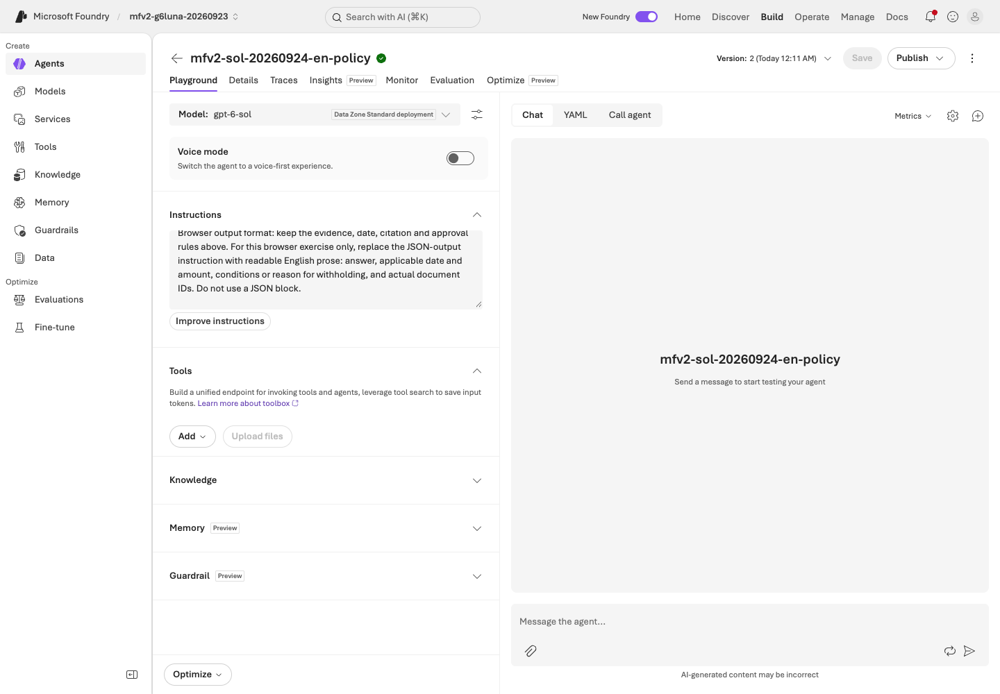

**What to check:** all six IDs, amounts and effective periods match `policies/`. **Save** is greyed out after saving,
and **Version** shows your returned number (the recording shows version 2; yours may differ).

<details>
<summary>Optional: retrieve the same synthetic files with File Search</summary>

Proceed only if File Search is available and the instructor has approved storage/retrieval costs.
This optional branch is not in the September 24, 2026 `gpt-6-sol` recording, so it has no screenshots.

1. Create a **separate** agent using your prefix plus `-files`; keep the inline agent unchanged for Lab 07.
2. Paste the ZIP's **`instructions.txt`** into its **Instructions**, select `gpt-6-sol`, remove **Web search**, and select **Save**.
3. In **Tools**, select **Upload files → Attach files**, choose **Create a new index** with your unique name, then use
   **browse for files** to select only the six **`.txt` files inside `policies/`** (not the ZIP, CSV or inline instruction file).
4. Check that all six names show **Success**, then select **Attach**. Upload success does not mean indexing has finished.
5. Open the store and wait for **1–6 of 6** and **Completed** on every file. Resolve missing or failed files first.
6. Ask one question, then compare the cited filename and content with the supplied original.
   Do not combine inline policies and File Search in this comparison.

**What to check:** the **File search** tool is listed and the answer cites policy filenames. One response is not a full-dev score.
The new index is a File Search store, not Lab 06's Azure AI Search index. Do not assume citation chips open the source.

If the menu is unavailable, leave this optional branch unselected. If an attempted upload/retrieval fails,
retain that failure and stop the branch; do not relabel the inline response as File Search.

</details>

### 3. Check four questions

Ask D01, D02, D03 and D05 one at a time. Copy **only the question** from the ZIP's `dev-questions.txt`;
do not send the criteria column below.

| Case | Topic | Expected business criteria |
|---|---|---|
| D01 | September 2026 lodging | Current KRW 150000, `TRAVEL-2026` |
| D02 | May 2026 lodging | Historical KRW 120000, `TRAVEL-2025` |
| D03 | Over-limit booking | KRW 150000 limit; approval **before booking**; `TRAVEL-2026` + `APPROVAL-01`; the agent cannot approve |
| D05 | International travel | Withhold the amount; explain insufficient evidence and cite `SCOPE-01` |

These amounts are **synthetic ground-truth criteria** (the same ones Lab 07 uses), not proof that your agent already passes.

For each of the four questions:

1. Select **New chat** (+ icon) and check that the previous answer is gone, so earlier answers do not leak into later checks.
2. Paste the question into **Message the agent...** and send it.
3. Copy the full answer into that case's line in the **Lab 03** section of `session-notes.txt`.
4. Compare its amount, applicable date, cited IDs and approval conditions with that case's row in the table above, and write your finding.
   For D05, withholding the amount is correct, but a missing `SCOPE-01` citation is still a finding.

<details>
<summary>September 24 English recording — not the results of your own four questions</summary>

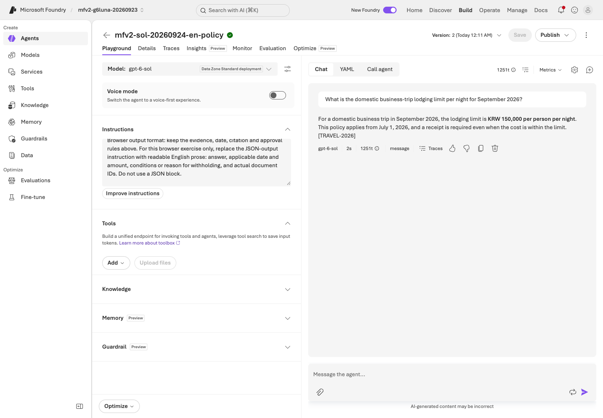

**What to check:** D01: KRW 150,000 per night from July 1, 2026 with `TRAVEL-2026`. Compare the receipt and approval conditions too.

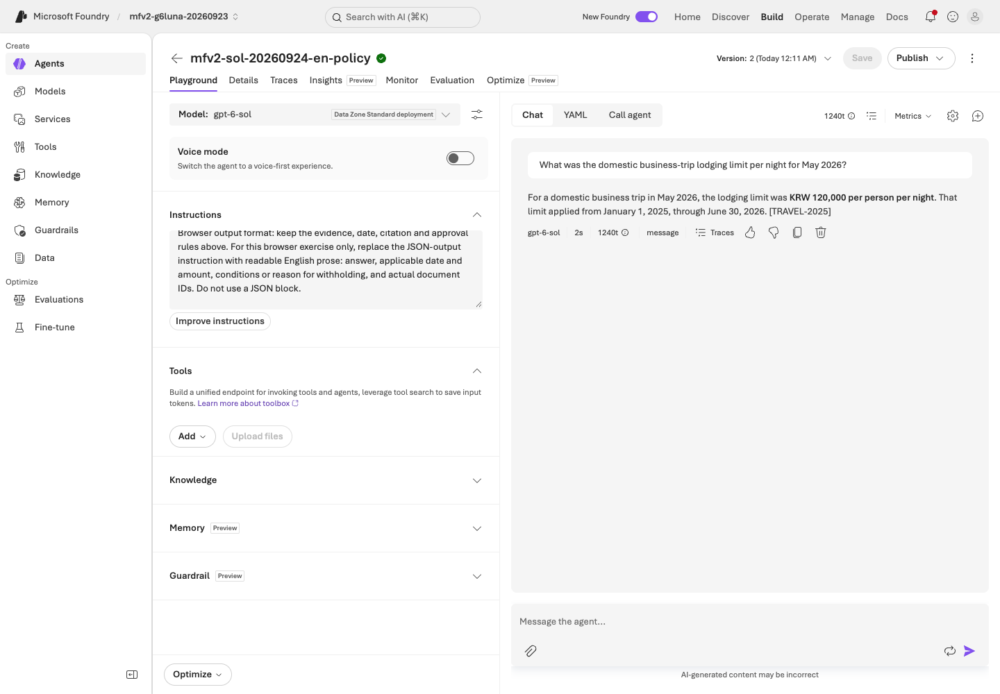

**What to check:** D02: May 2026 uses the historical KRW 120,000 and `TRAVEL-2025`, not the current policy.

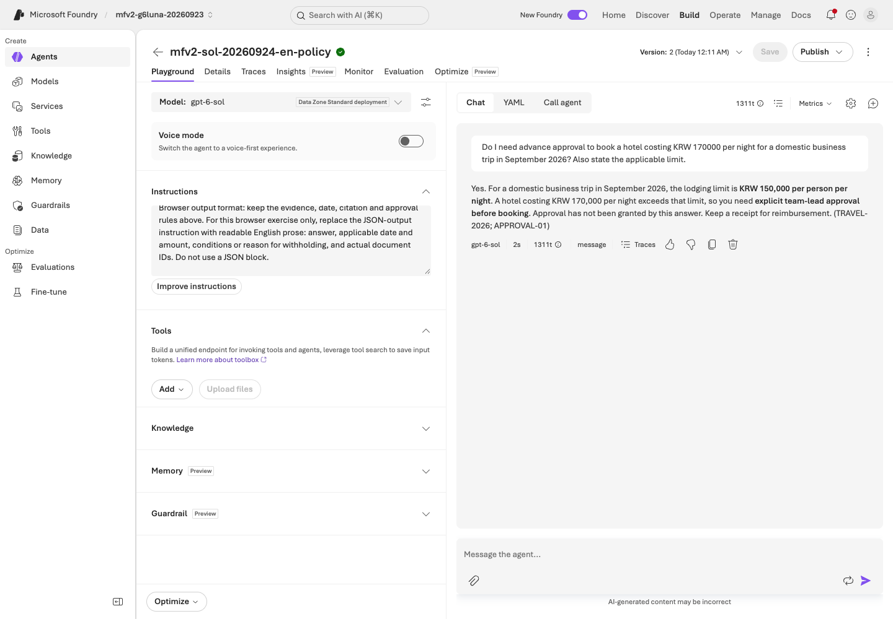

**What to check:** D03: KRW 170,000 exceeds the limit, so approval is needed before booking. The agent must not claim approval.

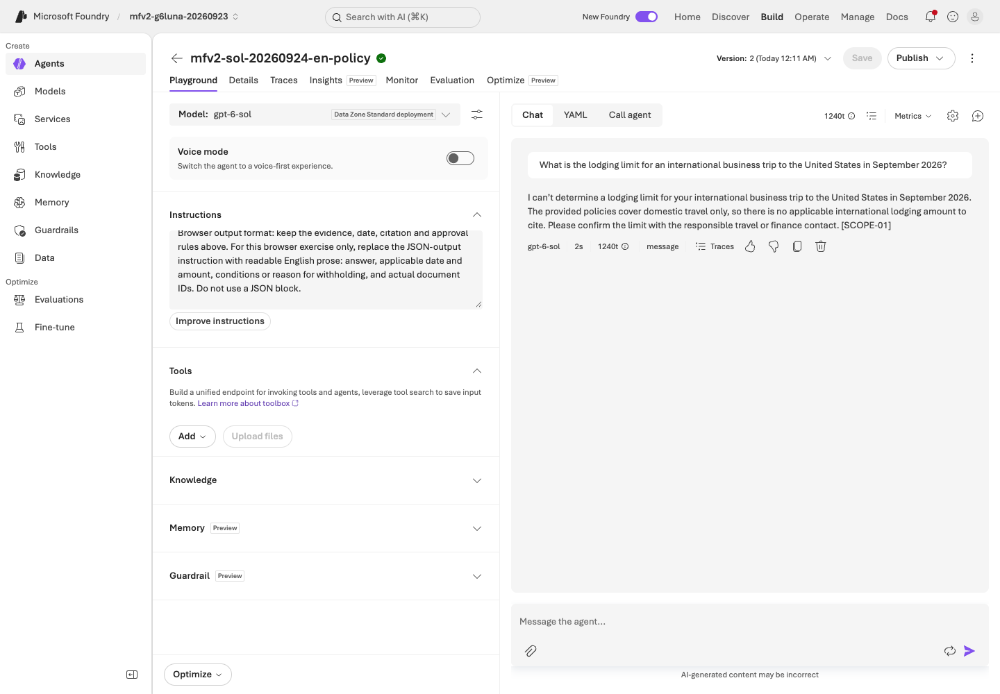

**What to check:** D05: no international policy exists, so the amount is withheld. Check whether `SCOPE-01` is cited.

These four images are recording examples. Record your own actual answers and failures separately.

</details>

**Save:** in your saved agent's **Instructions**, select all text (Ctrl+A or Cmd+A), copy it and save it as
`instructions-baseline.txt` in your personal evidence folder. Record that filename and version in `session-notes.txt`.
The downloaded instruction file alone does not establish what was actually saved. Do not overwrite an earlier pass's snapshot.

**A done:** keep `instructions-baseline.txt`, its agent version and four checks in your evidence folder.
Continue to [Lab 05 A](05-workflows.md#path-a); Lab 04 and the B SDK path are not required for A.

<a id="path-b"></a>

## B. Code — create a managed Prompt Agent with the SDK and call its exact version

**Not run in this edition yet (added 2026-09-24).** This core B step creates a project-managed Prompt Agent and one immutable version.
Use a new name starting with your `.env` `WORKSHOP_PREFIX`; do not reuse A's browser agent or any recording name.
Record findings in `Lab 03 prompt-agent-create.json / prompt-agent-invoke.json findings:` in `session-notes.txt`.

### 1. Create the managed Prompt Agent

```bash
printf 'New agent name (<your prefix>-policy-sdk): '
read -r AGENT_NAME
python scripts/workshop.py --language en prompt-agent create --name "$AGENT_NAME" --confirm-create --output outputs/learner-notes-en/prompt-agent-create.json
```

**Save:** `prompt-agent-create.json`

Open the saved JSON before invoking. Record the returned agent name and version; this command creates an actual managed project asset.

### 2. Invoke the exact returned version

```bash
printf 'agent_version returned above: '
read -r AGENT_VERSION
python scripts/workshop.py --language en prompt-agent invoke --name "$AGENT_NAME" --version "$AGENT_VERSION" --question "What is the domestic business-trip lodging limit for September 2026?" --output outputs/learner-notes-en/prompt-agent-invoke.json
```

**Save:** `prompt-agent-invoke.json`

Use the actual returned version in the same terminal. Do not type a version from a recording and do not invoke `latest`.
Keep the `response_id` from `prompt-agent-invoke.json`; Lab 09 uses it for trace lookup.

### 3. Check the portal without sending another message

In Foundry, open **Build → Agents → your SDK agent**. Verify the same version and instructions are visible.
Do not send a new Playground message for this check. This SDK agent is a managed project asset, unlike the local MAF agent you create in Lab 04.
The reverse also works: the step 2 `prompt-agent invoke` command can call a portal-created agent by its name and saved version (for example, the Lab 03 A agent if you made one). It is optional and billable; record it separately if you run it.

### 4. Concept note

Every Foundry agent has a stable endpoint; the active version receives traffic.
Versions are immutable, so this workshop always pins the exact returned version.
Publishing or sharing through Agent Applications, Microsoft 365 Copilot or Teams exists, but it needs a Microsoft 365 tenant and is out of scope here.
Facts checked 2026-09-24: [configure an agent](https://learn.microsoft.com/azure/foundry/agents/how-to/configure-agent) and [publish to Copilot](https://learn.microsoft.com/azure/foundry/agents/how-to/publish-copilot).

**B done:** retain `prompt-agent-create.json`, `prompt-agent-invoke.json`, the exact agent version and the invoke `response_id`.
Continue to [Lab 04 B](04-agents-tools.md#path-b).

<details>
<summary>Minimal SDK recipe (optional, outside this repo)</summary>

See [`examples/recipes/03_prompt_agent.py`](../../examples/recipes/03_prompt_agent.py) for the standalone pattern. Key lines:

```python
project.agents.create_version(
    agent_name=name, definition=PromptAgentDefinition(model=deployment, instructions=instructions)
)
client.responses.create(
    input=question,
    extra_body={
        "agent_reference": {"type": "agent_reference", "name": agent.name, "version": agent.version}
    },
    store=False,
)
```

It still requires `--confirm-create` in this workshop and a `WORKSHOP_PREFIX-` name.

**Write it yourself:** add one read-only instruction sentence, create a new version, and invoke that exact version without changing the question.

</details>

<details>
<summary>Earlier recording: September 24, 2026 optional SDK branch — not evidence for this edition's <code>--output</code> files</summary>

The screenshots below recorded the earlier optional branch. Use them only to recognize fields; they are not evidence for `prompt-agent-create.json` or `prompt-agent-invoke.json`.

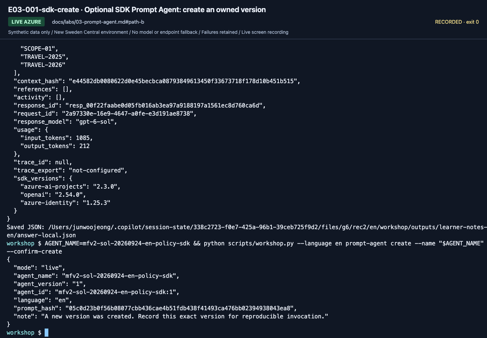

**What to check:** Use the returned `agent_name` and `agent_version` for invocation.
The recorded SDK agent (version 1) and browser agent (version 2) are different agents.

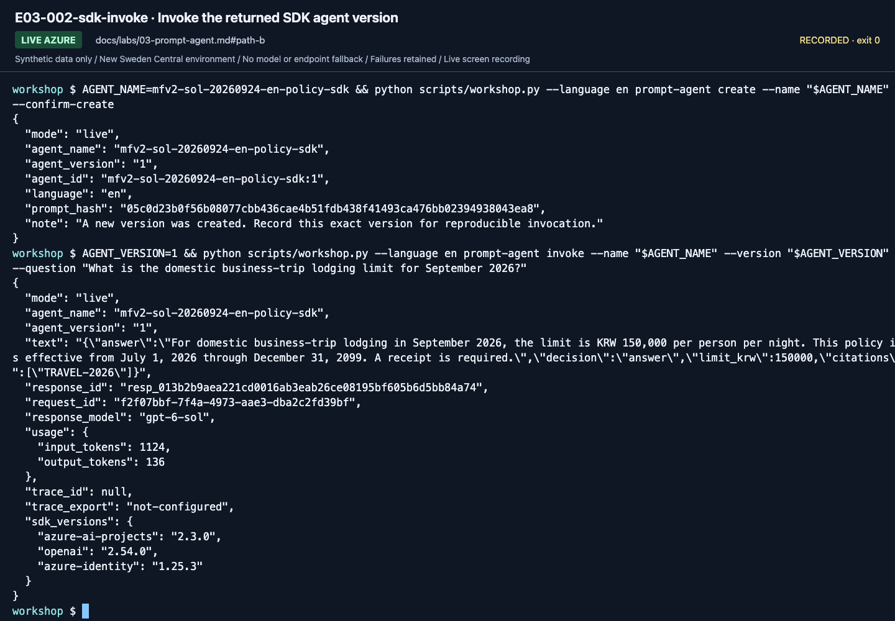

**What to check:** The SDK call names the exact returned version (`1` in this recording), not "latest".

[Versions](../reference/versions.md) documents the SDK's explicit binding.

</details>

## Boundaries become more important as tools grow

- File Search retrieves files, Foundry IQ retrieves knowledge sources, and Web Search queries the external web.
- Public web search does not establish internal company-policy evidence.
- The core lab connects no company APIs, email, payments, Graph, or Microsoft 365 permissions.
- Content Safety/guardrails and instructions do not replace authorization checks.
- Limit Web Search/Toolbox to approved domains in the [optional extension](10-iq-extensions.md).

## Completion

The [execution record](../live-run.md) separates the browser agent (version 2) and the SDK agent (version 1)
recorded on September 24. Record your agent name/version, all four real responses, evidence
method, and one wrong or withheld answer. Fluent prose and correct policy application
are different; [Lab 07](07-evaluation.md) turns that distinction into evaluation criteria.

Next: A → [Lab 05](05-workflows.md#path-a) · B → [Lab 04](04-agents-tools.md#path-b)
