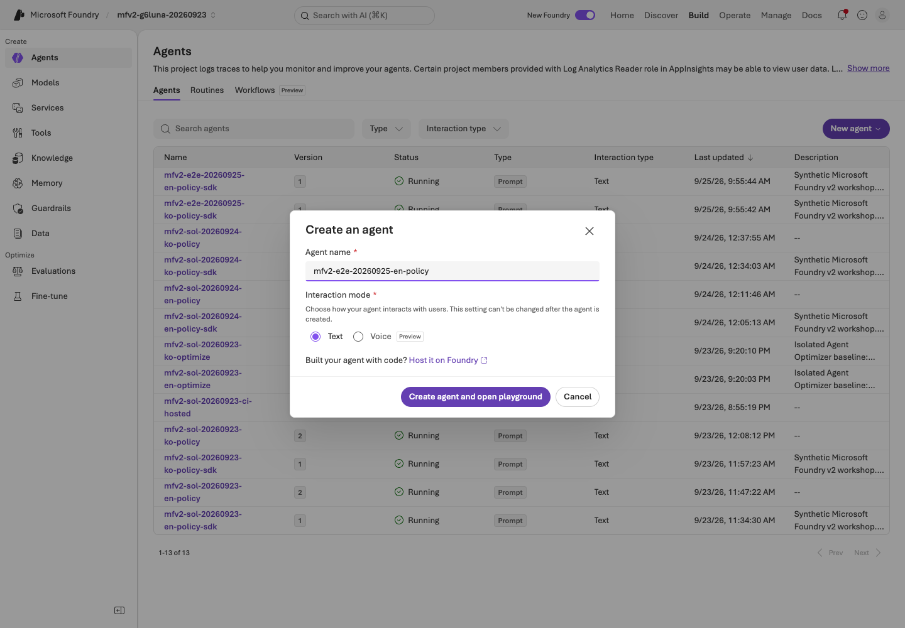
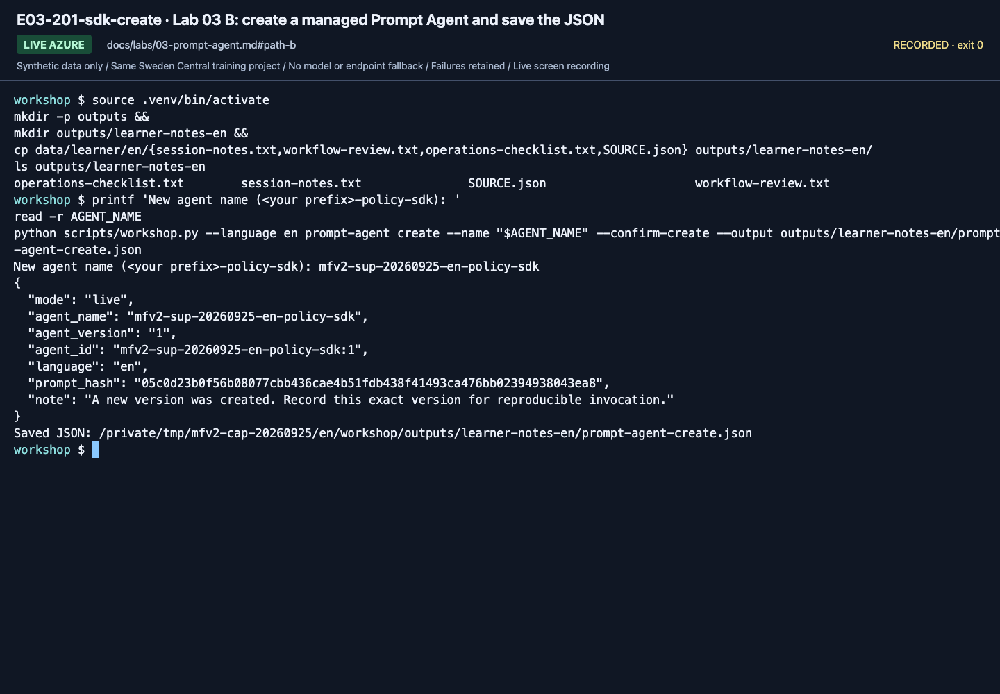
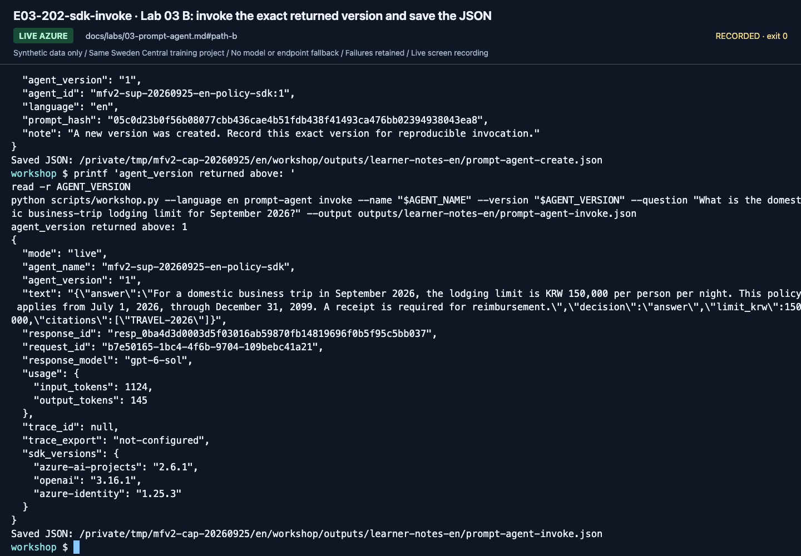
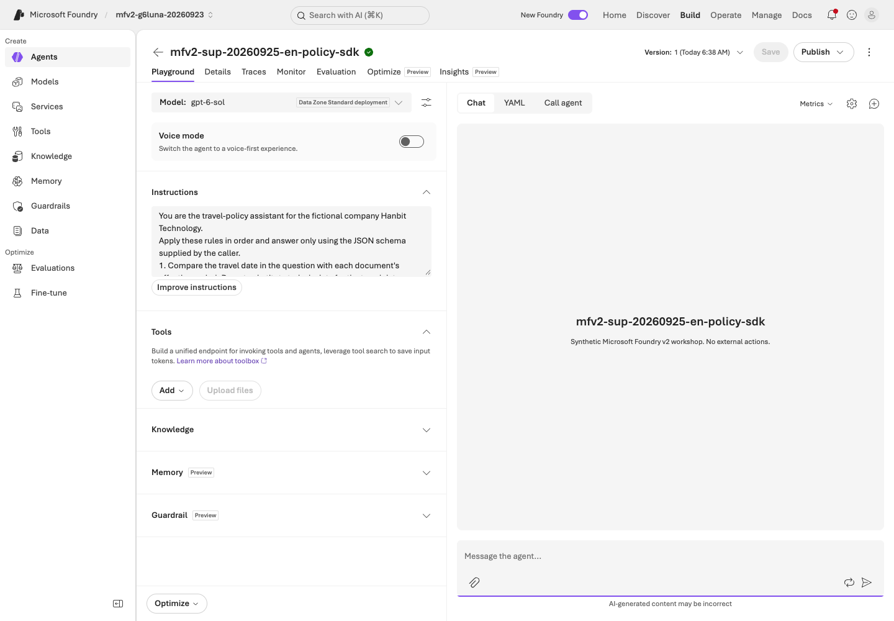
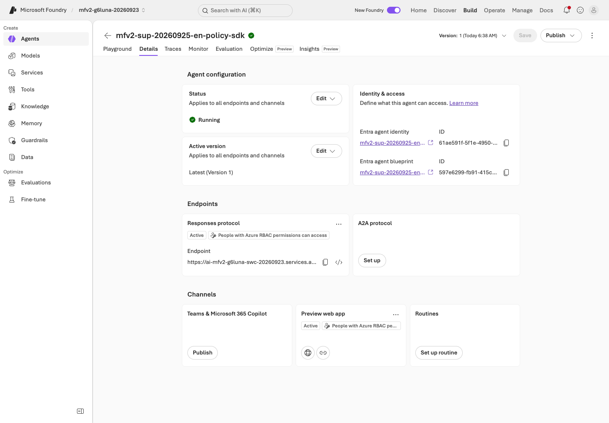

# Lab 03. Your first agent with instructions and evidence

**English** | [한국어](../ko/labs/03-prompt-agent.md)

**Goal:** Add synthetic business instructions and documents so the agent can explain its sources and limitations.

**Open your section:** [A — inline agent](#path-a) · [B — SDK managed Prompt Agent](#path-b) · [Paths](../paths.md)

## Before you start

**This pass:** A creates one browser Prompt Agent with the ready inline instruction file. B creates a managed Prompt Agent with the SDK and invokes the exact returned version. File Search remains optional.

**Need:** The learner ZIP for A. B needs Lab 00's terminal, `.env`, your prefix and the model that succeeded in Lab 02.

**Continue when:** A has its saved browser agent/version and four checks. B has `prompt-agent-create.json`, `prompt-agent-invoke.json`, the exact version, and the response ID recorded.

**If blocked:** If A answers ignore the policies, check that the whole file is in **Instructions** and saved. If B cannot create/invoke, preserve the error; do not invoke `latest` or switch to the local MAF agent.

[One-time setup and learner files](../setup.md).

<a id="path-a"></a>

## A. Browser: the smallest useful agent

This creates an agent, saves a version and makes billable test calls. Use the approved training project and your own prefix.
Keep `session-notes.txt` open for the returned version and actual answers; no manual deployment or Publish step is required.

### 1. Create the agent

#### Creation menu and name

Select **Build** in the top bar and **Agents** in the left menu, then **New agent** → **Build an agent**.


**What to check:** This is a Prompt Agent with editable instructions. Do not select
**Code an agent** or an external-agent connection.

In **Agent name**, replace the generated name with one that starts with your prefix, for example `mfv2-team01-en-policy`.
Keep **Interaction mode** on **Text**; it cannot be changed after creation.
Opening the first agent may also create a `text-embedding-3-large` deployment. Confirm the owner's authorization for this
before selecting **Create agent and open playground**. Wait for completion and record any created deployment for Lab 09.




**What to check:** Use your own **Agent name**, not the recording's `mfv2-sol-20260924-en-policy`
name. The September 24 video shows the earlier dialog, without **Interaction mode**. If the button is disabled while creating, wait rather than submitting twice.

#### Model and tools

Open the **Model** list at the top left and select **`gpt-6-sol`** under **Deployments** (the deployment that answered in [Lab 02](02-models.md)).


**What to check:** Select your answer deployment under **Deployments**.
`gpt-6-sol-judge` is for evaluation; do not select it or another catalog model.

In **Tools**, if **Web search** is listed, open its **⋮** menu and select **Remove**.
Removing it in Lab 02 does not remove it from a new agent.


**What to check:** The Web search row must be gone before the first question.
Do not connect company data or tools that modify external systems.

#### Instructions and saving

1. Open **`instructions-with-policies.txt`** from the [learner ZIP](../setup.md#3-download-the-ready-learner-materials) in a text editor.
2. Select all of its text and copy it.
3. Click **inside Instructions** on the left. Press **Ctrl+A** (**Cmd+A** on macOS) to select only that field's text,
   then paste to **replace** it with the whole file. Do not append to default instructions or paste into the chat box on the right.
4. Select **Save** at the top right and write the **Version** shown next to it on the `Agent name / saved version / deployment:` line of `session-notes.txt`.

The file already contains the instructions, all six synthetic policies and the browser output rule; keep the whole file unchanged.
Its final **Browser output format** paragraph replaces the opening JSON-output instruction for A:
expect readable prose with cited document IDs, not a JSON block.


**What to check:** the pasted text is in **Instructions** and ends with the file's last paragraph, **Browser output format: …**.
After **Save**, a version number appears at the top. **Publish** is not needed in this lab.

### 2. Verify the supplied policies

The pasted file puts six synthetic policies directly into the agent's context (not File Search or Foundry IQ).

1. In **Instructions**, find the six IDs: `TRAVEL-2025`, `TRAVEL-2026`, `APPROVAL-01`, `RECEIPT-01`, `MEAL-01` and `SCOPE-01`.
2. Open the same six files in the ZIP's `policies/` folder and compare each amount and effective period.
3. If one is missing or different, repeat the whole-field replacement above, select **Save** and update the saved version
   in `session-notes.txt` to the newly returned number. Otherwise change nothing.


**What to check:** all six IDs, amounts and effective periods match `policies/`. **Save** is greyed out after saving,
and **Version** shows your returned number (the recording shows version 2; yours may differ).

<details>
<summary>Optional: retrieve the same synthetic files with File Search</summary>

Proceed only if File Search is available and the instructor has approved storage/retrieval costs.
This optional branch is not in the September 24, 2026 `gpt-6-sol` recording.

**Check availability before creating another agent.** On September 25, 2026, the headless check of this training project
with `gpt-6-sol` showed **Upload files** disabled: **File search is temporarily unavailable for the selected model.
Support is coming soon.** This is a dated observation, not a promise of a release date.
If your project shows the same message, leave this branch **not run**; do not switch models or count inline answers as File Search.

[September 25 availability reference — English UI, no upload attempted](../assets/headless-guide-audit-20260925/file-search-unavailable.png).
This reference shows feature availability only; it is not a File Search execution or a language-specific learner recording.

1. Create a **separate** agent using your prefix plus `-files`; keep the inline agent unchanged for Lab 07.
2. Replace its **Instructions** with the ZIP's **`instructions.txt`**, select `gpt-6-sol`, remove **Web search** if listed, and select **Save**.
3. In **Tools**, select **Upload files → Attach files**, choose **Create a new index** with your unique name, then use
   **browse for files** to select only the six **`.txt` files inside `policies/`** (not the ZIP, CSV or inline instruction file).
4. Check that all six names show **Success**, then select **Attach**. Upload success does not mean indexing has finished.
5. Open the store and wait for **1–6 of 6** and **Completed** on every file. Resolve missing or failed files first.
6. Ask one question, then compare the cited filename and content with the supplied original.
   Do not combine inline policies and File Search in this comparison.

**What to check:** the **File search** tool is listed and the answer cites policy filenames. One response is not a full-dev score.
The new index is a File Search store, not Lab 06's Azure AI Search index. Do not assume citation chips open the source.

If the menu is unavailable, leave this optional branch unselected. If an attempted upload/retrieval fails,
retain that failure and stop the branch; do not relabel the inline response as File Search.

The core route still uses the original inline agent: [return to its check below](#check-inline-agent).
Keep the optional File Search outcome separate; its replies do not become the Lab 03 or Lab 07 baseline.

</details>

<a id="check-inline-agent"></a>

### 3. Check four questions

**Use the original inline agent, not the optional `-files` agent.** Open the agent named in the Lab 03 section of
`session-notes.txt`. Its **Version** must match the recorded saved version, **Save** must be greyed out,
and **Instructions** must contain the complete `instructions-with-policies.txt`, including all six policies.
If the name/version differs or there are unsaved edits, preserve any wanted draft separately and reopen the recorded inline version
without those edits. If you cannot restore that state, record Lab 03 incomplete and resolve it before asking.
Do not select **Save** merely to get past a version mismatch.

Ask D01, D02, D03 and D05 one at a time. Copy **only the question** from the ZIP's `dev-questions.txt`;
do not send the criteria column below.

| Case | Topic | Expected business criteria |
|---|---|---|
| D01 | September 2026 lodging | Current KRW 150000, `TRAVEL-2026` |
| D02 | May 2026 lodging | Historical KRW 120000, `TRAVEL-2025` |
| D03 | Over-limit booking | KRW 150000 limit; approval **before booking**; `TRAVEL-2026` + `APPROVAL-01`; the agent cannot approve |
| D05 | International travel | Withhold the amount; explain insufficient evidence and cite `SCOPE-01` |

These amounts are **synthetic ground-truth criteria** (the same ones Lab 07 uses), not proof that your agent already passes.

For each of the four questions:

1. Select **New chat** (+ icon) and check that the previous answer is gone, so earlier answers do not leak into later checks.
2. Paste the question into **Message the agent...** and send it.
3. Copy the full answer into that case's line in the **Lab 03** section of `session-notes.txt`.
4. Compare its amount, applicable date, cited IDs and approval conditions with that case's row in the table above, and write your finding.
   For D05, withholding the amount is correct, but a missing `SCOPE-01` citation is still a finding.

<details>
<summary>September 24 English recording — not the results of your own four questions</summary>


**What to check:** D01: KRW 150,000 per night from July 1, 2026 with `TRAVEL-2026`. Compare the receipt and approval conditions too.


**What to check:** D02: May 2026 uses the historical KRW 120,000 and `TRAVEL-2025`, not the current policy.


**What to check:** D03: KRW 170,000 exceeds the limit, so approval is needed before booking. The agent must not claim approval.


**What to check:** D05: no international policy exists, so the amount is withheld. Check whether `SCOPE-01` is cited.

These four images are recording examples. Record your own actual answers and failures separately.

</details>

**Save:** stay on that same recorded inline agent/version. Click inside its **Instructions**, press Ctrl+A (Cmd+A on macOS) to select only that text and copy it.
Paste it into a new plain-text file and save it as `instructions-baseline.txt` in your personal evidence folder (the extracted ZIP folder).
On `Evidence method / instructions-baseline.txt path:` write `inline instructions` and that file's path; keep the version on the line above.
The downloaded instruction file alone does not establish what was actually saved. Do not overwrite an earlier pass's snapshot.

**A done:** keep `instructions-baseline.txt`, its agent version and four checks in your evidence folder.
Continue to [Lab 05 A](05-workflows.md#path-a); Lab 04 and the B SDK path are not required for A.

<a id="path-b"></a>

## B. Code — create a managed Prompt Agent with the SDK and call its exact version

**Live-verified on 2026-09-24 in English and Korean with the refreshed SDK pins; screenshots and [short clips](../video-summary.md#review-refresh-supplement) recorded on 2026-09-25.** This core B step creates a project-managed Prompt Agent and one immutable version.
Run steps 1–2 in Lab 00's repository terminal with `.venv` active, not in the Playground. Steps 3–4 return to the browser.
Use a new name starting with your `.env` `WORKSHOP_PREFIX`; do not reuse A's browser agent or any recording name.
Record findings in `Lab 03 prompt-agent-create.json / prompt-agent-invoke.json findings:` in `session-notes.txt`.

<a id="resume-managed-agent"></a>

**Starting or resuming?** Use your own saved files from this project and pass:

| Existing evidence | Next action |
|---|---|
| You have not attempted creation | [Step 1](#create-managed-agent), then steps 2–3 |
| Successful `prompt-agent-create.json`, no invocation yet | Skip creation. Read its `agent_name` and `agent_version`, then [step 2](#invoke-managed-agent) |
| Both `prompt-agent-create.json` and `prompt-agent-invoke.json` | Read both files, then [step 3](#inspect-managed-agent); no new creation or model call |

A failed or uncertain creation is not an unattempted one. Preserve the error and stdout; have the owner check the exact agent name
before another create. For a returned response whose file was not saved, use [save recovery](../reference/troubleshooting.md#resume-safely).
Do not create another version merely to restore a terminal variable.

<a id="create-managed-agent"></a>

### 1. Create the managed Prompt Agent

The command automatically combines [`prompts/en/v2.txt`](../../prompts/en/v2.txt), the four-field JSON schema
and all six policies from [`data/knowledge/en/policies.json`](../../data/knowledge/en/policies.json) into the saved instructions.
Do not paste A's ZIP instructions or upload files. `v2` is the **prompt revision**, not the `agent_version` you enter in step 2.

```bash
printf 'New agent name (<your prefix>-policy-sdk): '
read -r AGENT_NAME
python scripts/workshop.py --language en prompt-agent create --name "$AGENT_NAME" --confirm-create --output outputs/learner-notes-en/prompt-agent-create.json
```

**Save:** `prompt-agent-create.json`

Open the saved JSON before invoking. Record its `agent_name` and `agent_version`; this command creates an actual managed project asset.



**What to check:** the name you typed at the prompt, `agent_version` (`1` for a new name) and the `Saved JSON` line pointing into your notes folder.

<a id="invoke-managed-agent"></a>

### 2. Invoke the exact returned version

Open `outputs/learner-notes-en/prompt-agent-create.json` and enter **both** returned fields below, not the recording's values.
In a new terminal, first return to this source folder and run `source .venv/bin/activate`; you do not need to recreate the agent.

```bash
printf 'agent_name from prompt-agent-create.json: '
read -r AGENT_NAME
printf 'agent_version from prompt-agent-create.json: '
read -r AGENT_VERSION
python scripts/workshop.py --language en prompt-agent invoke --name "${AGENT_NAME:?Enter agent_name from prompt-agent-create.json}" --version "${AGENT_VERSION:?Enter agent_version from prompt-agent-create.json}" --question "What is the domestic business-trip lodging limit for September 2026?" --output outputs/learner-notes-en/prompt-agent-invoke.json
```

**Save:** `prompt-agent-invoke.json`

The block reads the name and version again so it works after a pause; either blank value stops before the request.
Do not invoke `latest`. If this pass's invocation file already exists, read it instead of sending another request.
The agent is asked to return JSON (`answer`, `decision`, `limit_krw`, `citations`) inside `text`;
this command does not validate that inner JSON. Compare your answer with the supplied `TRAVEL-2026` policy:
expect `decision: answer`, `limit_krw: 150000` and `TRAVEL-2026` in `citations`.
Preserve empty or malformed answers and policy mismatches as failed checks in your notes; do not repair them or count them as success.
This one request is a smoke check, not A's four-question check or a Lab 07 evaluation.
Keep the `response_id` from `prompt-agent-invoke.json`; Lab 09 uses it for trace lookup.

<a id="sdk-invoke-recording-scope"></a>

**Recording scope — 2026-09-25:** the image and clip below used the earlier version-only prompt.
Follow the current block above: it also asks for `agent_name` and rejects empty values.
This resume change was checked offline, not re-recorded or newly verified against Azure.



**What to check:** `agent_name` and `agent_version` match the creation file, `text` holds the JSON answer and `response_id` is present.
`trace_id: null` and `trace_export: not-configured` describe local export only; Lab 09 finds the server-side trace by `response_id`.

<a id="inspect-managed-agent"></a>

### 3. Check the portal without sending another message

In Foundry, open **Build → Agents → your SDK agent**. Verify the same version and instructions are visible.



**What to check:** the header's **Version** matches `agent_version` in your `prompt-agent-invoke.json`,
and **Instructions** contains the v2 prompt, four-field JSON schema and six policies listed in [step 1](#create-managed-agent).
The command inserts the policies inline; it does not use File Search or IQ.
Keep chat empty and record mismatches without editing or saving. The recording's version `1` is not required for your run.
Do not send a new Playground message for this check. This SDK agent is a managed project asset, unlike the local MAF agent you create in Lab 04.
The reverse also works: the step 2 `prompt-agent invoke` command can call a portal-created agent by its name and saved version (for example, the Lab 03 A agent if you made one). It is optional and billable; record it separately if you run it.

### 4. Concept note

Every Foundry agent has a stable endpoint; the active version receives traffic.
Versions are immutable, so this workshop always pins the exact returned version.



**What to check:** **Details** shows **Active version** and the agent endpoint under **Responses protocol**.
Compare the displayed version with your saved invocation; record any difference rather than changing the active version.
The recording shows `Latest (Version 1)`, but the CLI call is bound to your explicitly entered version, not `latest`.
Publishing or sharing through Agent Applications, Microsoft 365 Copilot or Teams exists, but it needs a Microsoft 365 tenant and is out of scope here.
Facts checked 2026-09-24: [configure an agent](https://learn.microsoft.com/azure/foundry/agents/how-to/configure-agent) and [publish to Copilot](https://learn.microsoft.com/azure/foundry/agents/how-to/publish-copilot).
[Versions](../reference/versions.md) documents the SDK's explicit binding.

**B done:** retain `prompt-agent-create.json`, `prompt-agent-invoke.json`, the exact agent version and the invoke `response_id`.
Continue to [Lab 04 B](04-agents-tools.md#path-b).

<details>
<summary>Minimal SDK recipe (optional, outside this repo)</summary>

See [`examples/recipes/03_prompt_agent.py`](../../examples/recipes/03_prompt_agent.py) for the standalone pattern. Key lines:

```python
project.agents.create_version(
    agent_name=name, definition=PromptAgentDefinition(model=deployment, instructions=instructions)
)
client.responses.create(
    input=question,
    extra_body={
        "agent_reference": {"type": "agent_reference", "name": agent.name, "version": agent.version}
    },
    store=False,
)
```

It still requires `--confirm-create` in this workshop and a `WORKSHOP_PREFIX-` name.

**Write it yourself:** add one read-only instruction sentence, create a new version, and invoke that exact version without changing the question.

</details>

## Boundaries become more important as tools grow

- File Search retrieves files, Foundry IQ retrieves knowledge sources, and Web Search queries the external web.
- Public web search does not establish internal company-policy evidence.
- The core lab connects no company APIs, email, payments, Graph, or Microsoft 365 permissions.
- Content Safety/guardrails and instructions do not replace authorization checks.
- Limit Web Search/Toolbox to approved domains in the [optional extension](10-iq-extensions.md).

## Completion

The [execution record](../live-run.md) separates the browser agent (version 2) and the SDK agent (version 1)
recorded on September 24. Keep only the completion evidence for your route:

- **A:** your saved instructions/version, four actual checks, evidence method and findings.
- **B:** `prompt-agent-create.json`, `prompt-agent-invoke.json`, the exact version and response ID; the four browser questions are not extra B calls.

Fluent prose and correct policy application are different; [Lab 07](07-evaluation.md) turns that distinction into evaluation criteria.

Next: A → [Lab 05](05-workflows.md#path-a) · B → [Lab 04](04-agents-tools.md#path-b)
