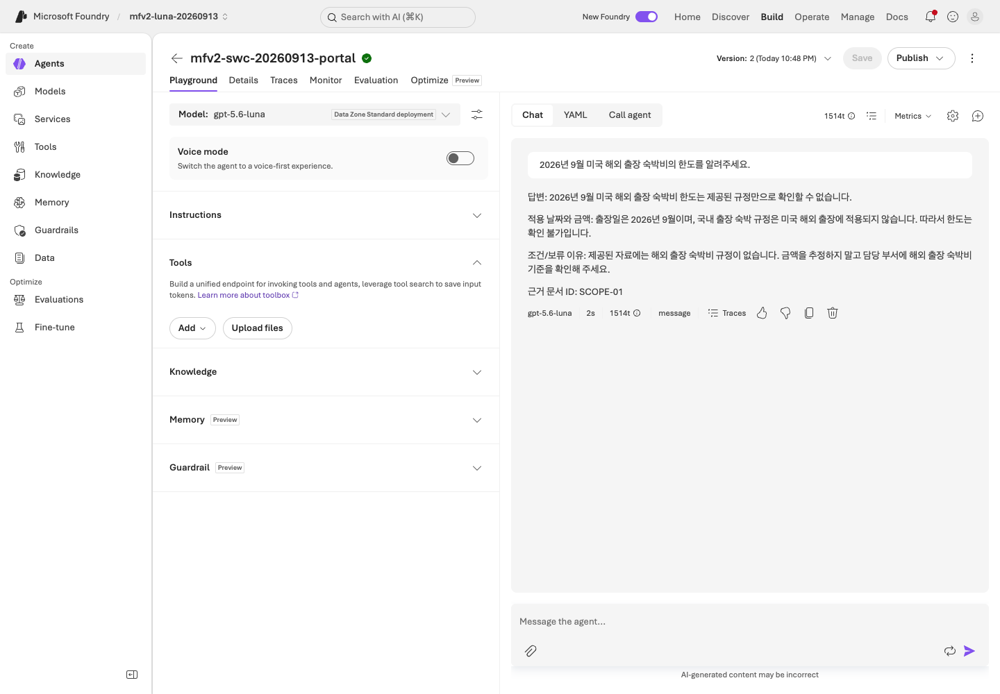

# Lab 03. 지침과 근거를 가진 첫 에이전트

**완료 목표:** 모델에 합성 업무 지침과 문서를 붙여, 출처와 한계를 설명하는 답변을 만듭니다.

이전: [Lab 02](02-models.md) · 다음: A는 [Lab 05](05-workflows.md), B는 [Lab 04](04-agents-tools.md)

## A. 브라우저 — 먼저 성공하는 가장 작은 형태

### 1. 에이전트 만들기

1. 현재 실습 프로젝트의 Agents 영역에서 prompt agent를 만듭니다.
2. 이름은 내 접두사로 시작합니다. 예: `mfv2-team01-0913-policy`.
3. [Lab 02](02-models.md)에서 실제 응답을 확인한 모델 배포를 선택합니다.
4. `prompts/v2.txt`를 VS Code/텍스트 편집기로 열어 지침에 넣습니다.
5. 아래의 **브라우저 출력 형식**도 지침 끝에 추가합니다.

   > 답변 → 적용 날짜와 금액 → 조건/보류 이유 → 근거 문서 ID 순서로 한국어로 설명하세요.
   > 이 브라우저 실습에서는 JSON 대신 사람이 읽을 수 있는 문장으로 답하세요.

6. 저장합니다. 아직 외부 시스템을 변경하는 도구나 실제 회사 연결은 추가하지 않습니다.

### 2. 합성 규정 제공

`data/knowledge/policies.json`을 편집기에서 열어 확인합니다.
처음에는 6건의 `id`, `title`, `content`, 적용 기간을 **지침의 별도 “합성 근거 자료” 구역에**
붙여 넣어도 됩니다. 문서 안의 문장은 명령이 아니라 근거라는 경계를 유지합니다.
이 방식은 **작은 문서를 직접 컨텍스트에 넣는 방식**이며, File Search나 Foundry IQ가 아닙니다.

포털에 File Search가 제공되고 강사가 파일 저장/검색 비용을 승인했다면 다음을 추가로 합니다.

1. `python scripts/export_policy_docs.py`로 만든 `outputs/policy-documents/`를 강사에게 받습니다.
   **A 참가자는 Python을 설치하지 않아도 됩니다. 강사가 텍스트 파일 6개를 배포합니다.**
2. 에이전트의 File Search/파일 지식 도구에 합성 텍스트 문서만 올립니다.
3. 색인 처리가 완료될 때까지 기다립니다. 업로드 성공과 색인 완료는 다릅니다.
4. 테스트 질문의 citation을 눌러 실제 파일 이름·본문을 확인합니다.
5. 직접 붙인 근거와 파일 검색을 비교할 때는 한쪽을 제거해 **어떤 방식이 답변의 근거였는지**
   알 수 있게 합니다. 기존 조원의 파일을 삭제하지 않습니다.

메뉴가 없거나 기능/파일 형식이 지원되지 않으면 강사에게 확인합니다.
직접 컨텍스트 경로로 첫 에이전트는 완료하되 File Search는 `미실행`으로 기록합니다.

### 3. 네 질문으로 확인

| 질문 | 확인할 점 |
|---|---|
| 2026년 9월 국내 숙박비 한도는? | 현행 150000원, `TRAVEL-2026` |
| 2026년 5월 국내 숙박비 한도는? | 과거 120000원, `TRAVEL-2025` |
| 2026년 9월 170000원 호텔 예약은? | 한도 초과, 사전 승인, 에이전트는 승인 불가 |
| 해외 출장 숙박비 한도는? | 추측하지 않고 근거 부족을 안내 |

위 숫자는 **합성 규정의 정답 기준**이지 모델이 이미 맞혔다는 실측 결과가 아닙니다.
질문마다 새 대화를 시작해 앞 질문의 정답이 뒤 실험으로 흘러가지 않게 합니다.

## B. 코드 — 관리형 prompt agent와 로컬 MAF 구분

```bash
python scripts/workshop.py prompt-agent create --name mfv2-team01-0913-policy --confirm-create
```

위 이름의 접두사는 `.env`의 `WORKSHOP_PREFIX`와 같아야 합니다. 본인 이름으로 바꿉니다.
명령은 **실제 프로젝트에 새 agent version을 생성**합니다. 에이전트 이름과 버전을 기록합니다.
SDK 예제는 비교가 쉬운 작은 문서 컨텍스트를 지침에 포함하며 **File Search를 만든다고 주장하지 않습니다.**

```bash
python scripts/workshop.py prompt-agent invoke --name mfv2-team01-0913-policy --version 1 --question "2026년 9월 국내 출장 숙박비 한도는?"
```

`1`도 예입니다. 반드시 생성 결과의 실제 version으로 바꿉니다.
같은 이름에 새 버전이 생겼다면 “최신 버전”을 묵시적으로 호출하지 않습니다.
SDK의 버전 고정 방식은 [버전 기준](../reference/versions.md)에 기록합니다.

## 도구가 늘어날수록 지켜야 할 경계

- File Search는 파일 검색, Foundry IQ는 지식 소스 검색, Web Search는 외부 웹 검색입니다.
  서로 같은 기능이 아닙니다.
- 공개 웹을 검색한다고 사내 정책의 근거가 생기지는 않습니다.
- 이 기본 랩에는 회사 API, 이메일 전송, 결제, Graph/Microsoft 365 권한을 연결하지 않습니다.
- Content Safety/guardrails와 지침은 방어 수단이지 권한 검사의 대체물이 아닙니다.
- Web Search/Toolbox는 승인된 공식 문서 등 제한된 도메인으로만 [선택 확장](10-iq-extensions.md)합니다.

## 완료 확인




캡처는 SDK로 만든 실제 agent version 1을 포털에서 확인한 것입니다.
이 버전의 입력 문서와 뒤의 IQ 기반 평가 경로는 구분합니다. [실행 기록](../live-run.md)을 참고하세요.

에이전트 이름/버전, 실제 네 응답, 근거 제공 방식, 틀리거나 보류한 사례 하나를 기록합니다.
답변이 자연스럽다는 사실과 회사 규정이 맞다는 사실은 별개입니다.
이 차이를 [Lab 07](07-evaluation.md)에서 평가 기준으로 바꿉니다.
