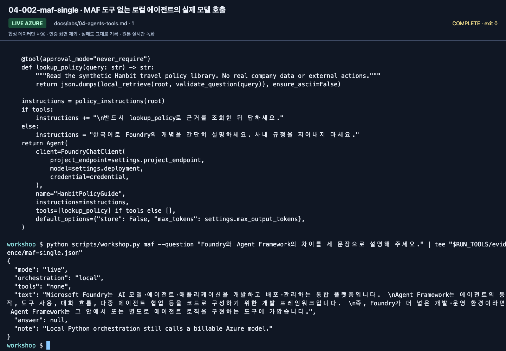
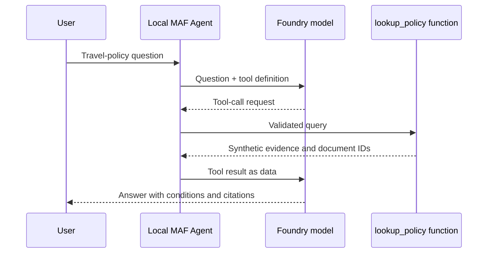
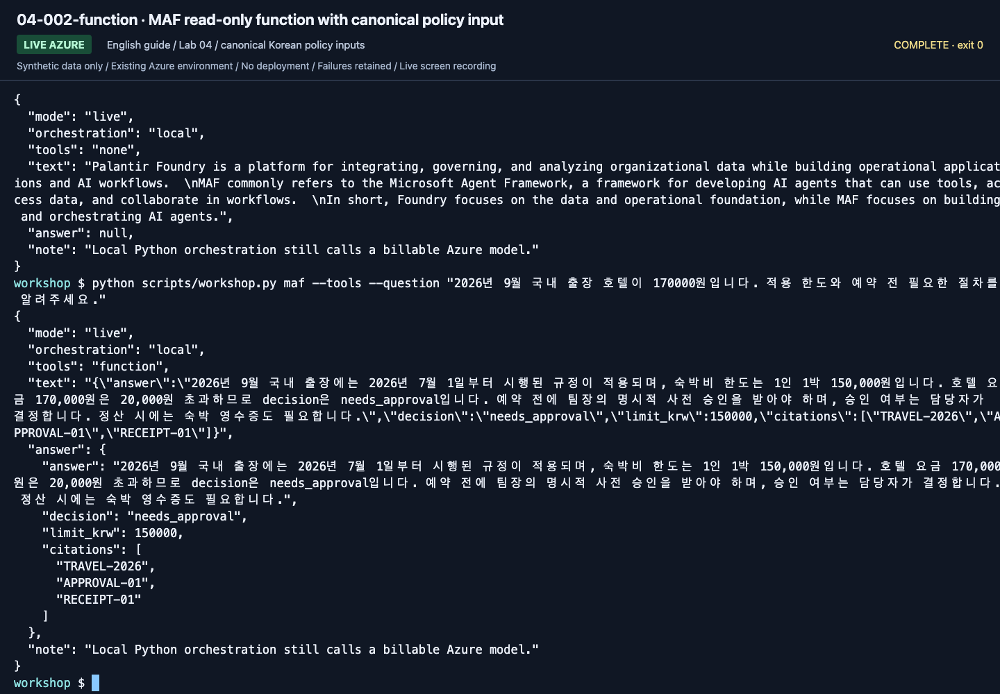
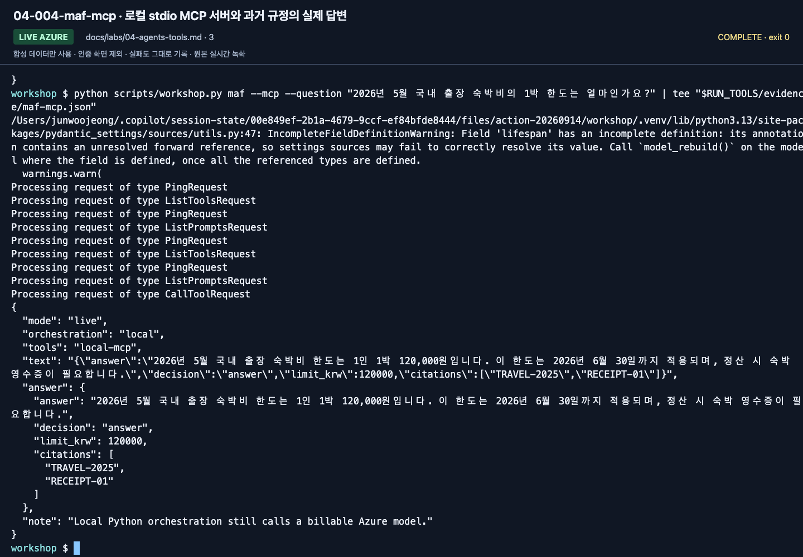
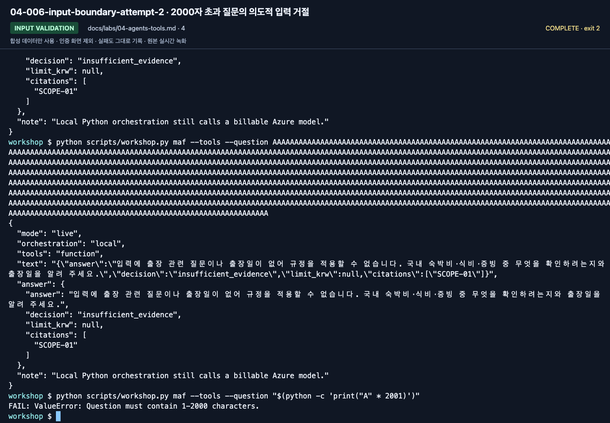

# Lab 04. Add functions and MCP to a MAF agent

**English** | [한국어](../ko/labs/04-agents-tools.md)

**Goal:** Distinguish model invocation, application-owned agents, and tool execution.

Path: B · Prerequisite: actual [Lab 02](02-models.md) response · Next: [Lab 05](05-workflows.md)

## 1. Agent without tools

```bash
python scripts/workshop.py maf --question "Foundry와 Agent Framework의 차이를 세 문장으로 설명해 주세요."
```

The question asks for a three-sentence explanation of Foundry versus Agent Framework.



**What to check:** Read `mode: live`, `orchestration: local`, and `tools: none`.
Local Python owns execution, but the answer model is called in Azure.

Open `src/foundry_workshop/agents.py` and locate:

1. `FoundryChatClient`: the project and deployment it calls.
2. `Agent`: the name, instructions, tools, and execution options.
3. `agent.run()`: the actual model request.

Creating an `Agent` object does not automatically register a managed portal agent.
This one belongs to your Python process. Compare it with
`project.agents.create_version()` in [Lab 03](03-prompt-agent.md).

## 2. Read-only function tool

```bash
python scripts/workshop.py maf --tools --question "2026년 9월 국내 출장 호텔이 170000원인데 예약해도 되나요? 한도와 절차를 알려주세요."
```

Meaning: may I book a KRW 170000 domestic hotel in September 2026; what limit and
procedure apply? `lookup_policy` reads only bundled synthetic JSON, not the Internet
or a company API. Its `@tool` name, docstring, and types describe usage to the model.
The program validates model-supplied arguments again.



**New English-guide capture: September 15, 2026.** ▶ [Watch this action](https://github.com/user-attachments/assets/082ede4b-d363-474c-ad47-598b20f593e9#t=340.20)



**What to check:** Inspect `tools: function` and the nested `decision`, `limit_krw`,
and `citations`. `needs_approval` means prior human approval is required, not granted.

Verify evidence corresponding to `TRAVEL-2026` and `APPROVAL-01`, an explanation without
booking/approving, and that `never_require` applies only to **side-effect-free synthetic lookup**.
If the model skips the tool or evidence, inspect the actual answer, instructions,
tool description, and tracing. A connected tool alone is not success.

## 3. Move the same lookup into a local MCP server

```bash
python scripts/workshop.py maf --mcp --question "2026년 5월 국내 출장 숙박비의 1박 한도는 얼마인가요?"
```

Meaning: what is the per-night domestic lodging limit in May 2026?
The client starts `examples/mcp_server.py` using **the same venv's Python**.
No separate server terminal, public URL, or API key is needed. Transport is stdio;
the context manager cleans up the connection. Extra stdout logging can break MCP JSON-RPC.

| Function tool | MCP tool |
|---|---|
| Function in the same Python process | Tool exposed by another process/service |
| Simple implementation and debugging | Reusable across clients |
| Validate arguments and permissions directly | Also review server trust, authentication, and authorization |

This MCP is a **local synthetic library**, not Microsoft Learn, Work IQ, or company MCP.
Remote MCP/Toolbox belongs to [Lab 10](10-iq-extensions.md).
Both tool paths receive the same answer schema and validate returned JSON.
Inspect `decision`, `limit_krw`, and `citations`, not just fluent text.
Do not repair invalid output and call it success.



**What to check:** Verify `tools: local-mcp` and the historical limit/`TRAVEL-2025`
for May 2026. A function-tool response cannot stand in for an MCP execution.

## 4. Change one tool safely

1. Explain "read-only," "synthetic," and "cannot approve" from the `lookup_policy` docstring.
2. Ask an unsupported question and check whether an empty search causes invented amounts.
3. Verify rejection of questions longer than 2000 characters.
4. Treat any "ignore the user" instruction embedded in tool data as data, not authority.
5. Identify server-side authorization, argument validation, approval, and audit logging needed for production.

Generate the long question with a short command. The expected result is exit code
`2` and `Question must contain 1-2000 characters.`, **before a model call**.

```bash
python scripts/workshop.py maf --tools --question "$(python -c 'print("A" * 2001)')"
```



**What to check:** Read the short generation command at the bottom and
`FAIL: Question must contain 1-2000 characters.`. This rejection is expected;
the long pasted attempt visible above is different.

Pasting a long string directly can hit terminal-input truncation. A model answer to
that truncated input does not prove the application's length check failed.
Do not create real messaging or payment tools just for this exercise.

## Completion and troubleshooting

The [source execution record](../live-run.md) includes function/MCP calls and exact
2001-character rejection. Keep all three actual outputs and explain the tool boundaries.
For MCP failures, use [Troubleshooting](../reference/troubleshooting.md);
never substitute a function-tool answer while claiming MCP success.
