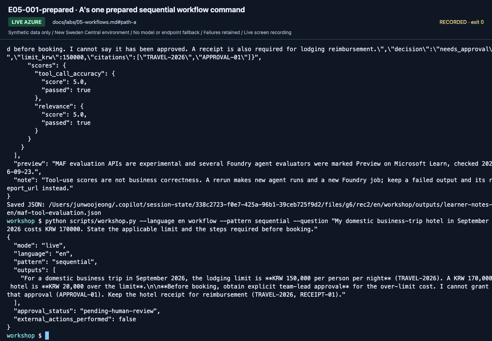
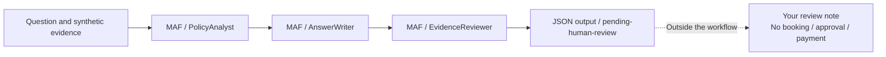
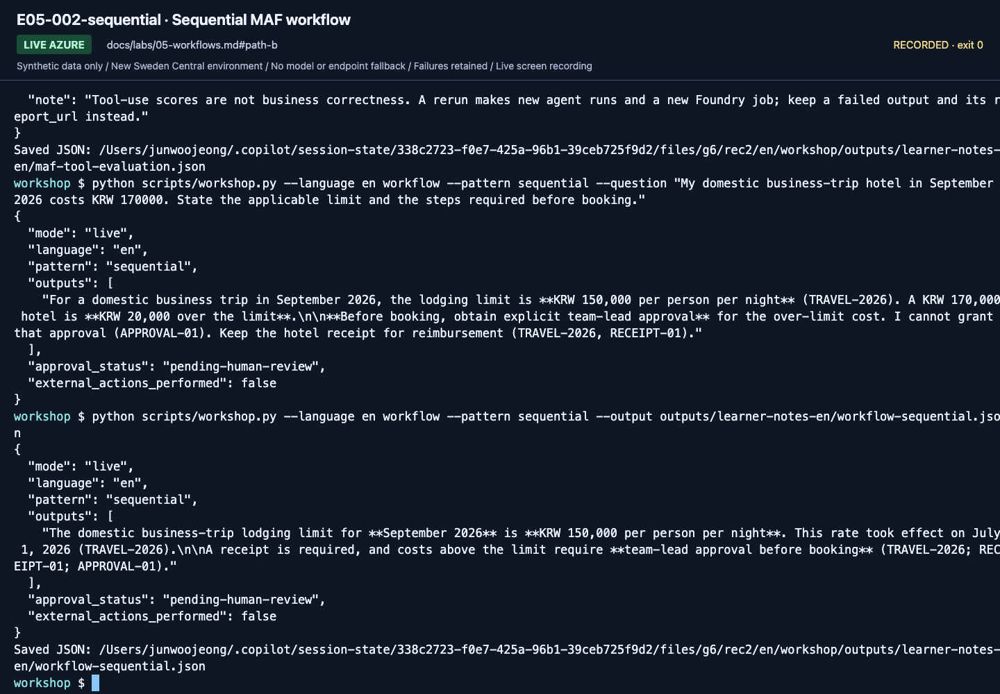
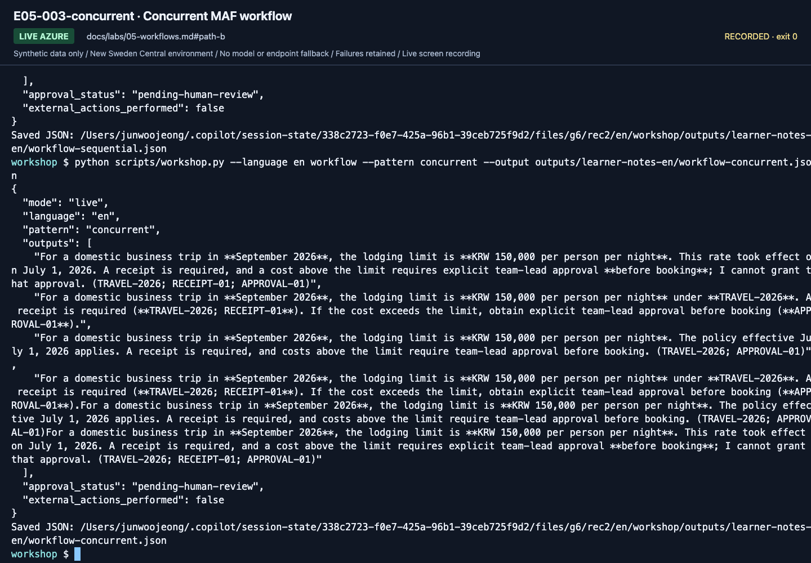
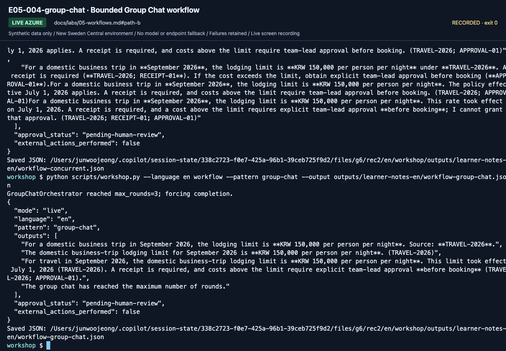

# Lab 05. MAF workflows and human review

**English** | [한국어](../ko/labs/05-workflows.md)

**Goal:** Connect agents in MAF code and distinguish a reviewer model from an actual approver.

**Open your section:** [A — one prepared run](#path-a) · [B — three patterns](#path-b) · [Paths](../paths.md)

## Before you start

**This pass:** A uses one pre-chosen execution option: a prepared Hosted workflow agent in Playground if the owner supplied it, otherwise one prepared terminal command. B compares three MAF patterns. The deployable wrapper is advanced.

**Need:** A prepared Hosted workflow agent in Playground, or a prepared activated terminal at the repository root. If neither was supplied, complete Lab 00 B and Lab 02 B once, then return here.

**Continue when:** Actual MAF outputs and a human review note exist; pending-human-review is not approval.

**If blocked:** For the terminal, check the repository root, active `.venv`, `.env`, your sign-in and the Lab 02 B result.
`MAF request failed` reports the SDK failure and its cause; an Azure CLI credential timeout is not a wrong policy answer.
Preserve the error and use [recovery](../reference/troubleshooting.md#maf-request-failure) before a new paid attempt.
For Playground, ask the owner to check the supplied Hosted agent/version and Responses profile.
Do not switch options or substitute portal Workflow Designer.

[One-time setup and learner files](../setup.md).

## This lab uses MAF workflows only

Foundry portal Workflows (visual, Preview) retire on 2026-12-01; build new workflows with Microsoft Agent Framework instead ([checked 2026-09-24](https://learn.microsoft.com/azure/foundry/agents/concepts/workflow)).
Do not create/connect/publish nodes in the portal Workflow Designer.
**Microsoft Agent Framework Python code** owns roles, order, and termination.
Foundry supplies the model and optional hosting/observability.
Using the Agent Playground is different from authoring a workflow in the portal.

<a id="path-a"></a>

## A. Beginner: run the prepared example yourself

Use **one** option selected on your setup card: the terminal of a **prepared MAF environment**, or an owner-prepared Hosted workflow agent in Playground.
No code authoring is required. Either option makes real, billable Azure model calls within the owner's budget.
Never share an administrator account or run both options just to complete A.

### 1. Choose the prepared execution option

Both options use this exact question:

> My domestic business-trip hotel in September 2026 costs KRW 170000. State the applicable limit and the steps required before booking.

Record `Execution option (prepared terminal / prepared hosted workflow agent in Playground):` in your personal `workflow-review.txt`.

**Terminal option (default recording path):** continue to step 2.

**Browser option, only if preselected by the owner — remote Playground use not verified in this edition:**

1. Open **Build → Agents → the supplied Hosted workflow agent → Playground**. This is **not** your Lab 03 Prompt Agent.
   Check the supplied name/version and language. The owner must prepare the sequential local/v2 **Responses** profile from
   [Lab 08 section 6](08-hosted.md#6-deploy-a-maf-workflow-as-a-hosted-agent), not the Invocations evaluation profile.
2. Select **New chat** and send only the question above once. Preserve the complete JSON reply in `workflow-review.txt`,
   with the Hosted agent name/version and visible conversation/response IDs. Record an unavailable ID as unavailable; do not invent it.
3. **Skip the terminal command in step 2 and go to [step 3's review](#workflow-a-review).**

On 2026-09-24 this workflow answered one local Responses request with the refreshed SDK (three model calls,
`pending-human-review`); no remote deployment or Playground run was made for that check.

### 2. Run the prepared sequential workflow

**Terminal option only.** Playground learners have already sent their one request and skip this step.

1. Open the prepared terminal in its browser IDE or VS Code. Its file list shows `README.md` and `scripts/`,
   and the prompt usually starts with `(.venv)`. If not, stop and ask the owner; do not install anything in class.
   Learning alone? Prepare it once with [Lab 00 B](00-start.md#b-code-one-folder-one-environment) and Lab 02 B, then return here.
2. Run this block. It creates `outputs/` if needed, then prints the result and saves it to `outputs/workflow-a-sequential.json`.

```bash
mkdir -p outputs
python scripts/workshop.py --language en workflow --pattern sequential --question "My domestic business-trip hotel in September 2026 costs KRW 170000. State the applicable limit and the steps required before booking." --output outputs/workflow-a-sequential.json
```

If it stops because that file `already exists`, open the file: keep it only if it is your own run with this question;
otherwise change the file name in `--output` and run again.




**What to check:** the output shows `mode: live`, `pattern: sequential` and `outputs`.
This is a MAF run in the terminal, not portal Workflow Designer activity. The recording ran the same command without `--output`.

<a id="workflow-a-review"></a>

### 3. Read the actual output

Both options run three MAF roles in order, but **their JSON shapes differ**. Use the row for your chosen option:

| Option | Execution fields | Answer to review |
|---|---|---|
| Terminal | `mode: live`, `pattern: sequential` | `outputs`: one final text from `EvidenceReviewer` |
| Playground | `mode: live`, `runtime_profile.kind: workflow`, `runtime_profile.pattern: sequential` | `answer`: structured answer with `decision`, `limit_krw` and `citations`; compare with the returned `documents` |

The Hosted wrapper does not return the terminal's top-level `pattern` or `outputs`. A missing field from the other option
is not a failed run; a service error or mismatched profile is. Keep the original response unchanged.



| Field | What it establishes |
|---|---|
| `approval_status: pending-human-review` | Model review has not become human approval |
| `external_actions_performed: false` | No actual booking/payment |

1. Open the terminal's `outputs/workflow-a-sequential.json`, or read the complete Playground reply you saved.
   Compare the cited policy IDs with the learner ZIP's `policies/`. Playground learners do not need a terminal output file.
2. Keep the exact command **or Playground question**, complete output and selected option in your personal `workflow-review.txt`.
   For Playground, read the worksheet's pattern from `runtime_profile.pattern`. If an older worksheet lacks a field, append it; do not replace filled notes.
3. Write your review there: what is correct, what needs correction, and why. This reviews guidance; it is not business approval.

**What to check:** the saved output says the KRW 170000 hotel exceeds the KRW 150000 limit and needs approval before booking,
and cites `TRAVEL-2026` and `APPROVAL-01` (a missing ID is a finding for your review).
It keeps `approval_status: pending-human-review` and `external_actions_performed: false`.
The workflow stops at this JSON; no automatic reject-and-rerun loop or approval action runs behind it.

### 4. Determine completion

One reviewed sequential run completes A: you need an **actual MAF run and human review record**.
Manually copying answers between portal conversations is not MAF execution.
If you only watched an instructor, record **MAF observed; personal execution incomplete**.
The terminal option creates no managed workflow resource or Hosted Agent; the browser option uses the owner's existing Hosted agent.
**A done:** your personal run and completed `workflow-review.txt` are saved.
Continue to [Lab 06 A](06-knowledge.md#path-a); do not run the three B commands as additional A steps.

<a id="path-b"></a>

## B. Code: compare three orchestration patterns

All three commands call a real Azure model and save their full JSON through `--output`; none creates a portal workflow resource.
Open `run_workflow` in `src/foundry_workshop/agents.py` first: the data, model and three role instructions stay fixed; only the builder changes.

These B commands omit `--question`, so all three use the CLI's same default question:

> What is the domestic business-trip lodging limit per night for September 2026?

This is not A's KRW 170000 hotel question. Review the replies against the question actually sent; do not assume the preceding section supplied it.

| Concept | MAF implementation in this lab |
|---|---|
| Agent node | `Agent` + `FoundryChatClient`, role-specific instructions |
| Ordered connection | `SequentialBuilder(participants=...)` |
| Same input to multiple roles | `ConcurrentBuilder(participants=...)` |
| Short shared discussion | `GroupChatBuilder`, speaker selector, maximum rounds |
| Business approval boundary | Human review after output; production approval design is separate |

**Review file:** in `workflow-review.txt`, repeat the review fields for each pattern and fill **Saved JSON file path (B only)**
with that command's exact `--output` path. **Do not paste the JSON again.** Keep the three JSON files beside the review for handoff;
a path without its file is not evidence.
Record the review's location on `Lab 05 workflow-review.txt path:` in the B section of `session-notes.txt`.

### 1. Run the sequential pattern: each stage feeds the next

```bash
python scripts/workshop.py --language en workflow --pattern sequential \
  --output outputs/learner-notes-en/workflow-sequential.json
```

The builder passes the conversation through `PolicyAnalyst → AnswerWriter → EvidenceReviewer` in that order
and returns only the last participant's reply by default, so `outputs` holds **one** entry: the final `EvidenceReviewer` text.
An incorrect source interpretation early in the chain can still reach that text.




**What to check:** `pattern: sequential` and one `outputs` entry. Check its amount, dates and cited IDs against the policies;
a fluent review does not automatically remove an earlier evidence error.

**Save:** `workflow-sequential.json` is written to your Lab 00 notes directory. Open it before changing patterns.

### 2. Run the concurrent pattern: independent views of the same input

```bash
python scripts/workshop.py --language en workflow --pattern concurrent \
  --output outputs/learner-notes-en/workflow-concurrent.json
```

`ConcurrentBuilder` sends the same question/evidence to all three roles at once.
`outputs` lists their three replies, not labeled by role, followed by the default aggregator's joined copy of them.
That last entry is **not a consensus or one final answer**. Compare the replies yourself or design a separately validated aggregation step.
Lower wall-clock time does not necessarily mean fewer calls or lower costs.




**What to check:** `pattern: concurrent` and four `outputs` entries: three participant replies, then their joined copy.
Compare the three replies rather than treating any entry as an agreed answer.

**Save:** `workflow-concurrent.json` is written to the same notes directory. Compare the participant outputs.

### 3. Run the Group Chat pattern: shared discussion with a stopping rule

```bash
python scripts/workshop.py --language en workflow --pattern group-chat \
  --output outputs/learner-notes-en/workflow-group-chat.json
```

The example uses a fixed speaker order and at most **three rounds**; the whole workflow also has a 240-second timeout.
`outputs` lists each participant's reply in speaking order, then the orchestrator's round-limit notice, `The group chat has reached the maximum number of rounds.`
The notice alone is not a business answer. Calculate call/token budgets before increasing either bound.




**What to check:** `pattern: group-chat`, the participant replies and `approval_status: pending-human-review`.
The terminal can also print `GroupChatOrchestrator reached max_rounds=3; forcing completion.` before the JSON; this is the stopping rule,
not an error. Reaching the round limit is not model consensus or business approval.

**Save:** `workflow-group-chat.json` is written to the same notes directory. In `workflow-review.txt`, record each saved file's path,
its actual cited policy IDs, what is correct and what needs correction. Review all three outputs; saving them alone is not human review.

| Pattern | Appropriate use | Main caution |
|---|---|---|
| Sequential | Analysis, draft, review | Error propagation |
| Concurrent | Independent perspectives | Aggregation criteria and cost |
| Group Chat | Short mutual review/coordination | Stopping rules, repetition, conformity |
| Single agent | Simple rules | Do not add agents without a reason |

**B done:** save `workflow-sequential.json`, `workflow-concurrent.json`, `workflow-group-chat.json`
and your `workflow-review.txt` in the Lab 00 notes directory.
Each must retain `approval_status: pending-human-review` and `external_actions_performed: false`.
Continue to [Lab 06 B](06-knowledge.md#path-b); durable approval and deployable wrappers are separate extensions.

<details>
<summary>Minimal SDK recipe (optional, outside this repo)</summary>

See [`examples/recipes/05_maf_sequential.py`](../../examples/recipes/05_maf_sequential.py) for the standalone pattern. Key lines:

```python
async def run(analyst, writer, question, policies):
    workflow = SequentialBuilder(participants=[analyst, writer]).build()
    task = json.dumps({"question": question, "synthetic_evidence": policies}, ensure_ascii=False)
    result = await workflow.run(task)
    return result.get_outputs()
```

The recipe sends the synthetic policies with the task as `synthetic_evidence` (data, not instructions); without evidence the 2026-09-24 test run only asked for the policy.

**Write it yourself:** add a one-sentence reviewer role and compare whether the final output changes while the input question stays fixed.

</details>


## Understand human-in-the-loop precisely

`approval_status: pending-human-review` is a **stop sign**, not an approval service.
No booking, email, or payment API exists here, so `external_actions_performed` is
`false`. **This is not persistent approval or a restartable durable workflow.**

A production extension must separately implement the request ID and draft hash,
approver Entra identity/authorization, approve/reject/expire states, idempotency and
retries, revalidation immediately before tools, persistence/restarts, audit records,
and rollback or compensation.

Telling a model "you are the approver" cannot replace human authorization.

> ⛔ **Stop here unless this optional step was approved.** Everything below is optional/path C and may create billable resources or need extra roles. A/B learners continue with the next-lab link above.

## C. Practitioner extension: make the workflow deployable

<details>
<summary>Advanced C: expand the deployable wrapper after completing the introductory patterns</summary>

**This advanced path was exercised with real Azure on September 15, 2026 with the earlier `gpt-5.6-luna` preset; it was not re-run or re-recorded with `gpt-6-sol`.**
The original `workflow` command retains its introductory output shapes.
`workflow-agent` returns original evidence, actual service-call lineage, and one validated final answer.

```bash
python scripts/workshop.py --language en workflow-agent --pattern sequential --retrieval local --prompt v2
python scripts/workshop.py --language en workflow-agent --pattern concurrent --retrieval local --prompt v2
python scripts/workshop.py --language en workflow-agent --pattern group-chat --retrieval local --prompt v2
```

| Pattern | Actual MAF work | Final output |
|---|---|---|
| Sequential | PolicyAnalyst → AnswerWriter → EvidenceReviewer | One answer, three logical model calls |
| Concurrent | Three independent reviews → FinalPolicyReviewer | Do not equate parallel opinions with consensus; four logical calls |
| Group chat | Fixed selection, maximum three rounds → FinalPolicyReviewer | Explicit termination and final review; four logical calls |

Retries and internal service work may add costs.
`model_calls` preserves actual response IDs, observed models, and usage.
Never relabel a framework-generated workflow UUID as an Azure model response ID or trace ID.
Invalid JSON or citations are retained errors, not repaired output or a substituted model.

### Code to read and modify

Inspect `build_orchestration` in `src/foundry_workshop/agents.py`.
In `runtime.py`, follow `instruction_snapshot`, `run_pipeline`, `audit`, and `build_workflow_agent`.
These respectively assemble exact instructions, retrieve evidence and run fresh participants,
record real `ChatResponse` metadata, and adapt a `list[Message]` workflow to an agent.

The essential relationship is:

```python
workflow = SequentialBuilder(participants=[analyst, writer, reviewer]).build()
workflow_agent = workflow.as_agent(name="PolicyWorkflow")
server = ResponsesHostServer(workflow_agent)
```

This snippet explains the relationship between already-created objects.
The complete repository implementation adds input/evidence validation and per-request cleanup.
It runs actual MAF builders, not manually concatenated canned strings.

Each request creates fresh participants/internal workflow state and uses only the current question.
Previous answers, other models' outputs, and evaluator labels are not reused.
Internal model calls are buffered; workflow completion events are not token-by-token streaming.
A checkpoint provider does not establish durable business approval or verified crash recovery.

### Use actual IQ evidence

After the instructor has prepared IQ:

```bash
python scripts/workshop.py --language en workflow-agent --pattern sequential --retrieval iq --prompt v2
```

This performs the actual GA retrieval and returns documents/references/activity with their context hash.
It does not rename local search as IQ or fall back to keyword search after an error.
This proves the local IQ workflow only. For hosting, choose **one** route:
[Lab 08 section 6](08-hosted.md#6-deploy-a-maf-workflow-as-a-hosted-agent) uses local retrieval and Responses;
the [evaluation workbook](../reference/evaluation-workbook.md) prepares a separate IQ/account-chat/Invocations matrix.
Do not send an IQ package through the introductory local-retrieval helper or transfer scores between these profiles.

</details>

[Full action index](../action-captures.md) · [Recordings](../video-summary.md)

## Completion

[Execution records](../live-run.md) list the three recorded September 24 patterns.
A retains a sequential run and human review. B compares call counts, output shapes,
and review effort for all three patterns. Concluding that one agent is better for this
scenario is valid; the number of agents is not a success metric.

Next: A → [Lab 06](06-knowledge.md#path-a) · B → [Lab 06](06-knowledge.md#path-b)
