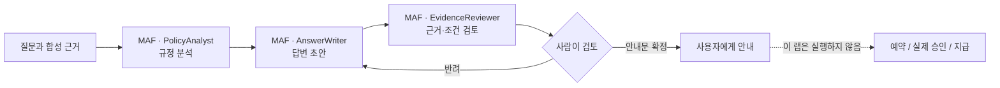
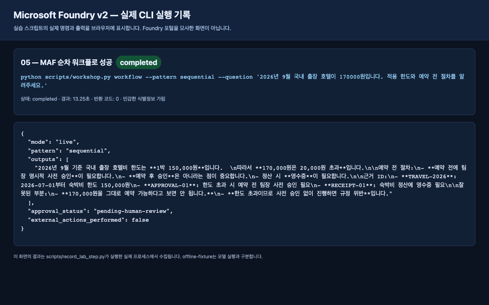
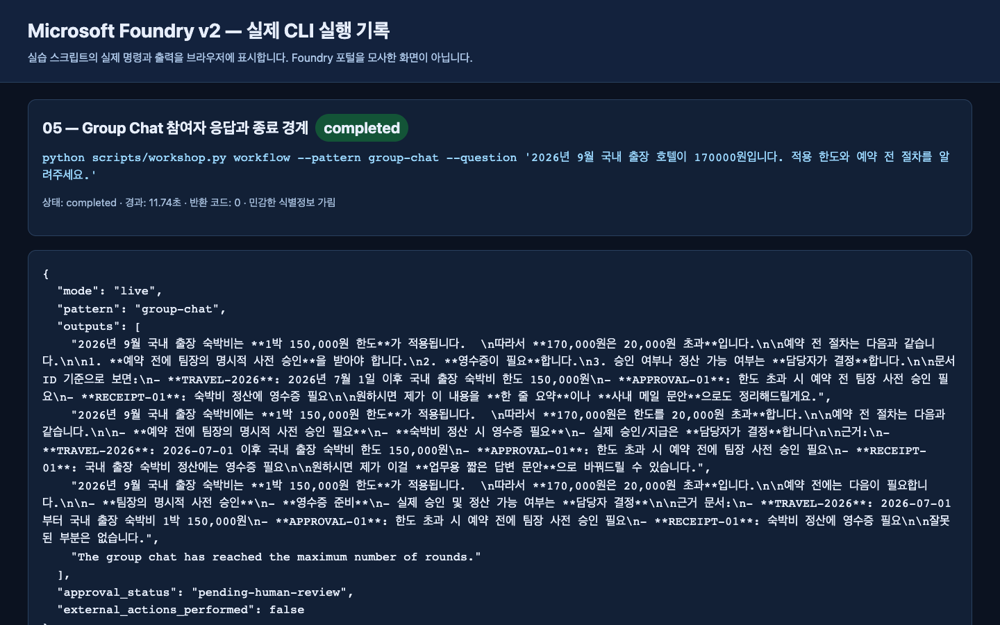

# Lab 05. MAF로 만드는 워크플로와 사람의 검토

**완료 목표:** MAF 코드로 에이전트를 연결해 실행하고, 검토자 모델과 실제 승인자를 구분합니다.

이전: A는 [Lab 03](03-prompt-agent.md), B는 [Lab 04](04-agents-tools.md) · 다음: [Lab 06](06-knowledge.md)

## 이 랩은 MAF 워크플로만 사용합니다

Foundry 포털의 Workflow Designer에서 노드를 생성·연결·게시하는 경로는 사용하지 않습니다.
워크플로의 역할·순서·종료 조건은 **Microsoft Agent Framework(MAF) Python 코드**가 소유합니다.
Foundry는 그 코드가 호출하는 모델과 선택적인 호스팅·관측을 제공합니다.
포털의 Agent Playground를 사용하는 것과 포털에서 workflow를 작성하는 것은 다릅니다.

## A. 초보자 — 준비된 MAF 예제를 직접 실행

코드를 직접 작성하지 않아도 됩니다. 강사가 **준비된 MAF 실행 환경**을 제공합니다:
이 저장소, Python/SDK, 학습자 권한의 Azure 로그인, `.env`, 활성화된 가상환경입니다.
브라우저 IDE나 VS Code의 준비된 터미널을 사용하며, 관리자 계정을 참가자에게 공유하지 않습니다.

같은 출장 질문을 다음 세 역할이 처리합니다.



### 1. 명령 하나로 순차 워크플로 실행

준비된 터미널이 저장소 루트인지 확인한 뒤 다음 명령을 복사합니다.
이 명령은 실제 Azure 모델을 호출하므로 강사의 호출 예산 안에서 실행합니다.

```bash
python scripts/workshop.py workflow --pattern sequential --question "2026년 9월 국내 출장 호텔이 170000원입니다. 적용 한도와 예약 전 필요한 절차를 알려주세요."
```

### 2. 실제 결과 읽기

| 출력 | 초보자가 확인할 내용 |
|---|---|
| `mode: live`, `pattern: sequential` | 준비된 MAF 코드가 실행한 결과인가 |
| `outputs` | 현행 한도와 사전 승인 조건을 근거와 함께 설명하는가 |
| `approval_status: pending-human-review` | 모델 검토를 실제 사람 승인으로 오해하지 않았는가 |
| `external_actions_performed: false` | 실제 예약·지급을 수행하지 않았는가 |

질문을 과거 출장일로 바꿔 한 번 더 실행하고, 어떤 규정을 적용했는지 비교합니다.
참가자가 답변과 규정을 직접 읽고 수정 이유·최종 안내문을 기록합니다.

### 3. 완료 판정

**실제 MAF 실행 결과와 사람의 검토 기록**이 있어야 이 단계가 완료됩니다.
여러 포털 대화의 답변을 사람이 복사해 이어 붙이는 것을 MAF 실행으로 기록하지 않습니다.
환경이 준비되지 않아 강사 실행만 봤다면 `MAF 관찰 / 직접 실행 미완료`로 구분합니다.
이 단계는 로컬 MAF 실행이며 관리형 workflow 리소스나 Hosted Agent를 만든 것이 아닙니다.

## B. 코드 — 세 가지 오케스트레이션 비교

모든 명령은 실제 Azure 모델을 호출합니다.
워크플로를 정의하는 코드는 `src/foundry_workshop/agents.py`의 `run_workflow`입니다.
같은 데이터·모델·지침을 유지한 채 MAF builder와 실행 순서의 차이를 확인합니다.
이 명령은 포털 workflow 리소스를 생성하지 않습니다.

### 포털 중심 개념을 MAF 코드로 옮기기

| 옮길 개념 | 이 실습에서 사용하는 MAF 구현 |
|---|---|
| 에이전트 노드 | `Agent` + `FoundryChatClient`, 역할별 지침 |
| 순서대로 연결 | `SequentialBuilder(participants=...)` |
| 같은 입력을 여러 역할에 전달 | `ConcurrentBuilder(participants=...)` |
| 여러 역할의 짧은 토론 | `GroupChatBuilder` + 발화자 선택 함수 + 최대 라운드 |
| 업무 승인 경계 | 출력 이후 사람의 검토; 아래의 운영용 승인 설계를 별도 구현 |

조건 분기·상태 저장·durable 승인까지 자동으로 마이그레이션되는 것은 아닙니다.
필요한 업무 상태와 오류/재시도 정책을 코드에서 명시적으로 설계해야 합니다.

### 1. 순차: 앞 단계 결과가 다음 단계의 입력

```bash
python scripts/workshop.py workflow --pattern sequential
```

`PolicyAnalyst → AnswerWriter → EvidenceReviewer`를 사용합니다.
`SequentialBuilder`의 participants 순서와 실제 출력의 흐름을 비교합니다.
원문 오류를 초안이 그대로 이어받을 수 있다는 점도 관찰합니다.

### 2. 병렬: 같은 입력을 독립적으로 검토

```bash
python scripts/workshop.py workflow --pattern concurrent
```

`ConcurrentBuilder`가 같은 질문·합성 근거를 세 역할에 보냅니다.
이 출력은 세 관점의 결과이며, **자동 합의·최종 답안 하나**가 아닙니다.
사용자가 읽어 통합하거나 별도의 검증된 집계 단계를 설계해야 합니다.
벽시계 시간이 줄어도 총 모델 호출 수나 비용이 줄었다고 단정하지 않습니다.

### 3. Group Chat: 공유 대화와 종료 조건

```bash
python scripts/workshop.py workflow --pattern group-chat
```

이 예제는 정해진 순서로 최대 **3라운드**만 진행합니다.
`output_from=participants`로 실제 참여자 응답을 수집합니다.
종료 안내 문구만 나온 것을 업무 답변으로 취급하지 않습니다.
무한 토론이나 모델 스스로 끝날 때까지 기다리는 구조가 아닙니다.
전체 workflow timeout도 240초로 제한합니다.
큰 수로 늘리기 전에 호출량과 token budget을 먼저 계산합니다.

| 패턴 | 적합한 업무 | 주의할 점 |
|---|---|---|
| 순차 | 자료 분석 → 초안 → 검수 | 앞 단계 오류 전파 |
| 병렬 | 서로 다른 관점의 독립 검토 | 집계 기준과 비용 |
| Group Chat | 짧은 상호 검토·조정 | 종료 조건, 반복·동조 편향 |
| 단일 에이전트 | 규칙이 단순한 질문 | 불필요하게 multi-agent로 만들지 않기 |

## Human-in-the-loop를 정확히 이해하기

예제의 `approval_status: pending-human-review`는 **정지 표지**입니다.
응답을 받은 사람이 검토할 때까지 승인됐다고 표시하지 않습니다.
이 코드에는 지급/이메일 전송/예약 API가 아예 없으므로 `external_actions_performed`는
`false`입니다. **영속적인 승인 서비스나 재시작 가능한 durable workflow를 구현한 것은 아닙니다.**

운영용으로 확장하려면 별도로 구현해야 할 항목:

- 요청 ID와 초안의 hash를 묶은 승인 대상.
- 실제 승인자의 Entra identity와 권한 확인.
- 승인/반려/만료, 중복 요청 방지와 재시도 정책.
- 승인 이후 도구 호출 직전의 재검증.
- 상태 저장, 재시작, 감사 로그, rollback/보상 동작.

모델에게 “너는 승인자”라는 지침을 준 것으로 사람 승인을 대체하지 않습니다.

## 완료 확인





두 화면 모두 포털 Workflow Designer가 아니라 실제 MAF Python 실행 로그입니다.
실행 중 발견한 반환값 처리와 전체 녹화는 [실행 기록](../live-run.md)에 있습니다.

A는 순차 MAF 실행과 사람의 검토 결과를 남깁니다.
B는 같은 질문에 대해 세 패턴의 호출 수·출력 형태·검토 부담을 비교한 표를 남깁니다.
우리 출장 상담에 단일 에이전트가 더 적절하다고 결론 내려도 좋습니다.
multi-agent 개수 자체가 성공 기준은 아닙니다.
