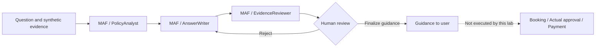
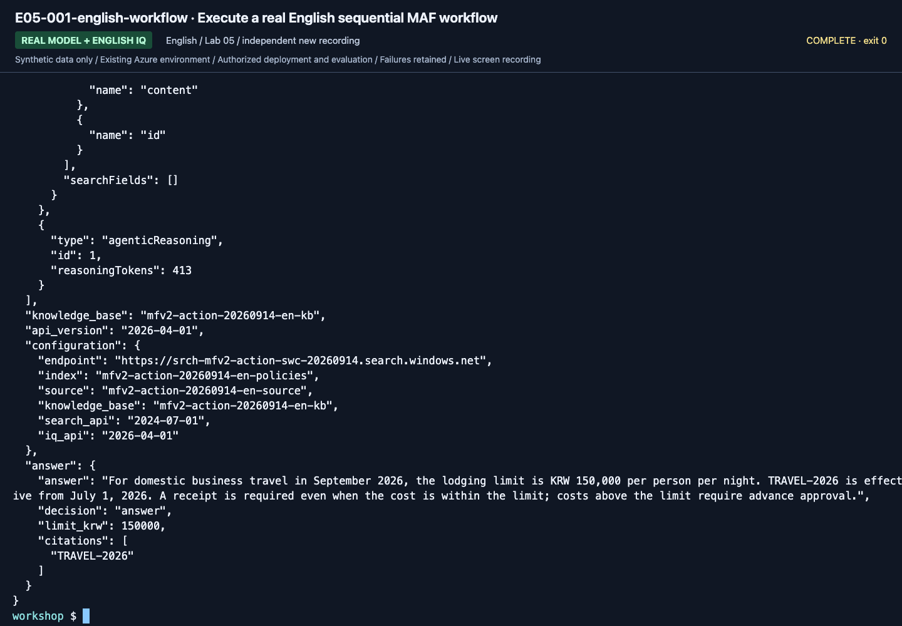
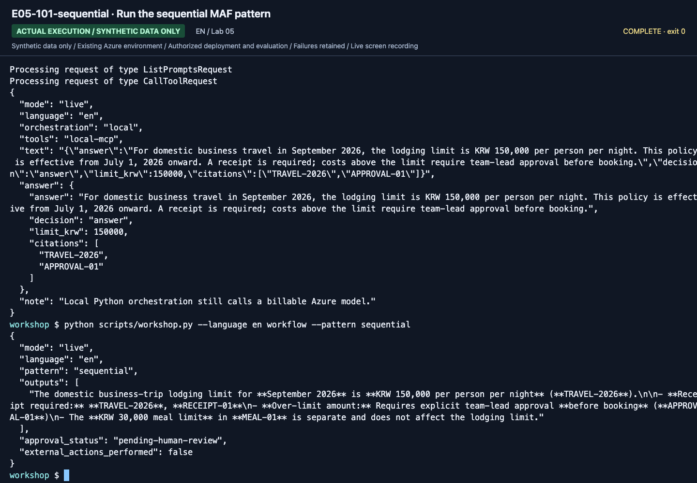
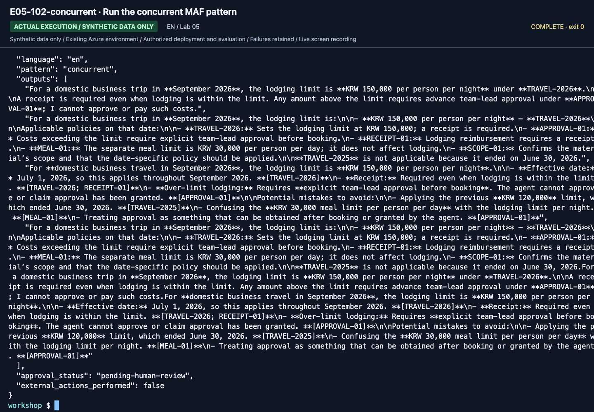
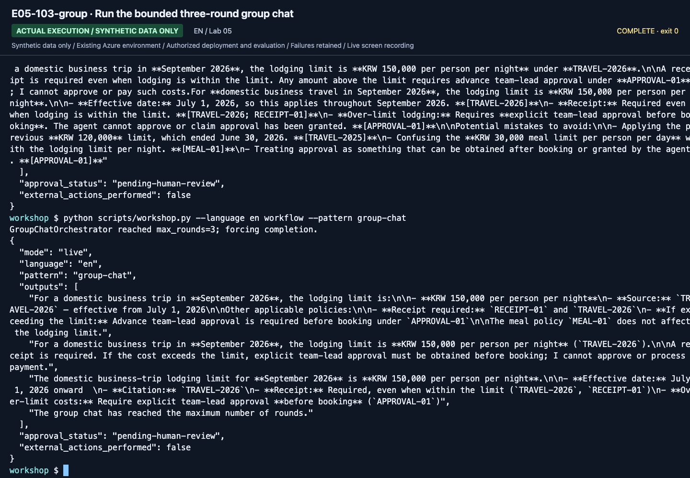
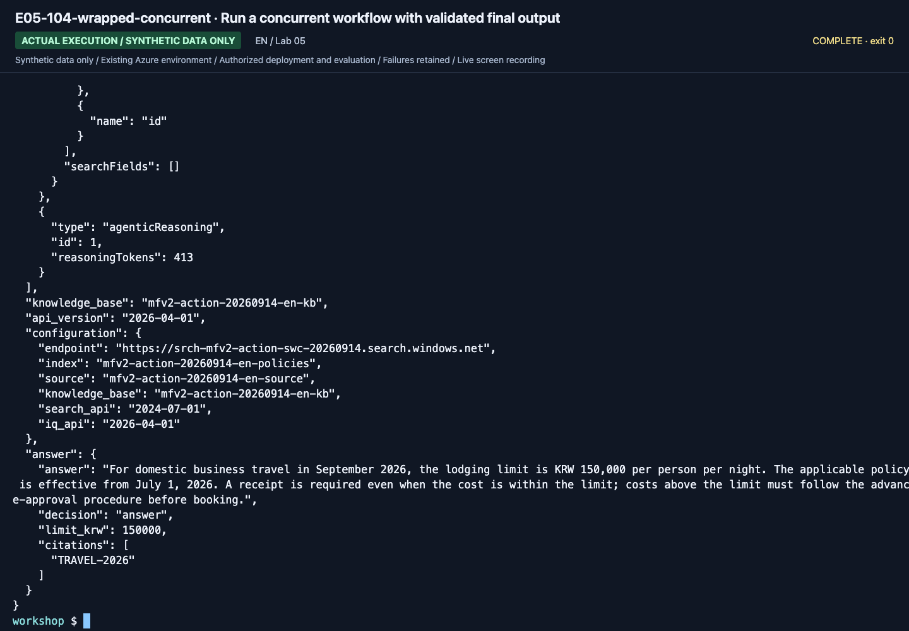
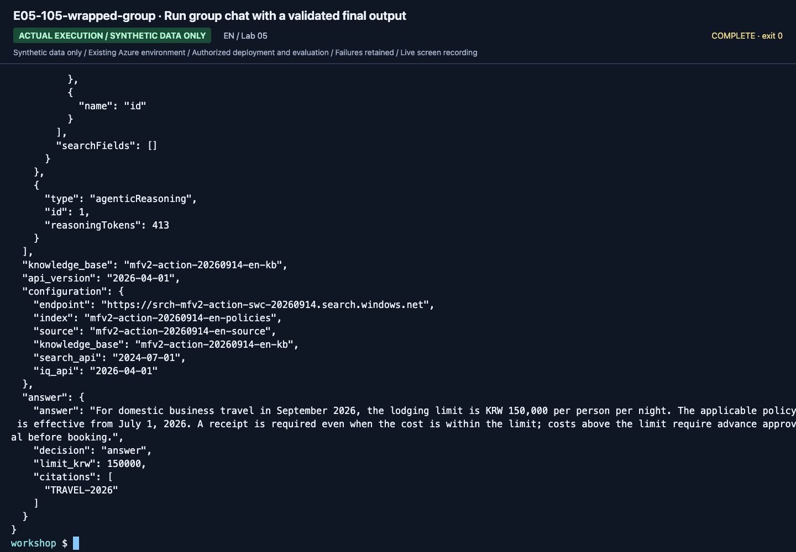

# Lab 05. MAF workflows and human review

**English** | [한국어](../ko/labs/05-workflows.md)

**Goal:** Connect agents in MAF code and distinguish a reviewer model from an actual approver.

Previous: A → [Lab 03](03-prompt-agent.md), B → [Lab 04](04-agents-tools.md) · Next: [Lab 06](06-knowledge.md)

## This lab uses MAF workflows only

Do not create/connect/publish nodes in the portal Workflow Designer.
**Microsoft Agent Framework Python code** owns roles, order, and termination.
Foundry supplies the model and optional hosting/observability.
Using the Agent Playground is different from authoring a workflow in the portal.

## A. Beginner: run the prepared example yourself

No code authoring is required. The instructor provides the repository, Python/SDKs,
learner-authorized Azure sign-in, `.env`, and an activated venv in a **prepared MAF
environment**. Use its browser IDE or VS Code terminal; never share an administrator account.

Three roles process the same travel question:



### 1. Run one sequential command

Confirm the prepared terminal is at the repository root. This command makes real,
billable Azure model calls within the instructor's budget.

```bash
python scripts/workshop.py --language en workflow --pattern sequential --question "My domestic business-trip hotel in September 2026 costs KRW 170000. State the applicable limit and the steps required before booking."
```

Meaning: a domestic hotel costs KRW 170000 in September 2026; explain the applicable
limit and the steps required before booking.


**What to check:** Read the last command's `pattern: sequential` and `outputs`.
This is a terminal-executed MAF result, not portal Workflow Designer activity.

### 2. Read the actual output

| Field | What it establishes |
|---|---|
| `mode: live`, `pattern: sequential` | Execution of the prepared MAF code |
| `outputs` | Current limit and advance-approval conditions supported by evidence |
| `approval_status: pending-human-review` | Model review has not become human approval |
| `external_actions_performed: false` | No actual booking/payment |

Run again with a historical travel date and compare the applied policy.
Personally read the answer and sources, then record corrections and the final guidance.


**What to check:** Compare the changed policy and limit. Both runs must retain
`approval_status: pending-human-review` and `external_actions_performed: false`.

### 3. Determine completion

You need an **actual MAF run and human review record**.
Manually copying answers between portal conversations is not MAF execution.
If you only watched an instructor, record **MAF observed; personal execution incomplete**.
Local MAF does not create a managed workflow resource or Hosted Agent.

## B. Code: compare three orchestration patterns

All commands call a real Azure model. Inspect `run_workflow` in
`src/foundry_workshop/agents.py`. Keep data, model, and instructions fixed while
examining builders and execution order. No command creates a portal workflow resource.

| Concept | MAF implementation in this lab |
|---|---|
| Agent node | `Agent` + `FoundryChatClient`, role-specific instructions |
| Ordered connection | `SequentialBuilder(participants=...)` |
| Same input to multiple roles | `ConcurrentBuilder(participants=...)` |
| Short shared discussion | `GroupChatBuilder`, speaker selector, maximum rounds |
| Business approval boundary | Human review after output; production approval design is separate |

Branches, persisted state, and durable approval are not automatically migrated.
Explicitly design business state, errors, and retries in code.

### 1. Sequential: each stage feeds the next

```bash
python scripts/workshop.py --language en workflow --pattern sequential
```

Compare `PolicyAnalyst → AnswerWriter → EvidenceReviewer` with the builder's participants
and actual outputs. An incorrect source interpretation can propagate to the draft.


**What to check:** Map the output to the three roles. Fluent review does not
automatically remove an earlier evidence error.

### 2. Concurrent: independent views of the same input

```bash
python scripts/workshop.py --language en workflow --pattern concurrent
```

`ConcurrentBuilder` sends the same question/evidence to three roles.
It returns three perspectives, **not automatic consensus or one final answer**.
Read and combine them yourself or design a separately validated aggregation step.
Lower wall-clock time does not necessarily mean fewer calls or lower costs.


**What to check:** Verify `pattern: concurrent` and multiple participant outputs.
Compare them rather than treating them as an agreed answer.

### 3. Group Chat: shared discussion with a stopping rule

```bash
python scripts/workshop.py --language en workflow --pattern group-chat
```

The example uses a fixed speaker order and at most **three rounds**.
`output_from=participants` retains real participant responses; a termination notice
alone is not a business answer. The entire workflow also has a 240-second timeout.
Calculate call/token budgets before increasing either bound.


**What to check:** Read `pattern: group-chat`, participant responses, and pending
human review. Reaching the round limit is not model consensus or business approval.

| Pattern | Appropriate use | Main caution |
|---|---|---|
| Sequential | Analysis, draft, review | Error propagation |
| Concurrent | Independent perspectives | Aggregation criteria and cost |
| Group Chat | Short mutual review/coordination | Stopping rules, repetition, conformity |
| Single agent | Simple rules | Do not add agents without a reason |

## Understand human-in-the-loop precisely

`approval_status: pending-human-review` is a **stop sign**, not an approval service.
No booking, email, or payment API exists here, so `external_actions_performed` is
`false`. **This is not persistent approval or a restartable durable workflow.**

A production extension must separately implement the request ID and draft hash,
approver Entra identity/authorization, approve/reject/expire states, idempotency and
retries, revalidation immediately before tools, persistence/restarts, audit records,
and rollback or compensation.

Telling a model "you are the approver" cannot replace human authorization.

## C. Practitioner extension: make the workflow deployable

**This path was exercised with real Azure and separately recorded in the Korean run; the English run uses independent recording sources.**
The original `workflow` command retains its introductory output shapes.
`workflow-agent` returns original evidence, actual service-call lineage, and one validated final answer.

```bash
python scripts/workshop.py --language en workflow-agent --pattern sequential --retrieval local --prompt v2
python scripts/workshop.py --language en workflow-agent --pattern concurrent --retrieval local --prompt v2
python scripts/workshop.py --language en workflow-agent --pattern group-chat --retrieval local --prompt v2
```

| Pattern | Actual MAF work | Final output |
|---|---|---|
| Sequential | PolicyAnalyst → AnswerWriter → EvidenceReviewer | One answer, three logical model calls |
| Concurrent | Three independent reviews → FinalPolicyReviewer | Do not equate parallel opinions with consensus; four logical calls |
| Group chat | Fixed selection, maximum three rounds → FinalPolicyReviewer | Explicit termination and final review; four logical calls |

Retries and internal service work may add costs.
`model_calls` preserves actual response IDs, observed models, and usage.
Never relabel a framework-generated workflow UUID as an Azure model response ID or trace ID.
Invalid JSON or citations are retained errors, not repaired output or a substituted model.

### Code to read and modify

Inspect `build_orchestration` in `src/foundry_workshop/agents.py`.
In `runtime.py`, follow `instruction_snapshot`, `run_pipeline`, `audit`, and `build_workflow_agent`.
These respectively assemble exact instructions, retrieve evidence and run fresh participants,
record real `ChatResponse` metadata, and adapt a `list[Message]` workflow to an agent.

The essential relationship is:

```python
workflow = SequentialBuilder(participants=[analyst, writer, reviewer]).build()
workflow_agent = workflow.as_agent(name="PolicyWorkflow")
server = ResponsesHostServer(workflow_agent)
```

This snippet explains the relationship between already-created objects.
The complete repository implementation adds input/evidence validation and per-request cleanup.
It runs actual MAF builders, not manually concatenated canned strings.

Each request creates fresh participants/internal workflow state and uses only the current question.
Previous answers, other models' outputs, and evaluator labels are not reused.
Internal model calls are buffered; workflow completion events are not token-by-token streaming.
A checkpoint provider does not establish durable business approval or verified crash recovery.

### Use actual IQ evidence

After the instructor has prepared IQ:

```bash
python scripts/workshop.py --language en workflow-agent --pattern sequential --retrieval iq --prompt v2
```

This performs the actual GA retrieval and returns documents/references/activity with their context hash.
It does not rename local search as IQ or fall back to keyword search after an error.
Continue with the same profile in [Lab 08](08-hosted.md).

## New English execution evidence

These are newly recorded English actions using the separate English prompt/data bundle. Use your own returned resource IDs and record your own results.



**What to check:** Inspect participants, final output, actual model-call IDs and bounded rounds. Do not infer human approval from completion.



**What to check:** Inspect participants, final output, actual model-call IDs and bounded rounds. Do not infer human approval from completion.



**What to check:** Inspect participants, final output, actual model-call IDs and bounded rounds. Do not infer human approval from completion.



**What to check:** Inspect participants, final output, actual model-call IDs and bounded rounds. Do not infer human approval from completion.



**What to check:** Inspect participants, final output, actual model-call IDs and bounded rounds. Do not infer human approval from completion.



**What to check:** Inspect participants, final output, actual model-call IDs and bounded rounds. Do not infer human approval from completion.

[Full action index](../action-captures.md) · [Recordings](../video-summary.md)


## Completion

[Execution records](../live-run.md) distinguish actual patterns and recorded actions.
A retains a sequential run and human review. B compares call counts, output shapes,
and review effort for all three patterns. Concluding that one agent is better for this
scenario is valid; the number of agents is not a success metric.
