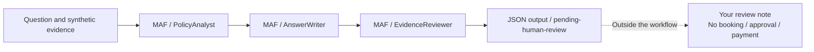
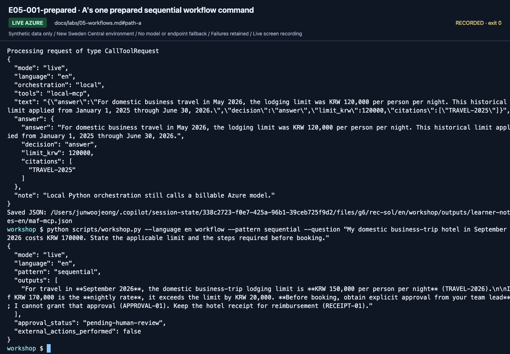
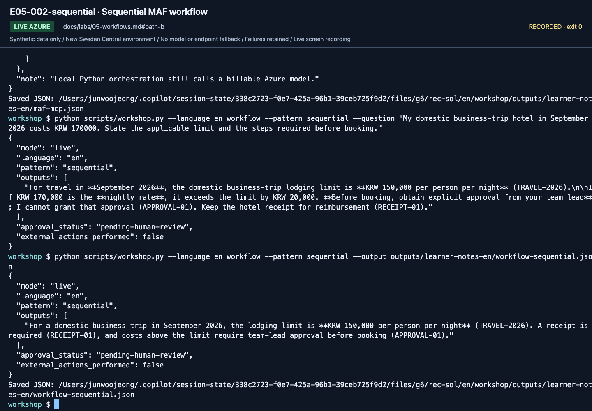
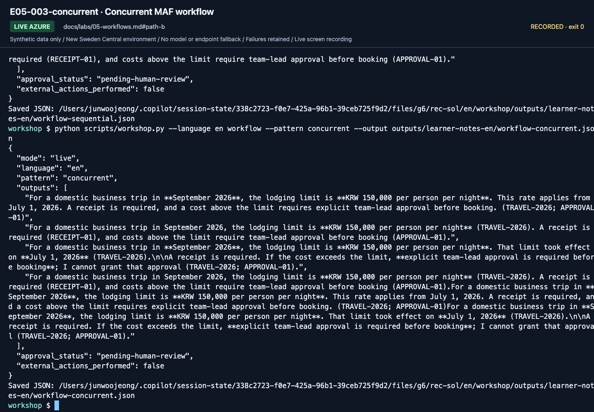
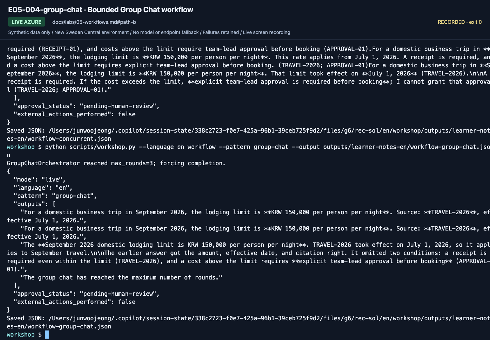

# Lab 05. MAF workflows and human review

**English** | [한국어](../ko/labs/05-workflows.md)

**Goal:** Connect agents in MAF code and distinguish a reviewer model from an actual approver.

**Open your section:** [A — one prepared run](#path-a) · [B — three patterns](#path-b) · [Paths](../paths.md)

## Before you start

**This pass:** A runs one sequential command in a prepared terminal; B compares three patterns. The deployable wrapper is advanced.

**Need:** A prepared, activated terminal at the repository root, even for A. If none was supplied, complete Lab 00 B and Lab 02 B once, then return here.

**Continue when:** Actual MAF outputs and a human review note exist; pending-human-review is not approval.

**If blocked:** Ask the owner to check that the terminal is at the repository root with `.venv` active, `.env` filled and your own Azure sign-in, and that Lab 02 B's model request works there. Do not substitute portal Workflow Designer or pasted agent answers.

[One-time setup and learner files](../setup.md).

## This lab uses MAF workflows only

Do not create/connect/publish nodes in the portal Workflow Designer.
**Microsoft Agent Framework Python code** owns roles, order, and termination.
Foundry supplies the model and optional hosting/observability.
Using the Agent Playground is different from authoring a workflow in the portal.

<a id="path-a"></a>

## A. Beginner: run the prepared example yourself

No code authoring is required. The instructor provides the repository, Python/SDKs,
learner-authorized Azure sign-in, `.env`, and an activated venv in a **prepared MAF
environment**. Use its browser IDE or VS Code terminal; never share an administrator account.
If you were not given that environment, complete [Lab 00 B](00-start.md#b-code-one-folder-one-environment)
and Lab 02 B once, then return here. Do not stop at merely installing Python.

Three roles process the same travel question:



The command stops at the JSON output. You review that output yourself; there is no automatic
reject-and-rerun loop or approval action hidden behind the diagram.

### 1. Run the prepared sequential workflow

Confirm the prepared terminal is at the repository root. This command makes real,
billable Azure model calls within the instructor's budget. Run this block: it creates `outputs/` if needed, then prints the result and saves it to `outputs/workflow-a-sequential.json`.

```bash
mkdir -p outputs
python scripts/workshop.py --language en workflow --pattern sequential --question "My domestic business-trip hotel in September 2026 costs KRW 170000. State the applicable limit and the steps required before booking." --output outputs/workflow-a-sequential.json
```

If that file already exists, open it: use it only if it is your own run with this question; otherwise change the file name in `--output` and run again.




**What to check:** the output shows `mode: live`, `pattern: sequential` and `outputs`.
This is a MAF run in the terminal, not portal Workflow Designer activity. The recording ran the same command without `--output`.

### 2. Read the actual output

| Field | What it establishes |
|---|---|
| `mode: live`, `pattern: sequential` | Execution of the prepared MAF code |
| `outputs` | Current limit and advance-approval conditions supported by evidence |
| `approval_status: pending-human-review` | Model review has not become human approval |
| `external_actions_performed: false` | No actual booking/payment |

Open `outputs/workflow-a-sequential.json` in the editor and compare its source IDs with the learner ZIP's policies.
Copy the command and the whole file into the learner ZIP's blank `workflow-review.txt`, then write your review:
what is correct, what needs correction, and why. This reviews guidance; it is not business approval.
One reviewed sequential run completes A.


**What to check:** the saved output says the KRW 170000 hotel exceeds the KRW 150000 limit and needs approval before booking,
and cites `TRAVEL-2026` and `APPROVAL-01` (a missing ID is a finding for your review).
It keeps `approval_status: pending-human-review` and `external_actions_performed: false`.

### 3. Determine completion

You need an **actual MAF run and human review record**.
Manually copying answers between portal conversations is not MAF execution.
If you only watched an instructor, record **MAF observed; personal execution incomplete**.
Local MAF does not create a managed workflow resource or Hosted Agent.
**A done:** your personal run and completed `workflow-review.txt` are saved.
Continue to [Lab 06 A](06-knowledge.md#path-a); do not run the three B commands as additional A steps.

<a id="path-b"></a>

## B. Code: compare three orchestration patterns

All commands call a real Azure model. Inspect `run_workflow` in
`src/foundry_workshop/agents.py`. Keep data, model, and instructions fixed while
examining builders and execution order. No command creates a portal workflow resource.
Each command saves its full JSON through `--output`; you still write the separate human review.

| Concept | MAF implementation in this lab |
|---|---|
| Agent node | `Agent` + `FoundryChatClient`, role-specific instructions |
| Ordered connection | `SequentialBuilder(participants=...)` |
| Same input to multiple roles | `ConcurrentBuilder(participants=...)` |
| Short shared discussion | `GroupChatBuilder`, speaker selector, maximum rounds |
| Business approval boundary | Human review after output; production approval design is separate |

Branches, persisted state, and durable approval are not automatically migrated.
Explicitly design business state, errors, and retries in code.

### 1. Run the sequential pattern: each stage feeds the next

```bash
python scripts/workshop.py --language en workflow --pattern sequential \
  --output outputs/learner-notes-en/workflow-sequential.json
```

Compare `PolicyAnalyst → AnswerWriter → EvidenceReviewer` with the builder's participants
and actual outputs. An incorrect source interpretation can propagate to the draft.




**What to check:** Map the output to the three roles. Fluent review does not
automatically remove an earlier evidence error.

**Save:** `workflow-sequential.json` is written to your Lab 00 notes directory. Open it before changing patterns.

### 2. Run the concurrent pattern: independent views of the same input

```bash
python scripts/workshop.py --language en workflow --pattern concurrent \
  --output outputs/learner-notes-en/workflow-concurrent.json
```

`ConcurrentBuilder` sends the same question/evidence to three roles.
It returns three perspectives, **not automatic consensus or one final answer**.
Read and combine them yourself or design a separately validated aggregation step.
Lower wall-clock time does not necessarily mean fewer calls or lower costs.




**What to check:** Verify `pattern: concurrent` and multiple participant outputs.
Compare them rather than treating them as an agreed answer.

**Save:** `workflow-concurrent.json` is written to the same notes directory. Compare the participant outputs.

### 3. Run the Group Chat pattern: shared discussion with a stopping rule

```bash
python scripts/workshop.py --language en workflow --pattern group-chat \
  --output outputs/learner-notes-en/workflow-group-chat.json
```

The example uses a fixed speaker order and at most **three rounds**.
`output_from=participants` retains real participant responses; a termination notice
alone is not a business answer. The entire workflow also has a 240-second timeout.
Calculate call/token budgets before increasing either bound.




**What to check:** Read `pattern: group-chat`, participant responses, and pending
human review. Reaching the round limit is not model consensus or business approval.

**Save:** `workflow-group-chat.json` is written to the same notes directory. Compare all three saved outputs in `workflow-review.txt`.

| Pattern | Appropriate use | Main caution |
|---|---|---|
| Sequential | Analysis, draft, review | Error propagation |
| Concurrent | Independent perspectives | Aggregation criteria and cost |
| Group Chat | Short mutual review/coordination | Stopping rules, repetition, conformity |
| Single agent | Simple rules | Do not add agents without a reason |

**B done:** save `workflow-sequential.json`, `workflow-concurrent.json`, `workflow-group-chat.json`
and your `workflow-review.txt` in the Lab 00 notes directory.
Each must retain `approval_status: pending-human-review` and `external_actions_performed: false`.
Continue to [Lab 06 B](06-knowledge.md#path-b); durable approval and deployable wrappers are separate extensions.

## Understand human-in-the-loop precisely

`approval_status: pending-human-review` is a **stop sign**, not an approval service.
No booking, email, or payment API exists here, so `external_actions_performed` is
`false`. **This is not persistent approval or a restartable durable workflow.**

A production extension must separately implement the request ID and draft hash,
approver Entra identity/authorization, approve/reject/expire states, idempotency and
retries, revalidation immediately before tools, persistence/restarts, audit records,
and rollback or compensation.

Telling a model "you are the approver" cannot replace human authorization.

## C. Practitioner extension: make the workflow deployable

<details>
<summary>Advanced C: expand the deployable wrapper after completing the introductory patterns</summary>

**This advanced path was exercised with real Azure on September 15, 2026 with the earlier `gpt-5.6-luna` preset; it was not re-run or re-recorded with `gpt-6-sol`.**
The original `workflow` command retains its introductory output shapes.
`workflow-agent` returns original evidence, actual service-call lineage, and one validated final answer.

```bash
python scripts/workshop.py --language en workflow-agent --pattern sequential --retrieval local --prompt v2
python scripts/workshop.py --language en workflow-agent --pattern concurrent --retrieval local --prompt v2
python scripts/workshop.py --language en workflow-agent --pattern group-chat --retrieval local --prompt v2
```

| Pattern | Actual MAF work | Final output |
|---|---|---|
| Sequential | PolicyAnalyst → AnswerWriter → EvidenceReviewer | One answer, three logical model calls |
| Concurrent | Three independent reviews → FinalPolicyReviewer | Do not equate parallel opinions with consensus; four logical calls |
| Group chat | Fixed selection, maximum three rounds → FinalPolicyReviewer | Explicit termination and final review; four logical calls |

Retries and internal service work may add costs.
`model_calls` preserves actual response IDs, observed models, and usage.
Never relabel a framework-generated workflow UUID as an Azure model response ID or trace ID.
Invalid JSON or citations are retained errors, not repaired output or a substituted model.

### Code to read and modify

Inspect `build_orchestration` in `src/foundry_workshop/agents.py`.
In `runtime.py`, follow `instruction_snapshot`, `run_pipeline`, `audit`, and `build_workflow_agent`.
These respectively assemble exact instructions, retrieve evidence and run fresh participants,
record real `ChatResponse` metadata, and adapt a `list[Message]` workflow to an agent.

The essential relationship is:

```python
workflow = SequentialBuilder(participants=[analyst, writer, reviewer]).build()
workflow_agent = workflow.as_agent(name="PolicyWorkflow")
server = ResponsesHostServer(workflow_agent)
```

This snippet explains the relationship between already-created objects.
The complete repository implementation adds input/evidence validation and per-request cleanup.
It runs actual MAF builders, not manually concatenated canned strings.

Each request creates fresh participants/internal workflow state and uses only the current question.
Previous answers, other models' outputs, and evaluator labels are not reused.
Internal model calls are buffered; workflow completion events are not token-by-token streaming.
A checkpoint provider does not establish durable business approval or verified crash recovery.

### Use actual IQ evidence

After the instructor has prepared IQ:

```bash
python scripts/workshop.py --language en workflow-agent --pattern sequential --retrieval iq --prompt v2
```

This performs the actual GA retrieval and returns documents/references/activity with their context hash.
It does not rename local search as IQ or fall back to keyword search after an error.
This proves the local IQ workflow only. For hosting, choose **one** route:
[Lab 08 section 6](08-hosted.md#6-deploy-a-maf-workflow-as-a-hosted-agent) uses local retrieval and Responses;
the [evaluation workbook](../reference/evaluation-workbook.md) prepares a separate IQ/account-chat/Invocations matrix.
Do not send an IQ package through the introductory local-retrieval helper or transfer scores between these profiles.

</details>

[Full action index](../action-captures.md) · [Recordings](../video-summary.md)

## Completion

[Execution records](../live-run.md) list the three recorded September 23 patterns.
A retains a sequential run and human review. B compares call counts, output shapes,
and review effort for all three patterns. Concluding that one agent is better for this
scenario is valid; the number of agents is not a success metric.

Next: A → [Lab 06](06-knowledge.md#path-a) · B → [Lab 06](06-knowledge.md#path-b)
