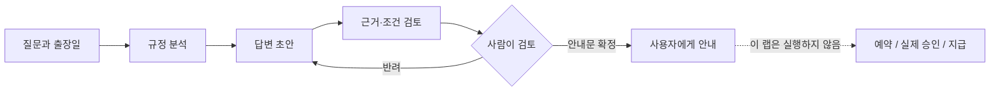

# Lab 05. 여러 에이전트와 사람의 검토

**완료 목표:** 필요한 경우에만 역할을 분리하고, 검토자 모델과 실제 승인자를 구분합니다.

이전: A는 [Lab 03](03-prompt-agent.md), B는 [Lab 04](04-agents-tools.md) · 다음: [Lab 06](06-knowledge.md)

## A. 브라우저 — 먼저 실행 설계

같은 출장 질문을 세 단계로 처리하는 설계를 그립니다.



1. [Lab 03](03-prompt-agent.md)의 에이전트에 실제 초안을 요청합니다.
2. 별도 새 대화에서 초안과 규정을 주고 “적용일·금액·인용·승인 조건을 검토하라”고 요청합니다.
3. 참가자가 직접 초안/검토 의견을 읽고 안내문을 수정합니다.
4. 수정 이유와 최종 안내문을 기록합니다.

이것은 **사람이 이어 주는 워크플로 설계/실행 연습**입니다.
관리형 Workflow를 배포했다고 기록하지 않습니다.
포털에 Workflow Designer가 제공되고 강사가 현재 사용법을 준비했다면 같은 단계를
노드로 옮겨 실행 로그·입출력을 관찰합니다. 기능이 없으면 설계 연습만으로 A 경로를 진행합니다.

## B. 코드 — 세 가지 오케스트레이션 비교

모든 명령은 실제 Azure 모델을 호출합니다.
내 코드에서 에이전트를 순서대로/동시에 실행하는 것이지 자동으로 cloud Workflow를 만드는 것은 아닙니다.

### 1. 순차: 앞 단계 결과가 다음 단계의 입력

```bash
python scripts/workshop.py workflow --pattern sequential
```

`PolicyAnalyst → AnswerWriter → EvidenceReviewer`를 사용합니다.
`SequentialBuilder`의 participants 순서와 실제 출력의 흐름을 비교합니다.
원문 오류를 초안이 그대로 이어받을 수 있다는 점도 관찰합니다.

### 2. 병렬: 같은 입력을 독립적으로 검토

```bash
python scripts/workshop.py workflow --pattern concurrent
```

`ConcurrentBuilder`가 같은 질문·합성 근거를 세 역할에 보냅니다.
이 출력은 세 관점의 결과이며, **자동 합의·최종 답안 하나**가 아닙니다.
사용자가 읽어 통합하거나 별도의 검증된 집계 단계를 설계해야 합니다.
벽시계 시간이 줄어도 총 모델 호출 수나 비용이 줄었다고 단정하지 않습니다.

### 3. Group Chat: 공유 대화와 종료 조건

```bash
python scripts/workshop.py workflow --pattern group-chat
```

이 예제는 정해진 순서로 최대 **3라운드**만 진행합니다.
무한 토론이나 모델 스스로 끝날 때까지 기다리는 구조가 아닙니다.
전체 workflow timeout도 240초로 제한합니다.
큰 수로 늘리기 전에 호출량과 token budget을 먼저 계산합니다.

| 패턴 | 적합한 업무 | 주의할 점 |
|---|---|---|
| 순차 | 자료 분석 → 초안 → 검수 | 앞 단계 오류 전파 |
| 병렬 | 서로 다른 관점의 독립 검토 | 집계 기준과 비용 |
| Group Chat | 짧은 상호 검토·조정 | 종료 조건, 반복·동조 편향 |
| 단일 에이전트 | 규칙이 단순한 질문 | 불필요하게 multi-agent로 만들지 않기 |

## Human-in-the-loop를 정확히 이해하기

예제의 `approval_status: pending-human-review`는 **정지 표지**입니다.
응답을 받은 사람이 검토할 때까지 승인됐다고 표시하지 않습니다.
이 코드에는 지급/이메일 전송/예약 API가 아예 없으므로 `external_actions_performed`는
`false`입니다. **영속적인 승인 서비스나 재시작 가능한 durable workflow를 구현한 것은 아닙니다.**

운영용으로 확장하려면 별도로 구현해야 할 항목:

- 요청 ID와 초안의 hash를 묶은 승인 대상.
- 실제 승인자의 Entra identity와 권한 확인.
- 승인/반려/만료, 중복 요청 방지와 재시도 정책.
- 승인 이후 도구 호출 직전의 재검증.
- 상태 저장, 재시작, 감사 로그, rollback/보상 동작.

모델에게 “너는 승인자”라는 지침을 준 것으로 사람 승인을 대체하지 않습니다.

## 완료 확인

같은 질문에 대해 세 패턴의 호출 수·출력 형태·검토 부담을 비교한 표를 남깁니다.
우리 출장 상담에 단일 에이전트가 더 적절하다고 결론 내려도 좋습니다.
multi-agent 개수 자체가 성공 기준은 아닙니다.
