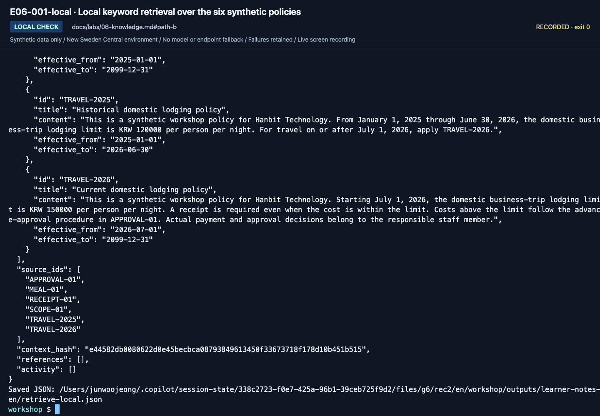
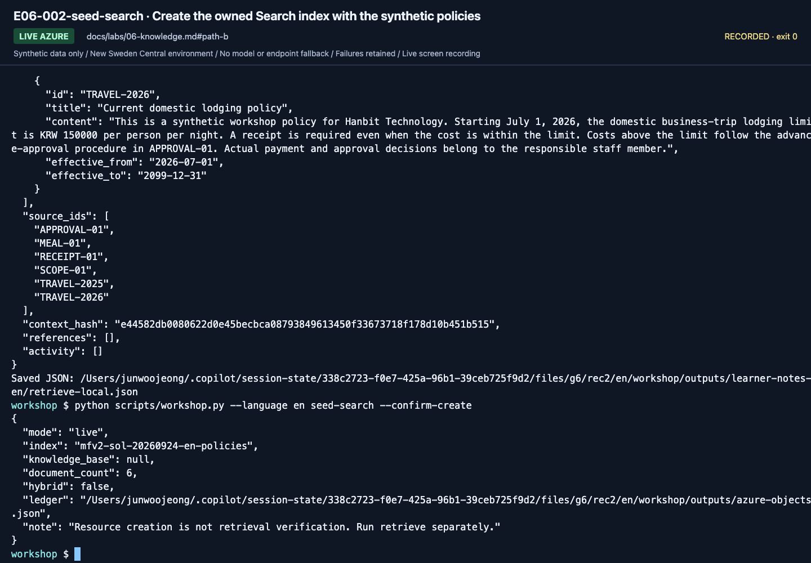
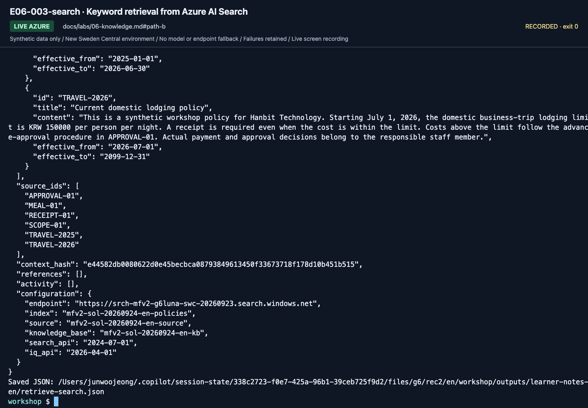
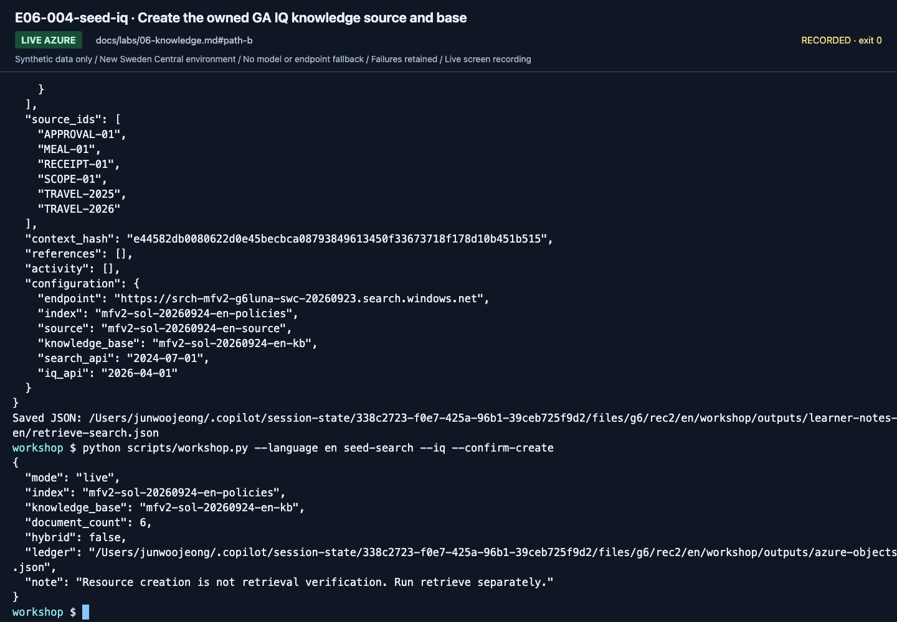
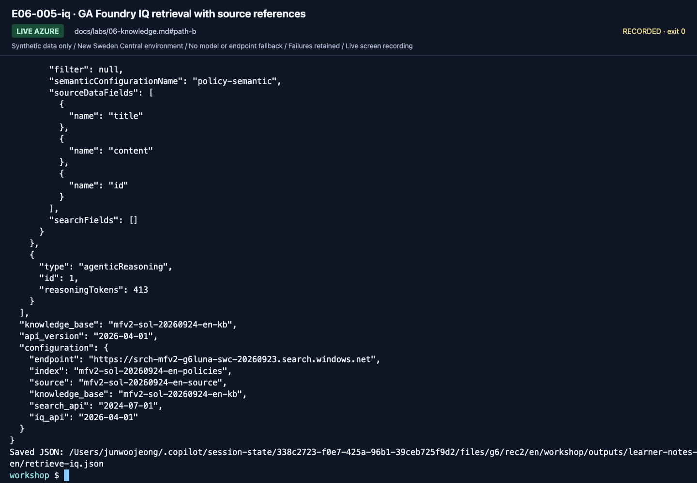
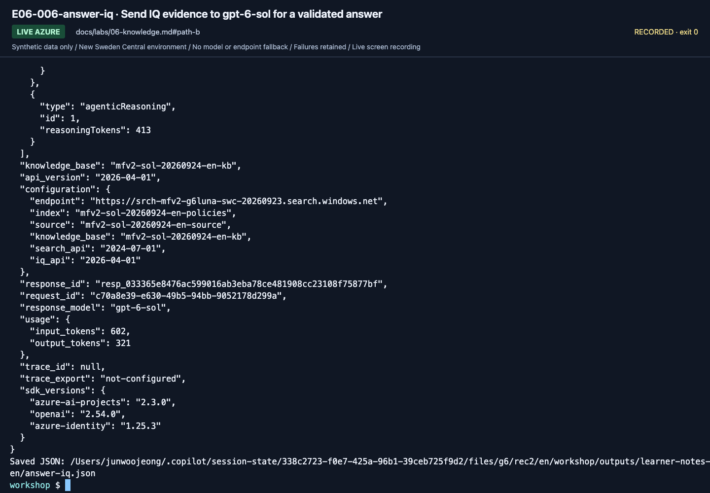
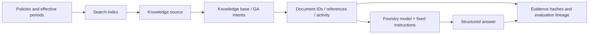
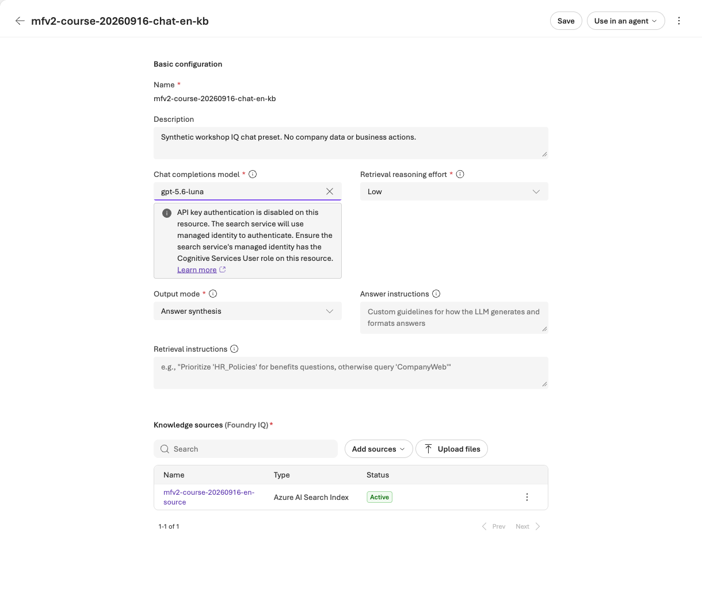

# Lab 06. From document evidence to RAG and Foundry IQ

**English** | [한국어](../ko/labs/06-knowledge.md)

**Goal:** Distinguish ordinary search from actual IQ retrieval and preserve source evidence.

**Open your section:** [A — check existing sources](#path-a) · [B — GA Search/IQ](#path-b) · [Paths](../paths.md)

## Before you start

**This pass:** A checks the sources in three Lab 03 answers. B runs the numbered Search and GA IQ steps. IQ Chat and hybrid search are optional.

**Need:** A: Lab 03 responses and learner files. B: .env, a prepared Search service, writer permissions for seed steps and a fresh owned prefix or matching ownership ledger.

**Continue when:** A: the policy IDs and dates in three answers are checked. B: the four retrieval and answer files are saved.

**If blocked:** A: ask only the missing question again (step 1). B: preserve a Search 401/403 and ask the owner to check [Search authentication and caller roles](../setup-owner.md#search-authentication), not just add another role. Never switch to another provider.

[One-time setup and learner files](../setup.md).

<a id="path-a"></a>

## A. Browser: a visible citation is not enough

Use the D01, D02 and D03 answers you saved for the exact agent/version recorded in [Lab 03](03-prompt-agent.md#path-a).

1. If one of them is missing, reopen that same saved agent version, select **New chat** and ask only that question from `dev-questions.txt`.
   If that version is unavailable, record the check incomplete; do not silently use the latest version.
2. For each answer, note the policy IDs it cites.
3. Open the matching files in the learner ZIP's `policies/` folder and compare the amount and the effective dates.
4. In the Lab 06 section of `session-notes.txt`, write each answer's cited ID, the effective dates and **correct** or **incorrect**:
   D01 on `Current-policy ID / effective dates / finding:`, D02 on `Historical-policy ID / effective dates / finding:`
   and D03 on `Over-limit approval source / finding:`.

| Answer | Correct source and amount | What to look for |
|---|---|---|
| D01 · September 2026 lodging | `TRAVEL-2026` (from 2026-07-01), KRW 150000 | The current policy is applied |
| D02 · May 2026 lodging | `TRAVEL-2025` (until 2026-06-30), KRW 120000 | Citing `TRAVEL-2026` here is an incorrect evidence choice |
| D03 · Over-limit booking | `TRAVEL-2026` and `APPROVAL-01` | The answer also explains approval **before booking** |

**What to check:** every cited ID exists in `policies/`, and its dates cover the question's travel month.
A citation that looks right but points to the wrong period is still incorrect; record it.
If the portal cannot open a cited source, compare the visible ID and text with the `policies/` file instead.

**A done:** the Lab 06 section of `session-notes.txt` has the three checks and `not selected` on `Optional IQ Chat outcome, or not selected:`
(if IQ Chat was prepared for you, do [Optional IQ Chat](#iq-chat-model) first). Continue to [Lab 07 A](07-evaluation.md#path-a).


<a id="path-b"></a>

## B. Code: local evidence, Search, then GA IQ

**Follow steps 1–5 in order: local evidence → Search → GA IQ → a grounded answer.**
Keep the **same September 2026, KRW 170000 hotel question** in all four query commands below.
This lets you compare evidence without changing the question too. The provider choices are fixed, not interchangeable fallbacks.

| Stage | What you verify | Azure use |
|---|---|---|
| Local keyword retrieval | Synthetic documents, source IDs and context hash | None |
| Ordinary Search | Results from your owned index | Object writes and possible Search charges |
| GA Foundry IQ | Knowledge-base references, activity and original documents | Object writes and possible retrieval charges; no model inside this base |
| Answer with IQ evidence | Newly retrieved evidence, policy conditions and citations | Another IQ retrieval plus a real, billable `gpt-6-sol` request |

No core step needs an embedding deployment. Hybrid search and model-based IQ Chat are separate optional branches.
An error does not permit switching providers.

**Resuming:** keep the same copy, language and prefix. Open matching saved outputs instead of replaying their commands;
`--output` refuses an existing file before sending a request. An intentional repeat needs a new filename recorded in your notes.

### 1. Check instructor preparation

You need the prepared Search service. For the seed commands, your account needs **Search Service Contributor** and
**Search Index Data Contributor** on it (reading alone needs only **Search Index Data Reader**).
The owner approves Search usage and billing.

The owner must also confirm that the service's **API access control** accepts Microsoft Entra identity tokens
([Search authentication check](../setup-owner.md#search-authentication)). A keys-only service rejects the workshop's requests even with the roles above.
Do not copy API keys into `.env` or change a shared service's settings yourself.

Open `.env` and check two values before seeding:

- `AZURE_SEARCH_ENDPOINT=https://<search>.search.windows.net`, from your setup card.
- `WORKSHOP_PREFIX` is new and unseeded for a fresh copy, or unchanged from the matching prepared copy.

Subscription Owner alone does not imply Search data access. Scripts do not create a
Search service or roles; they create **your prefixed objects inside a prepared service**.

**Choose the ownership situation before seeding.** A new learner copy needs a new, unseeded `mfv2-...` prefix and writer permissions.
An instructor-prepared copy must already contain the matching `outputs/azure-objects.json`.
An existing remote index plus an empty local ledger is not ready for a create/update exercise; do not overwrite it.
For a prepared copy, ask the owner which seed steps (3 and 4) completed successfully; a ledger alone does not prove all documents uploaded.
`--language en` does not append `-en` to Search names. See [workspace/language changes](../reference/configuration.md#workspace-scope).

### 2. Inspect the small source corpus

```bash
python scripts/workshop.py --language en retrieve --provider local \
  --question "My domestic business-trip hotel in September 2026 costs KRW 170000. May I book it? State the limit and procedure." \
  --output outputs/learner-notes-en/retrieve-local.json
```

Inspect `documents`, `source_ids`, and `context_hash`. This educational keyword search is not a production semantic search engine.
If evidence is missing, record the limitation instead of hardcoding answers.
Keep the selected English question unchanged within this experiment; `--language en` selects English documents.

**Screenshots in steps 2–5** come from a September 24, 2026 run that asked a different question for each provider.
Use them to find output fields, not as results of this same-question comparison; do not repeat paid calls to match them.




**What to check:** Expect `provider: local-keyword`; read `source_ids` and `context_hash`.
This is local synthetic-file retrieval, not Search/IQ. Configured endpoint names do not prove a cloud call.

**Save:** `retrieve-local.json` is written to your Lab 00 notes directory. Open it and check the original evidence.

### 3. Create an ordinary Search index

**This writes to the cloud.** Verify the prepared service, prefix, and permissions first.
If the owner confirmed successful index seeding in this prepared copy, skip this seed command and continue with the query below.

```bash
python scripts/workshop.py --language en seed-search --confirm-create
```

| Optional setting | Default object name |
|---|---|
| `AZURE_SEARCH_INDEX_NAME` | `<WORKSHOP_PREFIX>-policies` |
| `AZURE_SEARCH_KNOWLEDGE_SOURCE_NAME` | `<WORKSHOP_PREFIX>-source` |
| `AZURE_SEARCH_KNOWLEDGE_BASE_NAME` | `<WORKSHOP_PREFIX>-kb` |

Existing objects without your local ownership record are not overwritten.
If changing prefix after any seeding, use a fresh source copy as well, or ask the instructor to recover the original working copy.
Do not delete the old ledger. Partial document upload
failure is not overall success.




**What to check:** The seed result has `mode: live`, your `index`, `document_count: 6`,
`hybrid: false`, and `knowledge_base: null`. It created ordinary Search objects, not IQ.
The ownership record `outputs/azure-objects.json` is this command's saved evidence; no other file is needed.

Only after successful seeding, query that index:

```bash
python scripts/workshop.py --language en retrieve --provider search \
  --question "My domestic business-trip hotel in September 2026 costs KRW 170000. May I book it? State the limit and procedure." \
  --output outputs/learner-notes-en/retrieve-search.json
```



**What to check:** Expect `provider: azure-ai-search-keyword`; verify `configuration.endpoint` and `configuration.index`.
This result also contains `references: []` and `activity: []`. Those field names alone do not make it IQ.

**Save:** `retrieve-search.json` is written to the same notes directory. Review it before creating the IQ source/base.

### 4. Create a GA IQ knowledge source/base

If the owner confirmed this source/base was already seeded successfully in the matching copy, skip this seed command and continue with the IQ query below.
Otherwise this command uploads the policies again and creates the missing IQ objects; it is a cloud write, not a read-only check.

```bash
python scripts/workshop.py --language en seed-search --iq --confirm-create
```




**What to check:** the seed result now has a non-null `knowledge_base`, `document_count: 6` and a `ledger` path ending in `outputs/azure-objects.json`.
Continue only after all three appear. Keep that ownership ledger; do not delete it when pausing.

GA IQ here (REST `2026-04-01`) retrieves the documents without a model inside the knowledge base;
step 5 sends them to `gpt-6-sol` in a separate call ([model-based IQ](../reference/iq-model-identity.md) is optional).

```bash
python scripts/workshop.py --language en retrieve --provider iq \
  --question "My domestic business-trip hotel in September 2026 costs KRW 170000. May I book it? State the limit and procedure." \
  --output outputs/learner-notes-en/retrieve-iq.json
```




**What to check:** `provider: foundry-iq`, your `knowledge_base`, `api_version: 2026-04-01`, `references`, `activity` and the original `documents`.
Reference numbers are not document IDs. **An empty result means no documents were retrieved:** record it; do not invent an amount.
An IQ error stays an error; it never falls back to ordinary Search. Do not fill unreported latency or usage with invented values.

An `agenticReasoning` activity with `reasoningTokens` can still appear in this minimal GA path
(observed on 2026-09-25). It does not establish the optional `modelQueryPlanning` or `modelAnswerSynthesis` path.
[Search retrieval-token billing](https://learn.microsoft.com/azure/search/agentic-retrieval-overview#billing)
is separate from the answer model's `usage` in step 5; keep the two records separate.

**Save:** `retrieve-iq.json` is written to the same notes directory, including the original documents and activity. Inspect them before answering.

<a id="retrieval-comparison"></a>

**Compare before answering:** open `retrieve-local.json`, `retrieve-search.json` and `retrieve-iq.json` together.
In `session-notes.txt`'s B section, use `Lab 06 retrieval comparison (file / provider / source_ids / context_hash):`
for the three files. Do not fill the A-only source-check fields with these SDK results.
Check the original documents for `TRAVEL-2026` (KRW 150000) and `APPROVAL-01` (approval before booking).
Different providers need not return identical documents or hashes. If IQ lacks the required evidence, preserve the result and
diagnose retrieval before step 5; another provider's evidence is not a substitute.

### 5. Retrieve again, then ask the real model

```bash
python scripts/workshop.py --language en answer --prompt v2 --retrieval iq \
  --question "My domestic business-trip hotel in September 2026 costs KRW 170000. May I book it? State the limit and procedure." \
  --output outputs/learner-notes-en/answer-iq.json
```

**This command retrieves from IQ again; it does not read `retrieve-iq.json`.**
The new evidence and model answer are saved together in `answer-iq.json`.
Compare its `source_ids` and `context_hash` with `retrieve-iq.json`; if they differ, record that change and review
the documents actually used for the answer. A missing policy is different from misreading a correctly retrieved policy.




**What to check:** Verify the IQ base/API, `response_model`, `response_id`, and `usage`.
In `answer`, check `decision: needs_approval`, `limit_krw: 150000`, approval **before booking** and citations to
`TRAVEL-2026` and `APPROVAL-01`. Compare them with this response's original documents; record a mismatch rather than fixing the saved answer.

**Save:** `answer-iq.json` is written to the same notes directory. Check its complete response and retrieval metadata.
Record your finding on `Lab 06 answer-iq.json evidence / decision / citations / finding:` in the same B section.



**B done:** save the complete outputs as `retrieve-local.json`, `retrieve-search.json`, `retrieve-iq.json`
and `answer-iq.json` in your Lab 00 notes directory,
including original IDs, `references`, `activity`, `context_hash` and the ownership ledger.
Keep the original `outputs/azure-objects.json` in place; a copied output file does not establish object ownership.
Continue to [Lab 07 B](07-evaluation.md#path-b). That lesson starts a **declared local-retrieval experiment**; it does not reuse this IQ answer as an evaluation result.

<details>
<summary>Minimal SDK recipe (optional, outside this repo)</summary>

See [`examples/recipes/06_iq_retrieve.py`](../../examples/recipes/06_iq_retrieve.py) for the standalone GA IQ retrieval pattern. Key lines:

```python
response = http.post(
    f"{endpoint}/knowledgebases('{kb}')/retrieve",
    params={"api-version": "2026-04-01"},  # GA contract, checked 2026-09-24
    headers={"Authorization": f"Bearer {token}"},  # scope https://search.azure.com/.default
    json={
        "intents": [{"type": "semantic", "search": question}],
        "includeActivity": True,
        "knowledgeSourceParams": [
            {"kind": "searchIndex", "knowledgeSourceName": source, "includeReferences": True}
        ],
    },
)
response.raise_for_status()  # an error is a finding; never switch to plain Search
```

**Write it yourself:** print the returned reference IDs and the original document IDs separately; do not treat reference numbers as policy IDs.

</details>


> ⛔ **Stop here unless this optional step was approved.** Everything below is optional/path C and may create billable resources or need extra roles. A/B learners continue with the next-lab link above.

<a id="iq-chat-model"></a>

## Optional IQ Chat: open the prepared gpt-5.6-luna chat KB

Only if the owner prepared IQ Chat for you (A or B). It uses a separate `gpt-5.6-luna` deployment because Search
knowledge bases accepted no GPT-6 model on September 23, 2026 ([details](../reference/model-choice.md)).

<details>
<summary>Optional Preview IQ Chat — requires a prepared chat base and separate cost approval</summary>

Choose this segment only when the owner has completed [IQ preparation](../setup.md#4-environment-owner-checklist)
and supplied a matching working copy and repository-root terminal: activated `.venv`, your own sign-in,
and Search/chat-base settings for the selected language and prefix.
**Browser-only A learners need this terminal too; a Lab 05 Playground run does not prepare it.**
Otherwise record **IQ Chat not selected**, complete the source checks above, and continue to Lab 07.
Planning/synthesis for this Search-index source is **Preview as of September 15, 2026**; MI itself is supported.

1. In Foundry, open **Knowledge → Knowledge bases** and select the **`knowledge_base` name returned by the owner's `iq-chat setup`**,
   recorded on your setup card, normally `<prefix>-chat-en-kb`. Do not open the original `<prefix>-kb` expecting chat settings.
2. Confirm the **three filled values** below and the matching English synthetic source.
   If the model or either mode is blank, **stop before Save**: return to the list and check the chat-base name.
   If no prepared chat base exists, the owner completes [check → authorized setup](../reference/iq-model-identity.md);
   do not fix the model-free GA base by changing its configuration.
3. In that prepared repository-root terminal, run `check` below. Continue only when `configured: true`; `ready_for_setup: true` alone means prerequisites, not a saved chat base.
4. After cost approval, run `ask` **once**, or inspect your own already recorded run for this language/scope instead. The owner's setup run is not your own invocation evidence. Use the CLI, not an additional duplicate portal chat.
5. Open that run's `summary.json` and compare its answer/citations with the synthetic originals using the checks below. Record a failure unchanged.

| Setting | Exact first-pass choice |
|---|---|
| Chat deployment / underlying model | **`gpt-5.6-luna` / `gpt-5.6-luna`**, model version **`2026-07-09`** |
| Authentication | **System assigned identity** of **Search**, not the learner or Hosted agent |
| Model-account role | Search identity has **`Cognitive Services User`** on the Foundry account |
| Reasoning / output | **`low` / `answerSynthesis`** |
| API | **`2026-08-01-preview`**; no API key |



**What to check:** `gpt-5.6-luna`, **Low**, **Answer synthesis**, the English source and **Active** are visible.
There is no **Chat completions model is required** validation message. Required-field asterisks and the gray MI notice are normal:
the notice says Search will use its identity, not that authentication failed or that the role was verified.
This is a fresh, unedited view of an **already saved** chat KB; no Save, deployment or model request was performed for this capture.
The screen dates from September 17, 2026: the September 24 recording did not re-run IQ Chat, and this preset has not changed since.
Use it to recognize the fields, not as evidence of your own run.
Use your own returned name, not the screenshot's name.

**Do not clear the selected `gpt-5.6-luna` model or deploy a recommendation to match the picture.**
On September 17, the quick model list and **Browse more models** opened a deployment catalog, not the existing-deployment inventory.
The prepared `gpt-5.6-luna` binding displayed correctly even though it was absent from that catalog.
Keep the saved selection; use the owner's fixed CLI preset for initial setup rather than choosing another model or enabling API keys.

```bash
python scripts/workshop.py --language en iq-chat check
```

Only after that check passes and a new request's cost is approved:

```bash
python scripts/workshop.py --language en iq-chat ask --label iq-chat-lab06 --confirm-cost
```

Without `--question`, this command asks **“What is the domestic business-trip lodging limit per night for September 2026?”**,
not B's KRW 170000 question. Check the actual question in `request.json`.

The saved `summary.json` must show `model_planning_verified: true`, `model_synthesis_verified: true`,
and actual `modelQueryPlanning` / `modelAnswerSynthesis` for `gpt-5.6-luna`.
Its `answer` is plain text, not B's structured `decision`/`limit_krw` object. For this default question, check the KRW 150000
limit against `TRAVEL-2026`. Follow each answer citation through its returned reference to `sourceData.id` and `content`;
a numeric reference label is not a policy ID. Verified model calls do not by themselves prove a correct answer.
Request, response, source evidence and failures stay in `outputs/iq-chat/iq-chat-lab06/`; use a new label for another request.
`check` does not change Azure and `ask` never chooses another model/provider.
For `configured: false`, missing permissions, a wrong version, 403 or 429, stop and use [the fixed-preset recovery guide](../reference/iq-model-identity.md).
A fixed model removes a common configuration mismatch; it cannot guarantee quota or service availability.

**Return:** record the actual label and finding on `Optional IQ Chat outcome, or not selected:` in `session-notes.txt`.
Resume any unfinished [A source checks](#path-a) or [B steps](#path-b), not another workbook run.
If your core checks are complete, continue to [Lab 07 A](07-evaluation.md#path-a) or [Lab 07 B](07-evaluation.md#path-b).

</details>

> ⛔ **Stop here unless this optional step was approved.** Everything below is optional/path C and may create billable resources or need extra roles. A/B learners continue with the next-lab link above.

<a id="hybrid-rag"></a>

## C. Optional real hybrid RAG

**First pass: continue to [Lab 07](07-evaluation.md).** C and D are separate advanced branches, not missing steps in the GA path.

<details>
<summary>Expand the optional embedding and hybrid-index exercise</summary>

**This optional branch was not re-run with `gpt-6-sol` on September 23, 2026.**
Use a separate owned index instead of silently changing the existing text index.
Record the original `AZURE_SEARCH_INDEX_NAME` value, including a blank default, before changing `.env`.
Configure a verified embedding deployment and its actual dimensions.

```dotenv
AZURE_SEARCH_INDEX_NAME=<your-mfv2-prefix>-policies-hybrid
AZURE_AI_EMBEDDING_DEPLOYMENT_NAME=<verified-embedding-deployment>
WORKSHOP_EMBEDDING_DIMENSIONS=<actual-dimensions>
WORKSHOP_EMBEDDING_API=account
AZURE_OPENAI_ENDPOINT=https://<same-foundry-account>.openai.azure.com
```

```bash
python scripts/workshop.py --language en seed-search --hybrid --confirm-create --confirm-cost
python scripts/workshop.py --language en retrieve --provider hybrid --question "What is the domestic business-trip lodging limit for September 2026?"
python scripts/workshop.py --language en answer --retrieval hybrid --prompt v2
```

Creation approval covers the owned index; cost approval covers real embeddings.
All six synthetic documents are embedded and checked against the vector field/HNSW profile.
Queries contain both `search` and `vectorQueries`, with `top=6`.
Never truncate or zero-pad vectors to conceal dimension mismatches.

The Korean live run retained a project-embeddings 404 and then explicitly configured the same account's OpenAI API.
No exception handler switches endpoints automatically.
For your run, stop on that error and preserve it. Choose the account API only **before a separately approved new hybrid experiment**;
record its configuration and results separately instead of continuing or relabeling the failed experiment.
Inspect the real hybrid provider, observed embedding model/dimensions, source IDs, index, and context hash.
The code rejects silent text-to-vector schema replacement and text-only uploads that would erase existing vectors.
Ownership/per-index configuration stays in `outputs/azure-objects.json`.

Changing an environment index name does not rewire a remote IQ source/base.
Before returning to GA IQ or Lab 07, restore that original index setting; do not seed again to restore it.
Keep the source/base names unchanged and retain the ledger, including the hybrid index, for cleanup.
Do not mix retrieval changes into a prompt-only evaluation comparison.

</details>

> ⛔ **Stop here unless this optional step was approved.** Everything below is optional/path C and may create billable resources or need extra roles. A/B learners continue with the next-lab link above.

## D. Connect IQ to Hosted workflows and evaluation

<details>
<summary>Expand the advanced workflow/evaluation connection</summary>

### Recall is part of the experiment

The first English dev cohort correctly withheld an international lodging amount but missed the required scope-policy citation.
Actual IQ evidence omitted `SCOPE-01`, whose observed reranker score was about 1.775.
An explicit same-endpoint/query/corpus diagnostic with `WORKSHOP_IQ_RERANKER_THRESHOLD=0` returned all six synthetic documents.
This adjusts a **retrieval filter**, not the business rubric or judge threshold.
Keep the initial failed cohort and run a new, consistently configured baseline/candidate pair.
Do not apply this small-corpus setting blindly to production, change reference answers, or describe it as an error-triggered provider fallback.

```bash
python scripts/workshop.py --language en workflow-agent --pattern sequential --retrieval iq --prompt v2
```

This optional command asks the CLI's default lodging-limit question and performs fresh IQ retrieval;
it does not consume the `retrieve-iq.json` saved in B. Save its complete output as a separate experiment.
For the remote matrix, start at the
[evaluation workbook's preparation](../reference/evaluation-workbook.md#matrix-setup);
it packages its own IQ/account-chat/Invocations target once.
Lab 08's introductory helper accepts local retrieval, not this IQ profile.
The [IQ workbook](../reference/iq-workbook.md) documents separate Toolbox/Fabric/Work IQ approval and identity gates.
No hidden prerequisite requires another repository.

</details>

## Distinguish model-based IQ from the default GA path

To have a model plan queries and synthesize answers for this Search-index source, explicitly select the supported Preview contract
and configure the model, Search identity permissions, reasoning effort, and output mode together.
Managed identity is a normal keyless authentication option for that path and was verified with actual calls.
A `models` property in the GA schema does not imply that every source's LLM features are GA.
Use version-matched request fields from the [MI model-binding guide](../reference/iq-model-identity.md).
Keep the model-free GA base unchanged for its frozen evaluation; use the separate prepared chat base for the optional model-based mode.
The [new configured screen](#iq-chat-model) is the reference for IQ Chat.

[Full action index](../action-captures.md) · [Recordings](../video-summary.md)

## Completion

A: verify source IDs/effective periods and record whether IQ Chat was selected and actually run.
B: call Search and GA IQ separately and explain the returned evidence.
`outputs/azure-objects.json` records ownership of your Search objects;
it is not authorization to delete a shared service.

Next: A → [Lab 07](07-evaluation.md#path-a) · B → [Lab 07](07-evaluation.md#path-b)
