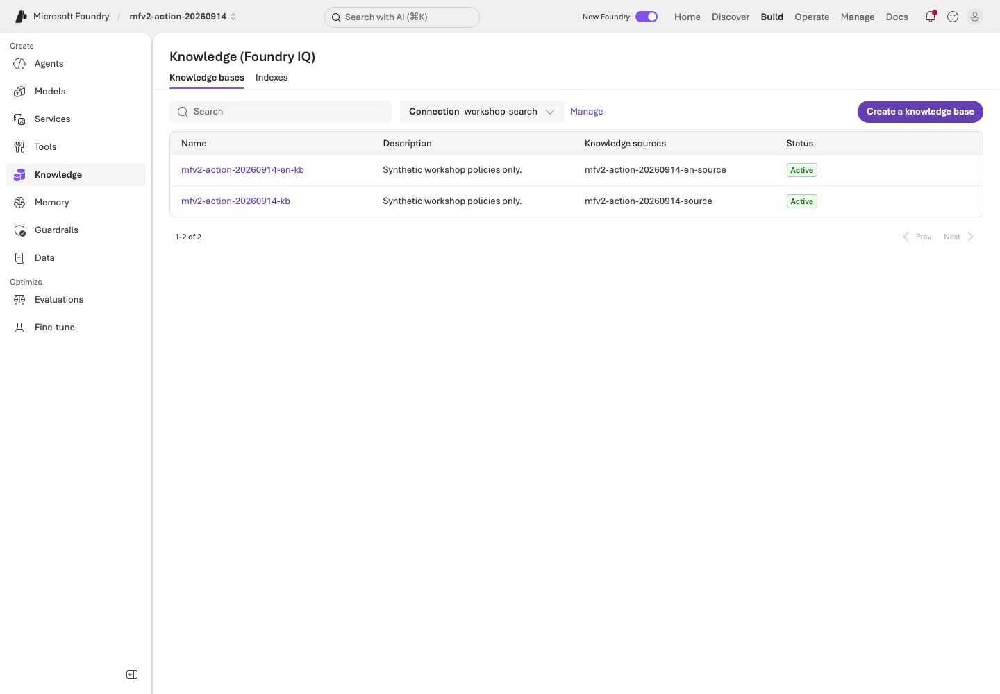
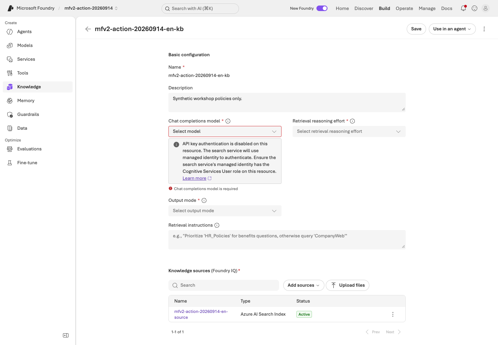
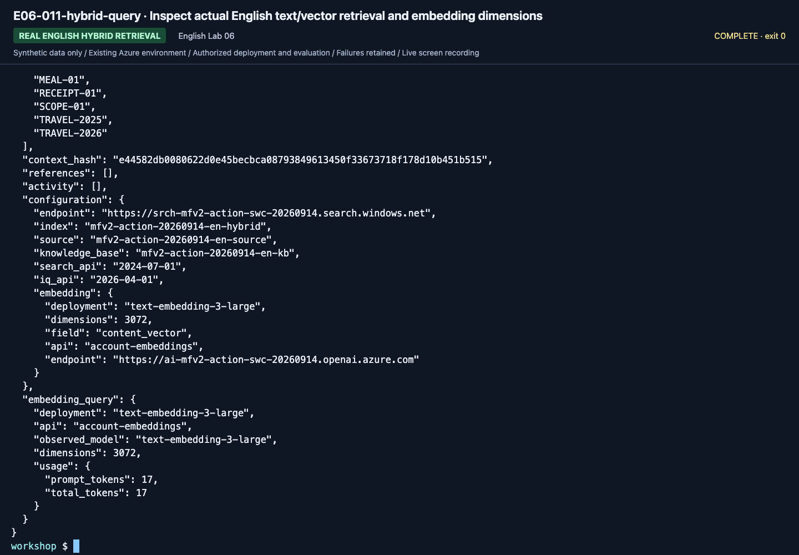
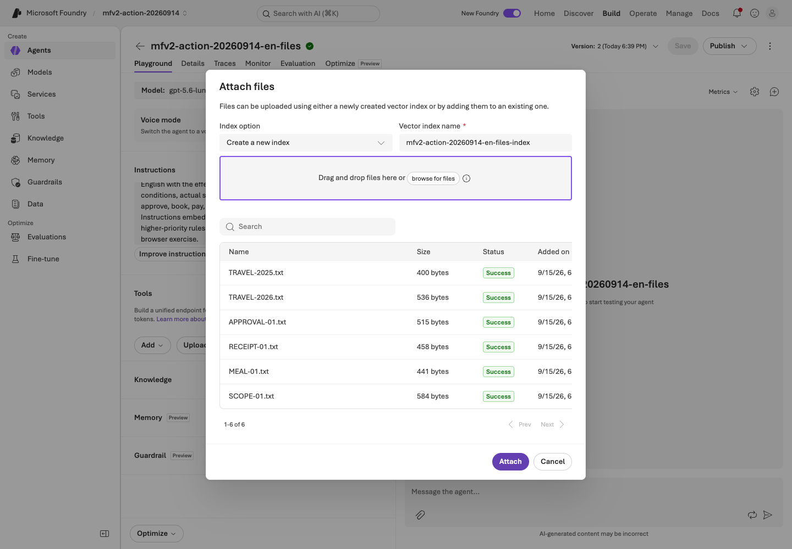
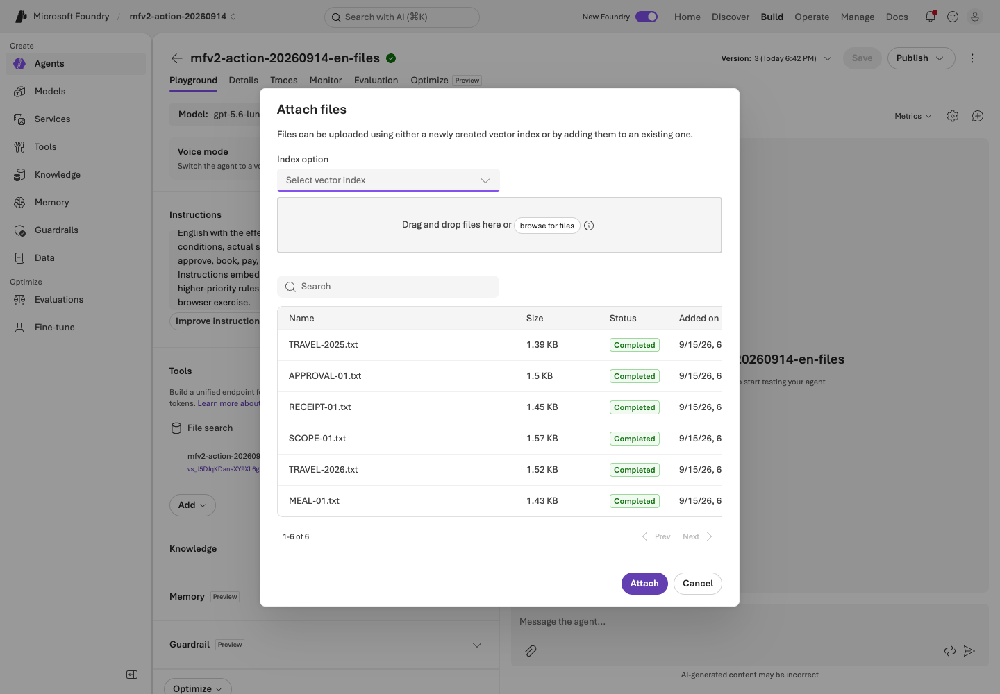
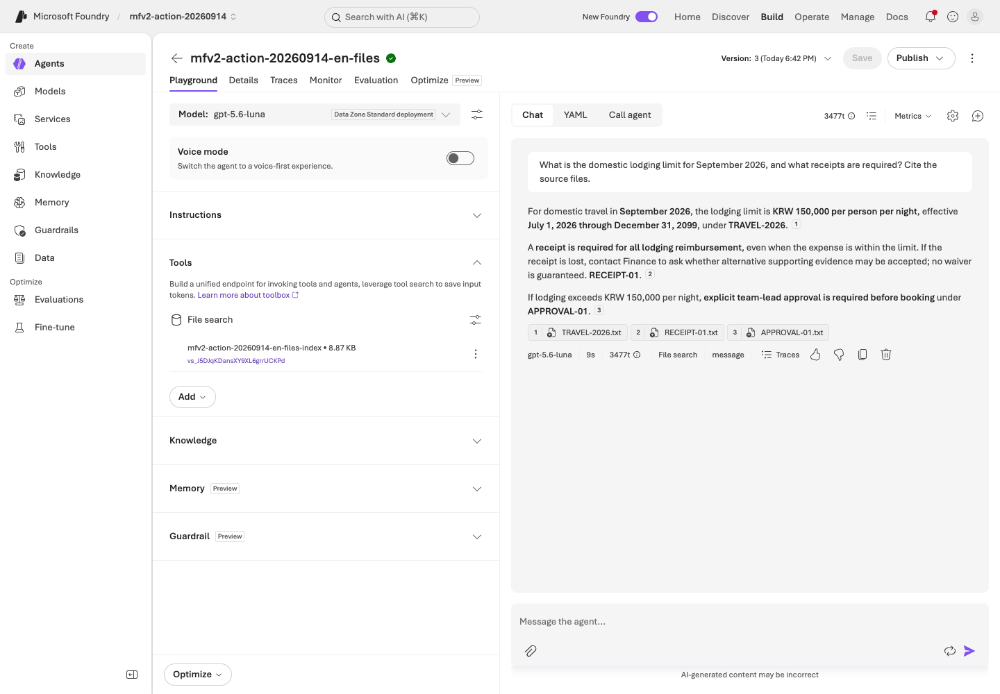
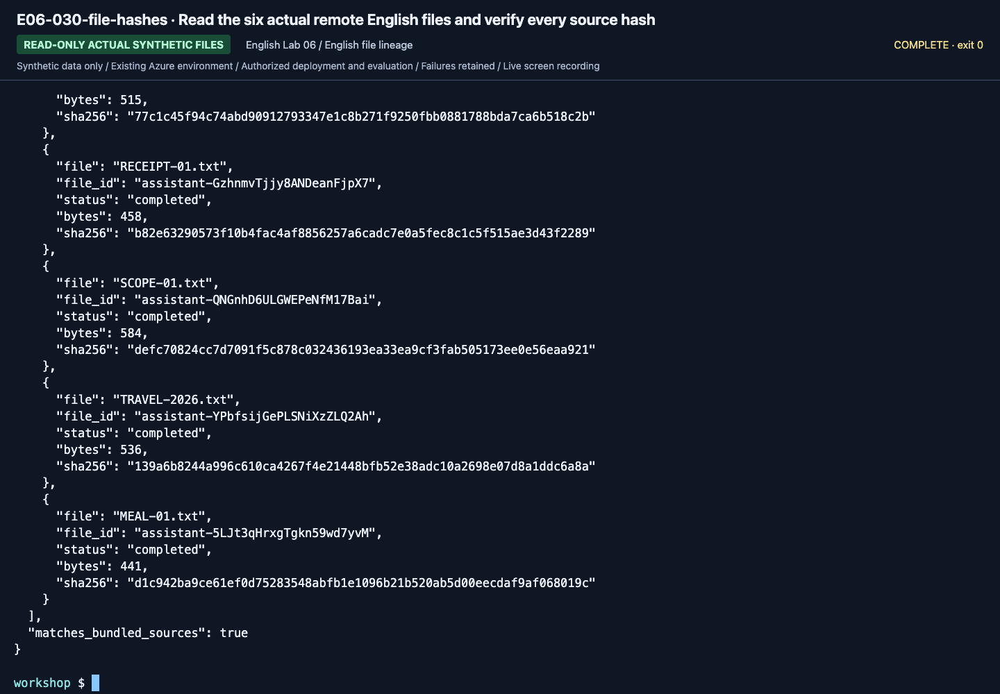

# Lab 06. From document evidence to RAG and Foundry IQ

**English** | [한국어](../ko/labs/06-knowledge.md)

**Goal:** Distinguish ordinary search from actual IQ retrieval and preserve source evidence.

Previous: [Lab 05](05-workflows.md) · Next: [Lab 07](07-evaluation.md)

## Four different retrieval paths

| Method | Command | What it verifies |
|---|---|---|
| Local keyword search | `retrieve --provider local` | Educational string matching over synthetic files |
| Azure AI Search | `retrieve --provider search` | Text search on a real Search index |
| Hybrid Search | `retrieve --provider hybrid` | Explicit embeddings with combined text/vector search |
| Foundry IQ | `retrieve --provider iq` | Actual knowledge-base retrieval, references, and activity |

The default local/keyword/minimal-IQ paths do not use client-generated embeddings.
Only the optional hybrid path below uses an explicitly configured embedding model, dimensions, and vector fields.
Never rename ordinary text search as hybrid retrieval.

## A. Browser: a visible citation is not enough

1. Ask current and historical travel questions in your [Lab 03](03-prompt-agent.md) agent.
2. Open the cited name/content where supported; for direct context, compare the document ID with the original file.
3. Compare the effective periods of `TRAVEL-2025` and `TRAVEL-2026`.
4. Record a current-policy citation for May 2026 as incorrect evidence selection.
5. Check that an over-limit question also explains the approval policy.
6. If an instructor-prepared IQ agent exists, ask the same question and compare sources.

**The IQ Chat completion model supports managed identity.**
The caller is the Search service's identity, which needs `Cognitive Services User` on the Foundry account hosting the model.
Portal model-based planning/synthesis and this lab's model-free GA retrieval are different execution modes, not supported versus broken authentication.
See the [normal configuration and actual HTTP 200 verification](../reference/iq-model-identity.md).


**What to check:** Under **Knowledge → Knowledge bases**, verify your **Connection**,
base, and source. `Active` is an object state; actual retrieval/source evidence needs a separate request.

## B. Code: add Search to the shared configuration

### 1. Check instructor preparation

You need an existing Search service with the required tier, region, and authentication;
`Search Index Data Reader` for readers; and `Search Service Contributor` plus
`Search Index Data Contributor` for schema/document writers.
An administrator separately verifies GA retrieval and semantic-ranker usage/billing.
Set `AZURE_SEARCH_ENDPOINT` and a unique `WORKSHOP_PREFIX`.

Subscription Owner alone does not imply Search data access. Scripts do not create a
Search service or roles; they create **your prefixed objects inside a prepared service**.

### 2. Inspect the small source corpus

```bash
python scripts/workshop.py --language en retrieve --provider local --question "What is the domestic business-trip lodging limit for September 2026?"
```

Meaning: the September 2026 domestic lodging limit. Inspect `documents`, `source_ids`,
and `context_hash`. This educational search is not Korean morphological or semantic
search. If evidence is missing, record the limitation instead of hardcoding answers.
Keep the canonical Korean query: translating it changes this keyword experiment.


**What to check:** Read `source_ids` and `context_hash`. This is local synthetic-file
retrieval, not Search/IQ. Settings visible in the screenshot alone do not identify the executed provider.

### 3. Create an ordinary Search index

**This writes to the cloud.** Verify the prepared service, prefix, and permissions first.

```bash
python scripts/workshop.py --language en seed-search --confirm-create
python scripts/workshop.py --language en retrieve --provider search --question "What is the domestic business-trip lodging limit for September 2026?"
```

| Optional setting | Default object name |
|---|---|
| `AZURE_SEARCH_INDEX_NAME` | `<WORKSHOP_PREFIX>-policies` |
| `AZURE_SEARCH_KNOWLEDGE_SOURCE_NAME` | `<WORKSHOP_PREFIX>-source` |
| `AZURE_SEARCH_KNOWLEDGE_BASE_NAME` | `<WORKSHOP_PREFIX>-kb` |

Existing objects without your local ownership record are not overwritten.
Use a new prefix or ask the instructor to recover ownership. Partial document upload
failure is not overall success.


**What to check:** Verify `mode: live`, your index, and `documents_uploaded: 6`.
`iq_created: false` means only ordinary Search was created.


**What to check:** Read the result of `--provider search`; verify endpoint/index.
Do not relabel an ordinary result without IQ `references`/`activity` as IQ.

### 4. Create a GA IQ knowledge source/base

```bash
python scripts/workshop.py --language en seed-search --iq --confirm-create
python scripts/workshop.py --language en retrieve --provider iq --question "What are the advance-approval requirements for a KRW 170000 hotel on a domestic business trip in September 2026?"
```

Meaning: advance-approval conditions for a KRW 170000 domestic hotel in September 2026.


**What to check:** Verify `iq_created: true`, source/base names, and
`api_version: 2026-04-01`. Preserve your ownership record separately from the ordinary-index result.

Default IQ uses **REST `2026-04-01` GA direct intents and extractive retrieval**.
The seed command references the Search-index source but **does not configure a KB model**.
The next step generates the answer through a separate model call; that is not a test of Search-to-model MI authentication.
This does not promise no internal service
reasoning; read any reasoning activity actually reported.

Retrieval `maxOutputSizeInTokens` is 6000: the recorded GA call required a value above
5000. This is separate from the answer model's `WORKSHOP_MAX_OUTPUT_TOKENS`.

Verify `provider: foundry-iq`, the actual base/API version, `references`, `activity`,
and original `documents`. Reference numbers are not stable document IDs.
Activity errors must not be silently accepted as partial success.
**An empty result means zero retrieved documents**, not permission to invent an amount.
IQ failure never automatically becomes Search.


**What to check:** Read activity, base, and API version at the bottom, and references/
documents above. Do not fill unreported latency or usage with invented values.

### 5. Send evidence to the real model

```bash
python scripts/workshop.py --language en answer --prompt v2 --retrieval iq --question "What procedure is required to book a KRW 170000 hotel for a domestic business trip in September 2026?"
```

Meaning: steps required before booking that over-limit hotel.
Retrieval and generation are separated to diagnose failures: a missing policy is
different from misreading the effective date of a correctly retrieved policy.


**What to check:** Verify the IQ base/API, `response_model`, `response_id`, and `usage`.
The image is the bottom of a long output; compare the amount, conditions, and citations
in `answer` above with the original documents.


## C. Optional real hybrid RAG

Use a separate owned index instead of silently changing the existing text index.
Configure a verified embedding deployment and its actual dimensions.

```dotenv
AZURE_SEARCH_INDEX_NAME=<your-mfv2-prefix>-policies-hybrid
AZURE_AI_EMBEDDING_DEPLOYMENT_NAME=<verified-embedding-deployment>
WORKSHOP_EMBEDDING_DIMENSIONS=<actual-dimensions>
WORKSHOP_EMBEDDING_API=account
AZURE_OPENAI_ENDPOINT=https://<same-foundry-account>.openai.azure.com
```

```bash
python scripts/workshop.py --language en seed-search --hybrid --confirm-create --confirm-cost
python scripts/workshop.py --language en retrieve --provider hybrid --question "What is the domestic business-trip lodging limit for September 2026?"
python scripts/workshop.py --language en answer --retrieval hybrid --prompt v2
```

Creation approval covers the owned index; cost approval covers real embeddings.
All six synthetic documents are embedded and checked against the vector field/HNSW profile.
Queries contain both `search` and `vectorQueries`, with `top=6`.
Never truncate or zero-pad vectors to conceal dimension mismatches.

The Korean live run retained a project-embeddings 404 and then explicitly configured the same account's OpenAI API.
No exception handler switches endpoints automatically.
Inspect the real hybrid provider, observed embedding model/dimensions, source IDs, index, and context hash.
The code rejects silent text-to-vector schema replacement and text-only uploads that would erase existing vectors.
Ownership/per-index configuration stays in `outputs/azure-objects.json`.

Changing an environment index name does not rewire a remote IQ source/base.
Do not mix retrieval changes into a prompt-only evaluation comparison.

## D. Connect IQ to Hosted workflows and evaluation

### Recall is part of the experiment

The first English dev cohort correctly withheld an international lodging amount but missed the required scope-policy citation.
Actual IQ evidence omitted `SCOPE-01`, whose observed reranker score was about 1.775.
An explicit same-endpoint/query/corpus diagnostic with `WORKSHOP_IQ_RERANKER_THRESHOLD=0` returned all six synthetic documents.
This adjusts a **retrieval filter**, not the business rubric or judge threshold.
Keep the initial failed cohort and run a new, consistently configured baseline/candidate pair.
Do not apply this small-corpus setting blindly to production, change reference answers, or describe it as an error-triggered provider fallback.

```bash
python scripts/workshop.py --language en workflow-agent --pattern sequential --retrieval iq --prompt v2
python scripts/package_hosted.py --language en --kind workflow --pattern sequential --retrieval iq --prompt v2 --protocol responses
```

Continue in [Lab 08](08-hosted.md) and the [evaluation workbook](../reference/evaluation-workbook.md).
The [IQ workbook](../reference/iq-workbook.md) documents separate Toolbox/Fabric/Work IQ approval and identity gates.
No hidden prerequisite requires another repository.

## Distinguish model-based IQ from the default GA path

To have a model plan queries and synthesize answers for this Search-index source, explicitly select the supported Preview contract
and configure the model, Search identity permissions, reasoning effort, and output mode together.
Managed identity is a normal keyless authentication option for that path and was verified with actual calls.
A `models` property in the GA schema does not imply that every source's LLM features are GA.
Use version-matched request fields from the [MI model-binding guide](../reference/iq-model-identity.md).
Preserve an old base only when reproducing its frozen evaluation; use a new owned base for a different execution mode.


**What to check:** The earlier screenshot shows a base with `models: []`.
**Chat completions model is required** means no model was selected, not that MI failed.
For the normal model-based path, configure a supported deployment and the Search MI role, then save and test.
Using another owned base protects the existing evaluation; it does not prohibit model configuration.

## New English execution evidence

These are newly recorded English actions using the separate English prompt/data bundle. Use your own returned resource IDs and record your own results.



**What to check:** Verify the English source IDs, selected provider, index/vector-store distinction, actual dimensions and completed file count.



**What to check:** Verify the English source IDs, selected provider, index/vector-store distinction, actual dimensions and completed file count.



**What to check:** Verify the English source IDs, selected provider, index/vector-store distinction, actual dimensions and completed file count.



**What to check:** Verify the English source IDs, selected provider, index/vector-store distinction, actual dimensions and completed file count.



**What to check:** Verify the English source IDs, selected provider, index/vector-store distinction, actual dimensions and completed file count.



**What to check:** Verify the English source IDs, selected provider, index/vector-store distinction, actual dimensions and completed file count.



**What to check:** Verify the English source IDs, selected provider, index/vector-store distinction, actual dimensions and completed file count.

[Full action index](../action-captures.md) · [Recordings](../video-summary.md)


## Completion

Call Search and IQ separately, explain their difference, and verify cited sources and
effective periods. `outputs/azure-objects.json` records ownership of your Search objects;
it is not authorization to delete a shared service.
