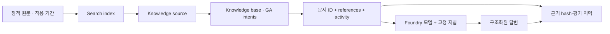
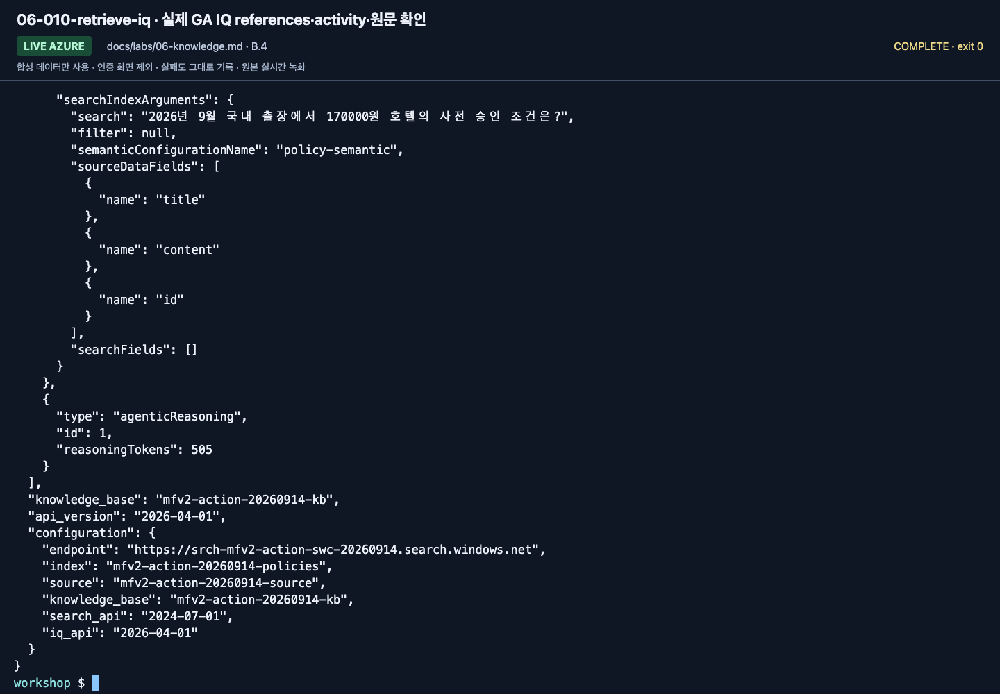

# Lab 06. 문서 근거에서 RAG와 Foundry IQ로

**완료 목표:** 일반 검색과 실제 IQ retrieval을 구분하고, 답변의 원문 근거를 보존합니다.

이전: [Lab 05](05-workflows.md) · 다음: [Lab 07](07-evaluation.md)

## 세 단계는 같은 기능이 아닙니다

| 방식 | 이 저장소의 실행 | 무엇을 확인하나요? |
|---|---|---|
| 로컬 키워드 검색 | `retrieve --provider local` | 합성 파일에 대한 학습용 문자열 검색 |
| Azure AI Search | `retrieve --provider search` | 실제 Search index의 텍스트 검색 |
| Foundry IQ | `retrieve --provider iq` | 실제 knowledge base의 retrieve, references·activity |

임베딩을 쓰지 않는 작은 텍스트/semantic 실습입니다. 일반 Search 경로를
**벡터·하이브리드 검색**이라고 표시하지 않습니다.
확장하려면 임베딩 모델·차원·벡터 필드·검색 전략을 별도 구성하고 다시 평가해야 합니다.

## A. 브라우저 — 인용이 보이면 끝인가?

1. [Lab 03](03-prompt-agent.md)의 실제 에이전트에서 현행과 과거 출장 질문을 각각 입력합니다.
2. 인용/근거의 문서 이름과 본문을 엽니다. 직접 컨텍스트 방식이면 해당 문서 ID를 원본 파일과 대조합니다.
3. `TRAVEL-2025`와 `TRAVEL-2026`의 적용 기간을 비교합니다.
4. 2026년 5월 질문에 현행 문서를 인용하면 잘못된 근거 선택으로 기록합니다.
5. “숙박 한도를 초과했다”는 질문에서 승인 규정이 함께 설명되는지 확인합니다.
6. 강사가 준비한 IQ 에이전트가 있으면 같은 질문을 보내 보고 원문 근거를 비교합니다.

포털의 IQ 생성 UI는 Preview 기능을 사용할 수 있습니다.
**이 랩의 GA REST 경로와 포털 내부의 계약이 같다고 가정하지 않습니다.**
포털로 IQ를 직접 만들려면 강사가 현재 UI·리전·요금·필요 권한을 확인해야 합니다.
관찰만 했다면 `강사 IQ 데모 관찰`로 남깁니다.

## B. 코드 — 공통 환경에 Search만 추가

### 1. 강사 사전 준비 확인

- 기존 Azure AI Search 서비스, 필요한 tier·리전·인증 설정.
- 읽기 사용자: `Search Index Data Reader`.
- 색인/소스 작성자: 해당 서비스의 `Search Service Contributor` 및 `Search Index Data Contributor`.
- GA knowledge retrieval과 semantic ranker의 사용/과금 설정을 관리자가 별도로 확인.
- `.env`의 `AZURE_SEARCH_ENDPOINT`와 고유 `WORKSHOP_PREFIX`.

구독 Owner만으로 Search 데이터 접근이 된다고 가정하지 않습니다.
기본 실습 스크립트는 Search 서비스나 역할을 생성하지 않고 **준비된 서비스 안의
본인 접두사 객체만** 만듭니다.

### 2. 작은 지식 원본 확인

```bash
python scripts/workshop.py retrieve --provider local --question "2026년 9월 국내 출장 숙박비 한도는?"
```

`documents`, `source_ids`, `context_hash`를 확인합니다.
학습용 로컬 검색은 한국어 형태소 검색이나 의미 검색의 대체물이 아닙니다.
검색 문서가 부족하면 정답을 코드에 넣지 말고 검색의 한계를 기록합니다.

### 3. 일반 Search 색인 만들기

**클라우드 쓰기 작업입니다.** 준비된 실습 서비스·접두사·권한을 확인한 뒤 실행합니다.

```bash
python scripts/workshop.py seed-search --confirm-create
python scripts/workshop.py retrieve --provider search --question "2026년 9월 국내 출장 숙박비 한도는?"
```

이름을 생략한 선택 환경변수는 다음과 같이 결정됩니다.

| 환경변수 | 기본 이름 |
|---|---|
| `AZURE_SEARCH_INDEX_NAME` | `<WORKSHOP_PREFIX>-policies` |
| `AZURE_SEARCH_KNOWLEDGE_SOURCE_NAME` | `<WORKSHOP_PREFIX>-source` |
| `AZURE_SEARCH_KNOWLEDGE_BASE_NAME` | `<WORKSHOP_PREFIX>-kb` |

기존 객체가 있는데 내 로컬 소유권 기록이 없으면 덮어쓰지 않습니다.
새 접두사를 쓰거나 강사에게 복구를 요청합니다.
문서 업로드가 부분 실패하면 전체 성공으로 처리하지 않습니다.

### 4. GA Foundry IQ knowledge source/base 만들기

```bash
python scripts/workshop.py seed-search --iq --confirm-create
python scripts/workshop.py retrieve --provider iq --question "2026년 9월 국내 출장에서 170000원 호텔의 사전 승인 조건은?"
```

기본 IQ 코드는 **REST `2026-04-01` GA의 minimal/extractive 계약**을 사용합니다.
명시적인 semantic `intents`로 요청하며, `messages`나 별도 planner 모델 설정을
요청에 넣지 않습니다. 최종 답변은 다음 단계의 모델 호출에서 생성합니다.
서비스 내부 처리가 없다는 보장은 아니며 실제 activity에 보고된 reasoning 항목도 확인합니다.
검색 응답의 `maxOutputSizeInTokens`는 6000으로 제한합니다. 실제 GA 호출에서 5000 초과가
필요함을 확인했으며, 이는 답변 모델의 `WORKSHOP_MAX_OUTPUT_TOKENS`와 다른 설정입니다.

확인:

1. `provider`가 `foundry-iq`인가.
2. 실제 knowledge base 이름과 API 버전이 기록되었는가.
3. `references`, `activity`, 원문 `documents`가 있는가.
4. 참조 번호와 문서의 안정적인 `id`를 혼동하지 않았는가.
5. activity에 오류가 있으면 부분 성공으로 넘어가지 않았는가.

**빈 결과는 0건 검색입니다.** 이 경우에도 정상 답변처럼 금액을 채우지 않습니다.
실패 시 Search로 자동 대체하지 않습니다.

### 5. 같은 질문을 근거와 함께 실제 모델에 전달

```bash
python scripts/workshop.py answer --prompt v2 --retrieval iq --question "2026년 9월 국내 출장에서 170000원 호텔을 예약하려면 어떤 절차가 필요한가요?"
```

검색→응답을 따로 둔 이유는 실패를 구분하기 위해서입니다.
검색에 현재 규정이 없는 것과, 올바른 규정을 받았는데 적용일을 잘못 해석한 것은 다른 문제입니다.



## Preview 확장은 별도 실험

`2026-08-01-preview`의 messages·추론 노력·답변 합성·추가 source와 GA body를 섞으면
400 오류가 날 수 있습니다. `outputMode`, `models`, `retrievalReasoningEffort`를
기본 GA 설정에 추가하지 않습니다.
[Lab 10](10-iq-extensions.md)과 [API 호환성](../reference/versions.md)에서 별도로 다룹니다.

## 완료 확인




GA 검색은 성공했지만 포털 Preview 편집기는 별도 chat model을 요구했습니다.
기존 GA 구성을 이 화면에서 저장해 바꾸지 않습니다.
실제 activity와 차이는 [실행 기록](../live-run.md)에 남겼습니다.

Search와 IQ를 각각 호출하고 구분할 수 있으며, 실제 인용의 원문과 적용 기간을 확인합니다.
`outputs/azure-objects.json`은 내 Search 객체의 소유권 기록입니다.
공유 서비스 자체를 삭제하는 권한 증명이 아닙니다.
