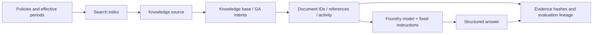

# Lab 06. From document evidence to RAG and Foundry IQ

**English** | [한국어](../ko/labs/06-knowledge.md)

**Goal:** Distinguish ordinary search from actual IQ retrieval and preserve source evidence.

**Open your section:** [A — check existing sources](#path-a) · [B — GA Search/IQ](#path-b) · [Paths](../paths.md)

**IQ Chat can use a chat model with Search managed identity.** For that optional exercise, open the
**prepared chat KB** with **`gpt-5.6-luna` / Low / Answer synthesis**, not the model-free GA KB.
[The configured screen and exact checks](#iq-chat-model) are below. A's default source check does not require IQ Chat.

## Before you start

**This pass:** A checks its agent's sources, then optionally the prepared fixed-model IQ chat base. B follows the numbered GA retrieval path; hybrid is optional.

**Need:** A: Lab 03 responses and learner files. B: .env, a prepared Search service, writer permissions and a fresh owned prefix or matching ownership ledger.

**Continue when:** A: policy IDs and dates are checked. B: Search and GA IQ outputs are saved. Luna planning/synthesis is required only for the separately selected IQ Chat branch.

**If blocked:** Resolve the selected path's source/access error without changing providers. A's default source check needs no IQ chat model.

[One-time setup and learner files](../setup.md).

## Four different retrieval paths

| Method | Command | What it verifies |
|---|---|---|
| Local keyword search | `retrieve --provider local` | Educational string matching over synthetic files |
| Azure AI Search | `retrieve --provider search` | Text search on a real Search index |
| Hybrid Search | `retrieve --provider hybrid` | Explicit embeddings with combined text/vector search |
| Foundry IQ | `retrieve --provider iq` | Actual knowledge-base retrieval, references, and activity |

The default local/keyword/minimal-IQ paths do not use client-generated embeddings.
Only the optional hybrid path below uses an explicitly configured embedding model, dimensions, and vector fields.
Never rename ordinary text search as hybrid retrieval.

<a id="path-a"></a>

## A. Browser: a visible citation is not enough

1. Open your current/historical/over-limit responses from [Lab 03](03-prompt-agent.md). If a response is missing, copy that question from `dev-questions.txt` into a new chat.
2. Open the cited name/content where supported; for direct context, compare the document ID with the original file.
3. Compare the effective periods of `TRAVEL-2025` and `TRAVEL-2026`.
4. Record a current-policy citation for May 2026 as incorrect evidence selection.
5. Check that an over-limit question also explains the approval policy.

**A done:** fill Lab 06 in `session-notes.txt` with the compared policy IDs, dates and your findings.
The default route makes no new retrieval request: mark **IQ Chat not selected** and continue to [Lab 07 A](07-evaluation.md#path-a).
Only expand the branch below if it was separately selected and prepared before execution.

<a id="iq-chat-model"></a>

### Optional IQ Chat: open the prepared Luna chat KB

<details>
<summary>Optional Preview IQ Chat — requires a prepared chat base and separate cost approval</summary>

Choose this segment only when the owner has completed [IQ preparation](../setup.md#4-environment-owner-checklist).
Otherwise record **IQ Chat not selected**, complete the source checks above, and continue to Lab 07.
Planning/synthesis for this Search-index source is **Preview as of September 15, 2026**; MI itself is supported.

1. In Foundry, open **Knowledge → Knowledge bases** and select the **`knowledge_base` name returned by the owner's `iq-chat setup`**,
   recorded on your setup card, normally `<prefix>-chat-en-kb`. Do not open the original `<prefix>-kb` expecting chat settings.
2. Confirm the **three filled values** below and the matching English synthetic source.
   If the model or either mode is blank, **stop before Save**: return to the list and check the chat-base name.
   If no prepared chat base exists, the owner completes [check → authorized setup](../reference/iq-model-identity.md);
   do not fix the model-free GA base by changing its configuration.
3. In the same prepared terminal used for Lab 05, run `check` below. Continue only when `configured: true`; `ready_for_setup: true` alone means prerequisites, not a saved chat base.
4. After cost approval, run `ask` **once**. Use the CLI for this test so its API/request fields and returned activity are preserved; do not also send a duplicate portal chat.
5. Compare `answer`, `source_ids`, `references`, and both model activities with the synthetic originals. Record a failure unchanged.

| Setting | Exact first-pass choice |
|---|---|
| Chat deployment / underlying model | **`gpt-5.6-luna` / `gpt-5.6-luna`**, model version **`2026-07-09`** |
| Authentication | **System assigned identity** of **Search**, not the learner or Hosted agent |
| Model-account role | Search identity has **`Cognitive Services User`** on the Foundry account |
| Reasoning / output | **`low` / `answerSynthesis`** |
| API | **`2026-08-01-preview`**; no API key |


**What to check:** `gpt-5.6-luna`, **Low**, **Answer synthesis**, the English source and **Active** are visible.
There is no **Chat completions model is required** validation message. Required-field asterisks and the gray MI notice are normal:
the notice says Search will use its identity, not that authentication failed or that the role was verified.
This is a fresh, unedited view of an **already saved** chat KB; no Save, deployment or model request was performed for this capture.
Use your own returned name, not the screenshot's name.

**Do not clear the selected Luna model or deploy a recommendation to match the picture.**
On September 17, the quick model list and **Browse more models** opened a deployment catalog, not the existing-deployment inventory.
The prepared Luna binding displayed correctly even though Luna was absent from that catalog.
Keep the saved selection; use the owner's fixed CLI preset for initial setup rather than choosing another model or enabling API keys.

```bash
python scripts/workshop.py --language en iq-chat check
```

Only after that check passes and the request cost is approved:

```bash
python scripts/workshop.py --language en iq-chat ask --label iq-chat-lab06 --confirm-cost
```

The result must show `model_planning_verified: true`, `model_synthesis_verified: true`,
and actual `modelQueryPlanning` / `modelAnswerSynthesis` for Luna.
Request, response, source evidence and failures stay in `outputs/iq-chat/iq-chat-lab06/`; use a new label for another request.
`check` does not change Azure and `ask` never chooses another model/provider.
For `configured: false`, missing permissions, a wrong version, 403 or 429, stop and use [the fixed-preset recovery guide](../reference/iq-model-identity.md).
A fixed model removes a common configuration mismatch; it cannot guarantee quota or service availability.

</details>

<a id="path-b"></a>

## B. Code: add Search to the shared configuration

### 1. Check instructor preparation

You need an existing Search service with the required tier, region, and authentication;
`Search Index Data Reader` for readers; and `Search Service Contributor` plus
`Search Index Data Contributor` for schema/document writers.
An administrator separately verifies GA retrieval and semantic-ranker usage/billing.
Set `AZURE_SEARCH_ENDPOINT` and a unique `WORKSHOP_PREFIX`.

Subscription Owner alone does not imply Search data access. Scripts do not create a
Search service or roles; they create **your prefixed objects inside a prepared service**.

**Choose the ownership situation before seeding.** A new learner copy needs a new, unseeded `mfv2-...` prefix and writer permissions.
An instructor-prepared copy must already contain the matching `outputs/azure-objects.json`.
An existing remote index plus an empty local ledger is not ready for a create/update exercise; do not overwrite it.
`--language en` does not append `-en` to Search names. See [workspace/language changes](../reference/configuration.md#workspace-scope).

### 2. Inspect the small source corpus

```bash
python scripts/workshop.py --language en retrieve --provider local \
  --question "What is the domestic business-trip lodging limit for September 2026?" \
  --output outputs/learner-notes-en/retrieve-local.json
```

Inspect `documents`, `source_ids`, and `context_hash`. This educational keyword search is not a production semantic search engine.
If evidence is missing, record the limitation instead of hardcoding answers.
Keep the selected English question unchanged within this experiment; `--language en` selects English documents.


**What to check:** Read `source_ids` and `context_hash`. This is local synthetic-file
retrieval, not Search/IQ. Check the returned provider, not just configured endpoint names.

**Save:** `retrieve-local.json` is written to your Lab 00 notes directory. Open it and check the original evidence.

### 3. Create an ordinary Search index

**This writes to the cloud.** Verify the prepared service, prefix, and permissions first.

```bash
python scripts/workshop.py --language en seed-search --confirm-create
```

| Optional setting | Default object name |
|---|---|
| `AZURE_SEARCH_INDEX_NAME` | `<WORKSHOP_PREFIX>-policies` |
| `AZURE_SEARCH_KNOWLEDGE_SOURCE_NAME` | `<WORKSHOP_PREFIX>-source` |
| `AZURE_SEARCH_KNOWLEDGE_BASE_NAME` | `<WORKSHOP_PREFIX>-kb` |

Existing objects without your local ownership record are not overwritten.
If changing prefix after any seeding, use a fresh source copy as well, or ask the instructor to recover the original working copy.
Do not delete the old ledger. Partial document upload
failure is not overall success.


**What to check:** The seed result has `mode: live`, your `index`, `document_count: 6`,
`hybrid: false`, and `knowledge_base: null`. It created ordinary Search objects, not IQ.

Only after successful seeding, query that index:

```bash
python scripts/workshop.py --language en retrieve --provider search \
  --question "What is the domestic business-trip lodging limit for September 2026?" \
  --output outputs/learner-notes-en/retrieve-search.json
```

**What to check:** Read the result of `--provider search`; verify endpoint/index.
Do not relabel an ordinary result without IQ `references`/`activity` as IQ.

**Save:** `retrieve-search.json` is written to the same notes directory. Review it before creating the IQ source/base.

### 4. Create a GA IQ knowledge source/base

```bash
python scripts/workshop.py --language en seed-search --iq --confirm-create
```

Continue only after the seed output has `document_count: 6` and the intended non-null `knowledge_base`.
Keep `outputs/azure-objects.json`; do not delete the ownership ledger when pausing.

```bash
python scripts/workshop.py --language en retrieve --provider iq \
  --question "What are the advance-approval requirements for a KRW 170000 hotel on a domestic business trip in September 2026?" \
  --output outputs/learner-notes-en/retrieve-iq.json
```

Meaning: advance-approval conditions for a KRW 170000 domestic hotel in September 2026.


**What to check:** The seed result now has a non-null `knowledge_base` and `document_count: 6`.
The **retrieve** result reports the source/base configuration and `api_version: 2026-04-01`.
Keep the `ledger` file, `outputs/azure-objects.json`, which records ownership.

Default IQ uses **REST `2026-04-01` GA direct intents and extractive retrieval**.
For this non-web Search-index source, that API does **not support using an LLM inside the KB**.
The seed command therefore **does not configure a KB model**. This is an API/source boundary, not an API-key authentication requirement.
The next step generates the answer through a separate model call; that is not a test of Search-to-model MI authentication.
This does not promise no internal service
reasoning; read any reasoning activity actually reported.

Retrieval `maxOutputSizeInTokens` is 6000: the recorded GA call required a value above
5000. This is separate from the answer model's `WORKSHOP_MAX_OUTPUT_TOKENS`.

Verify `provider: foundry-iq`, the actual base/API version, `references`, `activity`,
and original `documents`. Reference numbers are not stable document IDs.
Activity errors must not be silently accepted as partial success.
**An empty result means zero retrieved documents**, not permission to invent an amount.
IQ failure never automatically becomes Search.


**What to check:** Read `activity`, base, API version, `references` and `documents` together.
Do not fill unreported latency or usage with invented values.

**Save:** `retrieve-iq.json` is written to the same notes directory, including the original documents and activity. Inspect them before answering.

### 5. Send evidence to the real model

```bash
python scripts/workshop.py --language en answer --prompt v2 --retrieval iq \
  --question "What procedure is required to book a KRW 170000 hotel for a domestic business trip in September 2026?" \
  --output outputs/learner-notes-en/answer-iq.json
```

Meaning: steps required before booking that over-limit hotel.
Retrieval and generation are separated to diagnose failures: a missing policy is
different from misreading the effective date of a correctly retrieved policy.


**What to check:** Verify the IQ base/API, `response_model`, `response_id`, and `usage`.
Compare the amount, conditions, and citations in `answer` with the original documents.

**Save:** `answer-iq.json` is written to the same notes directory. Check its complete response and retrieval metadata.



**B done:** save the complete outputs as `retrieve-local.json`, `retrieve-search.json`, `retrieve-iq.json`
and `answer-iq.json` in your Lab 00 notes directory,
including original IDs, `references`, `activity`, `context_hash` and the ownership ledger.
Keep the original `outputs/azure-objects.json` in place; a copied output file does not establish object ownership.
Continue to [Lab 07 B](07-evaluation.md#path-b). That lesson starts a **declared local-retrieval experiment**; it does not reuse this IQ answer as an evaluation result.

## C. Optional real hybrid RAG

**First pass: continue to [Lab 07](07-evaluation.md).** C and D are separate advanced branches, not missing steps in the GA path.

<details>
<summary>Expand the optional embedding and hybrid-index exercise</summary>

Use a separate owned index instead of silently changing the existing text index.
Configure a verified embedding deployment and its actual dimensions.

```dotenv
AZURE_SEARCH_INDEX_NAME=<your-mfv2-prefix>-policies-hybrid
AZURE_AI_EMBEDDING_DEPLOYMENT_NAME=<verified-embedding-deployment>
WORKSHOP_EMBEDDING_DIMENSIONS=<actual-dimensions>
WORKSHOP_EMBEDDING_API=account
AZURE_OPENAI_ENDPOINT=https://<same-foundry-account>.openai.azure.com
```

```bash
python scripts/workshop.py --language en seed-search --hybrid --confirm-create --confirm-cost
python scripts/workshop.py --language en retrieve --provider hybrid --question "What is the domestic business-trip lodging limit for September 2026?"
python scripts/workshop.py --language en answer --retrieval hybrid --prompt v2
```

Creation approval covers the owned index; cost approval covers real embeddings.
All six synthetic documents are embedded and checked against the vector field/HNSW profile.
Queries contain both `search` and `vectorQueries`, with `top=6`.
Never truncate or zero-pad vectors to conceal dimension mismatches.

The Korean live run retained a project-embeddings 404 and then explicitly configured the same account's OpenAI API.
No exception handler switches endpoints automatically.
Inspect the real hybrid provider, observed embedding model/dimensions, source IDs, index, and context hash.
The code rejects silent text-to-vector schema replacement and text-only uploads that would erase existing vectors.
Ownership/per-index configuration stays in `outputs/azure-objects.json`.

Changing an environment index name does not rewire a remote IQ source/base.
Do not mix retrieval changes into a prompt-only evaluation comparison.

</details>

## D. Connect IQ to Hosted workflows and evaluation

<details>
<summary>Expand the advanced workflow/evaluation connection</summary>

### Recall is part of the experiment

The first English dev cohort correctly withheld an international lodging amount but missed the required scope-policy citation.
Actual IQ evidence omitted `SCOPE-01`, whose observed reranker score was about 1.775.
An explicit same-endpoint/query/corpus diagnostic with `WORKSHOP_IQ_RERANKER_THRESHOLD=0` returned all six synthetic documents.
This adjusts a **retrieval filter**, not the business rubric or judge threshold.
Keep the initial failed cohort and run a new, consistently configured baseline/candidate pair.
Do not apply this small-corpus setting blindly to production, change reference answers, or describe it as an error-triggered provider fallback.

```bash
python scripts/workshop.py --language en workflow-agent --pattern sequential --retrieval iq --prompt v2
```

Save this local workflow output. For the remote matrix, start at the
[evaluation workbook's preparation](../reference/evaluation-workbook.md#matrix-setup);
it packages its own IQ/account-chat/Invocations target once.
Lab 08's introductory helper accepts local retrieval, not this IQ profile.
The [IQ workbook](../reference/iq-workbook.md) documents separate Toolbox/Fabric/Work IQ approval and identity gates.
No hidden prerequisite requires another repository.

</details>

## Distinguish model-based IQ from the default GA path

To have a model plan queries and synthesize answers for this Search-index source, explicitly select the supported Preview contract
and configure the model, Search identity permissions, reasoning effort, and output mode together.
Managed identity is a normal keyless authentication option for that path and was verified with actual calls.
A `models` property in the GA schema does not imply that every source's LLM features are GA.
Use version-matched request fields from the [MI model-binding guide](../reference/iq-model-identity.md).
Keep the model-free GA base unchanged for its frozen evaluation; use the separate prepared chat base for the optional model-based mode.
The [new configured screen](#iq-chat-model) is the reference for IQ Chat.
The older empty-model screen below is historical GA inspection, not the target state to reproduce.

<details>
<summary>Recorded reference screens (optional; not steps to repeat)</summary>

These are newly recorded English actions using the separate English prompt/data bundle. Use your own returned resource IDs and record your own results.


**What to check:** Verify the English source IDs, selected provider, index/vector-store distinction, actual dimensions and completed file count.


**Historical limitation:** this September 15 GA base had `models: []`. Its missing-model validation is not MI failure
and is not the desired IQ Chat configuration. Do not overwrite it to match the new chat exercise.


**What to check:** Verify the English source IDs, selected provider, index/vector-store distinction, actual dimensions and completed file count.


**What to check:** Verify the English source IDs, selected provider, index/vector-store distinction, actual dimensions and completed file count.


**What to check:** Verify the English source IDs, selected provider, index/vector-store distinction, actual dimensions and completed file count.


**What to check:** Verify the English source IDs, selected provider, index/vector-store distinction, actual dimensions and completed file count.


**What to check:** Verify the English source IDs, selected provider, index/vector-store distinction, actual dimensions and completed file count.

[Full action index](../action-captures.md) · [Recordings](../video-summary.md)

</details>

## Completion

A: verify source IDs/effective periods and record whether IQ Chat was selected and actually run.
B: call Search and GA IQ separately and explain the returned evidence.
`outputs/azure-objects.json` records ownership of your Search objects;
it is not authorization to delete a shared service.

Next: A → [Lab 07](07-evaluation.md#path-a) · B → [Lab 07](07-evaluation.md#path-b)
