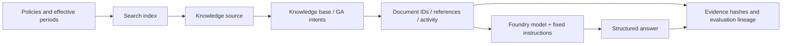

# Lab 06. From document evidence to RAG and Foundry IQ

**English** | [한국어](../ko/labs/06-knowledge.md)

**Goal:** Distinguish ordinary search from actual IQ retrieval and preserve source evidence.

Next: A → [Lab 07](07-evaluation.md) · B → [Lab 07](07-evaluation.md) · [Paths](../paths.md)

## Before you start

**This pass:** A checks its agent's sources, then optionally the prepared fixed-model IQ chat base. B follows the numbered GA retrieval path; hybrid is optional.

**Need:** A: Lab 03 responses and learner files; the owner's chat-base name only if IQ Chat is selected. B: .env, Search permissions and an owned synthetic source.

**Continue when:** The selected path's real evidence is recorded; IQ chat shows Luna planning and answer synthesis.

**If blocked:** Do not open the model-free GA base expecting a chat model. Use iq-chat check for the fixed chat preset.

[One-time setup and learner files](../setup.md).

## Four different retrieval paths

| Method | Command | What it verifies |
|---|---|---|
| Local keyword search | `retrieve --provider local` | Educational string matching over synthetic files |
| Azure AI Search | `retrieve --provider search` | Text search on a real Search index |
| Hybrid Search | `retrieve --provider hybrid` | Explicit embeddings with combined text/vector search |
| Foundry IQ | `retrieve --provider iq` | Actual knowledge-base retrieval, references, and activity |

The default local/keyword/minimal-IQ paths do not use client-generated embeddings.
Only the optional hybrid path below uses an explicitly configured embedding model, dimensions, and vector fields.
Never rename ordinary text search as hybrid retrieval.

## A. Browser: a visible citation is not enough

1. Open your current/historical/over-limit responses from [Lab 03](03-prompt-agent.md). If a response is missing, copy that question from `dev-questions.txt` into a new chat.
2. Open the cited name/content where supported; for direct context, compare the document ID with the original file.
3. Compare the effective periods of `TRAVEL-2025` and `TRAVEL-2026`.
4. Record a current-policy citation for May 2026 as incorrect evidence selection.
5. Check that an over-limit question also explains the approval policy.

### Optional IQ Chat: one prepared configuration, one actual test

Choose this segment only when the owner has completed [IQ preparation](../setup.md#4-environment-owner-checklist).
Otherwise record **IQ Chat not selected**, complete the source checks above, and continue to Lab 07.
Planning/synthesis for this Search-index source is **Preview as of September 15, 2026**; MI itself is supported.

1. In Foundry, open **Knowledge → Knowledge bases** and select the **exact chat-base name on your setup card**, normally `<prefix>-chat-en-kb`.
   Confirm its Search connection and synthetic source. Do not select the original model-free GA base.
2. Inspect **Chat completions model** using the table below. Do not save defaults over an existing base.
3. In the same prepared terminal used for Lab 05, run `check` below. Continue only when `configured: true`; `ready_for_setup: true` alone means prerequisites, not a saved chat base.
4. After cost approval, run `ask` **once**. Use the CLI for this test so its API/request fields and returned activity are preserved; do not also send a duplicate portal chat.
5. Compare `answer`, `source_ids`, `references`, and both model activities with the synthetic originals. Record a failure unchanged.

| Setting | Exact first-pass choice |
|---|---|
| Chat deployment / underlying model | **`gpt-5.6-luna` / `gpt-5.6-luna`**, model version **`2026-07-09`** |
| Authentication | **System assigned identity** of **Search**, not the learner or Hosted agent |
| Model-account role | Search identity has **`Cognitive Services User`** on the Foundry account |
| Reasoning / output | **`low` / `answerSynthesis`** |
| API | **`2026-08-01-preview`**; no API key |

```bash
python scripts/workshop.py --language en iq-chat check
python scripts/workshop.py --language en iq-chat ask --label iq-chat-lab06 --confirm-cost
```

The result must show `model_planning_verified: true`, `model_synthesis_verified: true`,
and actual `modelQueryPlanning` / `modelAnswerSynthesis` for Luna.
Request, response, source evidence and failures stay in `outputs/iq-chat/iq-chat-lab06/`; use a new label for another request.
`check` does not change Azure and `ask` never chooses another model/provider.
For `configured: false`, missing permissions, a wrong version, 403 or 429, stop and use [the fixed-preset recovery guide](../reference/iq-model-identity.md).
A fixed model removes a common configuration mismatch; it cannot guarantee quota or service availability.

## B. Code: add Search to the shared configuration

### 1. Check instructor preparation

You need an existing Search service with the required tier, region, and authentication;
`Search Index Data Reader` for readers; and `Search Service Contributor` plus
`Search Index Data Contributor` for schema/document writers.
An administrator separately verifies GA retrieval and semantic-ranker usage/billing.
Set `AZURE_SEARCH_ENDPOINT` and a unique `WORKSHOP_PREFIX`.

Subscription Owner alone does not imply Search data access. Scripts do not create a
Search service or roles; they create **your prefixed objects inside a prepared service**.

### 2. Inspect the small source corpus

```bash
python scripts/workshop.py --language en retrieve --provider local --question "What is the domestic business-trip lodging limit for September 2026?"
```

Inspect `documents`, `source_ids`, and `context_hash`. This educational keyword search is not a production semantic search engine.
If evidence is missing, record the limitation instead of hardcoding answers.
Keep the selected English question unchanged within this experiment; `--language en` selects English documents.


**What to check:** Read `source_ids` and `context_hash`. This is local synthetic-file
retrieval, not Search/IQ. Settings visible in the screenshot alone do not identify the executed provider.

### 3. Create an ordinary Search index

**This writes to the cloud.** Verify the prepared service, prefix, and permissions first.

```bash
python scripts/workshop.py --language en seed-search --confirm-create
python scripts/workshop.py --language en retrieve --provider search --question "What is the domestic business-trip lodging limit for September 2026?"
```

| Optional setting | Default object name |
|---|---|
| `AZURE_SEARCH_INDEX_NAME` | `<WORKSHOP_PREFIX>-policies` |
| `AZURE_SEARCH_KNOWLEDGE_SOURCE_NAME` | `<WORKSHOP_PREFIX>-source` |
| `AZURE_SEARCH_KNOWLEDGE_BASE_NAME` | `<WORKSHOP_PREFIX>-kb` |

Existing objects without your local ownership record are not overwritten.
Use a new prefix or ask the instructor to recover ownership. Partial document upload
failure is not overall success.


**What to check:** The seed result has `mode: live`, your `index`, `document_count: 6`,
`hybrid: false`, and `knowledge_base: null`. It created ordinary Search objects, not IQ.


**What to check:** Read the result of `--provider search`; verify endpoint/index.
Do not relabel an ordinary result without IQ `references`/`activity` as IQ.

### 4. Create a GA IQ knowledge source/base

```bash
python scripts/workshop.py --language en seed-search --iq --confirm-create
python scripts/workshop.py --language en retrieve --provider iq --question "What are the advance-approval requirements for a KRW 170000 hotel on a domestic business trip in September 2026?"
```

Meaning: advance-approval conditions for a KRW 170000 domestic hotel in September 2026.


**What to check:** The seed result now has a non-null `knowledge_base` and `document_count: 6`.
The **retrieve** result reports the source/base configuration and `api_version: 2026-04-01`.
Keep the `ledger` file, `outputs/azure-objects.json`, which records ownership.

Default IQ uses **REST `2026-04-01` GA direct intents and extractive retrieval**.
The seed command references the Search-index source but **does not configure a KB model**.
The next step generates the answer through a separate model call; that is not a test of Search-to-model MI authentication.
This does not promise no internal service
reasoning; read any reasoning activity actually reported.

Retrieval `maxOutputSizeInTokens` is 6000: the recorded GA call required a value above
5000. This is separate from the answer model's `WORKSHOP_MAX_OUTPUT_TOKENS`.

Verify `provider: foundry-iq`, the actual base/API version, `references`, `activity`,
and original `documents`. Reference numbers are not stable document IDs.
Activity errors must not be silently accepted as partial success.
**An empty result means zero retrieved documents**, not permission to invent an amount.
IQ failure never automatically becomes Search.


**What to check:** Read activity, base, and API version at the bottom, and references/
documents above. Do not fill unreported latency or usage with invented values.

### 5. Send evidence to the real model

```bash
python scripts/workshop.py --language en answer --prompt v2 --retrieval iq --question "What procedure is required to book a KRW 170000 hotel for a domestic business trip in September 2026?"
```

Meaning: steps required before booking that over-limit hotel.
Retrieval and generation are separated to diagnose failures: a missing policy is
different from misreading the effective date of a correctly retrieved policy.


**What to check:** Verify the IQ base/API, `response_model`, `response_id`, and `usage`.
The image is the bottom of a long output; compare the amount, conditions, and citations
in `answer` above with the original documents.



## C. Optional real hybrid RAG

**First pass: continue to [Lab 07](07-evaluation.md).** C and D are separate advanced branches, not missing steps in the GA path.

<details>
<summary>Expand the optional embedding and hybrid-index exercise</summary>

Use a separate owned index instead of silently changing the existing text index.
Configure a verified embedding deployment and its actual dimensions.

```dotenv
AZURE_SEARCH_INDEX_NAME=<your-mfv2-prefix>-policies-hybrid
AZURE_AI_EMBEDDING_DEPLOYMENT_NAME=<verified-embedding-deployment>
WORKSHOP_EMBEDDING_DIMENSIONS=<actual-dimensions>
WORKSHOP_EMBEDDING_API=account
AZURE_OPENAI_ENDPOINT=https://<same-foundry-account>.openai.azure.com
```

```bash
python scripts/workshop.py --language en seed-search --hybrid --confirm-create --confirm-cost
python scripts/workshop.py --language en retrieve --provider hybrid --question "What is the domestic business-trip lodging limit for September 2026?"
python scripts/workshop.py --language en answer --retrieval hybrid --prompt v2
```

Creation approval covers the owned index; cost approval covers real embeddings.
All six synthetic documents are embedded and checked against the vector field/HNSW profile.
Queries contain both `search` and `vectorQueries`, with `top=6`.
Never truncate or zero-pad vectors to conceal dimension mismatches.

The Korean live run retained a project-embeddings 404 and then explicitly configured the same account's OpenAI API.
No exception handler switches endpoints automatically.
Inspect the real hybrid provider, observed embedding model/dimensions, source IDs, index, and context hash.
The code rejects silent text-to-vector schema replacement and text-only uploads that would erase existing vectors.
Ownership/per-index configuration stays in `outputs/azure-objects.json`.

Changing an environment index name does not rewire a remote IQ source/base.
Do not mix retrieval changes into a prompt-only evaluation comparison.

</details>

## D. Connect IQ to Hosted workflows and evaluation

<details>
<summary>Expand the advanced workflow/evaluation connection</summary>

### Recall is part of the experiment

The first English dev cohort correctly withheld an international lodging amount but missed the required scope-policy citation.
Actual IQ evidence omitted `SCOPE-01`, whose observed reranker score was about 1.775.
An explicit same-endpoint/query/corpus diagnostic with `WORKSHOP_IQ_RERANKER_THRESHOLD=0` returned all six synthetic documents.
This adjusts a **retrieval filter**, not the business rubric or judge threshold.
Keep the initial failed cohort and run a new, consistently configured baseline/candidate pair.
Do not apply this small-corpus setting blindly to production, change reference answers, or describe it as an error-triggered provider fallback.

```bash
python scripts/workshop.py --language en workflow-agent --pattern sequential --retrieval iq --prompt v2
python scripts/package_hosted.py --language en --kind workflow --pattern sequential --retrieval iq --prompt v2 --protocol responses
```

Continue in [Lab 08](08-hosted.md) and the [evaluation workbook](../reference/evaluation-workbook.md).
The [IQ workbook](../reference/iq-workbook.md) documents separate Toolbox/Fabric/Work IQ approval and identity gates.
No hidden prerequisite requires another repository.

</details>

## Distinguish model-based IQ from the default GA path

To have a model plan queries and synthesize answers for this Search-index source, explicitly select the supported Preview contract
and configure the model, Search identity permissions, reasoning effort, and output mode together.
Managed identity is a normal keyless authentication option for that path and was verified with actual calls.
A `models` property in the GA schema does not imply that every source's LLM features are GA.
Use version-matched request fields from the [MI model-binding guide](../reference/iq-model-identity.md).
Preserve an old base only when reproducing its frozen evaluation; use a new owned base for a different execution mode.


**What to check:** The earlier screenshot shows a base with `models: []`.
**Chat completions model is required** means no model was selected, not that MI failed.
For the normal model-based path, configure a supported deployment and the Search MI role, then save and test.
Using another owned base protects the existing evaluation; it does not prohibit model configuration.

<details>
<summary>Recorded reference screens (optional; not steps to repeat)</summary>

These are newly recorded English actions using the separate English prompt/data bundle. Use your own returned resource IDs and record your own results.


**What to check:** Verify the English source IDs, selected provider, index/vector-store distinction, actual dimensions and completed file count.


**What to check:** Verify the English source IDs, selected provider, index/vector-store distinction, actual dimensions and completed file count.


**What to check:** Verify the English source IDs, selected provider, index/vector-store distinction, actual dimensions and completed file count.


**What to check:** Verify the English source IDs, selected provider, index/vector-store distinction, actual dimensions and completed file count.


**What to check:** Verify the English source IDs, selected provider, index/vector-store distinction, actual dimensions and completed file count.


**What to check:** Verify the English source IDs, selected provider, index/vector-store distinction, actual dimensions and completed file count.


**What to check:** Verify the English source IDs, selected provider, index/vector-store distinction, actual dimensions and completed file count.

[Full action index](../action-captures.md) · [Recordings](../video-summary.md)

</details>

## Completion

A: verify source IDs/effective periods and record whether IQ Chat was selected and actually run.
B: call Search and GA IQ separately and explain the returned evidence.
`outputs/azure-objects.json` records ownership of your Search objects;
it is not authorization to delete a shared service.

Next: A → [Lab 07](07-evaluation.md) · B → [Lab 07](07-evaluation.md)
