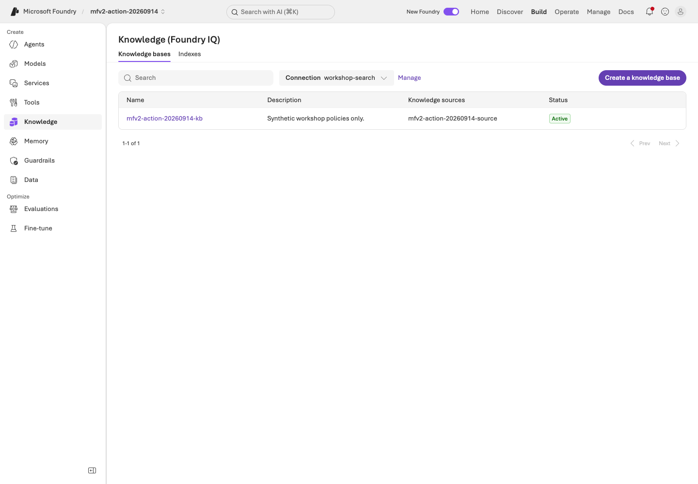
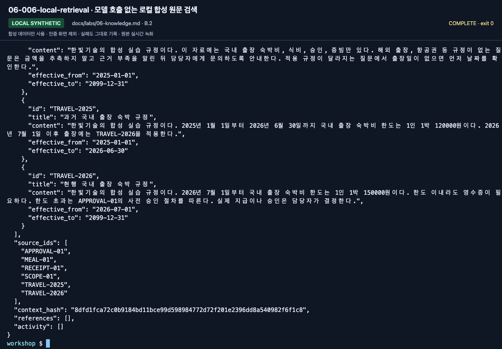
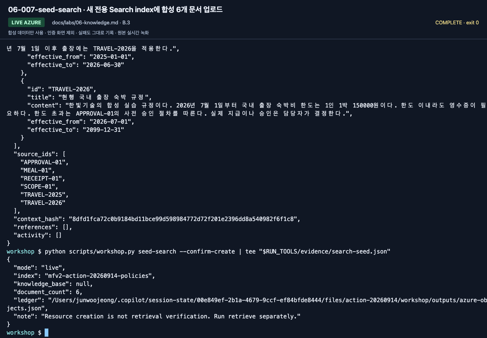
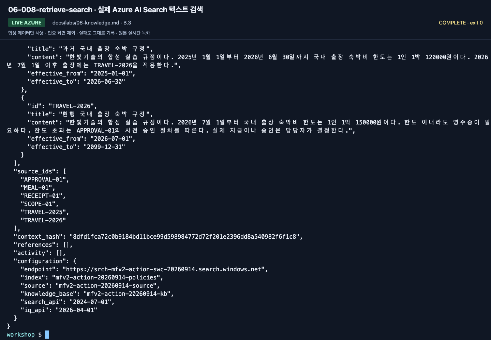
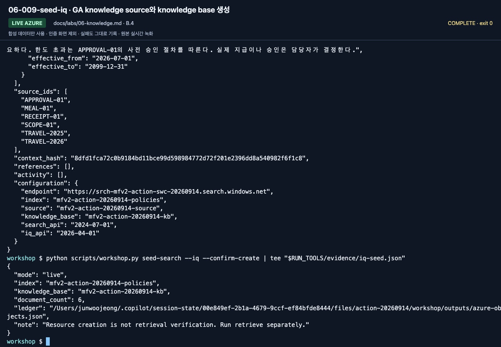
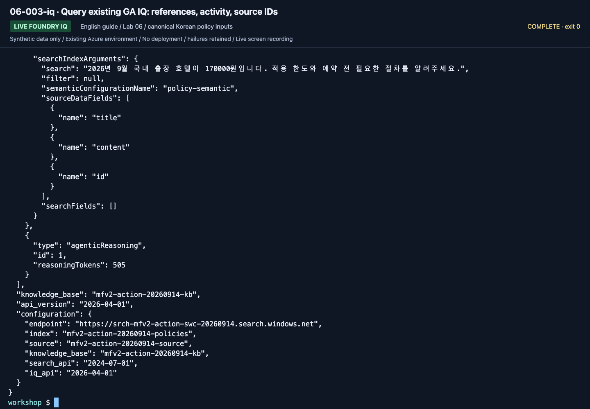
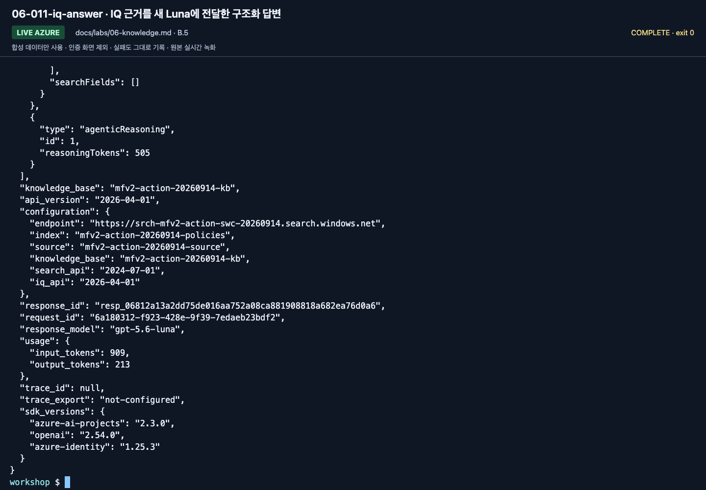
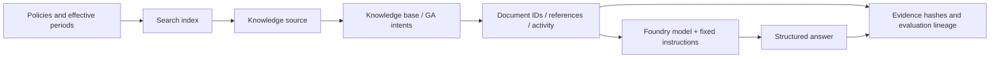
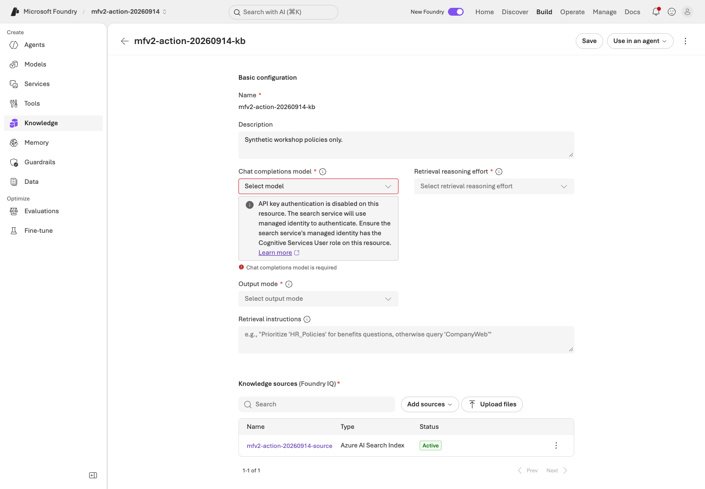

# Lab 06. From document evidence to RAG and Foundry IQ

**English** | [한국어](../ko/labs/06-knowledge.md)

**Goal:** Distinguish ordinary search from actual IQ retrieval and preserve source evidence.

Previous: [Lab 05](05-workflows.md) · Next: [Lab 07](07-evaluation.md)

## Three different retrieval paths

| Method | Command | What it verifies |
|---|---|---|
| Local keyword search | `retrieve --provider local` | Educational string matching over synthetic files |
| Azure AI Search | `retrieve --provider search` | Text search on a real Search index |
| Foundry IQ | `retrieve --provider iq` | Actual knowledge-base retrieval, references, and activity |

This small text/semantic exercise uses no embeddings. Do not call ordinary Search
**vector or hybrid search**. Those require a separately configured embedding model,
dimensions, vector fields, retrieval strategy, and new evaluation.

## A. Browser: a visible citation is not enough

1. Ask current and historical travel questions in your [Lab 03](03-prompt-agent.md) agent.
2. Open the cited name/content where supported; for direct context, compare the document ID with the original file.
3. Compare the effective periods of `TRAVEL-2025` and `TRAVEL-2026`.
4. Record a current-policy citation for May 2026 as incorrect evidence selection.
5. Check that an over-limit question also explains the approval policy.
6. If an instructor-prepared IQ agent exists, ask the same question and compare sources.

The portal IQ creation UI may use Preview features. **Do not assume its internal
contract matches this lab's GA REST API.** Direct portal creation requires instructor
verification of UI, region, pricing, and roles. Record observation as **instructor IQ demo observed**.



**What to check:** Under **Knowledge → Knowledge bases**, verify your **Connection**,
base, and source. `Active` is an object state; actual retrieval/source evidence needs a separate request.

## B. Code: add Search to the shared configuration

### 1. Check instructor preparation

You need an existing Search service with the required tier, region, and authentication;
`Search Index Data Reader` for readers; and `Search Service Contributor` plus
`Search Index Data Contributor` for schema/document writers.
An administrator separately verifies GA retrieval and semantic-ranker usage/billing.
Set `AZURE_SEARCH_ENDPOINT` and a unique `WORKSHOP_PREFIX`.

Subscription Owner alone does not imply Search data access. Scripts do not create a
Search service or roles; they create **your prefixed objects inside a prepared service**.

### 2. Inspect the small source corpus

```bash
python scripts/workshop.py retrieve --provider local --question "2026년 9월 국내 출장 숙박비 한도는?"
```

Meaning: the September 2026 domestic lodging limit. Inspect `documents`, `source_ids`,
and `context_hash`. This educational search is not Korean morphological or semantic
search. If evidence is missing, record the limitation instead of hardcoding answers.
Keep the canonical Korean query: translating it changes this keyword experiment.



**What to check:** Read `source_ids` and `context_hash`. This is local synthetic-file
retrieval, not Search/IQ. Settings visible in the screenshot alone do not identify the executed provider.

### 3. Create an ordinary Search index

**This writes to the cloud.** Verify the prepared service, prefix, and permissions first.

```bash
python scripts/workshop.py seed-search --confirm-create
python scripts/workshop.py retrieve --provider search --question "2026년 9월 국내 출장 숙박비 한도는?"
```

| Optional setting | Default object name |
|---|---|
| `AZURE_SEARCH_INDEX_NAME` | `<WORKSHOP_PREFIX>-policies` |
| `AZURE_SEARCH_KNOWLEDGE_SOURCE_NAME` | `<WORKSHOP_PREFIX>-source` |
| `AZURE_SEARCH_KNOWLEDGE_BASE_NAME` | `<WORKSHOP_PREFIX>-kb` |

Existing objects without your local ownership record are not overwritten.
Use a new prefix or ask the instructor to recover ownership. Partial document upload
failure is not overall success.



**What to check:** Verify `mode: live`, your index, and `documents_uploaded: 6`.
`iq_created: false` means only ordinary Search was created.



**What to check:** Read the result of `--provider search`; verify endpoint/index.
Do not relabel an ordinary result without IQ `references`/`activity` as IQ.

### 4. Create a GA IQ knowledge source/base

```bash
python scripts/workshop.py seed-search --iq --confirm-create
python scripts/workshop.py retrieve --provider iq --question "2026년 9월 국내 출장에서 170000원 호텔의 사전 승인 조건은?"
```

Meaning: advance-approval conditions for a KRW 170000 domestic hotel in September 2026.



**What to check:** Verify `iq_created: true`, source/base names, and
`api_version: 2026-04-01`. Preserve your ownership record separately from the ordinary-index result.

Default IQ uses the **REST `2026-04-01` GA minimal/extractive contract**, with explicit
semantic `intents`, not `messages` or a separate planner model in the request.
The next step generates the final answer. This does not promise no internal service
reasoning; read any reasoning activity actually reported.

Retrieval `maxOutputSizeInTokens` is 6000: the recorded GA call required a value above
5000. This is separate from the answer model's `WORKSHOP_MAX_OUTPUT_TOKENS`.

Verify `provider: foundry-iq`, the actual base/API version, `references`, `activity`,
and original `documents`. Reference numbers are not stable document IDs.
Activity errors must not be silently accepted as partial success.
**An empty result means zero retrieved documents**, not permission to invent an amount.
IQ failure never automatically becomes Search.

**New English-guide capture: September 15, 2026.** ▶ [Watch this action](https://github.com/user-attachments/assets/082ede4b-d363-474c-ad47-598b20f593e9#t=439.52)



**What to check:** Read activity, base, and API version at the bottom, and references/
documents above. Do not fill unreported latency or usage with invented values.

### 5. Send evidence to the real model

```bash
python scripts/workshop.py answer --prompt v2 --retrieval iq --question "2026년 9월 국내 출장에서 170000원 호텔을 예약하려면 어떤 절차가 필요한가요?"
```

Meaning: steps required before booking that over-limit hotel.
Retrieval and generation are separated to diagnose failures: a missing policy is
different from misreading the effective date of a correctly retrieved policy.



**What to check:** Verify the IQ base/API, `response_model`, `response_id`, and `usage`.
The image is the bottom of a long output; compare the amount, conditions, and citations
in `answer` above with the original documents.



## Preview extensions are separate experiments

Mixing `2026-08-01-preview` messages, reasoning effort, synthesis, or extra sources
with a GA body can cause HTTP 400. Do not add `outputMode`, `models`, or
`retrievalReasoningEffort` to the basic GA configuration.
See [Lab 10](10-iq-extensions.md) and [Versions](../reference/versions.md).



**What to check:** **Chat completions model is required** can appear despite successful
GA retrieval. Do not add an arbitrary model or **Save** over the GA configuration to
clear the message. The [execution record](../live-run.md) preserves this distinction.

## Completion

Call Search and IQ separately, explain their difference, and verify cited sources and
effective periods. `outputs/azure-objects.json` records ownership of your Search objects;
it is not authorization to delete a shared service.
