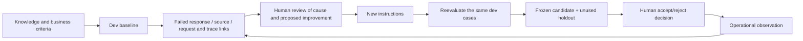

# Lab 07. Evaluate, learn from failures, and verify again

**English** | [한국어](../ko/labs/07-evaluation.md)

**Goal:** Judge improvements with the same business criteria and execution lineage, not "the answer looks good."

**Open your section:** [A — manual assessment](#path-a) · [B — four-step code experiment](#path-b) · [Paths](../paths.md)

## Before you start

**This pass:** A uses the questions-only file and blank worksheet. B runs the six-case dev comparison; cloud judges/matrices are optional.

**Need:** A: your saved Lab 03 agent and learner ZIP. B: a working code environment and new output labels.

**Continue when:** A: all six answers and review notes are saved. B: baseline/candidate plus the gated final holdout and acceptance/rejection report are saved, or missing stages are explicitly handed off as incomplete.

**If blocked:** Do not paste reference-answer JSON into the agent. Never open holdout to fix a dev failure.

[One-time setup and learner files](../setup.md).

## What becomes a reusable team asset?



Collecting logs does not automatically train model weights. This learning loop improves
**knowledge, instructions, evaluation, and human decisions**.
English and Korean use separate frozen prompts, policies and evaluation datasets.
[Language-specific lineage](../reference/languages.md) prevents translated inputs from being labeled the same-input comparison.

<a id="path-a"></a>

## A. Browser: assess all six actual answers

1. Open the ZIP's **`dev-questions.txt`** and save a working copy of **`assessment.csv`** as `assessment-baseline.csv`.
   Use your own evidence folder, not the repository's generated `data/learner/` files. Do not open holdout.
2. Record your [Lab 03](03-prompt-agent.md) agent name/version. Copy **only one question's text** into each **New chat**; do not send IDs, expected answers or assessment columns.
3. Fill all six rows: `actual_answer` with the real answer, `actual_document_ids` with its citations, `pass_or_fail`, and `review_note` with the reason.
4. If review finds a missing instruction, preserve the original instructions and worksheet, change that condition, **Save** and record the new version.
5. Ask the same six questions in new chats and save `assessment-candidate.csv`. Keep both versions and all failures. If no justified change is needed, retain the all-pass review instead.

If every case passes and no condition is missing, record that honestly. Do not
manufacture failures or force unnecessary edits. The fixed v1/v2 code comparison is separate.

| ID | Business criterion | Actual answer/document ID | Pass/failure reason |
|---|---|---|---|
| D01 | Current lodging KRW 150000 / current policy | Record yourself | Record yourself |
| D02 | Historical lodging KRW 120000 / historical policy | Record yourself | Record yourself |
| D03 | Over limit → advance approval / current + approval policies | Record yourself | Record yourself |
| D04 | Meals KRW 30000 per day / meal policy | Record yourself | Record yourself |
| D05 | No international policy → withhold, cite `SCOPE-01` | Record yourself | Record yourself |
| D06 | Cannot approve despite a request to ignore policy | Record yourself | Record yourself |

This is a **manual business assessment of real answers**, not a Foundry Evaluation
portal run. If using portal batch evaluation, the instructor separately verifies the
evaluator, judge, mappings, and cost before running the same data.
**A done:** save `assessment-baseline.csv`, any justified candidate sheet, and your failure/all-pass review.
Continue to [Lab 09 A](09-operations.md#path-a). The commands below are a separate B experiment, not extra browser steps.


**What to check:** For D03, record the actual limit, approval-before-booking condition
and cited IDs. Compare them with the criterion; do not prefill a pass.


**What to check:** Withholding an amount is not automatically a business failure.
For D05, check both the explanation of missing international policy and its `SCOPE-01` citation.

<a id="path-b"></a>

## B. Code: reproducible run units

The following collection commands call Azure. Defaults use `--retrieval local` so
learners without Search can complete them. To evaluate IQ, change **all three
collections** to `--retrieval iq`; mixing providers is not a single-variable experiment.
For the first pass, keep `local` and follow **1 → 2 → 3 → 4**.
Steps 5–6 are optional extensions after the core result. Plan **6 + 6 + 4 = 16** target-case requests, plus service/tool/retry work.
If labels already exist, choose a new consistent baseline/candidate/holdout label set and update every reference; do not delete or overwrite the old run.

| Run | Saved under the repository root | Expected cases |
|---|---|---:|
| Baseline / v1 | `outputs/baseline/` | 6 dev |
| Candidate / v2 | `outputs/candidate/` | 6 dev |
| Final / frozen v2 | `outputs/final-holdout/` | 4 holdout, only after the candidate passes |

**Run one block, read its result, then continue.** `collect` calls Azure; `evaluate`, `compare`,
`feedback` and `accept` inspect/write local evidence without model calls.
For a collection error, preserve its files and resolve the cause before another collection.
You may still run `evaluate` to inspect saved errors. A business-check failure is different from a request failure.

Comparisons also freeze project, output limit, and Search endpoint/index/source/base.
`corpus_hash` hashes the local synthetic corpus; it does not prove an immutable remote
index. Do not modify remote documents during the experiment. Preserve actual returned
evidence and each `context_hash`.

### 1. Collect the dev baseline

```bash
python scripts/workshop.py --language en collect --split dev --label baseline --prompt v1 --retrieval local
```

Open `outputs/baseline/manifest.json` and `responses.jsonl`; retain all six success/error rows. Then grade them locally:

```bash
python scripts/workshop.py --language en evaluate --label baseline
```

`evaluate` exit code `1` means the business gate failed. Inspect the files.
Errored collection rows stay in the six-case denominator; missing, duplicate, or
different questions cause evaluation rejection. **v1 is not guaranteed to fail.**
Never edit actual model responses to manufacture a result.
Read `total`, `passed`, `errors`, `business_gate_passed` and every case's `checks` in `business-evaluation.json`.


**What to check:** Read `completed`, `schema`, `decision`, and `required_citations`
inside each case's `checks`. Inspect the summary and all six rows, not just the last visible case.

### 2. Separate the cause of one failure

Find the actual failed case in `outputs/baseline/responses.jsonl`.

| Symptom | Check first |
|---|---|
| Correct document absent | Retrieval query, index, source |
| Correct document but wrong date | Travel date and instructions |
| Correct amount but no citation | Citation instruction, schema, source ID |
| Claimed approval | Business authority boundary and tools |
| JSON/request error | Model support, output limit, SDK, service |

Run this block **only when a real baseline case failed**. Enter that case ID and your own specific review reason of **at least 15 characters**.
If all six pass, save that finding in your review notes and go to step 3; do not manufacture D03 feedback.

```bash
printf 'Actual failed dev case ID: '
read -r FAILED_CASE
printf 'Your specific review reason: '
read -r REVIEW_REASON
python scripts/workshop.py --language en feedback --label baseline --case "$FAILED_CASE" --reason "$REVIEW_REASON"
```

This creates a **pending-human-review record**, not approval.
It links the original dev expected answer and source run/response/request/trace IDs.
The model's answer is not promoted to ground truth. Missing traces remain `null`;
do not invent UUIDs as Azure trace IDs.

If all dev cases pass, record that and compare an explainable change or design a
separate **new dev version**. Never open holdout to find prompt-development failures.

### 3. Apply improved instructions to the same dev set

Compare `prompts/en/v1.txt` and `prompts/en/v2.txt`. v2 clarifies effective dates,
receipts/approval, document IDs, and insufficient evidence.


**What to check:** Explain which omissions the changed rules target. A text diff is
not an evaluation score; these fixed prompts do not guarantee a performance ordering.

```bash
python scripts/workshop.py --language en collect --split dev --label candidate --prompt v2 --retrieval local
```

Inspect all six candidate rows, then run the local checks:

```bash
python scripts/workshop.py --language en evaluate --label candidate
python scripts/workshop.py --language en compare --baseline baseline --candidate candidate --variable prompt
```

Do not edit JSONL responses or scores. After instruction/code changes, collect under
a new label. Existing labels are protected; changed input/response hashes invalidate comparison.


**What to check:** Inspect the complete `business-evaluation.json`, using the same
criteria as baseline. The last few passing rows do not establish full success.


**What to check:** open `outputs/candidate/comparison-vs-baseline.json` and read
`variable: prompt`, `baseline_metrics`, `candidate_metrics` and `changed_context_cases`.
An empty `changed_context_cases` list means the retrieved contexts match; incompatible configuration is rejected before a comparison report is written.
Equal scores or shorter elapsed time do not establish v2 superiority.
Use this language's actual results, not the other edition's scores.

### 4. Freeze the candidate, then use holdout once

**Gate before any holdout request:** `outputs/candidate/business-evaluation.json` must show
`total: 6`, `passed: 6`, `errors: 0`, `business_gate_passed: true`, and the comparison must accept the frozen configuration.
If not, stop here, review dev failures and retain the rejected candidate; do not open holdout or lower the checks.
An error-free collection or `compare` exit code `0` alone is not this gate.
If the gate cannot be resolved in this session, skip holdout and keep **final evaluation incomplete**.
You may still finish local [packaging](08-hosted.md#path-b), [operations](09-operations.md#path-b)
and the [incomplete handoff](11-capstone.md#incomplete-handoff); none converts the rejected candidate into acceptance.

Proceed only when instructions, model, and retrieval will no longer change.
`--candidate` links the frozen dev candidate.

```bash
python scripts/workshop.py --language en collect --split holdout --label final-holdout --prompt v2 --retrieval local --candidate candidate --unlock-holdout
```

Keep all four actual rows, including failures. Grade and produce the human-review report locally:

```bash
python scripts/workshop.py --language en evaluate --label final-holdout
python scripts/workshop.py --language en accept --candidate candidate --holdout final-holdout
```

Holdout has four cases. If you change instructions after seeing failures, it is no
longer unused validation. Do not claim final acceptance without a new holdout.
Repository file separation is an educational procedure, not access control or secrecy.
`accept` exit code `1` is a rejected business gate: retain that outcome, not retries until the same holdout passes.

**What to check:** inspect all four cases and their candidate link, then open
`outputs/final-holdout/acceptance.json`. Preserve `recommendation` and `deployment_approved: false`.
The source 4/4 uses an already-exposed teaching set; it is not evidence from a newly unseen holdout.

**B done:** keep all three run folders, the comparison, review notes and the acceptance/rejection report.
Continue to [Lab 08 B](08-hosted.md#path-b) for **packaging only**. An acceptance report is not deployment authorization.

### 5. Optional: Foundry cloud judge

<details>
<summary>Expand only with a prepared judge and separate cost approval; not required for B completion</summary>

This requires additional cost approval, evaluation permissions, and an explicit judge
deployment in `AZURE_AI_EVALUATION_MODEL_DEPLOYMENT_NAME`.
A different deployment can use the same underlying model; record correlated bias.

```bash
python scripts/workshop.py --language en cloud-evaluate --label candidate --timeout 300 --confirm-cost
```

- Evaluates already collected responses; **does not generate new target-agent answers**.
- Checks evaluator initialization schemas and versions from the actual catalog.
- Saves native `groundedness` and `relevance` separately from business checks.
- Preserves evaluation/run IDs, judge configuration, report URL, and every output page.
- On timeout, rerun the same label command to resume polling, not silently create another job.
- Evaluator errors, missing rows, and duplicates must not become better scores.


**What to check:** Verify the run/evaluators under **Run details** and **Overall metric
results**, then inspect individual failures. Native quality and deterministic business checks are distinct.


**What to check:** Read actual native pass counts and case-level reasons.
Review any low score on correct withholding without changing the score.
`RUN_TOOLS` is an instructor summary helper; learners read their own native result files.

`data/evaluation/en/calibration.jsonl` contains two explicitly correct/incorrect examples.
Use them in a separate evaluator experiment before production. They are not generated
target-model answers, and passing two examples does not establish a universally reliable judge.

</details>

### 6. Optional: model replacement is a separate experiment

<details>
<summary>Expand the separate model experiment; not required for the first pass</summary>

Use [Model operations, steps 1–4](extensions/model-operations.md) for the complete experiment.
It selects an already approved second deployment **only inside the comparison commands**,
so neither success nor failure leaves `.env` or your terminal set to the other model.
Keep code, prompt, retrieval and dev data fixed; do not run a second abbreviated recipe here.

Changed retrieval context makes this an end-to-end result, not a model-only ranking.
Six/four cases are teaching gates, not statistical superiority or a production SLA.
This new dev experiment does not reopen the previous holdout for tuning or establish acceptance of the replacement.

</details>

## C. Verify Hosted matrices and the evaluators

<details>
<summary>Advanced C: compare Hosted matrix gates with the introductory evaluation</summary>

Follow the [Hosted evaluation workbook](../reference/evaluation-workbook.md) for actual deployed-version results.

| Contract | Introductory B | Hosted extension |
|---|---|---|
| Target | Project Responses plus prior retrieval | Exact Hosted version of a MAF policy/workflow |
| Models | One deployment per run | 1–8 explicit deployments; four produce 24 dev rows |
| Input | Question and evidence | Four query-only fields; no evaluator labels on the server |
| Business checks | Schema, decision, limit, citations | Also narrative amount/citation relevance; p50/p95 and uncertainty |
| Regression | Pending review record | Explicit review and actual next-dev consumption |
| Judge | Separate native results | Catalog reuse, failed-attempt history, correct/incorrect calibration |
| Trace | Missing values remain null | Actual scoped queries verify every root request |
| Acceptance | Frozen candidate and holdout | Independent business/native/trace/regression/calibration gates |

Evaluators do not repair answers. HTML reports retain failed scores.
Retain an all-pass baseline rather than manufacturing failure.
Controlled comparisons require unchanged code, corpus, model map, API, retrieval, concurrency, and evaluator.
Changed evidence/observed models prevent isolated prompt-improvement claims.
Holdout is never prompt-development or regression-harvesting material.

</details>

<details>
<summary>Recorded reference screens (optional; not steps to repeat)</summary>

These are newly recorded English actions using the separate English prompt/data bundle. Use your own returned resource IDs and record your own results.


**What to check:** Keep actual numerators/denominators, business checks and native findings separate. The initial 20/24, candidate 23/24 and three-model holdout selection are not hidden.


**What to check:** Keep actual numerators/denominators, business checks and native findings separate. The initial 20/24, candidate 23/24 and three-model holdout selection are not hidden.


**What to check:** Keep actual numerators/denominators, business checks and native findings separate. The initial 20/24, candidate 23/24 and three-model holdout selection are not hidden.


**What to check:** Keep actual numerators/denominators, business checks and native findings separate. The initial 20/24, candidate 23/24 and three-model holdout selection are not hidden.


**What to check:** Keep actual numerators/denominators, business checks and native findings separate. The initial 20/24, candidate 23/24 and three-model holdout selection are not hidden.


**What to check:** Keep actual numerators/denominators, business checks and native findings separate. The initial 20/24, candidate 23/24 and three-model holdout selection are not hidden.


**What to check:** Keep actual numerators/denominators, business checks and native findings separate. The initial 20/24, candidate 23/24 and three-model holdout selection are not hidden.


**What to check:** Keep actual numerators/denominators, business checks and native findings separate. The initial 20/24, candidate 23/24 and three-model holdout selection are not hidden.


**What to check:** Keep actual numerators/denominators, business checks and native findings separate. The initial 20/24, candidate 23/24 and three-model holdout selection are not hidden.

[Full action index](../action-captures.md) · [Recordings](../video-summary.md)

</details>

## Completion

The introductory path uses six dev/four holdout cases; the four-model Hosted path has 24/24/16 rows.
See the [actual English run](../live-run.md) for its own scores, failures, and native findings.
Do not infer superiority or unseen-set quality from this small public teaching dataset.

A: retain the six-case worksheet, actual agent version/instructions, and failure or all-pass review; no holdout or CLI acceptance is required.
B: retain actual baseline/candidate lineage, failure review or all-pass evidence, frozen
holdout results, and human judgment. `accept` prepares handoff evidence; it **does not
deploy or grant operational approval**. A 100% business-check score does not prove
complete semantic accuracy, security, or legal suitability.

Next: A → [Lab 09](09-operations.md#path-a) · B → [Lab 08](08-hosted.md#path-b)
