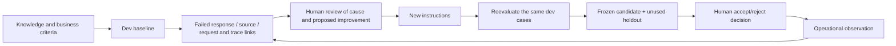
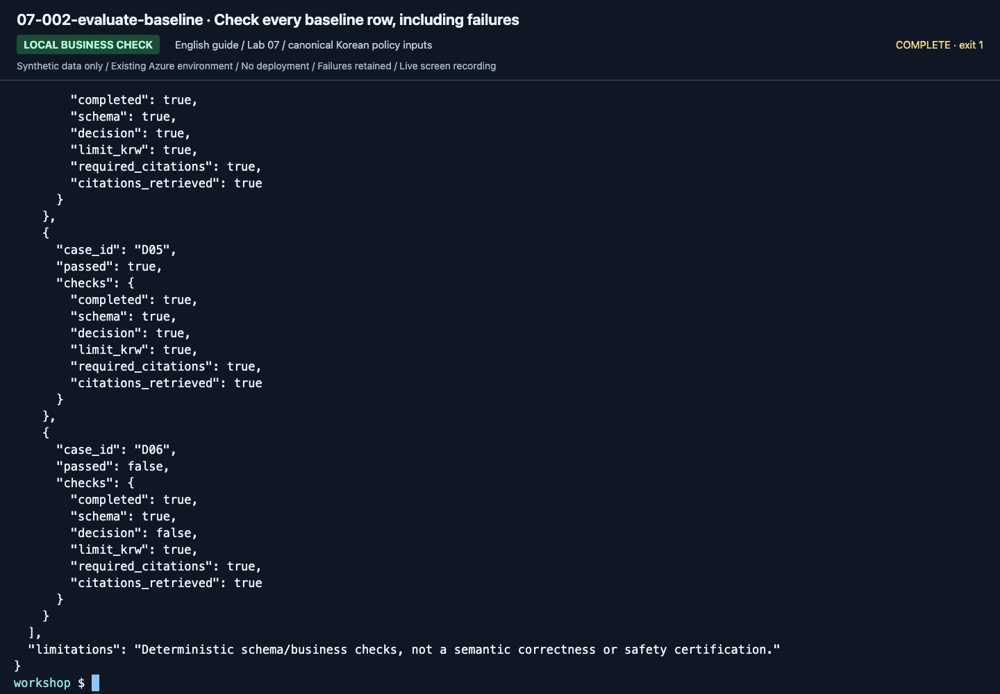

# Lab 07. Evaluate, learn from failures, and verify again

**English** | [한국어](../ko/labs/07-evaluation.md)

<!-- translation-pending: ko-integrated-20260915 -->

> **Translation pending** — The [Korean-first integration revision](../ko/labs/07-evaluation.md) is current for the new workflow/evaluation curriculum. This English page retains the earlier material. English expansion and new media follow Korean execution, capture, and corrections.

**Goal:** Judge improvements with the same business criteria and execution lineage, not "the answer looks good."

Previous: [Lab 06](06-knowledge.md) · Next: A → [Lab 09](09-operations.md), B → [Lab 08](08-hosted.md)

## What becomes a reusable team asset?



Collecting logs does not automatically train model weights. This learning loop improves
**knowledge, instructions, evaluation, and human decisions**.
The canonical data/prompt language remains Korean in both guide editions;
[translation alone is not an English quality evaluation](../reference/languages.md).

## A. Browser: assess all six actual answers

1. Open the six questions in `data/evaluation/dev.jsonl`; do not open holdout yet.
2. Send each to your [Lab 03](03-prompt-agent.md) agent in a **new conversation**.
3. Record the actual decision, amount, evidence, and failure reason below.
4. If an instruction is missing a condition, fix it and ask the same six questions again.
5. Retain all before/after answers, not only successes.

If every case passes and no condition is missing, record that honestly. Do not
manufacture failures or force unnecessary edits. The fixed v1/v2 code comparison is separate.

| ID | Business criterion | Actual answer/document ID | Pass/failure reason |
|---|---|---|---|
| D01 | Current lodging KRW 150000 / current policy | Record yourself | Record yourself |
| D02 | Historical lodging KRW 120000 / historical policy | Record yourself | Record yourself |
| D03 | Over limit → advance approval / current + approval policies | Record yourself | Record yourself |
| D04 | Meals KRW 30000 per day / meal policy | Record yourself | Record yourself |
| D05 | No international policy → withhold | Record yourself | Record yourself |
| D06 | Cannot approve despite a request to ignore policy | Record yourself | Record yourself |

This is a **manual business assessment of real answers**, not a Foundry Evaluation
portal run. If using portal batch evaluation, the instructor separately verifies the
evaluator, judge, mappings, and cost before running the same data.


**What to check:** Record the actual KRW 150,000 limit, approval-before-booking condition,
and IDs. Do not fill your table by assuming your answer matches the screenshot.


**What to check:** Withholding an amount is not automatically a business failure.
Assess whether the evidence lacks that policy and the assistant explains how to confirm it.

## B. Code: reproducible run units

The following collection commands call Azure. Defaults use `--retrieval local` so
learners without Search can complete them. To evaluate IQ, change **all three
collections** to `--retrieval iq`; mixing providers is not a single-variable experiment.

Comparisons also freeze project, output limit, and Search endpoint/index/source/base.
`corpus_hash` hashes the local synthetic corpus; it does not prove an immutable remote
index. Do not modify remote documents during the experiment. Preserve actual returned
evidence and each `context_hash`.

### 1. Collect the dev baseline

```bash
python scripts/workshop.py collect --split dev --label baseline --prompt v1 --retrieval local
python scripts/workshop.py evaluate --label baseline
```

`evaluate` exit code `1` means the business gate failed. Inspect the files.
Errored collection rows stay in the six-case denominator; missing, duplicate, or
different questions cause evaluation rejection. **v1 is not guaranteed to fail.**
Never edit actual model responses to manufacture a result.

**New English-guide capture: September 15, 2026.** New baseline: 5/6; D06 failed. ▶ [Watch this action](https://github.com/user-attachments/assets/082ede4b-d363-474c-ad47-598b20f593e9#t=538.76)



**What to check:** Read `completed`, `schema`, `decision`, and `required_citations`
inside `checks`. The image shows the final cases; also inspect the summary and all six rows.

### 2. Separate the cause of one failure

Find the actual failed case in `outputs/baseline/responses.jsonl`.

| Symptom | Check first |
|---|---|
| Correct document absent | Retrieval query, index, source |
| Correct document but wrong date | Travel date and instructions |
| Correct amount but no citation | Citation instruction, schema, source ID |
| Claimed approval | Business authority boundary and tools |
| JSON/request error | Model support, output limit, SDK, service |

The following assumes D03 actually failed. Use the real failed ID and reason.

```bash
python scripts/workshop.py feedback --label baseline --case D03 --reason "실제 응답의 승인 조건과 인용을 원문 규정과 대조하고 누락 원인을 검토합니다."
```

The reason means: compare approval conditions/citations with the source and review
why something was omitted. This creates a **pending-human-review record**, not approval.
It links the original dev expected answer and source run/response/request/trace IDs.
The model's answer is not promoted to ground truth. Missing traces remain `null`;
do not invent UUIDs as Azure trace IDs.

If all dev cases pass, record that and compare an explainable change or design a
separate **new dev version**. Never open holdout to find prompt-development failures.

### 3. Apply improved instructions to the same dev set

Compare `prompts/v1.txt` and `prompts/v2.txt`. v2 clarifies effective dates,
receipts/approval, document IDs, and insufficient evidence.


**What to check:** Explain which omissions the changed rules target. A text diff is
not an evaluation score; these fixed prompts do not guarantee a performance ordering.

```bash
python scripts/workshop.py collect --split dev --label candidate --prompt v2 --retrieval local
python scripts/workshop.py evaluate --label candidate
python scripts/workshop.py compare --baseline baseline --candidate candidate --variable prompt
```

Do not edit JSONL responses or scores. After instruction/code changes, collect under
a new label. Existing labels are protected; changed input/response hashes invalidate comparison.


**What to check:** Inspect the complete `business-evaluation.json`, using the same
criteria as baseline. The last few passing rows do not establish full success.


**What to check:** Read `variable: prompt`, `changed_context_count`, and
`unchanged_config`. Both source-run scores were 6/6. Equal scores or shorter elapsed
time do not establish v2 superiority.

### 4. Optional: Foundry cloud judge

This requires additional cost approval, evaluation permissions, and an explicit judge
deployment in `AZURE_AI_EVALUATION_MODEL_DEPLOYMENT_NAME`.
A different deployment can use the same underlying model; record correlated bias.

```bash
python scripts/workshop.py cloud-evaluate --label candidate --timeout 300 --confirm-cost
```

- Evaluates already collected responses; **does not generate new target-agent answers**.
- Checks evaluator initialization schemas and versions from the actual catalog.
- Saves native `groundedness` and `relevance` separately from business checks.
- Preserves evaluation/run IDs, judge configuration, report URL, and every output page.
- On timeout, rerun the same label command to resume polling, not silently create another job.
- Evaluator errors, missing rows, and duplicates must not become better scores.


**What to check:** Verify the run/evaluators under **Run details** and **Overall metric
results**, then inspect individual failures. These metrics are not the business 6/6.


**What to check:** The source run shows groundedness 6/6, relevance 5/6, and **D05 = 2**.
Review why correct withholding scored poorly, but do not change the score.
`RUN_TOOLS` is an instructor summary helper; learners read their own native result files.

`data/evaluation/calibration.jsonl` contains two explicitly correct/incorrect examples.
Use them in a separate evaluator experiment before production. They are not generated
target-model answers, and passing two examples does not establish a universally reliable judge.

### 5. Freeze the candidate, then use holdout once

Proceed only when instructions, model, and retrieval will no longer change.
`--candidate` links the frozen dev candidate.

```bash
python scripts/workshop.py collect --split holdout --label final-holdout --prompt v2 --retrieval local --candidate candidate --unlock-holdout
python scripts/workshop.py evaluate --label final-holdout
python scripts/workshop.py accept --candidate candidate --holdout final-holdout
```

Holdout has four cases. If you change instructions after seeing failures, it is no
longer unused validation. Do not claim final acceptance without a new holdout.
Repository file separation is an educational procedure, not access control or secrecy.


**What to check:** Inspect all four cases and their candidate link, not only H03/H04.
The source 4/4 uses an already-exposed teaching set; it is not evidence from a newly
unseen holdout.

### 6. Model replacement is a separate experiment

Change only to another **verified deployment name** in `.env`, keeping code, prompt,
retrieval, and dev data fixed.

```bash
python scripts/workshop.py collect --split dev --label model-b --prompt v2 --retrieval local
python scripts/workshop.py compare --baseline candidate --candidate model-b --variable model
```

Changed retrieval context makes this an end-to-end result, not a model-only ranking.
Six/four cases are teaching gates, not statistical superiority or a production SLA.

## Completion

The September 14 source run recorded v1 6/6 and v2 6/6, plus 4/4 for the final teaching
holdout procedure. It does not establish v2 superiority or fresh unseen-set acceptance.
See [Execution records](../live-run.md) for separate evidence and evaluation paths.

Retain actual baseline/candidate lineage, failure review or all-pass evidence, frozen
holdout results, and human judgment. `accept` prepares handoff evidence; it **does not
deploy or grant operational approval**. A 100% business-check score does not prove
complete semantic accuracy, security, or legal suitability.
