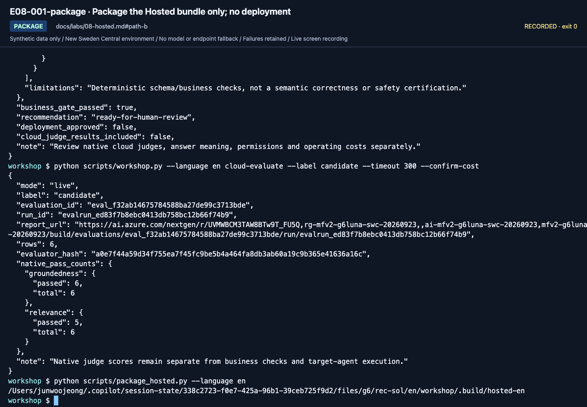
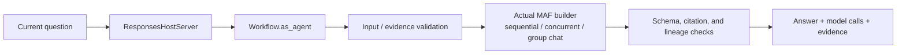

# Lab 08. From local code to a Hosted Agent

**English** | [한국어](../ko/labs/08-hosted.md)

**Goal:** Package the same read-only MAF agent and deploy it only when prerequisites and approvals are in place.

**Open your section:** A: [skip to Lab 09 A](09-operations.md#path-a) · [B — package only](#path-b) · [Paths](../paths.md)

> **Separate service and SDK status.** In this edition's dated compatibility snapshot,
> Hosted Agent is a GA service, while `agent-framework-foundry-hosting` and some azd
> capabilities are prerelease. B requires only local packaging. Serving and deployment
> are optional because of permissions, SDKs and costs, not because the entire service is Preview.

## Before you start

**This pass:** A skips to Lab 09. B packages the single agent and stops; local/remote execution, workflow and Invocations sections are optional.

**Need:** Packaging: repository and Python. Local invocation: Hosted SDK, Lab 04 response, azd and actual project ARM ID. Remote work also requires explicit deployment approval.

**Continue when:** Record package/local/remote as separate outcomes; only a real version-pinned remote response proves deployment.

**If blocked:** Without ARM ID, role or cost approval, stop at packaging. Do not rerun init inside another azd project.

[One-time setup and learner files](../setup.md).

<a id="path-b"></a>

## Entry gates

**Default B: package only, then Lab 09.** You do not need azd, a project ARM ID or the Hosted SDK for that stopping point.
Choose a different stopping point only with its prerequisites already met; local and remote execution are additional outcomes.

| Stopping point | Prerequisites | Follow |
|---|---|---|
| Package only | Repository and Python; no Azure writes or Hosted SDK needed | Section 1, then Lab 09 |
| Package + local response | Lab 04 `maf --tools` success, Python 3.13, Hosted SDK, compatible azd/extension, actual project ARM ID/location, inference cost approval | Sections 1–3 and 5 |
| Remote single agent | Above plus Hosted region/capacity, deployment/runtime-identity permission, session-cost approval | Sections 1–5 |
| Advanced workflow/matrix | Lab 05 C and a separate prepared workspace | Section 6 or the section 7 workbook, not both by default |

Do not run later sections to discover whether you have permission. Without their prerequisites, record them **not run**.
Local Docker/ACR installation is not required for code deployment.

## 1. Build a safe bundle without Azure

```bash
python scripts/package_hosted.py --language en
```

Output: `.build/hosted-en/`.

| Included | Excluded |
|---|---|
| Shared `foundry_workshop` code | `.env`, tokens, personal configuration |
| Synthetic policies and prompts | Dev/holdout expected answers |
| `main.py`, `.agentignore` | Run results and existing `.azure` state |
| Pinned direct dependencies | Local `.venv` and arbitrary files |
| Per-file hash manifest | Claims of cloud execution success |

`.agentignore` also excludes later `.foundry/` evaluation data/results and `eval*.yaml`
so evaluation answers do not enter a redeployment package.
Inspect `package-manifest.json` and `requirements.txt`.
Rebuilding does not delete an existing folder automatically. Preserve or clean up only
that **exact generated directory** first. Compare hashes after source changes.
For package-only completion, retain the manifest and continue to [Lab 09](09-operations.md).




**What to check:** `package_hosted.py` returns `.build/hosted-en`. This is packaging, not
Azure deployment. Check included/excluded files against the manifest.

**B done:** retain `.build/hosted-en/package-manifest.json` with `cloud_deployed: false`;
mark local invocation and remote deployment **not run**, then continue to [Lab 09 B](09-operations.md#path-b).
If the package already exists, inspect its manifest first. For a rebuild, preserve the exact directory under another name; do not delete your source, outputs or azd state.

<details>
<summary>Optional local/remote single-agent execution — expand only with the matching entry gate</summary>

## 2. Connect azd to an existing project

Learners install and sign in themselves. Do not unconditionally upgrade installed tools during class.

```bash
python -m pip install -e ".[hosted]"
azd version
azd ext list
azd auth login
python scripts/prepare_hosted_azd.py --help
```

If the extension is absent, follow the current
[official Hosted quickstart](https://learn.microsoft.com/azure/foundry/agents/quickstarts/quickstart-hosted-agent).
Keep this terminal at the **source repository root**. The helper reads its existing `.env`,
verifies the generated package and creates a separate local azd project; it does not run `azd ai agent init`
in your source copy or ask you to merge YAML by hand.
An existing local `azure.yaml`/`.azure` is preserved, not a reason to overwrite or repeatedly initialize it.

| Input | Exact source |
|---|---|
| `HOSTED_PACKAGE` | The exact directory printed by `package_hosted.py`; `.build/hosted-en` for the default single agent, or section 6's explicit workflow package |
| `HOSTED_DIRECTORY` | A **new empty absolute path**, outside this source repository and any existing azd project; no `~` shorthand |
| `PROJECT_ARM_ID` | Owner's verified project resource ID; for self-study, the project resource's Azure portal **JSON View → id**, not the parent account ID |
| `PROJECT_LOCATION` | That project's actual location **code**, such as `swedencentral`, not a display name with spaces or a recording's assumed region |
| `HOSTED_AGENT_NAME` | New owned name, such as your prefix plus `-hosted` |
| Endpoint/model/prefix/output limit | Read from this copy's `.env`; use the values already verified in Lab 00/02, not new model choices |

Enter actual values once. For a workflow, build its package in section 6 first, then use this same setup with that returned path.
Keep the directory and agent name in `session-notes.txt` for a new terminal.

```bash
printf 'Existing package directory printed by package_hosted.py: '
read -r HOSTED_PACKAGE
printf 'New empty absolute directory for this Hosted project: '
read -r HOSTED_DIRECTORY
printf 'Actual project ARM resource ID: '
read -r PROJECT_ARM_ID
printf 'Actual project location code: '
read -r PROJECT_LOCATION
printf 'New owned Hosted agent name: '
read -r HOSTED_AGENT_NAME
```

```bash
python scripts/prepare_hosted_azd.py --language en --kind runtime \
  --package "$HOSTED_PACKAGE" --directory "$HOSTED_DIRECTORY" \
  --agent-name "$HOSTED_AGENT_NAME" --initialize-env \
  --project-id "$PROJECT_ARM_ID" --location "$PROJECT_LOCATION"
```

The helper copies the **hash-verified package**, writes `azure.yaml`, creates the local azd environment
and reads its values back. It rejects an existing nonempty directory, a parent azd project,
wrong project scope, a changed package or an incompatible profile.
It creates no model, role or Azure deployment and does not change the default Azure CLI subscription.
If preparation fails, stop and preserve the directory/error; after resolving the cause, use a new empty directory rather than bypassing the guard.

**What to check:** open the returned `<HOSTED_DIRECTORY>/azure.yaml`.
It is JSON-formatted YAML with **one existing-project binding and one intended agent service**:
your service key/name, copied `src/<agent-name>`, Python 3.13/`main.py`, Responses protocol,
the same endpoint/deployment/output limit and **remote `WORKSHOP_AUTH_MODE=managed-identity`**.
There must be no model `deployments` list or another team's agent.
Do not edit the copied package after verification; rebuild from source into a fresh package/project if it changes.

**Compatibility review: September 17, 2026.** The [official manifest structure](https://learn.microsoft.com/azure/foundry/agents/how-to/author-azure-yaml)
and installed CLI help were checked. Manifest generation and stubbed azd environment/readback contracts were verified **offline**,
not by a new Azure deployment or recording.
`--kind runtime` accepts only this language's **local-retrieval, v2, project-Responses** policy/workflow packages.
The older `--kind workflow` is the distinct CI Invocations preset; it is not a shortcut for this exercise.

## 3. Local server: two terminals

Keep local `.env` authentication as `cli`, distinct from azd's remote runtime configuration.

**Terminal A — reuse the setup terminal from section 2:**

```bash
source .venv/bin/activate
python scripts/workshop.py --language en serve
```

Leave the server running on its default local port 8088.

**Terminal B:**

Open a second terminal at the **same source repository root**. Shell variables from A are not automatically present in B;
enter the standalone directory recorded in step 2. `--cwd` selects its azd project without moving your shell.
For a workflow package, use section 6's matching server/invocation instead of this default single-agent block.

```bash
printf 'Standalone Hosted directory from step 2: '
read -r HOSTED_DIRECTORY
curl --fail http://127.0.0.1:8088/readiness &&
azd ai agent invoke --cwd "${HOSTED_DIRECTORY:?Use the prepared standalone directory}" --local --port 8088 --new-session --new-conversation --timeout 120 "Explain the domestic lodging limit and evidence for September 2026."
```

The question requests the September 2026 domestic lodging limit and sources.


**What to check:** Leave A running and check HTTP 200 in B. The pinned SDK returns
`{"status":"healthy"}` (rechecked September 15, 2026), not `status: ready`.
HTTP readiness proves server availability, not model inference.


**What to check:** Inspect the limit/evidence and fresh **Session / Conversation**.
This local invocation still calls a billable Azure model; it is not remote-deployment evidence.

Check the real answer and sources beyond HTTP 200. When finished, stop only this
server with `Ctrl+C` in terminal A.

## 4. Remote deployment: separate cost and permission approval

Review any additional resource/identity plan with the instructor.
An existing project does not make every prerequisite complete.
If provisioning is required, run it only after **review and authorization for the
dedicated training scope**.
Return to terminal A after stopping its local server. It retains step 2's `HOSTED_AGENT_NAME` and `HOSTED_DIRECTORY`;
if you opened a new terminal, restore those exact values from your notes first.
Deploy **only that agent service** in the standalone project, not every service in your source repository.

```bash
azd deploy "${HOSTED_AGENT_NAME:?Use the prepared agent service name}" --cwd "${HOSTED_DIRECTORY:?Use the prepared standalone directory}" &&
azd ai agent show --cwd "${HOSTED_DIRECTORY:?Use the prepared standalone directory}" --output json
```

Stop if deployment fails; an older active version is not proof this deployment succeeded.
Record active state, actual version, and endpoint before invocation.
The `${...:?}` guards stop before azd runs if a required value is empty; they must not be removed to bypass an error.


**What to check:** Inspect the completion message and **Agent playground / Agent
endpoint**, then verify the real version and active state from `show`.

```bash
printf 'Actual version returned by show: '
read -r HOSTED_AGENT_VERSION
azd ai agent invoke --cwd "${HOSTED_DIRECTORY:?Use the prepared standalone directory}" --version "${HOSTED_AGENT_VERSION:?Use the version returned by show}" --new-session --new-conversation --timeout 270 "What are the advance-approval requirements for a KRW 170000 hotel on a domestic business trip in September 2026?"
```

The question asks for advance approval for the over-limit September 2026 hotel.


**What to check:** Retain **Session**, **Conversation**, and **Trace ID** with the answer.
Use that Trace ID in the next lab. One successful request is not full-dev quality evaluation.

Responses **sessions and conversations are separate**. `--new-session` alone may
reuse a conversation. Use both flags for independent checks; deliberately reuse a
conversation only when testing continuity.
Local users and remote agent identities differ. Repeated local `az login` cannot fix
a remote identity's 403; its actual model/tool permissions need review.

## 5. Record the limits of the evidence

This Hosted example uses the shared MAF function tool. It is **not the same path**
as Lab 07's project Responses with precomputed retrieval. Do not reuse that score for
a Hosted version; collect a separately version-pinned dev/holdout evaluation.


Verify evaluation type, exact agent/version, evaluator, and the complete case denominator.
The September 23 `gpt-6-sol` recording covers packaging only; the local server, remote deployment and the workflow
extension below were not re-run. See [execution records](../live-run.md); do not transfer scores between these targets.

</details>

## 6. Deploy a MAF workflow as a Hosted Agent

<details>
<summary>Advanced C: a separate workflow target; first-pass B continues to Lab 09</summary>

Default serve/package commands retain the earlier single-function-agent path.
Explicit workflow profiles freeze kind, pattern, retrieval, prompt, API, protocol, and language.
Do not reuse single-agent scores as evidence for the workflow target.

```bash
python scripts/workshop.py --language en workflow-agent --pattern sequential --retrieval local --prompt v2
python scripts/package_hosted.py --language en --kind workflow --pattern sequential
```

The package is `.build/workflow-sequential-local-v2-project-responses-responses-en/`.
Concurrent/group-chat use separate profile directories.
Packages are not overwritten; reference answers, holdout, and evaluator files are excluded.
This walkthrough uses **sequential**. For another pattern, change it explicitly in both packaging and `serve`;
the local server must match the selected package, not merely respond on the same port.

Complete **section 2's shared setup** with this exact returned package, a new owned agent name and a new empty directory.
Do not initialize another service in the source copy. Then use the following matching workflow command
**instead of section 3's default single-agent server**.

Terminal A, at the source repository root with `.venv` active:

```bash
python scripts/workshop.py --language en serve --kind workflow --pattern sequential
```

Terminal B, at the source repository root:

```bash
printf 'Standalone workflow directory prepared in step 2: '
read -r HOSTED_DIRECTORY
curl --fail http://127.0.0.1:8088/readiness &&
azd ai agent invoke --cwd "${HOSTED_DIRECTORY:?Use the prepared standalone directory}" --local --port 8088 --new-session --new-conversation --timeout 270 "Explain the limit and advance-approval requirements for a KRW 170000 domestic business-trip hotel in September 2026."
```

Inspect workflow kind, participants, actual model calls, final answer/evidence, and pending review status.
The outer workflow UUID can differ from the actual model response ID inside JSON.
For approved remote work, run **section 4 once** using this workflow's directory/name and actual returned version.
There is no second workflow deployment command to repeat here.



Fresh internal participants isolate requests.
Durable approval, crash recovery, and external business actions are not enabled automatically.

</details>

## 7. Typed Invocations versus Responses

<details>
<summary>Advanced C: open only when selecting the Hosted evaluation workbook</summary>

Use Responses for conversation and a separate Invocations profile for strict model/case/run matrices.

**Do not package here and repeat the same package command in the workbook.**
Start at [the workbook's preparation](../reference/evaluation-workbook.md#matrix-setup).
Its explicit profile is `workflow / sequential / iq / v1 → v2 / account-chat / invocations`.

Only question, model key, case ID, and run ID are accepted.
No reference answers, evaluator configuration, corpus paths, or arbitrary model/endpoint overrides enter the request.
Actual deployment/service IDs, usage, and evidence hashes remain in the response.
Follow the [evaluation workbook](../reference/evaluation-workbook.md); do not transfer scores between target paths.
The workbook uses the separate `--kind matrix` preparation path.
The introductory `--kind runtime` and single-model CI `--kind workflow` contracts are unchanged.

</details>

[Full action index](../action-captures.md) · [Recordings](../video-summary.md)

## Completion and cleanup

Record packaging, local response, remote deployment, and remote evaluation separately.
Sessions may be reused and accumulate compute cost. Use the explicitly scoped
[Hosted cleanup steps](../reference/cleanup.md#hosted-sessions) for your own sessions.
Do not apply `azd down` indiscriminately to every environment.

Next: A: [skip to Lab 09](09-operations.md#path-a) · B → [Lab 09](09-operations.md#path-b)
