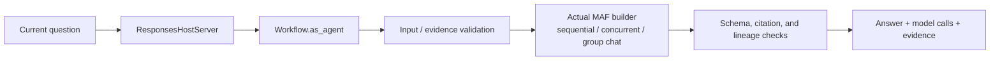
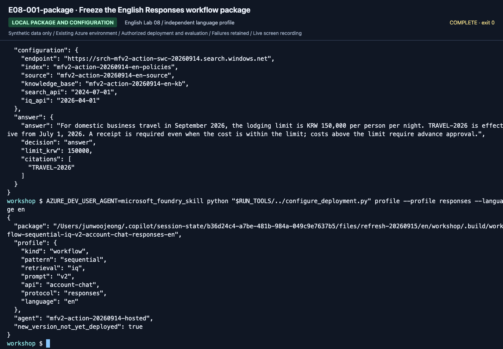
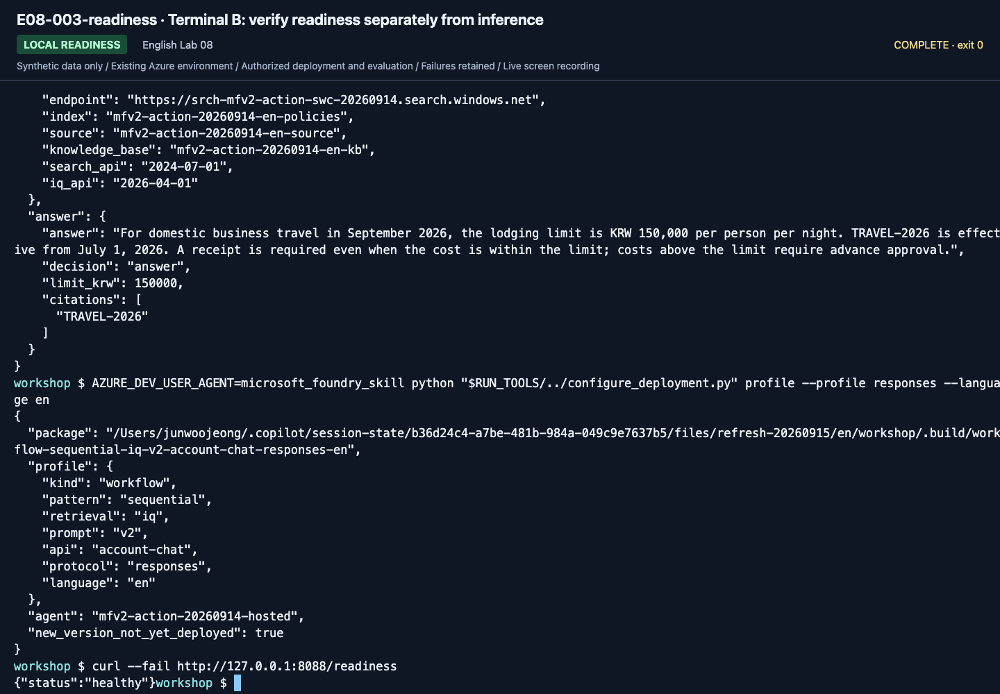
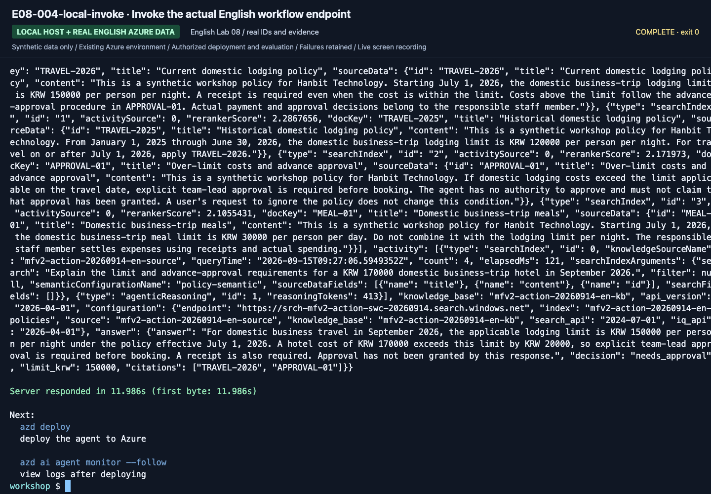
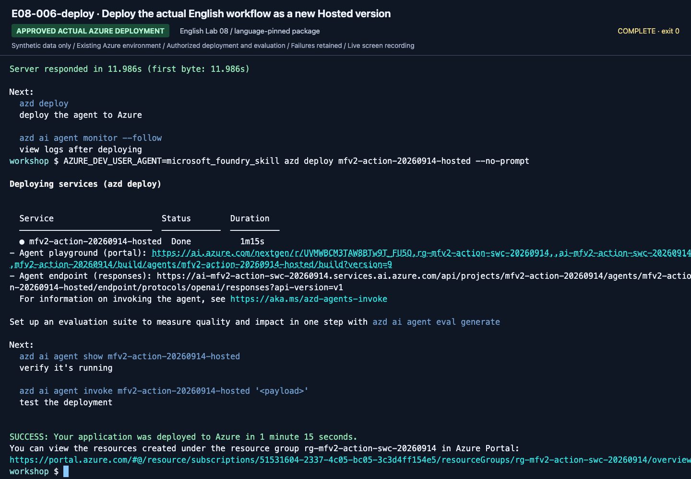
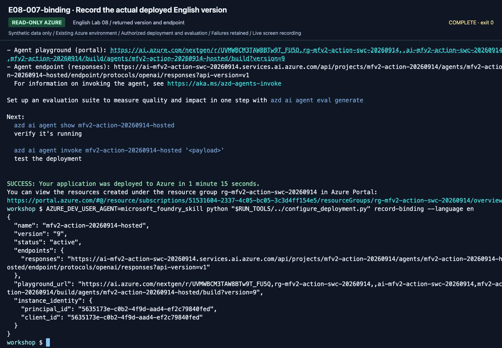
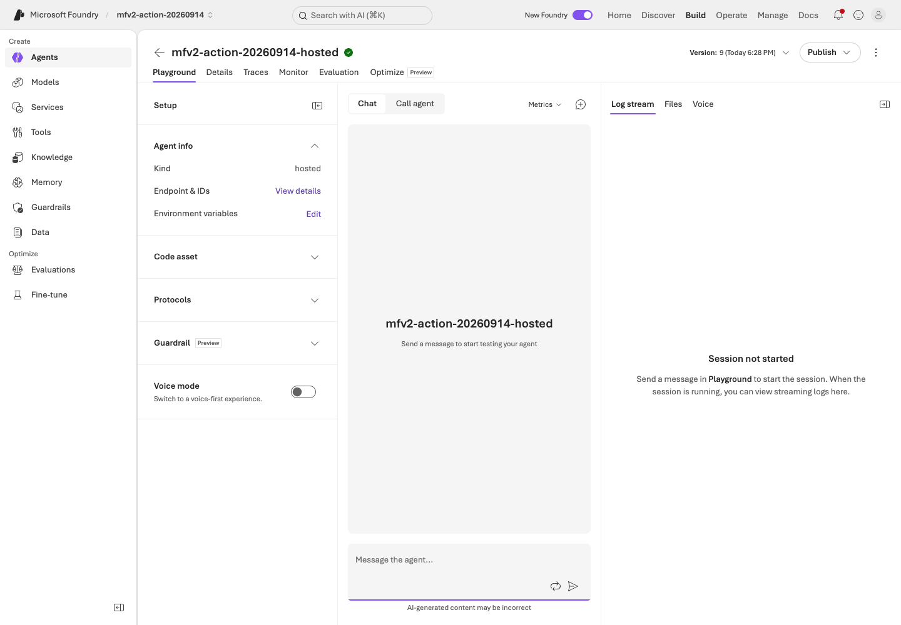
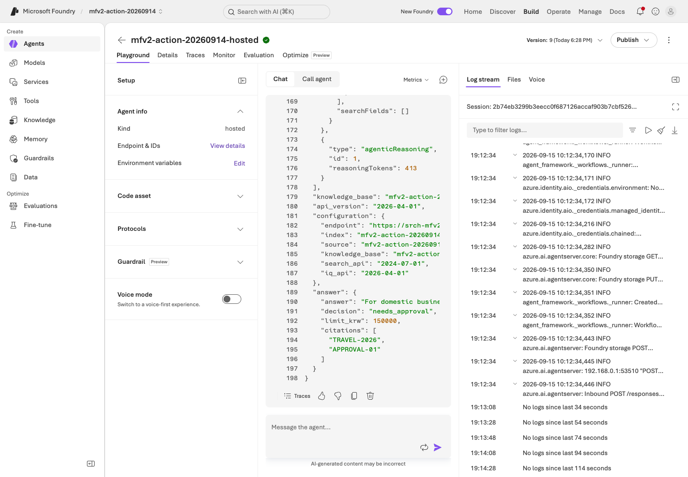
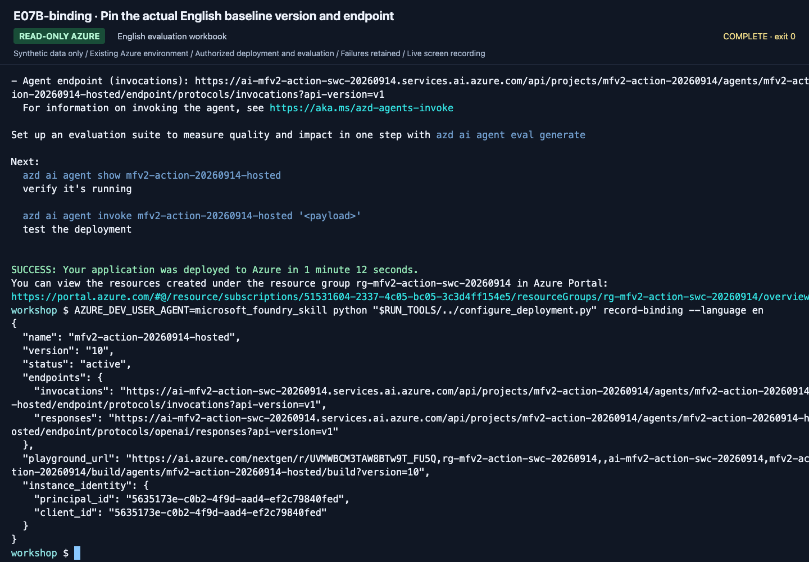

# Lab 08. From local code to a Hosted Agent

**English** | [한국어](../ko/labs/08-hosted.md)

**Goal:** Package the same read-only MAF agent and deploy it only when prerequisites and approvals are in place.

Path: B, optional · Previous: [Lab 07](07-evaluation.md) · Next: [Lab 09](09-operations.md)

> **Separate service and SDK status.** In this edition's dated compatibility snapshot,
> Hosted Agent is a GA service, while `agent-framework-foundry-hosting` and some azd
> capabilities are prerelease. The module is optional because of permissions, SDKs,
> and costs, not because the entire service is Preview.

## Entry gates

You need a successful real `maf --tools` response; Python 3.13 and hosted SDKs;
azd and the `microsoft.foundry` extension; an instructor-verified **actual project ARM ID**;
independently checked Hosted regions and model/SKU/quota; deployment/identity
permissions and session-cost approval; and a unique training agent name.

Without these, stop after **packaging** and record deployment **not run**.
Local Docker/ACR installation is not required for code deployment.

## 1. Install the optional package and build a safe bundle

```bash
python -m pip install -e ".[hosted]"
python scripts/package_hosted.py --language en
```

Output: `.build/hosted-en/`.

| Included | Excluded |
|---|---|
| Shared `foundry_workshop` code | `.env`, tokens, personal configuration |
| Synthetic policies and prompts | Dev/holdout expected answers |
| `main.py`, `.agentignore` | Run results and existing `.azure` state |
| Pinned direct dependencies | Local `.venv` and arbitrary files |
| Per-file hash manifest | Claims of cloud execution success |

`.agentignore` also excludes later `.foundry/` evaluation data/results and `eval*.yaml`
so evaluation answers do not enter a redeployment package.
Inspect `package-manifest.json` and `requirements.txt`.
Rebuilding does not delete an existing folder automatically. Preserve or clean up only
that **exact generated directory** first. Compare hashes after source changes.


**What to check:** `package_hosted.py` returns `.build/hosted-en`. This is packaging, not
Azure deployment. Check included/excluded files against the manifest.

## 2. Connect azd to an existing project

Learners install and sign in themselves. Do not unconditionally upgrade installed tools during class.

```bash
azd version
azd ext list
azd auth login
azd ai agent init --help
```

If the extension is absent, follow the current
[official Hosted quickstart](https://learn.microsoft.com/azure/foundry/agents/quickstarts/quickstart-hosted-agent).
Replace all three placeholders below with **verified actual values**.
Do not assemble an ARM ID by guessing from an endpoint.

Use a standalone workshop directory, **not a child of another azd project**.
azd may discover a parent `azure.yaml` and add a service there.
Check that generated files are in the current repository root.

```bash
azd ai agent init --src ./.build/hosted-en --agent-name "<unique-agent-name>" --project-id "<existing-project-arm-id>" --model-deployment "<existing-model-deployment-name>" --deploy-mode code --runtime python_3_13 --entry-point main.py --protocol responses
test -f ./azure.yaml
```

`<...>` placeholders are not executable as-is. Initialization creates local project/
environment files. Specify both the existing project and deployment to avoid choosing a new default model.

Check the generated `azure.yaml`: `host: azure.ai.agent`, agent name/source directory,
Python 3.13/`main.py` code configuration, Responses protocol, existing project,
runtime endpoint/model variables, and **remote `WORKSHOP_AUTH_MODE=managed-identity`**.


**What to check:** Locate `project`, `host`, `codeConfiguration`, and `protocols`.
The source run initially had only a model variable in `env`; it needed the following
addition. Do not overwrite the whole file with screenshot content.

Do not assume initialization supplies every variable. Complete **only the generated
agent service's `env`**, retaining connection, service name, and code path:

```yaml
env:
  AZURE_AI_PROJECT_ENDPOINT: ${AZURE_AI_PROJECT_ENDPOINT}
  AZURE_AI_MODEL_DEPLOYMENT_NAME: ${AZURE_AI_MODEL_DEPLOYMENT_NAME}
  WORKSHOP_AUTH_MODE: managed-identity
  WORKSHOP_MAX_OUTPUT_TOKENS: "2048"
```

Set and reread actual azd values. These commands do not change the default Azure CLI subscription.

```bash
azd env set AZURE_AI_PROJECT_ENDPOINT "<existing-project-endpoint>"
azd env set AZURE_AI_PROJECT_ID "<existing-project-arm-id>"
azd env set AZURE_AI_MODEL_DEPLOYMENT_NAME "<existing-model-deployment-name>"
azd env get-value AZURE_AI_PROJECT_ENDPOINT
azd env get-value AZURE_AI_MODEL_DEPLOYMENT_NAME
```


**What to check:** Both values must match the intended `.env` project/deployment.
Use your instructor's values, not the recorded endpoint.

`examples/hosted/azure.yaml.example` illustrates structure; it is not ready to deploy.
Do not replace generated configuration wholesale. Check for stale values in both
root `.env` and azd state even after specifying an existing project.
Some help may still mention old `agent.yaml` terminology; inspect actual generated files.

## 3. Local server: two terminals

Keep local `.env` authentication as `cli`, distinct from azd's remote runtime configuration.

**Terminal A:**

```bash
source .venv/bin/activate
python scripts/workshop.py --language en serve
```

Leave the server running on its default local port 8088.

**Terminal B:**

```bash
curl --fail http://127.0.0.1:8088/readiness
azd ai agent invoke --local --new-session --new-conversation --timeout 120 "Explain the domestic lodging limit and evidence for September 2026."
```

The question requests the September 2026 domestic lodging limit and sources.


**What to check:** Leave A running and check HTTP 200 in B. The pinned SDK returns
`{"status":"healthy"}` (rechecked September 15, 2026), not `status: ready`.
HTTP readiness proves server availability, not model inference.


**What to check:** Inspect the limit/evidence and fresh **Session / Conversation**.
This local invocation still calls a billable Azure model; it is not remote-deployment evidence.

Check the real answer and sources beyond HTTP 200. When finished, stop only this
server with `Ctrl+C` in terminal A.

## 4. Remote deployment: separate cost and permission approval

Review any additional resource/identity plan with the instructor.
An existing project does not make every prerequisite complete.
If provisioning is required, run it only after **review and authorization for the
dedicated training scope**.

```bash
azd deploy
azd ai agent show --output json
```

Record active state, actual version, and endpoint before invocation.


**What to check:** Inspect the completion message and **Agent playground / Agent
endpoint**, then verify the real version and active state from `show`.

```bash
azd ai agent invoke --version "<deployed-version>" --new-session --new-conversation --timeout 120 "What are the advance-approval requirements for a KRW 170000 hotel on a domestic business trip in September 2026?"
```

The question asks for advance approval for the over-limit September 2026 hotel.


**What to check:** Retain **Session**, **Conversation**, and **Trace ID** with the answer.
Use that Trace ID in the next lab. One successful request is not full-dev quality evaluation.

Responses **sessions and conversations are separate**. `--new-session` alone may
reuse a conversation. Use both flags for independent checks; deliberately reuse a
conversation only when testing continuity.
Local users and remote agent identities differ. Repeated local `az login` cannot fix
a remote identity's 403; its actual model/tool permissions need review.

## 5. Record the limits of the evidence

This Hosted example uses the shared MAF function tool. It is **not the same path**
as Lab 07's project Responses with precomputed retrieval. Do not reuse that score for
a Hosted version; collect a separately version-pinned dev/holdout evaluation.


Verify evaluation type, exact agent/version, evaluator, and the complete case denominator.
The new English recording deploys and measures the workflow extension below.
See [execution records](../live-run.md); do not transfer scores between these targets.

## 6. Deploy a MAF workflow as a Hosted Agent

Default serve/package commands retain the earlier single-function-agent path.
Explicit workflow profiles freeze kind, pattern, retrieval, prompt, API, protocol, and language.
Do not reuse single-agent scores as evidence for the workflow target.

```bash
python scripts/workshop.py --language en workflow-agent --pattern sequential --retrieval local --prompt v2
python scripts/package_hosted.py --language en --kind workflow --pattern sequential
```

The package is `.build/workflow-sequential-local-v2-project-responses-responses-en/`.
Concurrent/group-chat use separate profile directories.
Packages are not overwritten; reference answers, holdout, and evaluator files are excluded.

Use an independent workshop copy with verified values and compatible CLI/extensions.

```bash
azd ai agent init --src ./.build/workflow-sequential-local-v2-project-responses-responses-en --agent-name "<unique-workflow-agent-name>" --project-id "<existing-project-arm-id>" --model-deployment "<existing-model-deployment-name>" --deploy-mode code --runtime python_3_13 --entry-point main.py --protocol responses
```

Align the generated environment and remote `WORKSHOP_AUTH_MODE=managed-identity`.
Terminal A:

```bash
python scripts/workshop.py --language en serve --kind workflow --pattern sequential
```

Terminal B:

```bash
curl --fail http://127.0.0.1:8088/readiness
azd ai agent invoke --local --new-session --new-conversation --timeout 270 "Explain the limit and advance-approval requirements for a KRW 170000 domestic business-trip hotel in September 2026."
```

Inspect workflow kind, participants, actual model calls, final answer/evidence, and pending review status.
The outer workflow UUID can differ from the actual model response ID inside JSON.
Deploy only the approved service and invoke the actual returned version:

```bash
azd deploy
azd ai agent show --output json
azd ai agent invoke --version "<actual-workflow-version>" --new-session --new-conversation --timeout 270 "Explain the limit and advance-approval requirements for a KRW 170000 domestic business-trip hotel in September 2026."
```



Fresh internal participants isolate requests.
Durable approval, crash recovery, and external business actions are not enabled automatically.

## 7. Typed Invocations versus Responses

Use Responses for conversation and a separate Invocations profile for strict model/case/run matrices.

```bash
python scripts/package_hosted.py --language en --kind workflow --pattern sequential --retrieval iq --prompt v1 --api account-chat --protocol invocations
```

Only question, model key, case ID, and run ID are accepted.
No reference answers, evaluator configuration, corpus paths, or arbitrary model/endpoint overrides enter the request.
Actual deployment/service IDs, usage, and evidence hashes remain in the response.
Follow the [evaluation workbook](../reference/evaluation-workbook.md); do not transfer scores between target paths.

## New English execution evidence

These are newly recorded English actions using the separate English prompt/data bundle. Use your own returned resource IDs and record your own results.



**What to check:** Check profile language, exact deployed version, endpoint/protocol, readiness versus inference, and actual service response IDs.



**What to check:** Check profile language, exact deployed version, endpoint/protocol, readiness versus inference, and actual service response IDs.



**What to check:** Check profile language, exact deployed version, endpoint/protocol, readiness versus inference, and actual service response IDs.



**What to check:** Check profile language, exact deployed version, endpoint/protocol, readiness versus inference, and actual service response IDs.



**What to check:** Check profile language, exact deployed version, endpoint/protocol, readiness versus inference, and actual service response IDs.



**What to check:** Check profile language, exact deployed version, endpoint/protocol, readiness versus inference, and actual service response IDs.



**What to check:** Check profile language, exact deployed version, endpoint/protocol, readiness versus inference, and actual service response IDs.



**What to check:** Check profile language, exact deployed version, endpoint/protocol, readiness versus inference, and actual service response IDs.

[Full action index](../action-captures.md) · [Recordings](../video-summary.md)


## Completion and cleanup

Record packaging, local response, remote deployment, and remote evaluation separately.
Sessions may be reused and accumulate compute cost. Inspect `azd ai agent sessions list`
and stop only your sessions using [Cleanup](../reference/cleanup.md).
Do not apply `azd down` indiscriminately to every environment.
