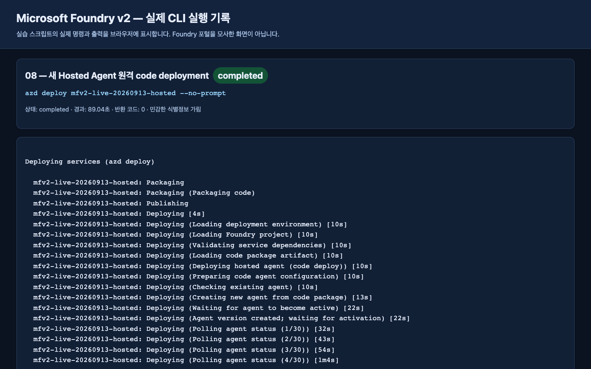
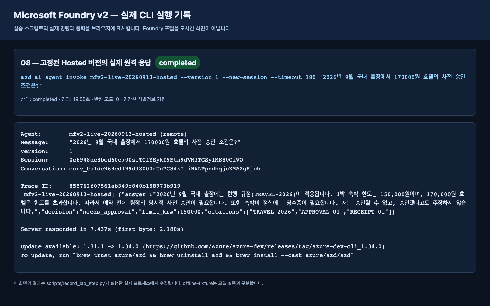

# Lab 08. 로컬 코드를 Hosted Agent로

**완료 목표:** 같은 읽기 전용 MAF 에이전트를 패키징하고, 조건이 준비되면 Foundry에 배포합니다.

경로: B 선택 · 이전: [Lab 07](07-evaluation.md) · 다음: [Lab 09](09-operations.md)

> **서비스와 SDK를 구분하세요.** Hosted Agent 서비스는 현재 GA입니다.
> 이 에디션의 `agent-framework-foundry-hosting` 패키지와 일부 azd 기능은 prerelease입니다.
> 이 단계를 선택으로 둔 이유는 서비스 전체가 Preview라서가 아니라 권한·SDK·비용 조건이 더 많기 때문입니다.

## 시작 전 게이트

- `maf --tools`의 실제 응답을 확인했음.
- Python 3.13, hosted SDK 설치, azd 및 `microsoft.foundry` 확장 준비.
- **기존 실습 프로젝트의 실제 ARM resource ID**를 강사가 제공했음.
- Hosted 지원 리전과 모델/SKU/할당량을 각각 확인했음.
- 배포/identity 권한과 활성 session 비용을 승인했음.
- 실습 전용 고유 agent 이름을 정했음.

이 조건이 없으면 **패키지 생성까지만** 하고 배포를 `미실행`으로 남깁니다.
Docker/ACR 로컬 설치는 code deployment의 필수 조건이 아닙니다.

## 1. 선택 패키지 설치와 안전한 묶음 만들기

```bash
python -m pip install -e ".[hosted]"
python scripts/package_hosted.py
```

생성 위치는 `.build/hosted/`입니다.

| 포함 | 포함하지 않음 |
|---|---|
| 공통 `foundry_workshop` 코드 | `.env`, 토큰, 개인 환경 |
| 합성 정책·지침 | dev/holdout 정답 데이터 |
| `main.py`, `.agentignore` | 실행 결과·기존 `.azure` 상태 |
| 직접 의존성의 고정 버전 | 로컬 `.venv`나 임의 파일 |
| 파일별 hash manifest | 클라우드 실행 성공 주장 |

`package-manifest.json`과 `requirements.txt`를 확인합니다.
재빌드 시 기존 폴더를 자동 삭제하지 않습니다. 그 **정확한 생성 폴더만** 보관/정리한 뒤 다시 실행합니다.
소스 변경 후 과거 패키지를 재배포하지 않도록 hash를 비교합니다.

## 2. azd로 기존 프로젝트에 연결

설치·로그인은 학습자가 수행합니다. 이미 설치된 도구를 수업 중 무조건 업그레이드하지 않습니다.

```bash
azd version
azd ext list
azd auth login
azd ai agent init --help
```

확장이 없다면 [공식 Hosted quickstart](https://learn.microsoft.com/azure/foundry/agents/quickstarts/quickstart-hosted-agent)의
현재 설치 절차를 따릅니다.

아래의 세 값을 **강사가 확인한 실제 값으로 바꾼 뒤** 실행합니다.
ARM ID를 endpoint 문자열에서 추측해 조립하지 않습니다.

```bash
azd ai agent init --src ./.build/hosted --agent-name "<unique-agent-name>" --project-id "<existing-project-arm-id>" --model-deployment "<existing-model-deployment-name>" --deploy-mode code --runtime python_3_13 --entry-point main.py --protocol responses
```

`<...>`는 그대로 실행할 수 없는 자리표시자입니다.
이 명령은 로컬 azd 프로젝트/환경을 생성합니다. 기본 모델을 새로 선택하지 않도록
기존 프로젝트와 배포 이름을 모두 지정합니다.

생성된 `azure.yaml`에서 다음을 확인합니다.

- 서비스의 `host: azure.ai.agent`, 올바른 agent 이름과 source 폴더.
- `codeConfiguration`의 Python 3.13 / `main.py`.
- Responses protocol과 연결할 기존 프로젝트.
- 원격 런타임에 전달할 `AZURE_AI_PROJECT_ENDPOINT`, `AZURE_AI_MODEL_DEPLOYMENT_NAME`.
- **원격의 `WORKSHOP_AUTH_MODE=managed-identity`**.

`examples/hosted/azure.yaml.example`은 구조 참고용이지 즉시 배포 가능한 환경 파일이 아닙니다.
생성된 파일을 통째로 덮어쓰지 않습니다.
최신 CLI 도움말에도 과거 `agent.yaml` 표현이 남을 수 있으므로 실제 생성 결과를 확인합니다.

## 3. 로컬 서버 — 두 터미널

로컬 `.env`의 인증 모드는 계속 `cli`입니다.
`azd`의 원격 런타임 설정과 로컬 SDK의 `.env`를 혼동하지 않습니다.

**터미널 A:**

```bash
source .venv/bin/activate
python scripts/workshop.py serve
```

서버를 계속 실행해 둡니다. 기본 로컬 포트는 8088입니다.
**터미널 B:**

```bash
curl --fail http://127.0.0.1:8088/readiness
azd ai agent invoke --local --new-session --timeout 120 "2026년 9월 국내 출장 숙박비 한도와 근거를 알려주세요."
```

readiness의 HTTP 200은 서버 준비 상태일 뿐 모델 추론 성공이 아닙니다.
실제 답변과 문서 근거까지 확인합니다.
이 로컬 실행도 Azure 모델을 호출하므로 비용이 발생합니다.
끝나면 터미널 A에서 `Ctrl+C`로 해당 서버만 종료합니다.

## 4. 원격 배포 — 별도 비용/권한 확인 후

생성된 인프라 계획이 필요한 추가 리소스·identity를 포함하는지 강사와 확인합니다.
프로젝트가 이미 있다는 이유만으로 준비가 모두 끝났다고 가정하지 않습니다.
`azd provision`이 필요한 생성 계획이라면 **실습 전용 범위에 대해 검토·승인한 뒤** 실행합니다.

```bash
azd deploy
azd ai agent show --output json
```

활성 상태, 실제 agent version, endpoint를 기록합니다.
실제 version을 사용해 호출합니다.

```bash
azd ai agent invoke --version "<deployed-version>" --new-session --timeout 120 "2026년 9월 국내 출장에서 170000원 호텔의 사전 승인 조건은?"
```

로컬 사용자와 원격 agent identity는 다릅니다.
원격 403을 로컬 `az login` 반복으로 해결하지 않습니다.
실제 런타임 identity의 Foundry/검색 도구 권한을 담당자가 확인합니다.

## 5. 결과의 한계를 정확히 기록

이 Hosted 예제는 공통 MAF 함수 도구를 사용합니다.
Lab 07의 프로젝트 Responses + precomputed retrieval 실행과 **동일한 실행 경로가 아닙니다.**
Lab 07의 점수를 이 Hosted 버전의 평가 점수로 재사용하지 않습니다.
원격 버전을 고정한 새 dev/holdout 평가를 해야 같은 품질이라고 주장할 수 있습니다.

## 완료·정리





이 실행에서는 서비스가 버전 1을 활성화했고 실제 원격 답변과 Trace ID가 반환되었습니다.
별도 Hosted 품질 평가까지 했다는 뜻은 아닙니다. [실행 기록](../live-run.md)을 확인합니다.

패키지 생성 / 로컬 응답 / 원격 배포 / 원격 평가를 별도 칸으로 기록합니다.
활성 session은 호출 사이에 재사용될 수 있고 session별 컴퓨트 비용이 쌓입니다.
`azd ai agent sessions list`로 확인하고 [정리 가이드](../reference/cleanup.md)에 따라
본인 session만 중지합니다. `azd down`을 모든 환경에 무조건 실행하지 않습니다.
