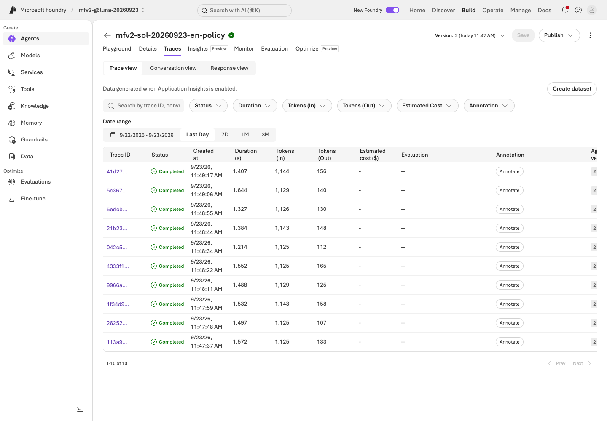
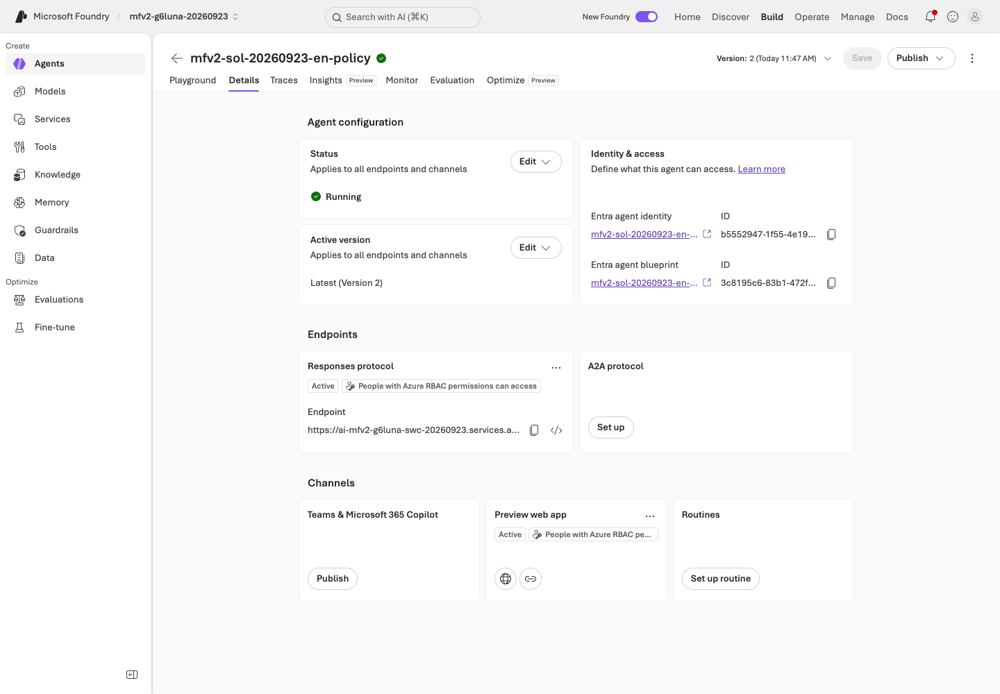
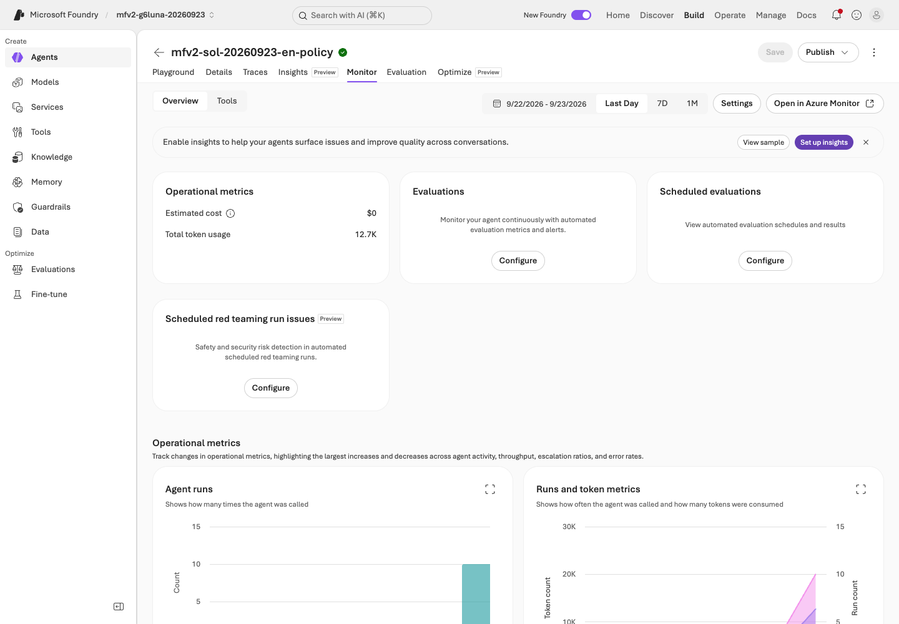
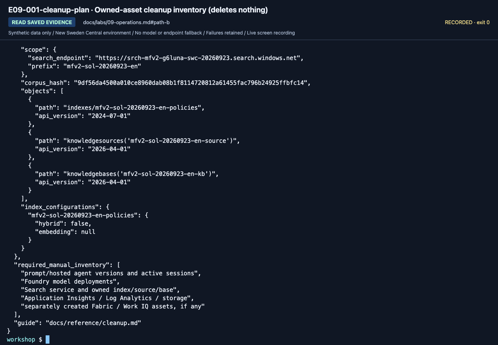

# Lab 09. Traces, operational gates, costs, and cleanup

**English** | [한국어](../ko/labs/09-operations.md)

**Goal:** Preserve evidence for the next decision instead of mistaking one successful demo for a production-ready system.

**Open your section:** [A — four existing-result checks](#path-a) · [B — lineage and cleanup](#path-b) · [Paths](../paths.md)

## Before you start

**This pass:** A completes the four browser checks and cleanup inventory. B correlates its own records; matrix commands require the advanced workbook.

**Need:** A: your agent, its version and your evidence files. B: your output labels. Trace access is optional.

**Continue when:** You can identify the used version, evidence, costs and owned cleanup targets without deleting shared resources.

**If blocked:** Missing telemetry is unverified, not zero errors. Do not replay model calls just to obtain a screenshot.

[One-time setup and learner files](../setup.md).

<a id="path-a"></a>

## A. Browser: what needs management?

Complete these four checks using **your own existing results**, without sending another model request:

1. In the left menu, select **Agents** and open your Lab 03 agent. On its **Details** tab, compare the name, version and model
   with the version you assessed in Lab 07.
2. On its **Playground** tab, check **Instructions**, **Tools** and **Knowledge**: the six synthetic sources (or your selected
   File Search/IQ connection) are there, with no unapproved Web search or company connection.
3. Open your six-row assessment and `workflow-review.txt`, and note where they are. Your assessment is a manual review; the optional Lab 07 Foundry evaluation is a separate run.
   If you can open the **Traces** tab, find one of your saved requests; otherwise write **trace unverified** (not “no errors”).
4. Use [the cleanup checklist](../reference/cleanup.md) to inventory your agent, optional files/chat base, any evaluation dataset or evaluation you created, and any sessions.
   Mark shared services as **owner-managed**, confirm residual costs with the owner, and record who will stop/delete each authorized asset.

Fill the learner ZIP's blank `operations-checklist.txt` with those four outcomes.

**What to check:** items 1–4 of `operations-checklist.txt` name your agent and version, where your results are,
the assets you own, the shared services marked **owner-managed**, and who pays for what remains.
**A done:** continue to [Lab 11 A](11-capstone.md#path-a); no new model, trace or matrix command is required.
The following table is an optional deeper review, limited to assets visible with your permissions.

| Area | Question to answer |
|---|---|
| Agents, versions, assets | Which version are users actually calling? |
| Deployments and quota | Can you distinguish model, deployment, and capacity limits? |
| Tools and knowledge connections | Which data/external systems can be accessed? |
| Evaluation | Which dataset and evaluator produced the result? |
| Trace/Monitor | Can you find the failed request's execution path? |
| Costs and usage | Are Search, sessions, and logs charged in addition to models? |
| Security/governance | Who can invoke, change, deploy, and approve? |

This integrates the original Control Plane perspective. Missing Fleet/management
menus can be normal for your role. Gaining subscription-wide permissions is not the objective.

<details>
<summary>Optional, owner-prepared: evaluate the answers your agent already gave, from its traces</summary>

This scores your recorded Lab 03 and Lab 07 conversations without new agent calls; the judge calls still cost.

1. Open your agent's **Evaluation** tab and select **Create**. Keep **Agent**, **Individual turns** and **One time**.
2. In **Data**, select **Existing traces**. Your conversations appear with their trace and response IDs; allow 3–5 minutes after your last question.
3. If a **Setup incomplete** banner asks you to give the project's managed identity the **Monitoring Reader** role on
   Application Insights, stop and ask the owner. Do not select **Resolve**: it changes a role assignment.
4. Otherwise select **Next** and set **Criteria** as in Lab 07 A step 4: judge model `gpt-6-sol-judge`; **Remove all** under Safety and Agents;
   keep Relevance and Coherence; add TaskAdherence (Preview) if it is listed; then **Next** and **Submit**.

On September 23, 2026 the training project showed this banner, so the trace-based evaluation was **not run** for this edition.
**Recurring** in the **Frequency** step, or **Make recurring** on a trace or agent evaluation, turns it into continuous evaluation;
dataset-based runs cannot be made recurring. Recurring runs need their own cost approval and an owner who turns them off.

</details>

<a id="path-b"></a>

## B. Code: link execution lineage and actual telemetry

### 1. Find local lineage first

In `outputs/<label>/manifest.json` and `responses.jsonl`, locate run/question IDs
(`run_id`, `case_id`), prompt/data/code/evidence hashes, `response_id`, `request_id`,
actual response model, retrieval provider/document IDs/IQ activity, success/errors,
token usage, and latency.

Write the run labels and the IDs you used in item 3 of `outputs/learner-notes-en/operations-checklist.txt`.

**What to check:** every successful response row has a `response_id`; error rows keep their error fields and still count.
`trace_id` stays `null` and `trace_export` is `not-configured` unless tracing was set up for you;
response IDs do not become Azure Monitor traces by themselves.

### 2. Explain one failure or an all-pass result

Use an existing dev response. Distinguish a model/request error, tool error, missing evidence and wrong policy application.
Write one line per service in item 3 of `operations-checklist.txt`, for example:
`Model: my Azure CLI user, response resp_…` · `Search: my Azure CLI user, prefix mfv2-…` · `Hosted: not run`.
If all cases passed, retain that finding and the remaining limitations; do not invent a failure.
Review changes only on dev in [Lab 07](07-evaluation.md#path-b), not the exposed holdout.

### 3. Print the cleanup inventory

```bash
python scripts/workshop.py --language en cleanup-plan
```

This **prints a list and procedure; it deletes nothing**. Add the inventory to item 4 of your
`operations-checklist.txt`, separating owned objects, shared services, authorized owner actions and residual costs.

**What to check:** the output shows `deletes_resources: false` and lists the Search objects under your prefix;
the other entries are a manual checklist for agents, deployments, Search and logs.
Use [Cleanup](../reference/cleanup.md) for any separately approved action.

**B done:** your own lineage, failure/all-pass review and cleanup inventory are saved.
Continue to [Lab 11 B](11-capstone.md#path-b). Without configured tracing, record **trace unverified**; do not create a Hosted deployment or make a new request to finish this core step.

### Optional: prepare server-side tracing

<details>
<summary>Actual telemetry needs a prepared agent, trace access and separate call/cost approval</summary>

The instructor verifies the project/Application Insights connection, retention, costs,
and permissions. Follow [official tracing setup](https://learn.microsoft.com/azure/foundry/observability/how-to/trace-agent-setup).
Add local client instrumentation only when needed. This repository's Hosted entry point
does not enable sensitive input/output capture by default.

1. Send one synthetic question to the prepared agent.
2. Record response, conversation, and agent version.
3. Find that same invocation in Foundry tracing.
4. Inspect parent/child spans, model/tools, latency, and errors.
5. Check retention/permissions and avoid unnecessary raw-content export.




**What to check:** In **Traces → Trace view**, check date range and agent version.
The newest row is not automatically the request you just sent.


**What to check:** Search the actual Trace ID and open the matching row.
Response, conversation, and trace IDs are different identifiers.


**What to check:** Inspect root `invoke_agent`, Metadata, and the actual visible span count.
Do not equate a partially visible trace tree with the response's complete `model_calls` list.

Protected tables can require additional permission beyond ordinary log reading.
Do not repeat costly model calls while waiting for telemetry. If absent, record
**unverified** and inspect connection, exporter, roles, and time range.


Compare model/tool activity and final HTTP status; distinguish runtime failures from
log-connection errors after a session stops. The matrix query below verifies exact root requests separately.

### Explain a trace failure

Do not stop at "D03 returned 403." Identify which user/project/agent identity attempted
to access which service. Separate model failure, tool failure, missing evidence,
and wrong policy application.
After reviewing sources and the reason for change, return to the dev comparison in
[Lab 07](07-evaluation.md). Automatic trace-to-dataset is optional Preview, not a core requirement.


If a child span failed, explain that specific operation instead of rewriting the run as “zero errors.”
Model responses, retrieval/tool work, service initialization, and native judgment failures are distinct.

</details>

## Operational approval gates

| Gate | Evidence to retain |
|---|---|
| Quality | All dev/holdout rows, including failures, business criteria and semantic review |
| Permissions | Least privilege; user and runtime identities separated |
| Data | Synthetic/approved data, effective periods, sources, retention |
| Safety | Server-side checks and human approval design for real actions |
| Costs | Expected calls, Search fixed costs, sessions, log retention |
| Release | Exact agent/model/prompt/dataset/code versions |
| Recovery | Previous version, reversible settings, responsible owner |

Do not enable automatic optimization or continuous evaluation by default.
Sampling, evaluation charges, and data policy require separate approval.
Six passing teaching cases do not authorize production.

## C. Hosted matrix Trace/Monitor acceptance

<details>
<summary>Advanced C only: expand after collecting the Hosted matrix, not after introductory Lab 07</summary>

**This advanced path was checked on September 15, 2026 with the earlier `gpt-5.6-luna` preset; it was not re-run with `gpt-6-sol`.**
Use an existing matrix label from the [evaluation workbook](../reference/evaluation-workbook.md).
`wf-candidate` is not the introductory `candidate` run; substitute your actual matrix label in every command.

```bash
python scripts/workshop.py --language en benchmark trace-plan --label wf-candidate
python scripts/workshop.py --language en benchmark monitor --label wf-candidate
```

The first writes KQL only. The second queries the configured App Insights application ID
with a subscription/tenant-scoped credential and `https://api.applicationinsights.io/.default`.
The September 15 Korean run (earlier `gpt-5.6-luna` edition) retained a CLI `InvalidTokenError` and corrected that credential path, not the identity or target.
Application IDs are not workspace IDs or instrumentation keys.

Queries are displayed and restricted by agent, time, and exact trace IDs.
Start from `requests`; code-level participant names are not the deployed agent name.
Do not double-count parent and child token/latency observations.
The default gate verifies root requests; deeper model/tool semantics need separate review.

Missing, duplicate, failed, or unmeasured rows cannot pass.
Existing verified evidence is reused only after hash checks, without pretending to query Azure again.

```bash
python scripts/workshop.py --language en benchmark stop-session --label wf-candidate
```

Only the recorded session/version is stopped or confirmed idle.
Shared services, models, evaluation history, and persistent files remain.

### Optional continuous evaluation

Approve data scope, sampling, hourly caps, evaluator versions, ongoing costs, and a disable/cleanup owner.
Follow [current recurring-evaluation guidance](https://learn.microsoft.com/azure/foundry/observability/how-to/how-to-monitor-agents-dashboard#set-up-continuous-evaluation).
In the portal, **Recurring** in an evaluation's **Frequency** step (September 23, 2026) creates such a rule for an agent or trace evaluation.
Do not repeatedly invoke just to manufacture a sampled screenshot.
Rule configuration and actual evaluated samples are different evidence; nothing is enabled automatically.

</details>

<details>
<summary>More September 23 gpt-6-sol captures (reference; not steps to repeat)</summary>

These captures come from the September 23, 2026 English recording with `gpt-6-sol` / `2026-09-22`. Use your own resource names, versions and results.



**What to check:** Details shows the agent name, the saved version and `gpt-6-sol`; compare them with your worksheet.



**What to check:** Monitor totals count requests and tokens. They are not evaluation correctness.



**What to check:** The inventory lists only the Search objects recorded for your prefix and `deletes_resources: false`; the rest is a manual checklist.

[Full action index](../action-captures.md) · [Recordings](../video-summary.md)

</details>

## Always finish with cleanup

If you selected the Hosted matrix, verify its exact root traces and owned session states.
A and core B do not need that optional telemetry to finish their cleanup handoff.
Completed overall does not mean every child span is exported or error-free.
The September 23 `gpt-6-sol` recording covers the agent Details/Traces/Monitor tabs and the cleanup inventory only.
[Execution records](../live-run.md) list actual outcomes and retained assets.

A uses the checklist and owner handoff above. B has already printed the local inventory in step 3.
Follow [Cleanup](../reference/cleanup.md), preserve shared/other-team resources, and
recheck active sessions, residual resources, and costs rather than assuming a command
means cleanup is complete.


**What to check:** Check actual session states and pagination.
Use your IDs, not screenshot IDs. Idle does not eliminate every
filesystem, Search, or log charge.

Next: A → [Lab 11](11-capstone.md#path-a) · B → [Lab 11](11-capstone.md#path-b)
