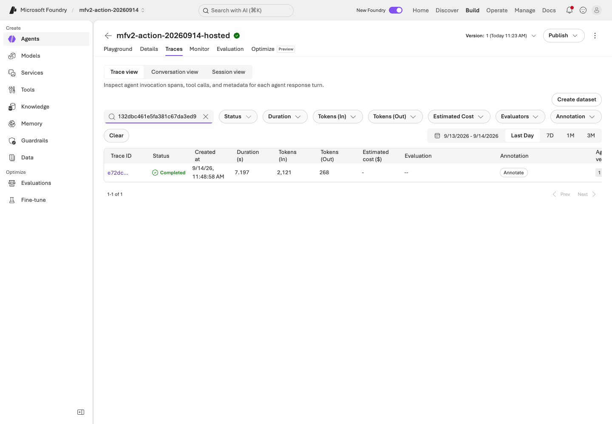

# Lab 09. Traces, operational gates, costs, and cleanup

**English** | [한국어](../ko/labs/09-operations.md)

**Goal:** Preserve evidence for the next decision instead of mistaking one successful demo for a production-ready system.

Previous: [Lab 07](07-evaluation.md) or [Lab 08](08-hosted.md) · Next: [Capstone](11-capstone.md)

## A. Browser: what needs management?

Observe only the training project's assets visible with your permissions.

| Area | Question to answer |
|---|---|
| Agents, versions, assets | Which version are users actually calling? |
| Deployments and quota | Can you distinguish model, deployment, and capacity limits? |
| Tools and knowledge connections | Which data/external systems can be accessed? |
| Evaluation | Which dataset and evaluator produced the result? |
| Trace/Monitor | Can you find the failed request's execution path? |
| Costs and usage | Are Search, sessions, and logs charged in addition to models? |
| Security/governance | Who can invoke, change, deploy, and approve? |

This integrates the original Control Plane perspective. Missing Fleet/management
menus can be normal for your role. Gaining subscription-wide permissions is not the objective.

## B. Code: link execution lineage and actual telemetry

### 1. Find local lineage first

In `outputs/<label>/manifest.json` and `responses.jsonl`, locate run/question IDs
(`run_id`, `case_id`), prompt/data/code/evidence hashes, `response_id`, `request_id`,
actual response model, retrieval provider/document IDs/IQ activity, success/errors,
token usage, and latency.

Request/response IDs **do not automatically become Azure Monitor traces**.
Report `trace_id: null` and `trace_export: not-configured` when that is what you have.

### 2. Prepare server-side tracing

The instructor verifies the project/Application Insights connection, retention, costs,
and permissions. Follow [official tracing setup](https://learn.microsoft.com/azure/foundry/observability/how-to/trace-agent-setup).
Add local client instrumentation only when needed. This repository's Hosted entry point
does not enable sensitive input/output capture by default.

1. Send one synthetic question to the prepared agent.
2. Record response, conversation, and agent version.
3. Find that same invocation in Foundry tracing.
4. Inspect parent/child spans, model/tools, latency, and errors.
5. Check retention/permissions and avoid unnecessary raw-content export.


**What to check:** In **Traces → Trace view**, check date range and agent version.
The newest row is not automatically the request you just sent.



**What to check:** Search the actual Trace ID and open the matching row.
Response, conversation, and trace IDs are different identifiers.


**What to check:** Inspect root `invoke_agent` and Metadata. The source run showed
**20 spans, two chat calls, one tool call**, and also **two errors**. Keep both facts.

Protected tables can require additional permission beyond ordinary log reading.
Do not repeat costly model calls while waiting for telemetry. If absent, record
**unverified** and inspect connection, exporter, roles, and time range.


**What to check:** The source run used `azd ai agent monitor` on the same session
immediately after the call. Compare model/tool activity and final Responses HTTP
status; distinguish this from log-connection errors after a session stops.

### 3. Explain one failure

Do not stop at "D03 returned 403." Identify which user/project/agent identity attempted
to access which service. Separate model failure, tool failure, missing evidence,
and wrong policy application.
After reviewing sources and the reason for change, return to the dev comparison in
[Lab 07](07-evaluation.md). Automatic trace-to-dataset is optional Preview, not a core requirement.


**What to check:** Select the red `GET .../storage/state_stores/...` span.
The source run's initial GET returned 404, followed by successful creation/update.
Do not call it a failed model answer or rewrite the run as "zero errors."


**What to check:** Inspect `execute_tool lookup_policy` in the same tree.
Explain successful tool/model work separately from the failed initialization reads.

## Operational approval gates

| Gate | Evidence to retain |
|---|---|
| Quality | All dev/holdout rows, including failures, business criteria and semantic review |
| Permissions | Least privilege; user and runtime identities separated |
| Data | Synthetic/approved data, effective periods, sources, retention |
| Safety | Server-side checks and human approval design for real actions |
| Costs | Expected calls, Search fixed costs, sessions, log retention |
| Release | Exact agent/model/prompt/dataset/code versions |
| Recovery | Previous version, reversible settings, responsible owner |

Do not enable automatic optimization or continuous evaluation by default.
Sampling, evaluation charges, and data policy require separate approval.
Six passing teaching cases do not authorize production.

## Always finish with cleanup

In the September 14 source run, the 20-span root completed with two chat calls and
one tool call. Two initial state-store/item 404s remained visible; later writes and
the final answer succeeded. `monitor` read the same Running session immediately after
invocation. Completed overall does not mean no child errors.
[Execution records](../live-run.md) list retained assets.

```bash
python scripts/workshop.py cleanup-plan
```

This **prints a list and procedure; it deletes nothing**.
Follow [Cleanup](../reference/cleanup.md), preserve shared/other-team resources, and
recheck active sessions, residual resources, and costs rather than assuming a command
means cleanup is complete.


**What to check:** Check your session states and pagination. Both recorded sessions
were `idle`. Use your IDs, not the screenshot's IDs. Idle does not eliminate every
filesystem, Search, or log charge.
