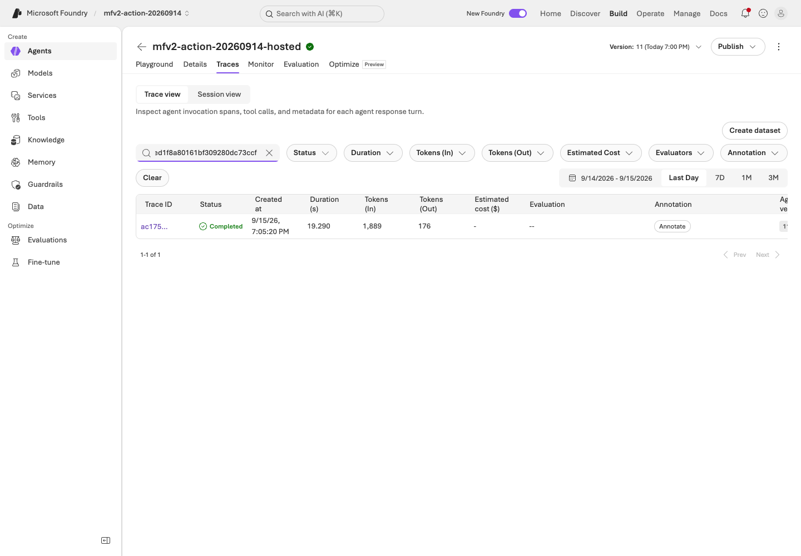
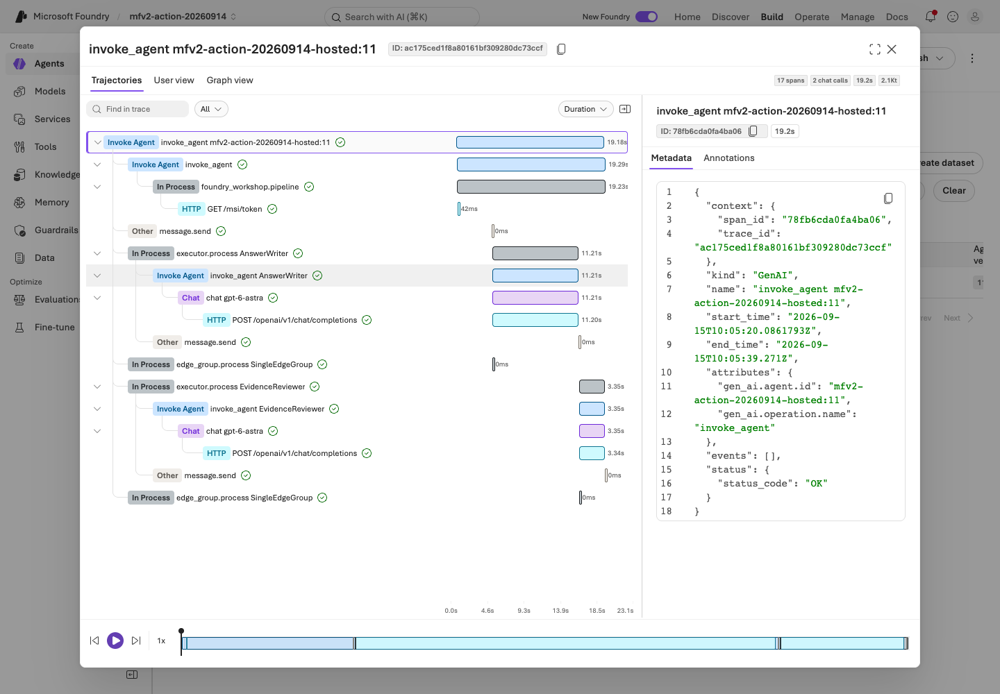
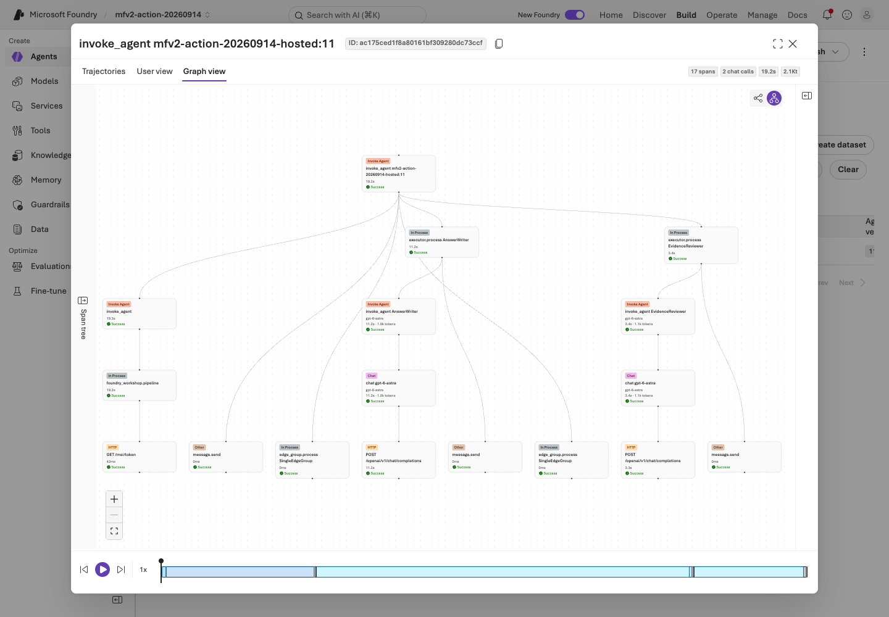
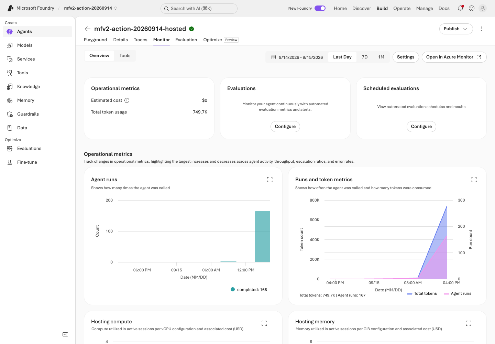
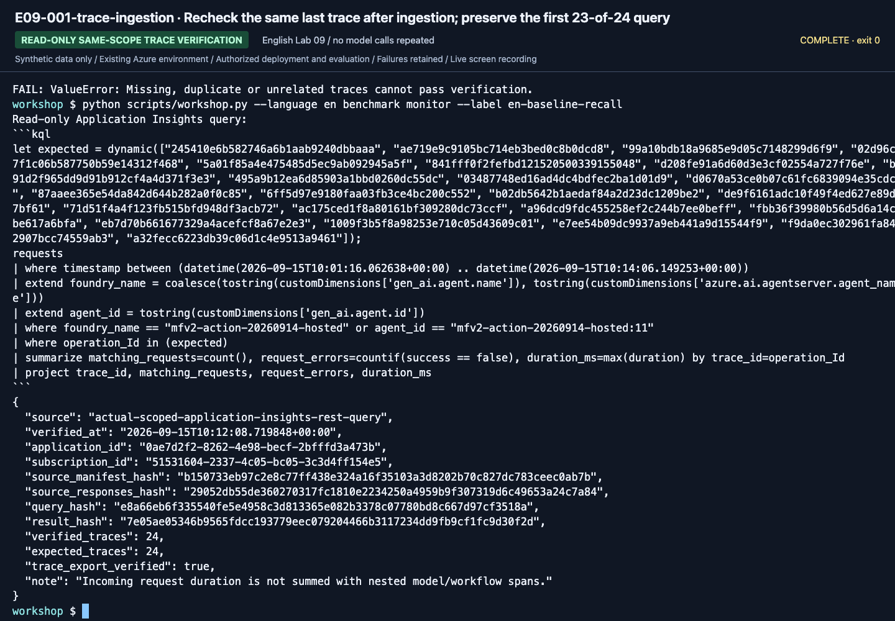
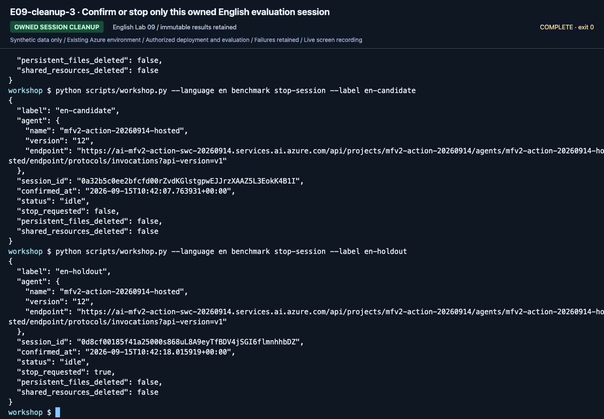

# Lab 09. Traces, operational gates, costs, and cleanup

**English** | [한국어](../ko/labs/09-operations.md)

**Goal:** Preserve evidence for the next decision instead of mistaking one successful demo for a production-ready system.

Next: A → [Lab 11](11-capstone.md) · B → [Lab 11](11-capstone.md) · [Paths](../paths.md)

## Before you start

**This pass:** A completes the four browser checks and cleanup inventory. B correlates its own records; matrix commands require the advanced workbook.

**Need:** Your agent/version and output labels; actual trace access is an additional prerequisite, not assumed.

**Continue when:** You can identify the used version, evidence, costs and owned cleanup targets without deleting shared resources.

**If blocked:** Missing telemetry is unverified, not zero errors. Do not replay model calls just to obtain a screenshot.

[One-time setup and learner files](../setup.md).

## A. Browser: what needs management?

Complete these four checks using **your own existing results**, without sending another model request:

1. **Agents → your Lab 03 agent**: compare name/version/model with the worksheet. Do not select a recording's version.
2. **Instructions / Tools / Knowledge**: verify the six synthetic sources or the selected File Search/IQ connection; no unapproved Web Search or company connection.
3. Open your **six-row assessment** and `workflow-review.txt`. Record manual assessment versus actual native evaluation separately.
   If traces are available, match an existing recorded request; otherwise write **trace unverified**, not “no errors.”
4. Use [the cleanup checklist](../reference/cleanup.md) to inventory your agent, optional files/chat base, and any sessions.
   Mark shared services as **owner-managed**, confirm residual costs with the owner, and record who will stop/delete each authorized asset.

Save `operations-checklist.txt` with those four outcomes. A then goes to [Lab 11](11-capstone.md); no matrix command is required.
The following table is an optional deeper review, limited to assets visible with your permissions.

| Area | Question to answer |
|---|---|
| Agents, versions, assets | Which version are users actually calling? |
| Deployments and quota | Can you distinguish model, deployment, and capacity limits? |
| Tools and knowledge connections | Which data/external systems can be accessed? |
| Evaluation | Which dataset and evaluator produced the result? |
| Trace/Monitor | Can you find the failed request's execution path? |
| Costs and usage | Are Search, sessions, and logs charged in addition to models? |
| Security/governance | Who can invoke, change, deploy, and approve? |

This integrates the original Control Plane perspective. Missing Fleet/management
menus can be normal for your role. Gaining subscription-wide permissions is not the objective.

## B. Code: link execution lineage and actual telemetry

### 1. Find local lineage first

In `outputs/<label>/manifest.json` and `responses.jsonl`, locate run/question IDs
(`run_id`, `case_id`), prompt/data/code/evidence hashes, `response_id`, `request_id`,
actual response model, retrieval provider/document IDs/IQ activity, success/errors,
token usage, and latency.

Request/response IDs **do not automatically become Azure Monitor traces**.
Report `trace_id: null` and `trace_export: not-configured` when that is what you have.

### 2. Prepare server-side tracing

The instructor verifies the project/Application Insights connection, retention, costs,
and permissions. Follow [official tracing setup](https://learn.microsoft.com/azure/foundry/observability/how-to/trace-agent-setup).
Add local client instrumentation only when needed. This repository's Hosted entry point
does not enable sensitive input/output capture by default.

1. Send one synthetic question to the prepared agent.
2. Record response, conversation, and agent version.
3. Find that same invocation in Foundry tracing.
4. Inspect parent/child spans, model/tools, latency, and errors.
5. Check retention/permissions and avoid unnecessary raw-content export.


**What to check:** In **Traces → Trace view**, check date range and agent version.
The newest row is not automatically the request you just sent.


**What to check:** Search the actual Trace ID and open the matching row.
Response, conversation, and trace IDs are different identifiers.


**What to check:** Inspect root `invoke_agent`, Metadata, and the actual visible span count.
Do not equate a partially visible trace tree with the response's complete `model_calls` list.

Protected tables can require additional permission beyond ordinary log reading.
Do not repeat costly model calls while waiting for telemetry. If absent, record
**unverified** and inspect connection, exporter, roles, and time range.


Compare model/tool activity and final HTTP status; distinguish runtime failures from
log-connection errors after a session stops. The matrix query below verifies exact root requests separately.

### 3. Explain one failure

Do not stop at "D03 returned 403." Identify which user/project/agent identity attempted
to access which service. Separate model failure, tool failure, missing evidence,
and wrong policy application.
After reviewing sources and the reason for change, return to the dev comparison in
[Lab 07](07-evaluation.md). Automatic trace-to-dataset is optional Preview, not a core requirement.


If a child span failed, explain that specific operation instead of rewriting the run as “zero errors.”
Model responses, retrieval/tool work, service initialization, and native judgment failures are distinct.

## Operational approval gates

| Gate | Evidence to retain |
|---|---|
| Quality | All dev/holdout rows, including failures, business criteria and semantic review |
| Permissions | Least privilege; user and runtime identities separated |
| Data | Synthetic/approved data, effective periods, sources, retention |
| Safety | Server-side checks and human approval design for real actions |
| Costs | Expected calls, Search fixed costs, sessions, log retention |
| Release | Exact agent/model/prompt/dataset/code versions |
| Recovery | Previous version, reversible settings, responsible owner |

Do not enable automatic optimization or continuous evaluation by default.
Sampling, evaluation charges, and data policy require separate approval.
Six passing teaching cases do not authorize production.

## C. Hosted matrix Trace/Monitor acceptance

<details>
<summary>Advanced C only: expand after collecting the Hosted matrix, not after introductory Lab 07</summary>

Use an existing matrix label from the [evaluation workbook](../reference/evaluation-workbook.md).
`wf-candidate` is not the introductory `candidate` run; substitute your actual matrix label in every command.

```bash
python scripts/workshop.py --language en benchmark trace-plan --label wf-candidate
python scripts/workshop.py --language en benchmark monitor --label wf-candidate
```

The first writes KQL only. The second queries the configured App Insights application ID
with a subscription/tenant-scoped credential and `https://api.applicationinsights.io/.default`.
The Korean run retained a CLI `InvalidTokenError` and corrected that credential path, not the identity or target.
Application IDs are not workspace IDs or instrumentation keys.

Queries are displayed and restricted by agent, time, and exact trace IDs.
Start from `requests`; code-level participant names are not the deployed agent name.
Do not double-count parent and child token/latency observations.
The default gate verifies root requests; deeper model/tool semantics need separate review.

Missing, duplicate, failed, or unmeasured rows cannot pass.
Existing verified evidence is reused only after hash checks, without pretending to query Azure again.

```bash
python scripts/workshop.py --language en benchmark stop-session --label wf-candidate
```

Only the recorded session/version is stopped or confirmed idle.
Shared services, models, evaluation history, and persistent files remain.

### Optional continuous evaluation

Approve data scope, sampling, hourly caps, evaluator versions, ongoing costs, and a disable/cleanup owner.
Follow [current recurring-evaluation guidance](https://learn.microsoft.com/azure/foundry/observability/how-to/how-to-monitor-agents-dashboard#set-up-continuous-evaluation).
Do not repeatedly invoke just to manufacture a sampled screenshot.
Rule configuration and actual evaluated samples are different evidence; nothing is enabled automatically.

</details>

<details>
<summary>Recorded reference screens (optional; not steps to repeat)</summary>

These are newly recorded English actions using the separate English prompt/data bundle. Use your own returned resource IDs and record your own results.



**What to check:** Use exact trace/session IDs and versions. Root verification does not prove every child span is present; estimated cost is not a billing statement.



**What to check:** Use exact trace/session IDs and versions. Root verification does not prove every child span is present; estimated cost is not a billing statement.



**What to check:** Use exact trace/session IDs and versions. Root verification does not prove every child span is present; estimated cost is not a billing statement.



**What to check:** Use exact trace/session IDs and versions. Root verification does not prove every child span is present; estimated cost is not a billing statement.



**What to check:** Use exact trace/session IDs and versions. Root verification does not prove every child span is present; estimated cost is not a billing statement.



**What to check:** Use exact trace/session IDs and versions. Root verification does not prove every child span is present; estimated cost is not a billing statement.

[Full action index](../action-captures.md) · [Recordings](../video-summary.md)

</details>

## Always finish with cleanup

Verify this edition's exact root traces and owned session states.
Completed overall does not mean every child span is exported or error-free.
[Execution records](../live-run.md) list actual outcomes and retained assets.

A uses the checklist and owner handoff above. B/C can also print the local inventory:

```bash
python scripts/workshop.py --language en cleanup-plan
```

This **prints a list and procedure; it deletes nothing**.
Follow [Cleanup](../reference/cleanup.md), preserve shared/other-team resources, and
recheck active sessions, residual resources, and costs rather than assuming a command
means cleanup is complete.


**What to check:** Check actual session states and pagination.
Use your IDs, not screenshot IDs. Idle does not eliminate every
filesystem, Search, or log charge.

Next: A → [Lab 11](11-capstone.md) · B → [Lab 11](11-capstone.md)
