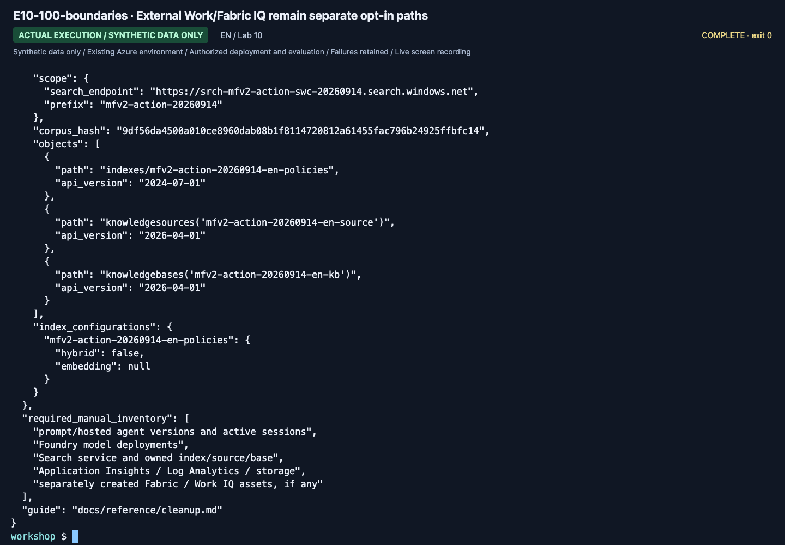

# Lab 10. Fabric IQ, Work IQ, and Toolbox extensions

**English** | [한국어](../ko/labs/10-iq-extensions.md)

**Optional advanced work. Complete the core labs without accessing actual Fabric or Microsoft 365 accounts.**

Prerequisite: [Lab 06](06-knowledge.md) · Parent: [Learning paths](../paths.md)

## Three IQs are not one API

| Product | Main context | Default scope here |
|---|---|---|
| Foundry IQ | Enterprise knowledge, knowledge sources/bases | GA retrieval over a synthetic Search index |
| Fabric IQ | Semantic models, analytics, ontology, OneLake, data agents | Separate connection design only when synthetic assets are prepared |
| Work IQ | Microsoft 365 work/collaboration context | Disabled by default; real user connection needs separate approval |

Do not infer that similarly named products share a key, or that a Copilot license
permits unrestricted app-only backend access.

## 1. Synthetic design exercise for everyone

Without signing into services, design this routing table:

| Question | Appropriate evidence | Required verification |
|---|---|---|
| What is the lodging limit? | Versioned policies / Foundry IQ | Source, effective date, citation |
| What are quarterly travel totals by department? | Synthetic analytics model / Fabric | Aggregation definition, user data permissions |
| What did the travel-review meeting agree? | Approved work context / Work IQ | Consent, delegated permission, sensitive-data protection |

Mocking three response shapes with synthetic JSON is a routing exercise,
**not proof of an actual Fabric IQ or Work IQ connection**.

**What to check:** Review the evidence/verification route for each question.
`fabric_connected`, `work_iq_connected`, and `company_or_m365_data_accessed` are all
`false`. This is not a live service-query command.

## 2. Fabric: only with prepared synthetic assets

Record prerequisites before connecting:

1. A Fabric workspace containing only synthetic data and a currently supported capacity.
2. A published Data Agent/semantic model and source-read permissions.
3. Tenant, network, region, and processing requirements across Foundry/Search/Fabric.
4. Current supported MCP or Foundry tool/knowledge-source integration.
5. Asset-specific identity: ontology/semantic-model paths require delegated/OBO context; published Data Agent MCP may support a separately authorized service principal.
6. Capacity uptime, request costs, and shutdown/restoration plan.

If assets are absent, start with the
[official Fabric Data Agent tutorial](https://learn.microsoft.com/fabric/data-science/data-agent-end-to-end-tutorial).
Preparation is outside the 45–90-minute module.
The [pinned source Fabric guide](https://github.com/junwoojeong100/microsoft-iq-on-foundry/blob/fa16c84f9800377823edd9aea1cb20d6a56a1edf/docs/fabric-iq.md)
is background reading; recheck historical SKU/CLI/role assumptions against current documentation.

**Evidence:** actual user question, selected agent/source, answer/evidence, and
user-context/OBO verification. An administrator's success does not establish every user's access.

## 3. Work IQ: explicit opt-in and additional billing

An administrator first reviews the current
[Work IQ knowledge-source requirements](https://learn.microsoft.com/azure/search/agentic-knowledge-source-how-to-work-iq):
tenant enablement, real user sign-in and assigned usage-based billing;
delegated `WorkIQAgent.Ask` and admin/user consent; network/tenant/support boundaries;
data movement, retention, regulation, and per-user access/deletion policy.
Preview Work IQ may **perform actions**, not merely read.

No repository script automatically enables Work IQ or creates accounts/service
principals. Do not force personal sign-in or paste Graph/M365 tokens.
Owning M365 Copilot alone does not satisfy these requirements.
The September 15 contract includes a Copilot Studio usage-based billing plan with per-user assignments,
tenant enablement, user assertions, `WorkIQAgent.Ask` delegated consent, and a customer-owned Entra app/federated credential
for the `2026-08-01-preview` path. `applicationId` is the client ID; `federatedCredentialId` is the credential object ID.
Do not generalize old same-tenant examples or replace user context with the host identity.

**Stop:** if approval, billing, tenant, delegated access, or action scope is unclear,
remain with synthetic routing. Do not make a real connection.

## 4. Toolbox, remote MCP, and the web

[Lab 04](04-agents-tools.md) uses local MCP. Begin remote-tool extensions with approved
public documentation such as Microsoft Learn.

| Addition | Decide before connecting |
|---|---|
| Microsoft Learn MCP | Trusted server URL, exposed tools, call budget |
| Web Search | Allowed domains, freshness, source URLs, query sensitivity |
| Company API | OpenAPI/MCP schema, input validation, per-user authorization |
| Mutating operation | Separate approval, idempotency, audit and compensation |

Web IQ and ordinary Web Search are not interchangeable.
Tool registration is not proof of a correct result under real permissions.
`FoundryToolbox` belongs to the prerelease hosting package; it does not create the upstream project connection.
Read the [IQ workbook](../reference/iq-workbook.md) for the actual lifecycle, credential, Fabric, and Work IQ boundaries.

## 5. Richer IQ Preview: separate from GA code

The dated compatibility snapshot uses `2026-08-01-preview` for richer experiments.
Message-based planning, reasoning effort, synthesis, and added sources have different
bodies from GA `2026-04-01`. Do not insert Preview fields into `seed-search --iq`.

Use a separate experiment copy, prefix, and configuration following
[official API migration](https://learn.microsoft.com/azure/search/agentic-retrieval-how-to-migrate).
Install any Preview SDK in its own environment; do not upgrade all GA dependencies.
Optional planner fields in `.env.example` illustrate this extension and are unused by default GA commands.

## New English execution evidence

These are newly recorded English actions using the separate English prompt/data bundle. Use your own returned resource IDs and record your own results.

**What to check:** No external company, Fabric or Microsoft 365 data was queried. This is an inventory/boundary exercise, not a live connection.

[Full action index](../action-captures.md) · [Recordings](../video-summary.md)

## Finish

Remove/restore only approved added connections and check owned Fabric capacity,
Work IQ billing, and sessions. Check shared-agent dependencies before stopping capacity.
Never arbitrarily remove another team's connection or organization-wide consent.
