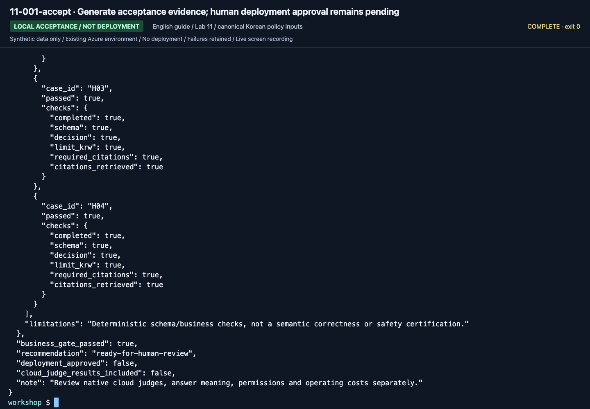

# Lab 11. A final handoff your team can reproduce

**English** | [한국어](../ko/labs/11-capstone.md)

<!-- translation-pending: ko-integrated-20260915 -->

> **Translation pending** — The [Korean-first integration revision](../ko/labs/11-capstone.md) is current for the new workflow/evaluation curriculum. This English page retains the earlier material. English expansion and new media follow Korean execution, capture, and corrections.

**Goal:** Hand over a small system with separate knowledge, code, evaluation, and operations—not just a model demo.

Parent: [Learning paths](../paths.md) · Finish: [Cleanup](../reference/cleanup.md)

## Assignment

Complete the Hanbit Technology assistant's guidance flow. Rather than attaching many
new services, make the following artifacts understandable and reproducible by another
learner. Add neither company data nor automatic payments.

| Deliverable | A. Beginner | B. Practitioner |
|---|---|---|
| Architecture | Project/model/evidence/agent diagram | Include actual code, provider, identity |
| Knowledge | Six synthetic documents and effective periods | Corpus hash, retrieval provider, IDs |
| Instructions | Final instructions and reasons for changes | v1/v2 hashes and frozen candidate |
| MAF workflow | Actual prepared sequential run and human review | Code/results for sequential, concurrent, Group Chat |
| Evaluation | Manual assessment of all six real dev answers | Complete dev before/after, final holdout, errors |
| Failure review | Actual failure or all-pass record | Source run/request/response and pending review |
| Operations | Permissions, cost, cleanup | Reproduction settings, optional remote version, actual trace |
| Limitations | Observed-only and unrun features | SDK/cloud/Preview verification boundaries |

## Practitioner acceptance command

If you have the actual candidate and holdout from [Lab 07](07-evaluation.md):

```bash
python scripts/workshop.py accept --candidate candidate --holdout final-holdout
```

The result is **evidence for human acceptance**, not permission to deploy based on a
single `true`. If using Hosted, add its version-specific smoke/evaluation evidence.
Do not transfer local project Responses quality scores to a different Hosted path.

**New English-guide capture: September 15, 2026.** ▶ [Watch this action](https://github.com/user-attachments/assets/082ede4b-d363-474c-ad47-598b20f593e9#t=784.68)



**What to check:** Inspect the output file and pending `human_approval`.
`accepted: true` means the artifact met checker conditions, not production approval.
The recorded holdout was already exposed teaching data, not a fresh unseen test.

## Five-minute presentation

1. **Problem:** which questions are answered and which are withheld?
2. **Evidence:** actual document IDs, effective dates, and retrieval path.
3. **Verification:** all cases, failures, improvements, and holdout.
4. **Control:** approval boundaries, user/agent identities, sensitive data, costs.
5. **Unknowns:** unrun features, Preview boundaries, subscription-specific limitations.

## Reviewer acceptance checklist

- [ ] Real calls and fixtures are visibly distinct.
- [ ] Deployment names and project endpoints were verified, not guessed.
- [ ] Workflows ran in MAF code; manually stitched portal answers are not substituted.
- [ ] Failures, missing rows, and errors remain in the denominator.
- [ ] Historical/current policy effective dates were checked.
- [ ] Holdout was not reused for prompt development.
- [ ] Source, dataset, prompt, response, and evaluator lineage is preserved.
- [ ] An LLM reviewer is not treated as a human approver.
- [ ] Unmeasured latency/usage is not filled with zero.
- [ ] Features not remotely executed are marked not run.
- [ ] Owned assets were cleaned up and shared assets preserved.

Six/four cases are workshop gates. Production adoption also requires business-expert
policy approval, broader evaluation, threat modeling, load/recovery/access reviews,
and service-specific SLA, price, and retention reviews.
