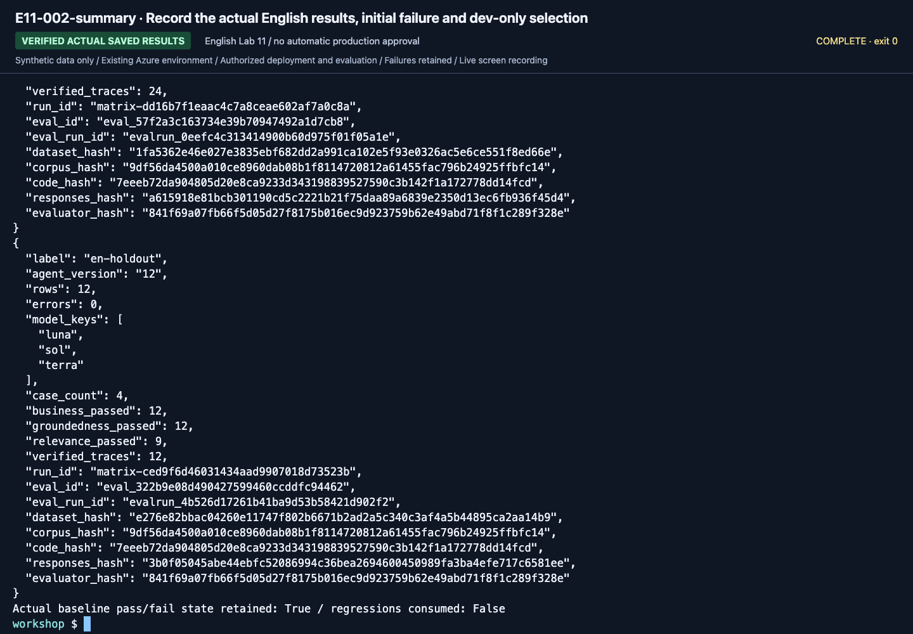
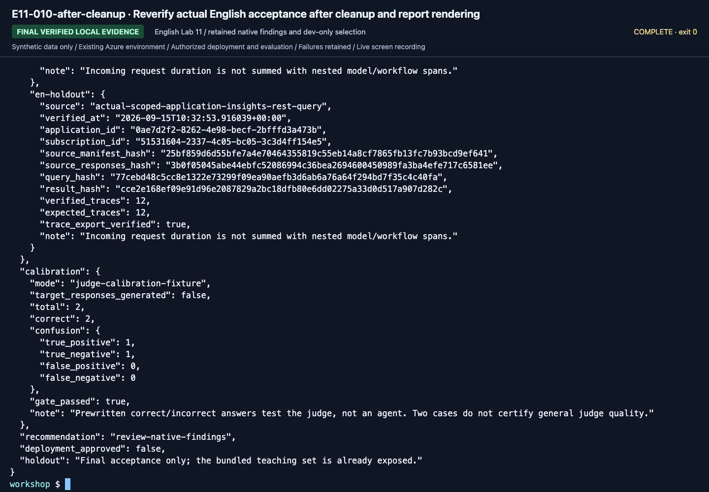

# Lab 11. A final handoff your team can reproduce

**English** | [한국어](../ko/labs/11-capstone.md)

**Goal:** Hand over a small system with separate knowledge, code, evaluation, and operations—not just a model demo.

**Open your section:** [A — evidence folder](#path-a) · [B — saved acceptance](#path-b) · [Paths](../paths.md)

## Before you start

**This pass:** A submits the learner worksheet plus agent/workflow/source/cleanup evidence. B/C use only the acceptance command for the path actually run.

**Need:** Your own completed earlier outputs, not copied scores or recordings.

**Continue when:** Another learner can identify what ran, with which inputs, and what remains unverified.

**If blocked:** Do not run an acceptance command for absent labels or treat a model review as human approval.

[One-time setup and learner files](../setup.md).

## Assignment

Complete the Hanbit Technology assistant's guidance flow. Rather than attaching many
new services, make the following artifacts understandable and reproducible by another
learner. Add neither company data nor automatic payments.

| Deliverable | A. Beginner | B. Practitioner |
|---|---|---|
| Architecture | Project/model/evidence/agent diagram | Include actual code, provider, identity |
| Knowledge | Six synthetic documents and effective periods | Corpus hash, retrieval provider, IDs |
| Instructions | Final instructions and reasons for changes | v1/v2 hashes and frozen candidate |
| MAF workflow | Actual prepared sequential run and human review | Code/results for sequential, concurrent, Group Chat |
| Evaluation | Manual assessment of all six real dev answers | Complete dev before/after, final holdout, errors |
| Failure review | Actual failure or all-pass record | Source run/request/response and pending review |
| Operations | Permissions, cost, cleanup | Reproduction settings and cleanup; remote version/trace only if selected |
| Limitations | Observed-only and unrun features | SDK/cloud/Preview verification boundaries |

<a id="path-a"></a>

## A. Fifteen-minute handoff, no new Azure calls

Put these in your own evidence folder, without `.env`, credentials or another learner's outputs:

| File/result | Completion check |
|---|---|
| Completed `session-notes.txt` | Setup card, sketch, actual project/deployment/agent version, model observations and source checks are identifiable |
| Actual saved instructions plus the learner ZIP's `SOURCE.json` | Original text and any browser edits/version changes remain distinguishable |
| `assessment-baseline.csv`; candidate sheet only if changed | All D01–D06 actual answers/citations/reasons, not copied answer keys |
| `workflow-review.txt` | One real sequential command/output and your review |
| `operations-checklist.txt` | Owned/shared assets, cleanup outcomes or pending owner action, remaining costs, unrun optional features |

Open each file and check it against the table. For self-study, review it yourself; for a class, hand it over only through the agreed channel.
A does **not** run the B/C acceptance commands below or open holdout.
**A done:** complete the [reviewer checklist](#reviewer-acceptance-checklist) and [cleanup handoff](../reference/cleanup.md).
No optional module or new Azure request is needed to submit these files.

<a id="path-b"></a>

## Practitioner acceptance command

<a id="b-evidence"></a>

### Check the files you already produced

Use this inventory before deciding whether the handoff is complete.
The printed JSON files and notes are in `outputs/learner-notes-en/`; generated runs and ownership stay at their original paths.
If you chose different names, record those exact paths in `session-notes.txt`.

| From | Keep |
|---|---|
| Lab 02 | `model.json`, `answer-local.json` |
| Lab 04 | `maf-none.json`, `maf-function.json`, `maf-mcp.json` |
| Lab 05 | `workflow-sequential.json`, `workflow-concurrent.json`, `workflow-group-chat.json`, completed `workflow-review.txt` |
| Lab 06 | `retrieve-local.json`, `retrieve-search.json`, `retrieve-iq.json`, `answer-iq.json`; original `outputs/azure-objects.json` |
| Lab 07 | Complete `outputs/baseline/`, `outputs/candidate/`, `outputs/final-holdout/`, including comparison, review and acceptance/rejection evidence |
| Lab 08 | `.build/hosted-en/package-manifest.json` and the package it describes |
| Setup / Lab 09 | Completed `session-notes.txt`, `operations-checklist.txt`, and the copied `SOURCE.json` |

Open each saved JSON and check that it contains the whole response, not only the last terminal lines.
An empty template or a filename alone is not execution evidence. If an item is missing, use the incomplete outcome below;
do not repeat paid calls or fabricate files just to fill the inventory.

### Choose the actual outcome

**Choose the outcome before running a command.** Use the actual state of your own files:

| Evidence available | Handoff action | Status |
|---|---|---|
| Complete real candidate and bound holdout | Read or create the acceptance report below | Ready for human review only if its business gate passes |
| Complete records but a failed final business gate | Preserve the report and all failed rows | Rejected; not deployment approval |
| A required run or stage is missing/blocked | Skip `accept`; use [incomplete handoff](#incomplete-handoff) | Incomplete; not full B completion |

Only if you have the actual candidate and holdout from [Lab 07](07-evaluation.md), use their labels.
If already run in Lab 07, open `outputs/final-holdout/acceptance.json` instead of repeating the command:

```bash
python scripts/workshop.py --language en accept --candidate candidate --holdout final-holdout
```

The result is **evidence for human acceptance**, not permission to deploy based on a
single `true`. If using Hosted, add its version-specific smoke/evaluation evidence.
Do not transfer local project Responses quality scores to a different Hosted path.


**What to check:** Read `candidate_grade`, `holdout_grade`, `business_gate_passed`,
and `recommendation` (`ready-for-human-review` or `reject`).
`deployment_approved: false` and `cloud_judge_results_included: false` are explicit limits, not missing approvals to bypass.
The recorded holdout was already exposed teaching data, not a fresh unseen test.

<a id="incomplete-handoff"></a>

### When required work is incomplete

Use the **B outcome** section of your `session-notes.txt`; no new model call or invented report is needed.
Record the last completed step, the failed command/error, which run folders actually exist, and which were **not collected**.
Keep partial manifests and error files unchanged. Record the next permitted action and responsible owner.
Do not report missing runs as `0 errors`, manufacture an `acceptance.json`, unlock holdout after a failed dev gate, or delete the original failure.

This is a useful blocked-work handoff, **not successful completion of B's missing requirements**.
Still finish the owned/shared asset and residual-cost entries in `operations-checklist.txt`.

**B done:** hand over the existing files in the [B evidence inventory](#b-evidence), including Lab 02's model outputs and Lab 05's human review.
Finish the [reviewer checklist](#reviewer-acceptance-checklist) and [cleanup handoff](../reference/cleanup.md).
Mark a failed business gate **rejected**, missing required stages **incomplete**, and omitted optional local/remote hosting, cloud judge or trace work **not run / unverified**.

## Hosted workflow/evaluation acceptance evidence

<details>
<summary>Advanced C only: expand after completing the Hosted evaluation workbook</summary>

Keep introductory A/B outputs separate from the [advanced workbook](../reference/evaluation-workbook.md).
The `wf-*` labels below must exist as real matrix runs; introductory `candidate`/`final-holdout` are not substitutes.
Four models require 24 baseline dev, 24 candidate dev, and 16 frozen holdout rows.
Select any accepted subset **using dev**, not favorable holdout results.

```bash
python scripts/workshop.py --language en benchmark verify --baseline wf-baseline --candidate wf-candidate --holdout wf-final --require-native --require-traces --calibration judge-calibration
```

This default does not assume a promoted regression exists.
If a reviewed regression was actually consumed by the candidate, add `--require-regressions`; otherwise record the all-pass/no-promotion reason.
Execution, business correctness, native quality, and findings are separate.
Neither `gate_passed` nor `ready-for-human-review` is production approval.
Choose `--require-native-pass` beforehand if every generic native quality check must pass.

Include original synthetic inputs/hashes; exact version/model/API/retrieval configuration;
all responses/errors/model calls; evaluator versions/thresholds; trace-query receipts;
consumed regression lineage where applicable; calibration and small-sample limits;
and owned-session cleanup with remaining costs.
Use this evidence for [archive acceptance](../reference/consolidation.md), not earlier recordings or upstream reports.

</details>

## Five-minute presentation

1. **Problem:** which questions are answered and which are withheld?
2. **Evidence:** actual document IDs, effective dates, and retrieval path.
3. **Verification:** all cases, failures, improvements, and holdout only for the B/C path that ran it.
4. **Control:** approval boundaries, user/agent identities, sensitive data, costs.
5. **Unknowns:** unrun features, Preview boundaries, subscription-specific limitations.

## Reviewer acceptance checklist

- [ ] Real calls and fixtures are visibly distinct.
- [ ] Deployment names and project endpoints were verified, not guessed.
- [ ] Workflows ran in MAF code; manually stitched portal answers are not substituted.
- [ ] Failures, missing rows, and errors remain in the denominator.
- [ ] Historical/current policy effective dates were checked.
- [ ] Holdout was not reused for prompt development.
- [ ] Source, dataset, prompt, response, and evaluator lineage is preserved.
- [ ] An LLM reviewer is not treated as a human approver.
- [ ] Unmeasured latency/usage is not filled with zero.
- [ ] Features not remotely executed are marked not run.
- [ ] Owned cleanup is verified or assigned to a named authorized owner; shared assets are preserved.

Six/four cases are workshop gates. Production adoption also requires business-expert
policy approval, broader evaluation, threat modeling, load/recovery/access reviews,
and service-specific SLA, price, and retention reviews.

<details>
<summary>Recorded reference screens (optional; not steps to repeat)</summary>

These are newly recorded English actions using the separate English prompt/data bundle. Use your own returned resource IDs and record your own results.



**What to check:** Read the retained initial failure, actual four-model candidate score and dev-selected three-model holdout. Human review remains separate.



**What to check:** Read the retained initial failure, actual four-model candidate score and dev-selected three-model holdout. Human review remains separate.

[Full action index](../action-captures.md) · [Recordings](../video-summary.md)

</details>

Next: A → [Cleanup](../reference/cleanup.md) · B → [Cleanup](../reference/cleanup.md)
