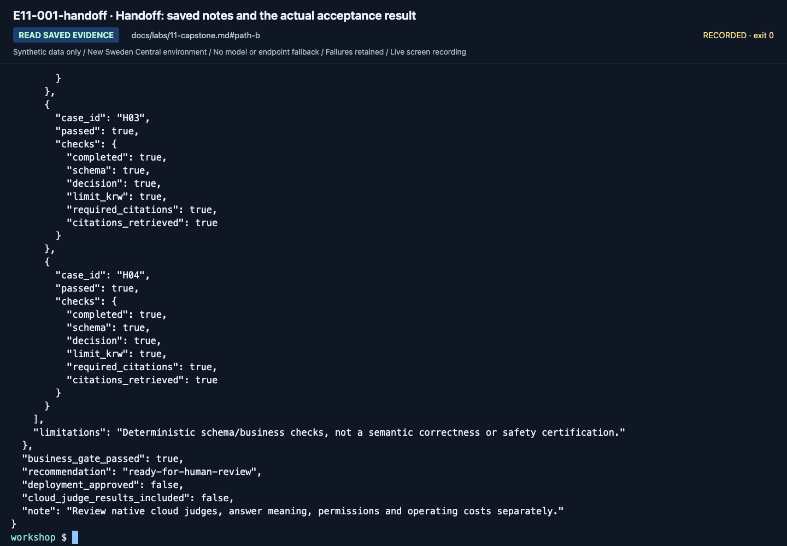

# Lab 11. A final handoff your team can reproduce

**English** | [한국어](../ko/labs/11-capstone.md)

**Goal:** Hand over a small system with separate knowledge, code, evaluation, and operations—not just a model demo.

**Open your section:** [A — evidence folder](#path-a) · [B — saved acceptance](#path-b) · [C — selected module](#path-c) · [Paths](../paths.md)

## Before you start

**This pass:** A submits its evidence folder. B reads or creates the acceptance report for its actual run. C hands over only the selected module's outcome; Hosted acceptance is a separate path.

**Need:** The files you saved in the earlier labs.

**Continue when:** Another learner can identify what ran, with which inputs, and what remains unverified.

**If blocked:** Record a missing file or stage as **incomplete** in `session-notes.txt` and still hand over the cleanup owner. Do not send new Azure requests to fill gaps.

[One-time setup and learner files](../setup.md).

## Assignment

Complete the Hanbit Technology assistant's guidance flow. Rather than attaching many
new services, make the following artifacts understandable and reproducible by another
learner. Add neither company data nor automatic payments.

| Deliverable | A. Beginner | B. Implementation |
|---|---|---|
| Architecture | Project/model/evidence/agent diagram | Include actual code, provider, identity |
| Knowledge | Six synthetic documents and effective periods | Corpus hash, retrieval provider, IDs |
| Instructions | Final instructions and reasons for changes | v1/v2 hashes and frozen candidate |
| MAF workflow | Actual prepared sequential run and human review | Code/results for sequential, concurrent, Group Chat |
| Evaluation | Manual assessment of all six real dev answers | Complete dev before/after, final holdout, errors |
| Failure review | Actual failure or all-pass record | Source run/request/response and pending review |
| Operations | Permissions, cost, cleanup and trace evidence or unverified reason | Reproduction settings, cleanup and trace evidence; local MAF has no server-side trace |
| Limitations | Observed-only and unrun features | SDK/cloud/Preview verification boundaries |

<a id="path-a"></a>

## A. Fifteen-minute handoff, no new Azure calls

Put these in your own evidence folder, without `.env`, credentials or another learner's outputs:

| File/result | Completion check |
|---|---|
| Completed `session-notes.txt` | Setup card, sketch, actual project/deployment/agent version, model observations and source checks are identifiable |
| `instructions-baseline.txt` and the learner ZIP's `SOURCE.json` | Snapshot matches the assessed baseline version; `SOURCE.json` identifies the supplied bundle, not your later edits |
| `assessment-baseline.csv` | All D01–D06 actual answers/citations/reasons and the version recorded in `session-notes.txt`; not copied answer keys |
| Only for a changed candidate: `instructions-candidate.txt`, `assessment-candidate.csv` | New saved version, change reason and all six new results; no overwritten baseline or mixed-version rows |
| `workflow-review.txt` | One selected sequential run: exact command or Playground question, complete output and your review; Hosted name/version and visible IDs if used |
| `operations-checklist.txt` | Owned/shared assets, cleanup outcomes or pending owner action, remaining costs, unrun optional features |

Open each file and check it against the table. For self-study, review it yourself; for a class, hand it over only through the agreed channel.
A complete assessment may contain business failures. Missing answers, request errors or mixed versions instead mean **assessment incomplete**:
record that outcome in **Lab 07 A** of `session-notes.txt`, preserve the existing files and still hand over cleanup ownership.
Do not invent responses or repeat paid calls just to fill the folder.
A does **not** run the B/C acceptance commands below or open holdout.
Before you hand over, tick these five checks:

- [ ] Each file in the table opens and meets its completion check.
- [ ] `assessment-baseline.csv` has all six rows, including failures.
- [ ] `workflow-review.txt` has the complete output and your review.
- [ ] `operations-checklist.txt` names who stops or deletes each asset you own.
- [ ] The folder contains no `.env`, password, key or token.

**A done:** hand the folder over through the agreed class channel (for self-study, keep it),
then follow [Cleanup](../reference/cleanup.md) for the assets you own.

<a id="path-b"></a>

<a id="practitioner-acceptance-command"></a>

## B. Review saved evidence and record the outcome

**No new Azure calls.** Check the files first, then record **ready for human review**, **rejected** or **incomplete**.
If Lab 07 already produced `acceptance.json`, read it instead of rerunning the command.

<a id="b-evidence"></a>

### Check the files you already produced

Use this inventory before deciding whether the handoff is complete.
The JSON files saved by `--output` and your notes are in `outputs/learner-notes-en/`; generated runs and ownership stay at their original paths.
If you chose different names, record those exact paths in `session-notes.txt`.

| From | Keep |
|---|---|
| Lab 02 | `model.json`, `answer-local.json` |
| Lab 03 | `prompt-agent-create.json`, `prompt-agent-invoke.json` |
| Lab 04 | `maf-none.json`, `maf-function.json`, `maf-mcp.json` |
| Lab 05 | `workflow-sequential.json`, `workflow-concurrent.json`, `workflow-group-chat.json`, completed `workflow-review.txt` |
| Lab 06 | `retrieve-local.json`, `retrieve-search.json`, `retrieve-iq.json`, `answer-iq.json`; original `outputs/azure-objects.json` |
| Lab 07 | Complete `outputs/baseline/`, `outputs/candidate/`, `outputs/final-holdout/`, including comparison, review and acceptance/rejection evidence |
| Lab 08 | `.build/hosted-en/package-manifest.json` and the package it describes |
| Setup / Lab 09 | Completed `session-notes.txt`, `operations-checklist.txt`, and the copied `SOURCE.json` |

Open each saved JSON and review the whole response. `--output` preserves it; saving alone does not establish a correct answer.
In `session-notes.txt`, **B - code evidence and handoff** must also contain your per-lab findings,
Lab 07's comparison/gate decision and actual verdict, and Lab 08's package/execution status.
An empty template or a filename alone is not execution evidence. If an item is missing, use the incomplete outcome below;
do not repeat paid calls or fabricate files just to fill the inventory.

**Lab 09 trace record:** open `operations-checklist.txt` and check the
`Actual trace evidence, or unverified when unavailable:` line you filled in Lab 09.
It must contain your trace/operation ID and finding, or `trace unverified: <reason>`; do not make a new request to fill it.

### Choose the actual outcome

**Check whether the saved evidence permits `accept` first.** Then use its actual report or error to record the outcome:

| Evidence available | Handoff action | Status |
|---|---|---|
| Complete real candidate and bound holdout; both business gates pass | Read or create the acceptance report below | `accept` exit `0`: `ready-for-human-review`, not deployment approval |
| Complete records but a failed final business gate | Preserve the report and all failed rows | `accept` exit `1`: `reject` |
| A required run/stage is missing or blocked, or `accept` exits `2` | Use [incomplete handoff](#incomplete-handoff); do not invent a report or recollect holdout | Incomplete; a successful local grade alone cannot establish acceptance lineage |

Only if you have the actual candidate and holdout from [Lab 07](07-evaluation.md), use their labels.
If already run in Lab 07, open `outputs/final-holdout/acceptance.json` instead of repeating the command:

```bash
python scripts/workshop.py --language en accept --candidate candidate --holdout final-holdout
```

The result is **evidence for human acceptance**, not permission to deploy based on a
single `true`. If using Hosted, add its version-specific smoke/evaluation evidence.
Do not transfer local project Responses quality scores to a different Hosted path.




**What to check:** Read `candidate_grade`, `holdout_grade`, `business_gate_passed`,
and `recommendation` (`ready-for-human-review` or `reject`).
`deployment_approved: false` and `cloud_judge_results_included: false` are explicit limits, not missing approvals to bypass.
This holdout is public teaching data that learners have already seen, not a fresh unseen test.

<a id="incomplete-handoff"></a>

### When required work is incomplete

Use **B - code evidence and handoff** in your `session-notes.txt`; no new model call or invented report is needed.
Record the last completed step, the failed command/error, which run folders actually exist, and which were **not collected**.
Keep partial manifests and error files unchanged. Record the next permitted action and responsible owner.
Do not report missing runs as `0 errors`, manufacture an `acceptance.json`, unlock holdout after a failed dev gate, or delete the original failure.

This is a useful blocked-work handoff, **not successful completion of B's missing requirements**.
Still finish the owned/shared asset and residual-cost entries in `operations-checklist.txt`.

**B done:** hand over the existing files in the [B evidence inventory](#b-evidence), including Lab 02's model outputs, Lab 03's managed-agent outputs, Lab 05's human review and Lab 09 trace status.
Finish the [reviewer checklist](#reviewer-acceptance-checklist) and [cleanup handoff](../reference/cleanup.md).
Mark a failed business gate **rejected** and missing required stages **incomplete**.
Omitted optional local/remote hosting and cloud judges are **not run**; unavailable traces are **unverified**, with the reason recorded.

<a id="path-c"></a>

## C. Hand off one selected module

**No new Azure calls or extra evaluation to fill this handoff.** For a standalone C visit, skip the A/B inventories above.
Append `C - module handoff` to your `session-notes.txt` and record:

| Keep | Record |
|---|---|
| Module | Name/link, language, last completed step and its own stopping criterion |
| Actual outcome | Live execution, local simulation or design-only; completed, not run, or failed/blocked with the reason |
| Evidence | Exact existing file paths, run/version IDs when applicable, your review and remaining limitations; preserve original errors |
| Cleanup | Owned/shared assets, completed cleanup or the named responsible owner, and remaining costs; write none only when confirmed |

Do not run `accept`, `benchmark verify` or a new holdout solely to finish one module.
Those commands apply only to the B or [Hosted evaluation path](#hosted-acceptance) you actually selected.

**C done:** hand over the recorded module outcome and follow [Cleanup](../reference/cleanup.md) for any owned assets.
Missing requirements remain **incomplete**; a failed/blocked result does not become a successful module.
Stop here for a module-only visit.

<a id="hosted-acceptance"></a>

## Hosted workflow/evaluation acceptance evidence

<details>
<summary>Advanced C only: expand after completing the Hosted evaluation workbook</summary>

Keep introductory A/B outputs separate from the [advanced workbook](../reference/evaluation-workbook.md).
The `wf-*` labels below must exist as real matrix runs; introductory `candidate`/`final-holdout` are not substitutes.
Four models require 24 baseline dev, 24 candidate dev, and 16 frozen holdout rows.
Select any accepted subset **using dev**, not favorable holdout results.

If this exact frozen experiment already has `outputs/benchmarks/wf-final/release-verification.json`, read it instead of repeating verification.
Otherwise, run the local verification below only after the workbook's required evidence exists:
Use the policy recorded before the experiment: add `--require-native-pass` only if you selected it then, and retain that choice at handoff.

```bash
python scripts/workshop.py --language en benchmark verify --baseline wf-baseline --candidate wf-candidate --holdout wf-final --require-native --require-traces --calibration judge-calibration
```

Open `outputs/benchmarks/wf-final/release-verification.json` and retain `gate_passed`, `native_quality_passed`,
`recommendation` and `deployment_approved: false`. Use your actual holdout label if it differs from `wf-final`.
Check that `selected_model_keys` matches the dev-selected subset and `native_quality_required` matches your recorded policy.

| Actual result | Handoff decision |
|---|---|
| `ready-for-human-review` | Requested gates passed; a person must still review the evidence |
| `review-native-findings` | A dev-selected model failed a candidate/holdout native check (`native_quality_passed: false`) while the default gate passed; preserve the scores and unresolved findings for human review, not automatic acceptance |
| `reject` (exit `1`) | Preserve the rejection and failed rows; do not loosen criteria or tune on holdout |
| Missing/invalid evidence prevents a report (exit `2`) | Hand over **incomplete** work and its blocker; do not invent the file or recollect holdout |

This default does not assume a promoted regression exists.
If a reviewed regression was actually consumed by the candidate, add `--require-regressions`; otherwise record the all-pass/no-promotion reason.
Execution, business correctness, native quality, and findings are separate.
Neither command success, `gate_passed` nor `ready-for-human-review` is production approval.

Include original synthetic inputs/hashes; exact version/model/API/retrieval configuration;
all responses/errors/model calls; evaluator versions/thresholds; trace-query receipts;
consumed regression lineage where applicable; calibration and small-sample limits;
and owned-session cleanup with remaining costs.
Use this evidence for [archive acceptance](../reference/consolidation.md), not earlier recordings or upstream reports.

</details>

## Five-minute presentation

1. **Problem:** which questions are answered and which are withheld?
2. **Evidence:** actual document IDs, effective dates, and retrieval path.
3. **Verification:** all cases, failures, improvements, and holdout only for the B/C path that ran it.
4. **Control:** approval boundaries, user/agent identities, sensitive data, costs.
5. **Unknowns:** unrun features, Preview boundaries, subscription-specific limitations.

## Reviewer acceptance checklist

- [ ] Real calls and fixtures are visibly distinct.
- [ ] Deployment names and project endpoints were verified, not guessed.
- [ ] Workflows ran in MAF code; manually stitched portal answers are not substituted.
- [ ] Failures, missing rows, and errors remain in the denominator.
- [ ] Historical/current policy effective dates were checked.
- [ ] Holdout was not reused for prompt development.
- [ ] Source, dataset, prompt, response, and evaluator lineage is preserved.
- [ ] An LLM reviewer is not treated as a human approver.
- [ ] Unmeasured latency/usage is not filled with zero.
- [ ] Features not remotely executed are marked not run.
- [ ] Owned cleanup is verified or assigned to a named authorized owner; shared assets are preserved.

Six/four cases are workshop gates. Production adoption also requires business-expert
policy approval, broader evaluation, threat modeling, load/recovery/access reviews,
and service-specific SLA, price, and retention reviews.

[Full action index](../action-captures.md) · [Recordings](../video-summary.md)

**Next learning:** continue with [Learning resources](../reference/learning-resources.md).

Next: A → [Cleanup](../reference/cleanup.md) · B → [Cleanup](../reference/cleanup.md)
