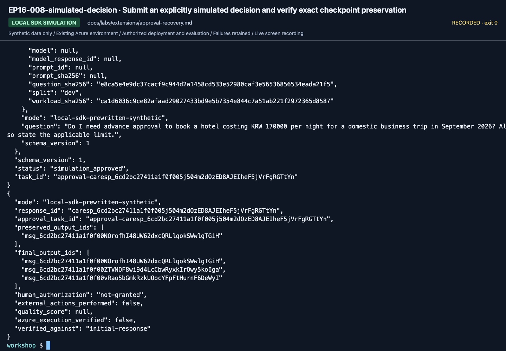

# Local SDK approval-gate simulation and recovery

**English** | [한국어](../../ko/labs/extensions/approval-recovery.md)

**Optional Preview module. Compatibility checked on 2026-09-16:** Python 3.13,
`azure-ai-agentserver-core==2.1.0`, and `azure-ai-agentserver-responses==2.2.0b1`.
Use the workshop's already-prepared, pinned SDK environment. This extension does
not change Lab 05, the workshop CLI, deployment configuration, or canonical data.

**Real SDK mechanics; explicitly prewritten synthetic work.** There is no model
inference, retrieval, evaluator, booking, payment, email, or real authorization.
`synthetic-runtime-only` is a protocol label, **not an Azure model deployment**.
The only scenario is the bundled English development question `D03`. Holdout is
not used. A new English stop/restart/continuation was recorded on September 16;
[the results](../../edition-results.md) distinguish it from Azure execution.

**Need:** two dedicated terminals and the pinned SDK environment.
**Stop when:** the same response/gate IDs and original output survive the chosen continuation, with `human_authorization: not-granted`.
**If blocked:** retain the checkpoint and error; do not bypass the gate or call this business approval.

<details>
<summary>Why this is different from Lab 05's pending-review flag</summary>

Lab 05's `pending-human-review` value is a safety boundary, not a durable approval
workflow. Here, a real SDK `@multi_turn_task` persists an approval request in
`FoundryStateStore`, returns, and becomes **suspended**. A later, explicitly
simulated decision resumes the **same approval task ID** with a new input ID.

A separate SDK-managed background Response owns the streamed output. It keeps
the **same response ID** across continuation and recovery. Each complete message
is committed with `yield stream.checkpoint()`. Recovery reconstructs
`ResponseEventStream` from `context.persisted_response`, validates the entire
committed prefix, and skips those stages without regenerating their output IDs.
An interrupted, uncommitted stage may run again; external effects are not
transactionally coupled to these checkpoints and **must not be added here**.

The approval task and the Response task are distinct identities, linked by
`approval_task_id` and `response_id`. The outer Response polls the durable gate
while the process is running; it does not make inference calls while waiting.
This bounded exercise allows 600 seconds for a simulated decision, including
downtime, and at most two subsequent prewritten workload stages.

</details>

## Recommended first pass

### 1. Prepare two dedicated terminals

Run from the repository root in both terminals. If your prepared virtual
environment is elsewhere, set `WORKSHOP_PYTHON` to its existing Python executable
before this block. Otherwise the default is the repository's `.venv`. Do not
install packages or switch SDK versions to make a failing compatibility check
look successful.

```bash
export WORKSHOP_PYTHON="${WORKSHOP_PYTHON:-$PWD/.venv/bin/python}"
export OTEL_SDK_DISABLED=true
unset FOUNDRY_HOSTING_ENVIRONMENT FOUNDRY_PROJECT_ENDPOINT
unset AZURE_AI_PROJECT_ENDPOINT AZURE_AIPROJECT_ENDPOINT
unset APPLICATIONINSIGHTS_CONNECTION_STRING OTEL_EXPORTER_OTLP_ENDPOINT
unset OTEL_EXPORTER_OTLP_TRACES_ENDPOINT OTEL_EXPORTER_OTLP_LOGS_ENDPOINT
unset OTEL_EXPORTER_OTLP_METRICS_ENDPOINT
"$WORKSHOP_PYTHON" examples/resilient/workshop.py check
```

The check must report the two exact SDK versions above and
`azure_requests_sent: false`. No Azure login, subscription change, `.env` loading,
package installation, or cloud resource is needed. These environment changes
affect only the dedicated terminal, not your Azure configuration.

### 2. Start the owned local server

In terminal A:

```bash
"$WORKSHOP_PYTHON" examples/resilient/workshop.py --language en --run-id first-pass serve
```

It binds only `http://127.0.0.1:8093` and prints its PID, execution mode, and state
directory. Leave it running. The SDK uses local files under
`outputs/resilience/first-pass/sdk-state/` for tasks, response snapshots, state
stores, and replay streams. A per-run process lock prevents a second server or
cleanup from using this run concurrently. Never share this directory between
servers or expose the unauthenticated demonstration port.

If the port is occupied, stop this attempted launch and choose a different
`--port` explicitly on **every** command for the run. Do not stop another process.
The client checks the server's workshop/run identity before sending input.

### 3. Create one Response and observe the pause

In terminal B:

```bash
"$WORKSHOP_PYTHON" examples/resilient/workshop.py --language en --run-id first-pass start
"$WORKSHOP_PYTHON" examples/resilient/workshop.py --language en --run-id first-pass status
```

`start` sends this actual Responses API request:

```json
{"model":"synthetic-runtime-only","input":"D03","store":true,"background":true,"stream":true}
```

It records the SDK-issued response ID, reads the first output from SSE, and
disconnects. Because this is a stored background response, that disconnect is
**not a decision and not a cancellation**. The client waits for the server's
post-checkpoint evidence before saving `initial-response.json`.

Check these real field names; IDs and hashes differ each run:

| Field in `status` | Expected at the pause |
| --- | --- |
| `mode` | `local-sdk-prewritten-synthetic` |
| `response_id` | SDK-issued ID, normally beginning `caresp_` in this version |
| `response_status` | `in_progress` |
| `approval_task_id` | `approval-` followed by that same response ID |
| `approval_status` | `awaiting_simulated_decision` |
| `gate.decision` | `null` |
| `gate.gate_id`, `gate.request_input_id`, `gate.request_sha256` | Persisted decision-binding values |
| `output_ids` | One SDK-issued message ID for `approval_request` |
| `human_authorization` | `not-granted` |

Doing nothing leaves the gate pending; it never approves itself. The installed
SDK tests also inspect the approval task's actual `suspended` status. Its full
request is stored in `FoundryStateStore`, not in an in-memory dictionary or an
assumed `TaskContext.metadata` surface.

### 4. Consent to the simulation, then verify completion

This command is permission to exercise a **simulated decision only**. Running it
yourself, or having an AI run it, is never evidence of authorized human review.

```bash
"$WORKSHOP_PYTHON" examples/resilient/workshop.py --language en --run-id first-pass decide \
  --decision approve --confirm-simulated-decision
"$WORKSHOP_PYTHON" examples/resilient/workshop.py --language en --run-id first-pass wait \
  --timeout-seconds 30
```

The decision result has `status: simulation_approved`,
`decision.kind: simulated`, and normally `decision.entry_mode: resumed`.
It retains the original `task_id`, request digest, and gate ID.
The SDK's `input_id` / `if_last_input_id` ordering precondition and the
state-store ETag guard reject stale or competing decisions. Missing consent,
wrong bindings, an expired gate, and attempts to replace a decision fail
explicitly; none unlock work.

`wait` requires `GET /responses/{response_id}` to return `status: completed`.
It verifies exactly three ordered messages:
`approval_request`, `synthetic_review_packet`, and `human_handoff_required`.
The original committed message must retain its complete payload and ID, and all
final output IDs must be distinct. The result reports `preserved_output_ids`
and `final_output_ids`; the full final Response is saved as
`completed-response.json`.

**Completion means the synthetic runtime exercise completed.**
`human_authorization` remains `not-granted`, `external_actions_performed` remains
`false`, `quality_score` is `null`, and `azure_execution_verified` is `false`.
Missing messages, changed IDs, failed responses, or cancellation cannot pass
this verification.

### 5. Stop and clean up this run

Press **Ctrl+C in terminal A**, the terminal running this owned server. Once it
has exited, run in terminal B:

```bash
"$WORKSHOP_PYTHON" examples/resilient/workshop.py --language en --run-id first-pass cleanup \
  --confirm-delete-local-state
```

This removes only the marked run's **SDK working state**. Original request,
response and checkpoint evidence remains beside `cleanup.json`.
It refuses an active process lock, symlinks, unrecognized files, or a missing
ownership marker. It never kills a process or deletes an Azure resource.
Do not reuse a cleaned run ID; choose a new one and keep the earlier evidence.
The SDK multi-turn chain otherwise stays suspended even after its final turn;
do not mistake application completion for automatic chain deletion.

<!-- edition-checkpoint:EP16-008-simulated-decision -->



**What to check:** The original output ID survived recovery. human_authorization remains not-granted and external_actions_performed remains false. Your resource names and IDs will differ.

[Watch this recorded action](https://github.com/user-attachments/assets/798a020d-664c-480e-83ba-f2cb381139da#t=336.60) · [All actions and failures](../../edition-actions.md)

## Optional branches, after the first pass

### Pause across a process restart on macOS or Linux

Use a new run label in both terminals:

```bash
# Terminal A
"$WORKSHOP_PYTHON" examples/resilient/workshop.py --language en --run-id resume-pass serve
```

```bash
# Terminal B
"$WORKSHOP_PYTHON" examples/resilient/workshop.py --language en --run-id resume-pass start
```

While the gate is still pending, press Ctrl+C in A. Restart A with the **same**
`resume-pass serve` command and unchanged source/environment. Do not run `start`
again. The SDK startup scanner reenters the stored Response; it does not generate
a replacement task or infer a decision. In B:

```bash
"$WORKSHOP_PYTHON" examples/resilient/workshop.py --language en --run-id resume-pass status
"$WORKSHOP_PYTHON" examples/resilient/workshop.py --language en --run-id resume-pass decide \
  --decision approve --confirm-simulated-decision
"$WORKSHOP_PYTHON" examples/resilient/workshop.py --language en --run-id resume-pass wait
```

The request/gate/task IDs must be unchanged and the pending gate must still have
needed the explicit simulated decision. The final `checkpoint.json` records
`handler_is_recovery: true`. Stop A and use the same cleanup command with
`--run-id resume-pass`.

**Pinned local SDK limitation:** graceful shutdown closes the earlier SSE log.
Old events can be replayed, but this edition does not claim a complete,
gapless SSE tail across that restart. Use the final JSON Response plus the
saved checkpoint's original IDs for acceptance. The SDK tests distinguish
uninterrupted SSE replay from cross-lifetime checkpoint recovery.
This SDK can also log an unobserved `TaskDeferred` future during graceful
shutdown. That message alone proves neither failure nor successful recovery;
verify the stored state and original IDs after restarting.

### Explicit hard crash after a committed workload step: Linux only

This branch is prepared for **Linux, WSL, or a Linux container**. It has not been
claimed as executed on Linux or Hosted Azure in this edition. The runner refuses
the hard-crash flag on macOS. Do not treat a cooperative local restart as proof
of container/OOM/crash behavior.

```bash
# Terminal A, on Linux
"$WORKSHOP_PYTHON" examples/resilient/workshop.py --language en --run-id crash-pass serve \
  --crash-after-checkpoint 1 --allow-owned-process-crash
```

```bash
# Terminal B
"$WORKSHOP_PYTHON" examples/resilient/workshop.py --language en --run-id crash-pass start
"$WORKSHOP_PYTHON" examples/resilient/workshop.py --language en --run-id crash-pass decide \
  --decision approve --confirm-simulated-decision
```

After the approval request and the first workload message are durably
checkpointed, the dedicated server records `crash-checkpoint.json` and exits
**its own PID only**, with exit code `86`. The hook has no HTTP trigger and
requires both explicit flags. `crash-once.json` prevents repeated crashes.

Restart A **without crash flags**, using the same run/state:

```bash
"$WORKSHOP_PYTHON" examples/resilient/workshop.py --language en --run-id crash-pass serve
```

Then in B:

```bash
"$WORKSHOP_PYTHON" examples/resilient/workshop.py --language en --run-id crash-pass wait \
  --timeout-seconds 120 --verify-crash-checkpoint
```

Do not create another Response or send another decision. Acceptance requires the
**two original committed output IDs and payloads**, the original response/task
identity, and exactly one remaining workload message. Keep the evidence if
recovery times out; do not edit leases, snapshots, or IDs to manufacture success.
Stop A and clean up `crash-pass` when finished.

### Rejection, expiry, and errors

For a fresh run, `--decision reject --confirm-simulated-decision` produces only
the approval-request and `simulation_rejected` messages. No approved workload is
executed. Omitting a decision until the persisted deadline produces a failed
Response with `error.code: approval_timeout`, not a successful answer. The
server allows `--approval-timeout-seconds 1..900` and
`--stage-delay-seconds 0..5`; client waits are bounded to 120 seconds.

Use `status` after a client disconnect or wait timeout, never another `start`.
If a create failed before its ID was recorded (`client.json` contains a null
response ID), its outcome is unknown: preserve the evidence, stop the owned
server, and explicitly clean up before using a new run. Missing/corrupt state,
changed scenario/workload hashes, SDK mismatch, and storage errors are errors,
not reasons to switch endpoints, models, providers, or fixtures.

## Local validation and the separate Hosted gate

```bash
PYTHONPATH=src "$WORKSHOP_PYTHON" -m unittest tests.test_resilience tests_sdk.test_resilience
"$WORKSHOP_PYTHON" -m ruff check src/foundry_workshop/resilience.py examples/resilient \
  tests/test_resilience.py tests_sdk/test_resilience.py
"$WORKSHOP_PYTHON" -m compileall -q src/foundry_workshop/resilience.py \
  examples/resilient tests/test_resilience.py tests_sdk/test_resilience.py
```

The SDK tests use actual file providers, host startup/shutdown, multi-turn
ordering, checkpoint persistence, recovery callbacks, and original output IDs.
Network connections are prohibited in these ASGI contract tests. Fresh SDK
registries and release of the previous lifetime's file locks prevent memory
from masquerading as durable storage. These are **local contract results**,
not a Linux hard-crash run, a Hosted deployment result, or an evaluation score.

**This edition's local evidence, 2026-09-16:** all 27 targeted tests passed.
A real macOS loopback server was also gracefully stopped with a pending gate,
restarted, and explicitly given a simulated decision. It completed under the
same response/task IDs with three distinct outputs and the original committed
output preserved. Human authorization remained `not-granted`. This was not a
hard crash or an Azure run. The later English recording of the same bounded workflow is linked above.

An important pinned-version distinction: core 2.1.0's `TaskContext` returns a
recovery sentinel, so its handler uses `return await ctx.exit_for_recovery()`.
The Responses context raises its recovery control-flow signal, so the streaming
handler uses bare `await context.exit_for_recovery()`. The tests also interrupt
an approval turn after its receipt write and verify that startup recovery does
not write a second receipt. Do not copy a different package version's shutdown
idiom without checking the installed implementation.

The request records the development dataset, question, corpus, and prewritten
workload hashes. Prompt/model/evaluator lineage is explicitly absent because
none is executed; the SDK Response ID is not a model-inference response ID.
The corpus is schema-checked and fingerprinted, not retrieved by an AI model.

A production approval service needs independently authenticated authorized
reviewers, a real authorization policy, durable service-side storage, expiry
and revocation rules, and an idempotent/transactional external-action boundary.
This local gate supplies none of that authority. Hosted integration, deployment,
paid model use, cloud evaluation, and real human review remain separate work
requiring separate authorization. Local files do not establish cross-container
durability; the Linux hard-crash and Hosted checks must be recorded separately.

## Implementation and references

- [Pure contracts and lineage](../../../src/foundry_workshop/resilience.py)
- [SDK host and durable approval task](../../../examples/resilient/server.py)
- [Owned runner, client, and cleanup](../../../examples/resilient/workshop.py)
- [Add a human-in-the-loop approval step](https://learn.microsoft.com/azure/foundry/agents/how-to/add-human-in-the-loop)
- [Deploy a resilient agent](https://learn.microsoft.com/azure/foundry/agents/how-to/deploy-resilient-agent)
- [Long-running agent API reference](https://learn.microsoft.com/azure/foundry/agents/concepts/long-running-agent-reference)
- [Maintained resilient streaming sample](https://github.com/microsoft-foundry/foundry-samples/blob/main/samples/python/hosted-agents/bring-your-own/responses/resilient-streaming/src/resilient-streaming/main.py)
