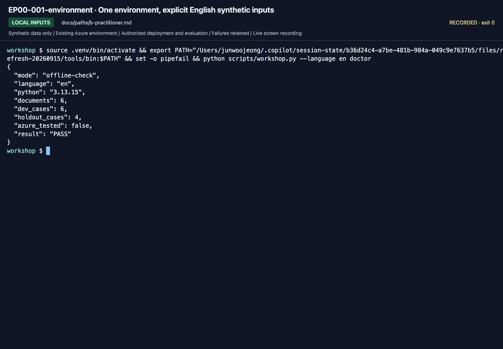

# Developer tools: one environment, optional editor integration

**English** | [한국어](../../ko/labs/extensions/developer-toolkit.md)

**Path B preparation.** The canonical route uses the repository's Python CLI.
Foundry Toolkit is an optional editor interface, not a second implementation or a reason to install every new SDK.

## 1. Confirm the actual Python and project

Complete [Lab 00 B](../00-start.md#b-code-one-folder-one-environment).
In VS Code, open the repository folder and choose its `.venv` with **Python: Select Interpreter**.
Open a new terminal at the same root and activate that environment.

```bash
python --version
python -m pip check
python scripts/check_sdk.py
python scripts/workshop.py --language en doctor
python scripts/workshop.py --language en doctor --cloud
```

An offline PASS does not prove cloud authentication.
A successful cloud preflight does not prove model feature support; complete Lab 02's actual request.

<!-- edition-checkpoint:EP00-001-environment -->



**What to check:** The recorded environment check identifies the actual Python and explicit English source path. It does not prove model or deployment success. Your resource names and IDs will differ.

[Watch this recorded action](https://github.com/user-attachments/assets/798a020d-664c-480e-83ba-f2cb381139da#t=2.00) · [All actions and failures](../../edition-actions.md)

## 2. Inspect azd without modifying shared settings

```bash
azd version
azd ext list
azd auth login --check-status
azd ai agent init --help
```

The account, project and model values must match the setup card.
Do not change the default subscription or globally upgrade every extension during a class.
An incompatible CLI/extension combination is a preparation blocker, not a reason to skip error output.

## 3. Optional Foundry Toolkit

Use the [official installation and project setup guide](https://learn.microsoft.com/azure/foundry/how-to/develop/install-foundry-toolkit-visual-studio-code).
Install only after the owner approves the extension on that computer.

After installation:

1. Open **Foundry Toolkit** in VS Code's Activity Bar.
2. Sign in with the same intended Entra account; this is separate from assuming that a terminal login was inherited.
3. Under **My Resources**, select the exact training project.
4. Inspect its model and agent inventory; compare the IDs/endpoints with your setup card.
5. Open a source file and terminal in the same workspace; do not create a duplicate project from an unrelated template.

For Toolbox creation, use the [workshop's executable Toolbox path](toolbox.md) first.
Toolkit's tools view can then inspect that same resource rather than create another unnamed copy.

If Toolkit is not installed or cannot access the project, keep the CLI route and label editor integration **not run**.
Do not present a screenshot of the Marketplace as a successful Toolkit integration.

## 4. Record the compatibility snapshot

The committed dependency pins are the tested workshop combination, not a promise to use every package's newest release.
MAF Python 1.18 introduces vector-store abstractions, tool-loop bounds and breaking dependency/serialization changes.
Before adopting it, test the **whole** provider/Projects/OpenAI/hosting combination in a separate environment.
Do not upgrade only one library and infer compatibility from a successful import.

SDK help and generated `azure.yaml` are executable contracts.
If current help differs from a historical screenshot or source sample, keep the discrepancy and verify the intended operation before changing the guide.

**Next:** [B implementation route](../../paths/b-practitioner.md).
[MAF Python 1.18 release](https://github.com/microsoft/agent-framework/releases/tag/python-1.18.0) ·
[Workshop compatibility record](../../reference/versions.md).
