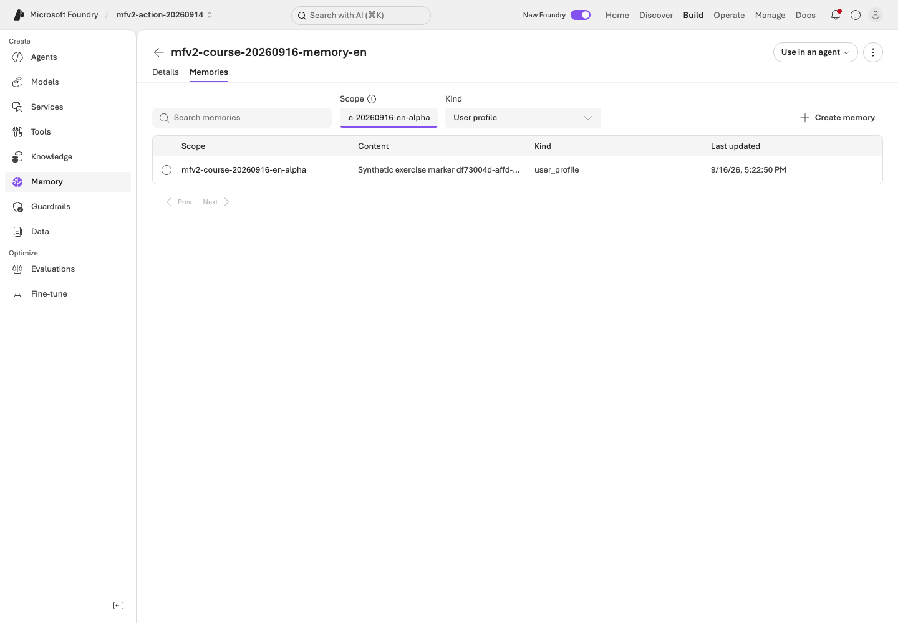

# Memory: store, recall and remove synthetic context

**English** | [한국어](../../ko/labs/extensions/memory.md)

**Path C, optional Preview — September 16, 2026.**
This first pass uses the **managed Memory Store APIs**, then explicitly passes their results to a fresh model request.
It does not enable automatic memory extraction in the core policy agent or share memory between evaluation cases.

**Need:** B's working environment, an existing supported chat model and embedding deployment,
project/model permissions, and approval for memory writes, model use and owned cleanup.
**Stop when:** a real stored item survives separate CLI calls, alpha/beta searches remain separate,
the answer uses actual retrieved memory, and owned deletion is verified.
**If blocked:** retain the error; do not switch scope, account, model or memory provider.

**First pass:** steps 1–5 within the one-hour retention window. Keep the returned `memory_id`
in the same terminal for update/forget; automatic agent memory is not part of this pass.

## 1. Configure the existing embedding deployment

Keep the project and answer deployment from your setup card.
Set `AZURE_AI_EMBEDDING_DEPLOYMENT_NAME` to the owner's actual existing embedding deployment.
Do not infer it from an example name or deploy a new model after a failure.

```bash
python scripts/workshop.py --language en memory plan
```

Check `<prefix>-memory-en`, the two synthetic scope names and `default_ttl_seconds: 3600`.
The plan creates nothing. Complete the CRUD steps within the retention window.
The long authoring session observed an item absent after that window; it did not measure an exact TTL-expiry SLA.

## 2. Create a dedicated store

```bash
python scripts/workshop.py --language en memory create --confirm-create
```

The store binds the verified chat/embedding deployments.
The local ownership record is under `outputs/memory/<store-name>/ownership.json`.
An existing store name is rejected rather than adopted.

The owner may need to grant the project identity model access in the training account.
That is separate from your own CLI login. Never replace missing roles with an API key.

## 3. Store only a bundled synthetic study question

```bash
python scripts/workshop.py --language en memory put --scope alpha --case D02 --confirm-write --confirm-cost
```

The command derives content from **dev D02** and adds a random synthetic exercise marker.
It does not store a real person's profile or a reference answer.
Copy the returned `memory_id`:

```bash
printf 'Actual memory_id from put: '
read -r MEMORY_ID
python scripts/workshop.py --language en memory inspect --scope alpha
python scripts/workshop.py --language en memory inspect --scope beta
```

Alpha must contain your item; beta should be empty in a new store.
Each command creates a fresh client, so this is persistent service state rather than a Python variable retained in memory.
An acknowledged write can briefly return 404 on read-back. The helper records the returned ID
and retries only bounded reads, never the write. If verification still times out, inspect that same item instead of creating a duplicate.

**Important:** alpha/beta are partition keys, not two authenticated people.
The same authorized operator can select either scope. This does not prove that one real user is forbidden from choosing another user's scope.

In the portal's **Memory → your store → Memories** view, enter the actual alpha or beta scope.
The default `{{$userId}}` text is not the synthetic scope you created.
Wait for **Loading memories…** to finish before interpreting an empty table or taking a result screenshot.

## 4. Recall in a new request

```bash
python scripts/workshop.py --language en memory recall --scope alpha --label memory-alpha --confirm-cost
python scripts/workshop.py --language en memory recall --scope beta --label memory-beta --confirm-cost
```

The helper first calls the actual managed memory search API.
It verifies the returned `memories[].memory_item` IDs/content/scope, then sends only those records to a **fresh, stateless** model request.
The beta request receives no alpha context or prior response history.

Inspect `outputs/memory-runs/<label>/request.json`, `search.json`, `response.json` and `summary.json`.
Check the actual search ID, memory IDs, response model/ID and usage where returned.
The model must not repeat a marker from another scope.
`native_agent_memory_tool_used: false` is intentional: this is explicit API-backed memory, not the automatic agent-tool path.

An empty alpha search after writing is a finding to diagnose, not permission to fabricate recall.
Keep the original empty result and indexing/service error before an explicitly new attempt.

<!-- edition-checkpoint:EP17-108-alpha-content -->



**What to check:** The actual alpha scope contains only the updated synthetic marker/question. Selecting a partition is not authentication as a different user. Your resource names and IDs will differ.

[Watch this recorded action](https://github.com/user-attachments/assets/798a020d-664c-480e-83ba-f2cb381139da#t=428.40) · [All actions and failures](../../edition-actions.md)

## 5. Update the item, then forget it

Change the stored study question from historical D02 to current D01:

```bash
python scripts/workshop.py --language en memory update --scope alpha --case D01 --memory-id "$MEMORY_ID" --confirm-write --confirm-cost
python scripts/workshop.py --language en memory inspect --scope alpha
```

The item keeps its identity and marker, and the helper reads back the exact new content.
This is explicit CRUD, not an LLM automatically deciding to rewrite a memory.

After deletion approval:

```bash
python scripts/workshop.py --language en memory forget --memory-id "$MEMORY_ID" --confirm-delete
python scripts/workshop.py --language en memory inspect --scope alpha
python scripts/workshop.py --language en memory inspect --scope beta
python scripts/workshop.py --language en memory cleanup --confirm-delete
```

The item must be absent after deletion. Cleanup verifies the owned store marker and requires the known items/scopes to be empty.
Deletion can take a short time to become visible. The helper retains the delete receipt and performs
bounded read-back checks; it does not repeatedly submit delete requests.
If retention or another authorized cleanup already removed the item, `forget` reports
`already_absent: true` and `delete_requested: false`; it does not claim to have performed a new deletion.
It never removes the shared project, models or another store.
The source questions, request/response evidence and ownership receipts remain.

## Optional: automatic agent memory is a different configuration

<details>
<summary>Reference only — do not enable automatic extraction to complete the API exercise</summary>

Foundry's `memory_search_preview` tool can extract memories after conversations, with an update delay,
and support direct remember/forget commands. A scope of `{{$userId}}` can use the caller identity or a trusted backend's `x-memory-user-id` header.
Do not trust an arbitrary end user's header as an authorization boundary.

That agent-tool workflow needs separate extraction/retention tests and deletion checks for queued updates.
The API-backed run above does not prove automatic extraction, native user authorization or permanent privacy erasure across every service.
Keep memory out of the isolated dev/holdout benchmark unless it is a separately frozen experimental variable.

</details>

**Next:** [Routines](routines.md), [C module selection](../../paths/c-advanced.md), or [Lab 11](../11-capstone.md).
[Official memory lifecycle, scopes and API shapes](https://learn.microsoft.com/azure/foundry/agents/how-to/memory-usage).
