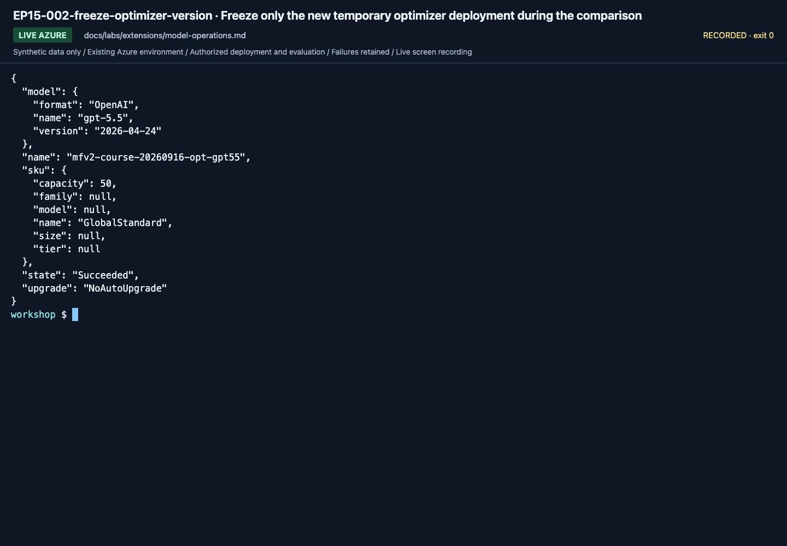

# Model operations: compare deliberately, preserve rollback

**English** | [한국어](../../ko/labs/extensions/model-operations.md)

**Path C.** Model migration is more than changing a deployment name.
The first pass compares **two already approved deployments** with the same dev inputs;
Router and retirement planning are separate extensions.

**Need:** the real [Lab 07](../07-evaluation.md) candidate, a second approved deployment,
matching API/Structured Outputs support, cost approval and new labels.
**Stop when:** the comparison includes actual model identities, all rows/errors and a written migration decision.
**If blocked:** retain the existing model; never let an error choose another deployment or endpoint.

## 1. Freeze the baseline

Record the candidate's actual deployment/model/version, project/API, prompt, corpus, retrieval,
output limit and data hashes. Preserve its original run directory.
Do not use a Router as a fixed-model baseline or reuse results from another language.

The new deployment must already exist and be permitted in the same experiment.
This lab does not deploy models or increase quota.

<!-- edition-checkpoint:EP15-002-freeze-optimizer-version -->



**What to check:** Only the separately approved temporary optimizer deployment was version-frozen. Existing answer/judge deployments were not replaced. Your resource names and IDs will differ.

[Watch this recorded action](https://github.com/user-attachments/assets/798a020d-664c-480e-83ba-f2cb381139da#t=196.80) · [All actions and failures](../../edition-actions.md)

## 2. Change exactly one model choice

In `.env`, change only `AZURE_AI_MODEL_DEPLOYMENT_NAME` to the approved second deployment.
Keep the remaining configuration unchanged, then perform read-only preflight:

```bash
python scripts/workshop.py --language en doctor --cloud
```

Confirm the actual underlying model/version and deployment state.
If the API or output schema is incompatible, stop. That is a migration finding, not permission to use another API for only this model.

## 3. Collect a new dev run and compare

If the original candidate used the Lab 07 `local` example:

```bash
python scripts/workshop.py --language en collect --split dev --label migration-model-b --prompt v2 --retrieval local
python scripts/workshop.py --language en evaluate --label migration-model-b
python scripts/workshop.py --language en compare --baseline candidate --candidate migration-model-b --variable model
```

If your baseline used another provider, explicitly use that same provider throughout this separate comparison.
Do not replace only the failed cases or omit errors from the denominator.
Inspect amounts, dates, citations, approval behavior, latency and token measurements together.
Restore the original deployment value after the experiment unless a migration was separately approved.

## 4. Write the lifecycle plan

| Phase | Your evidence |
|---|---|
| Discover | Actual retirement notice/date or a documented reason to migrate |
| Assess | Supported model, region, quota, API and policy fit |
| Adapt | Reviewed prompt/schema/tool changes in a separate version |
| Validate | Controlled dev comparison; final acceptance only after freezing the candidate |
| Roll out | Approved small rollout, monitored actual version and rollback trigger |
| Retire | Confirm no active callers require the old deployment before its owner removes it |

Check `versionUpgradeOption` and the actual deployment type with the owner.
An endpoint continuing to answer after an automatic model upgrade does not prove unchanged behavior.
Do not change shared upgrade settings or delete a shared model as part of a learner's experiment.

## Optional: compare Model Router as a different target

A Router is an explicitly selected routing system, not the fallback for a failed direct model.
Before testing it, record its version, routing mode and permitted model subset.
Use the same representative dev workload and read quality, estimated cost, latency and **actual selected-model distribution** together.

Use the [official Router evaluation methodology](https://learn.microsoft.com/azure/foundry/openai/how-to/evaluate-model-router)
to choose metrics and workload categories. Keep mock reports visibly distinct from real requests.
Do not report a fixed-model ranking or statistical superiority from this workshop's tiny dataset.
If a Router deployment is not prepared, record **Router not run**; do not create one implicitly.

**Next:** [Lab 11](../11-capstone.md) with the comparison, migration/rollback plan and unverified items.
[Official model migration lifecycle](https://learn.microsoft.com/azure/foundry/foundry-models/concepts/model-migration).
