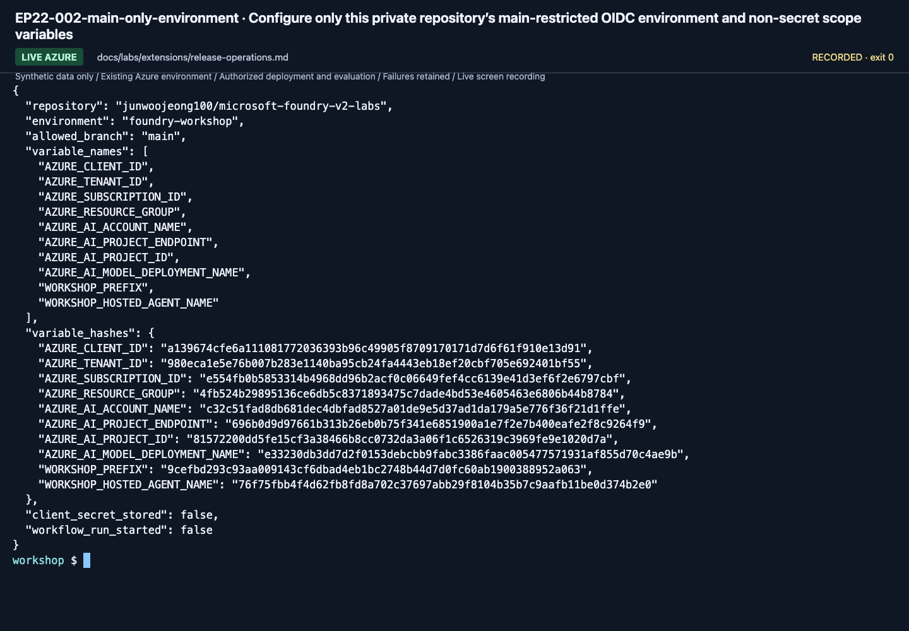

# Release operations: bounded monitoring and an explicit deployment gate

**English** | [한국어](../../ko/labs/extensions/release-operations.md)

**Path C, optional.** The repository's existing CI checks local logic, SDK contracts and documentation.
That is not a deployed-agent quality gate or continuous evaluation.
Do not enable recurring paid work or push a deployment without its own approval.

**Need:** an owned deployed agent/version, actual evaluation and trace records, an approved monitoring budget,
and a prepared GitHub OIDC identity for the deployment extension.
**Stop when:** configuration, actual execution and quality decisions are recorded separately, and temporary monitoring rules are disabled.
**If blocked:** retain the current deployment and report the missing permission/configuration; no success-shaped fallback.

## 1. Establish the evidence before automation

Use the [Hosted evaluation workbook](../../reference/evaluation-workbook.md).
Record the target version, model map, source/prompt/data hashes, native evaluator versions,
trace evidence and human acceptance status.

An automation workflow must not redefine thresholds after seeing a failing result.
It must not omit failed/missing cases or copy another target's scores.

## 2. Create a bounded recurring evaluation configuration

In Foundry, open **Build → Evaluations → Recurring Configs → Create**.
Select only your dedicated lab agent and the intended evaluation level.

Choose one mode, not both on the first pass:

| Mode | Purpose | First-pass boundary |
|---|---|---|
| Scheduled | Evaluate a selected dataset or traffic on a schedule | A short, explicitly approved test; disable immediately afterward |
| Continuous | Sample agent traffic as it occurs | Lowest supported sampling/run limit; no uncontrolled traffic generation |

Choose the appropriate dataset/live-traffic source and compatible evaluator.
Record the rule ID, agent filter, sampling mode, maximum runs, evaluator version, owner and disable plan.
Use a maximum of one hourly run where supported for the first demonstration.

Creating or enabling a rule does not prove that a sample was evaluated.
Use one planned synthetic request, then inspect that same request/rule's evaluation history.
Do not send repeated model calls solely to make a chart populate.

## 3. Inspect actual results, then disable

Open the agent's **Monitor** view and the matching evaluation run.
Verify the time range, agent/version, selected sample, completed/failed status and individual findings.
Keep missing telemetry as **unverified**, not zero errors or zero cost.

Disable the temporary recurring configuration after the test and read back its disabled state.
Keep the rule/run IDs and result artifacts. Removing a rule does not erase model, Search or logging charges.

## 4. Prepare a narrowly scoped GitHub OIDC identity

This step requires an owner and separate approval.
The identity must trust only the intended repository and branch or protected GitHub environment.
Grant only the required training-project deployment/model/tool permissions.
Do not create client secrets or grant subscription-wide Owner.
For this workflow, the deployment identity uses project-scoped **Foundry Project Manager**
and read-only account metadata access. It can then grant only project-scoped **Foundry User**
to the actual deployed runtime identity. The helper verifies the returned agent/version/principal
instead of accepting an arbitrary principal ID from a dispatch input.

Store non-secret project/tenant/subscription/client identifiers as repository or environment variables.
Do not print tokens or entire `.env` files in workflow logs.

**Use the actual subject, not a remembered name-only template.** Read the repository's current OIDC configuration:

```bash
printf 'Approved GitHub repository (owner/name): '
read -r GITHUB_REPO
gh api "repos/$GITHUB_REPO/actions/oidc/customization/sub"
```

For immutable subjects, the returned `sub_claim_prefix` includes owner and repository IDs:
`repo:<owner>@<owner-id>/<repository>@<repository-id>`.
The protected environment adds `:environment:foundry-workshop`.
Match the exact `subject`, issuer and audience emitted by `azure/login`; never print the raw token.
Do not disable immutable claims, add wildcard trust, switch to a client secret, or broaden Azure roles to fix a mismatch.

The September 17 CI check initially returned `AADSTS700213` for a legacy name-only subject.
Only the existing federation's subject was corrected to the actual immutable repository/environment claim;
the identity, issuer, audience, Azure roles and GitHub security settings were unchanged.
See the [GitHub OIDC reference](https://docs.github.com/en/actions/reference/security/oidc) and
[exact federated credential update contract](https://learn.microsoft.com/graph/api/federatedidentitycredential-update).

The official [Hosted CI/CD quickstart](https://learn.microsoft.com/azure/foundry/agents/quickstarts/set-up-cicd-hosted-agent)
is the deployment/authentication reference. Adapt it to this repository's actual package/profile and version-pinned smoke contract;
nonempty stdout alone is not proof that an agent returned a valid result.

<!-- edition-checkpoint:EP22-002-main-only-environment -->



**What to check:** The private repository environment is restricted to main and stores non-secret scope variables. Configuration is not proof of a successful workflow run. Your resource names and IDs will differ.

[Watch this recorded action](https://github.com/user-attachments/assets/798a020d-664c-480e-83ba-f2cb381139da#t=644.12) · [All actions and failures](../../edition-actions.md)

## 5. Define the release sequence

This repository includes the manually dispatched
[hosted-lab-release workflow](../../../.github/workflows/hosted-lab-release.yml).
It targets one existing project, creates no model deployments, pins the returned agent version,
and uses a six-case dev matrix as both the first-request smoke contract and the regression gate.
It does not open holdout or grant human production approval.
This first CI gate checks the complete six-row business contract. Native judging, calibration,
continuous evaluation and human production acceptance remain separately declared checks.

The workflow builds a hash-verified, profile-pinned azd project under the runner's temporary directory.
It does not reuse this repository's historical `azure.yaml` or append a CI service to an older project.
The shared `prepare_hosted_azd.py --kind workflow` helper binds only the selected existing project,
the single primary model and the invocations protocol; it initializes local environment values without provisioning.

Configure the `foundry-workshop` GitHub environment with the approved `AZURE_CLIENT_ID`,
`AZURE_TENANT_ID`, `AZURE_SUBSCRIPTION_ID`, `AZURE_RESOURCE_GROUP`, `AZURE_AI_ACCOUNT_NAME`,
`AZURE_AI_PROJECT_ENDPOINT`, the **actual** `AZURE_AI_PROJECT_ID`, `AZURE_AI_MODEL_DEPLOYMENT_NAME`,
`WORKSHOP_PREFIX`, and `WORKSHOP_HOSTED_AGENT_NAME`.
The agent name must begin with that prefix. Set branch/environment protections appropriate to the training scope.
No client secret belongs in these variables.

| Gate | Required evidence |
|---|---|
| Local checks | Offline/SDK tests, lint, compilation and documentation contracts |
| Package | Exact source/profile manifest; no secrets or evaluator answer files in the runtime |
| Deployment authorization | Manual dispatch or protected environment approval for the intended training target |
| Deploy | Actual version/endpoint and successful state, not just a log line |
| Smoke | A valid response from that exact version with real model/tool/evidence metadata |
| Quality | Complete chosen evaluation cohort and predeclared business/native requirements |
| Human decision | Explicit acceptance or pending review; no automated claim of production approval |
| Cleanup/rollback | Recorded owned sessions/rules and the previous known version |

Run the deployment workflow manually for the first exercise.
Select the dataset language and explicitly acknowledge the deployment/inference cost in its dispatch form.
The workflow fails rather than returning a skipped success when that acknowledgement is absent.
Do not add a scheduled trigger or a deploy-on-every-push rule just to demonstrate automation.
If the workflow has not been published/executed, mark **pipeline configuration only**, not CI/CD verified.

## 6. Roll back deliberately

Identify the exact previous agent/model/configuration versions before making a change.
If the smoke or quality gate fails, stop rollout and keep the failed version's artifacts.
Restoring a previous version is an explicit authorized operation; it is not another model chosen inside an exception handler.

**Next:** [Model operations](model-operations.md) or [Lab 11 handoff](../11-capstone.md).
[Monitoring and recurring-evaluation lifecycle](https://learn.microsoft.com/azure/foundry/observability/how-to/how-to-monitor-agents-dashboard).
