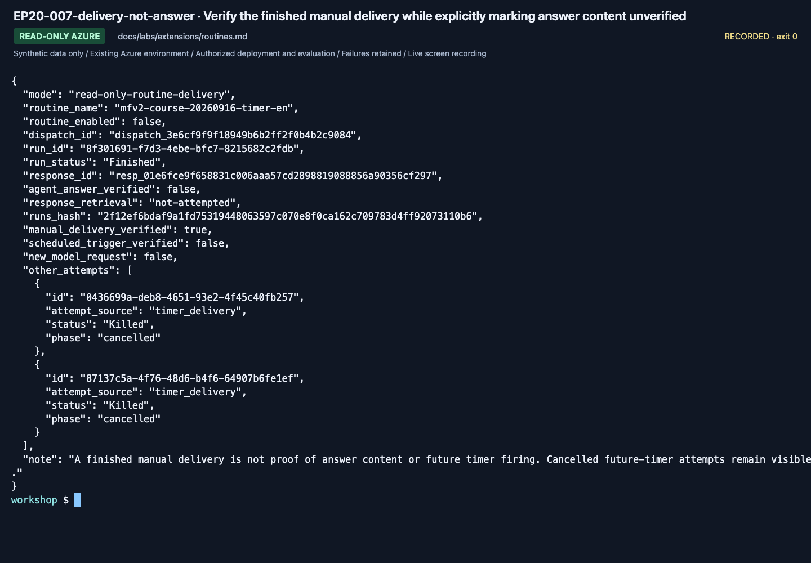

# Routines: one deliberate dispatch, then disable

**English** | [한국어](../../ko/labs/extensions/routines.md)

**Path C, optional.** A routine triggers an existing agent; it does not create an agent,
implement a durable approval service, or authorize company/Microsoft 365 access.
The inspected azd extension labels its routine command surface Preview on September 16, 2026.

**Need:** an approved existing Prompt or Hosted Responses agent, the actual project endpoint,
azd routine commands, an owned routine name and cost approval.
**Stop when:** one dispatch has an identifiable run result and the routine is disabled afterward.
**If blocked:** disable the owned routine and retain its dispatch ID/error before investigating.

**First pass:** steps 1–5 verify one manual dispatch and final disabled state.
They do not verify firing at the future timer time. Keep the same terminal and the actual returned dispatch ID.

## 1. Choose the smallest safe trigger

Use a **disabled one-shot timer**, set one day ahead, and trigger it manually during the lab.
This avoids a recurring job silently running throughout the class.
Only test the specified synthetic policy question; do not connect Teams/GitHub event sources in this first pass.

The routine uses **agent identity** by default.
That identity must already have the required model/tool permissions; the developer's local login does not supply them.
Creator/delegated-user identity is a different optional contract and is not selected here.

## 2. Confirm the CLI and values

```bash
azd ai routine create --help
azd ai routine dispatch --help
azd ai routine run list --help
```

Use the same terminal for the following steps:

```bash
printf 'Full project endpoint from your setup card: '
read -r PROJECT_ENDPOINT
printf 'Existing approved Responses agent name: '
read -r AGENT_NAME
printf 'New routine name (<your prefix>-timer-en): '
read -r ROUTINE_NAME
WHEN=$(python -c 'from datetime import datetime, timedelta, UTC; print((datetime.now(UTC) + timedelta(days=1)).isoformat())')
```

The target must be a real approved agent, not a model deployment name.
The routine references its agent's active configuration; record the actual invoked version and do not treat it as an immutable benchmark binding.

## 3. Create it disabled

After approval for this owned object:

```bash
azd ai routine create "$ROUTINE_NAME" --trigger timer --at "$WHEN" --agent-name "$AGENT_NAME" --action agent-response --enabled=false --project-endpoint "$PROJECT_ENDPOINT" --output json
azd ai routine show "$ROUTINE_NAME" --project-endpoint "$PROJECT_ENDPOINT" --output json
```

Check the actual name, project, agent, trigger time, time zone and disabled state.
Do not add `--force` to get around a collision. Use another owned name.

## 4. Dispatch once and disable

The following invocation is billable. The future timer must not be left enabled.
Run the disable command **even if dispatch fails**, then inspect the error:
Do not join disable to dispatch with `&&`, which would skip cleanup after a failure.

```bash
azd ai routine enable "$ROUTINE_NAME" --project-endpoint "$PROJECT_ENDPOINT"
azd ai routine dispatch "$ROUTINE_NAME" --input "What are the advance-approval requirements for a KRW 170000 hotel on a domestic business trip in September 2026?" --project-endpoint "$PROJECT_ENDPOINT" --output json
azd ai routine disable "$ROUTINE_NAME" --project-endpoint "$PROJECT_ENDPOINT"
azd ai routine run list "$ROUTINE_NAME" --project-endpoint "$PROJECT_ENDPOINT" --output json
azd ai routine show "$ROUTINE_NAME" --project-endpoint "$PROJECT_ENDPOINT" --output json
```

Keep the dispatch ID and action correlation ID. A queued dispatch is not a completed agent response.
On the observed CLI build, `run list` can print `value: null` even when SDK history
contains the run. That CLI shape is not proof of no execution. Verify the exact returned dispatch
using the read-only SDK helper:

```bash
printf 'Returned dispatch ID: '; read -r DISPATCH_ID
python scripts/workshop.py --language en routines inspect --name "$ROUTINE_NAME" --dispatch-id "$DISPATCH_ID" --label routine-result
```

This verifies **delivery**, not answer content. The observed agent-identity routine completed,
but its returned response ID produced 404 on later retrieval. Record that boundary rather than
call the agent directly and present the replacement as a routine answer.
`--verify-response` with a new label attempts explicit response verification and fails visibly
when the original response is unavailable. It never repeats the model request.
Inspect the matching run's state and returned answer/error; list again only to observe that same run, not to dispatch another.
Confirm the final routine state is disabled before leaving the lab.

<!-- edition-checkpoint:EP20-007-delivery-not-answer -->



**What to check:** The original manual delivery finished, but agent_answer_verified is false. Cancelled future-timer attempts are not successful scheduled firings. Your resource names and IDs will differ.

[Watch this recorded action](https://github.com/user-attachments/assets/798a020d-664c-480e-83ba-f2cb381139da#t=556.72) · [All actions and failures](../../edition-actions.md)

## 5. Record the outcome and clean up

Retain the creation configuration, exact dispatch/run IDs, target version where reported,
actual answer/error, and final disabled state. Do not replace missing run results with a direct agent call and call that a routine success.

After checking that no other workflow uses it, remove only the owned routine using the current
`azd ai routine delete --help` syntax or the project's routine management page.
Deleting a routine does not remove the target agent, model, Search service or historical run evidence.

## Recovery and boundaries

| Symptom | Response |
|---|---|
| Unknown `routine` command | Stop and prepare a compatible azd/extension combination; do not upgrade all shared tools blindly |
| CLI cannot decode `created_at` or another response field | The write may have succeeded. Preserve the error and inspect show/list before another create |
| Target model/tool 403 | Check the routine's actual dispatch identity and target permissions |
| No matching run yet | Observe the same dispatch's asynchronous history; do not generate repeated billable runs |
| Wrong trigger or agent | Disable first, review the owned definition, then perform an explicit authorized change |

A recurrent schedule, GitHub issue trigger or Teams event requires a separate exercise,
consent/cost review and cleanup owner. None is enabled automatically here.

**Next:** [C module selection](../../paths/c-advanced.md) or [Lab 11 handoff](../11-capstone.md).
[Official routine lifecycle](https://learn.microsoft.com/azure/foundry/agents/how-to/use-routines).
