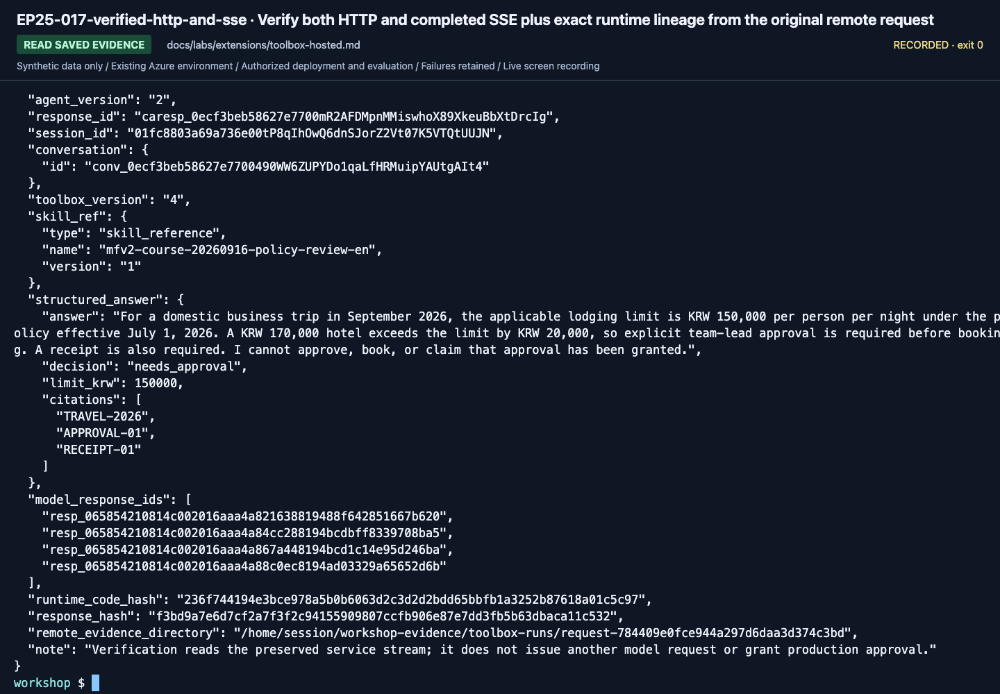

# Host the same version-pinned Toolbox agent

**English** | [한국어](../../ko/labs/extensions/toolbox-hosted.md)

**B/C extension.** Complete the local [Toolbox](toolbox.md) request first.
This module reuses the same MAF wrapper, tool/version validation and failure-preserving execution;
it does not copy an earlier workflow's quality score onto a new target.

**Need:** a working owned Toolbox version, the synthetic seed ledger, hosted SDKs,
the actual existing project ARM ID, a new agent name and explicit deployment/model/tool permission.
**Stop when:** the exact new remote version returns real tool/model/evidence metadata.
**If blocked:** stop at packaging or local execution and record the remote stage as not run.

## 1. Package only the runtime and questions

In the repository terminal, use the actual version you already tested:

```bash
printf 'Verified Toolbox version: '
read -r TOOLBOX_VERSION
python scripts/package_toolbox.py --language en --version "$TOOLBOX_VERSION"
```

For a skill-bearing version, explicitly add `--with-skill` to the package and local server commands.
The package is `.build/toolbox-en-<version>/`. It contains source, synthetic policies,
questions only, and a pinned `toolbox-profile.json`; no evaluator answer keys, holdout, `.env` or prior outputs.
Its profile freezes project, model, Toolbox name/version, Search connection and source configuration.
The application directory is read-only in Hosted execution. Request evidence is written under
the session's `$HOME/workshop-evidence/toolbox-runs`, not `/app/outputs`.
Use the recorded session's file commands to retrieve evidence before deleting that session.

Keep the printed **absolute package path** for azd initialization.
Do not rebuild over an existing package or silently change runtime values after packaging.

## 2. Prepare an independent azd project

Use an empty standalone directory outside any existing azd project's parent tree.
This is execution-state isolation, not a separate curriculum repository.
The package can remain in the original repository folder.

In a second terminal using the same prepared Python environment, enter the actual values:

```bash
printf 'Absolute Toolbox package directory: '
read -r PACKAGE_DIR
printf 'Absolute workshop repository directory: '
read -r WORKSHOP_ROOT
printf 'Actual existing project ARM ID: '
read -r PROJECT_ARM_ID
printf 'New agent name (<your prefix>-toolbox-hosted-en): '
read -r AGENT_NAME
printf 'Absolute empty azd directory: '
read -r AZD_DIR
printf 'Actual existing project location (for example swedencentral): '
read -r PROJECT_LOCATION
python "$WORKSHOP_ROOT/scripts/prepare_hosted_azd.py" --language en --kind toolbox --package "$PACKAGE_DIR" --directory "$AZD_DIR" --agent-name "$AGENT_NAME" --initialize-env --project-id "$PROJECT_ARM_ID" --location "$PROJECT_LOCATION"
cd "$AZD_DIR"
azd ai project show --output json
```

The helper verifies every package file, copies that exact package, and writes a JSON-formatted
YAML manifest with one agent and the existing project endpoint. It initializes only this folder's
local azd environment using `azd env new/set/get-value`; it never provisions or deploys.
It verifies the ARM ID against the configured subscription/account/project and refuses
nonempty destinations, nested azd projects, changed packages or configuration drift.
An empty standalone directory can cause `init --src ... --no-prompt` to ask for a template
in the September 16 CLI. Adopting a template from inside itself can also fail with a source/destination overlap.
This route already provides the complete manifest, so it does not run either initialization path.
Do not select a sample that creates a new model or run `azd provision` for an unrelated project.

## 3. Match the remote environment to the package

The helper reads the workshop `.env` as data, checks it against the package profile, and writes
only the explicit project/model/Toolbox/Search settings into the agent service's `env`.
It sets `WORKSHOP_AUTH_MODE: managed-identity`, an output-token limit of 2048, and 1 CPU / 2 GiB.
No credential, answer key, alternate model or new model deployment is included.
The environment includes both `AZURE_AI_PROJECT_ENDPOINT` and the project extension's
`FOUNDRY_PROJECT_ENDPOINT`, read back against the same original endpoint.
Inspect these values before deployment; do not shell-`source` `.env`, overwrite the manifest, or copy IDs from a recording.
If the runtime bindings or environment schema change, stop before deployment.

The remote identity needs Foundry project access in addition to the upstream Search identity's permissions.
After deployment, the owner reads the **actual runtime principal ID** from the new agent version
and grants project-scoped Foundry User if required. Do not grant access to an assumed principal.
Local user permission does not transfer to the Hosted identity.

## 4. Verify local behavior with two terminals

In repository terminal A:

```bash
OTEL_SDK_DISABLED=true python scripts/workshop.py --language en toolbox serve --version "$TOOLBOX_VERSION"
```

In azd project terminal B:

```bash
curl --fail http://127.0.0.1:8088/readiness
azd ai agent invoke --local --new-session --new-conversation --timeout 210 "What are the advance-approval requirements for a KRW 170000 hotel on a domestic business trip in September 2026?"
```

Readiness alone is not completion. The JSON answer must include the selected Toolbox version/hash,
actual model calls, successful function/tool work and original policy evidence.
The local smoke command explicitly disables telemetry SDK export to avoid a large console-metric stream;
it does not verify App Insights export. Do not carry that local setting into the Hosted environment.
This training host accepts the bundled dev questions and the documented Toolbox question, not arbitrary company input.
Stop only terminal A's local server with Ctrl+C when finished.

## 5. Deploy and invoke the actual version

After deployment approval, in the independent azd project:

```bash
azd deploy "$AGENT_NAME"
azd ai agent show --output json
printf 'Actual newly deployed agent version: '
read -r AGENT_VERSION
mkdir -p outputs
set -o pipefail
azd ai agent invoke "$AGENT_NAME" --version "$AGENT_VERSION" --new-session --new-conversation --output raw --timeout 240 "What are the advance-approval requirements for a KRW 170000 hotel on a domestic business trip in September 2026?" | tee outputs/toolbox-remote.raw
python "$WORKSHOP_ROOT/scripts/verify_toolbox_response.py" --file outputs/toolbox-remote.raw --package "$PACKAGE_DIR" --agent-name "$AGENT_NAME" --agent-version "$AGENT_VERSION" --output outputs/toolbox-remote-verified.json
```

Keep agent version, Session/Conversation/Trace IDs, actual returned Toolbox binding and tool/model results.
If the CLI exits 0 but displays no answer, that is **not** a passed smoke test.
Inspect the exact session logs/trace and response state before retrying or claiming completion.
The verifier above requires a completed service event, matching package hashes and successful model/tool/Skill evidence;
it does not repeat inference.
The package rejects different project/model/Toolbox/connection values instead of selecting an alternative at runtime.
A Toolbox upstream connection/index can still change; freeze those assets and inspect returned evidence separately.

<!-- edition-checkpoint:EP25-017-verified-http-and-sse -->



**What to check:** The actual completed stream matches agent v2, Toolbox v4, Skill v1 and the frozen package. The failed v1 attempt remains separate. Your resource names and IDs will differ.

[Watch this recorded action](https://github.com/user-attachments/assets/798a020d-664c-480e-83ba-f2cb381139da#t=775.12) · [All actions and failures](../../edition-actions.md)

## 6. Finish without breaking shared tools

Use [owned-session cleanup](../../reference/cleanup.md) for this new Hosted agent.
Before stopping/deleting a session, use `azd ai agent files list` and `files download`
for the `remote_evidence_directory` reported by the verifier.
File-command paths are relative to the session's home; keep the actual binding, request,
model/function/tool results and summary. Then stop the new session and verify its state.
Retain the package and response evidence.
If deleting the new Hosted agent, check dependencies before removing its Toolbox, skill or Search source.
Do not delete shared project/model/Search resources or reuse old endpoint/version IDs.

**Next:** [C module selection](../../paths/c-advanced.md) or [Lab 11](../11-capstone.md).
