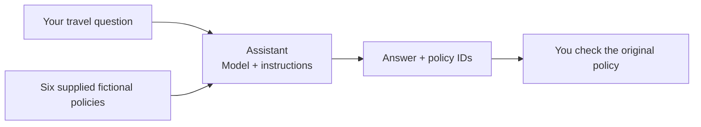

# A. Beginner: build one grounded agent, without writing Python

**English** | [한국어](../ko/paths/a-beginner.md)

**Finish with your own agent, a six-question assessment, one workflow review, trace status and a cleanup handoff.**
Follow only the A rows below. The 270-minute teaching plan assumes setup, permissions and installations are already complete; it is not a measured learner duration.

## Understand what you are building

Imagine someone asks: **"What is the domestic business-trip lodging limit per night for September 2026?"**
You will give an assistant the fictional Hanbit Technology policies so it can answer from those documents,
show which policy it used, and say when the evidence is insufficient. It must not approve or book a trip.
You do not need to write Python or memorize the reference documents.

| Word you will see | Meaning in this exercise |
|---|---|
| Foundry / project | The Azure platform / your prepared workspace in it |
| Model / deployment | The engine that generates answers / its callable name; use the prepared `gpt-6-sol` |
| Agent | Your configured assistant: a model with instructions, evidence and permitted tools |
| Instructions | Rules the assistant should follow on every question, not the question itself |
| Grounding / citation | Basing an answer on supplied evidence / naming that evidence, such as `TRAVEL-2026` |
| Saved version | A numbered snapshot of the agent's configuration; saving instructions does not train a new model |

**Your first milestone is Labs 00–03:** open the right project, see the model without policy evidence, then save an agent
with that evidence and check four answers. Keep its instructions and your actual findings, even if an answer is wrong.
This is **not full A completion**: Labs 05–11 add the workflow, source review, six-question assessment and cleanup handoff.
Use the sequence below; do not jump directly to Lab 03.

## Start here

Complete [setup](../setup.md): get the English learner ZIP, then record the owner's values.
**Learning alone?** You are the owner too: complete [the self-study preparation](../setup-owner.md#self-study) first.
Open `START-HERE.txt`. Use the prepared **gpt-6-sol** deployment and the ZIP's ready instructions, questions
and blank worksheets; do not assemble your own inputs or report format.
For Lab 05 you run one prepared option: by default a terminal with the workshop code installed and your own Azure sign-in.
A Hosted Responses Playground is used only if the owner verified it before class.
If neither is prepared, complete [Lab 00 B setup](../labs/00-start.md#path-b) and [Lab 02 B](../labs/02-models.md#path-b) before this timed route,
then return to **step 1 below (Lab 00 A)**, not Lab 03 B.

**First-pass choices are already made:** put the six policies directly in Instructions (**inline**), run one prepared workflow,
assess the six practice questions (**dev**) yourself, and record the request-history (**trace**) status in Lab 09.
File Search, IQ Chat, Hosted deployment, cloud judges and C modules are **not selected** unless you opt in separately.
The numbered links below open A's exact section; use **A done** to leave each lab.

## Know which window to use

Keep this guide and the Foundry portal in separate browser tabs. Open your personal files beside them.

| Place | What you do there | Do not put there |
|---|---|---|
| This guide on GitHub | Read the next A step and its expected result | Your answers or credentials |
| Foundry portal, `ai.azure.com` | Paste the complete instruction file into **Instructions**; send only a question in **Message the agent...** | Terminal commands or the assessment criteria |
| Extracted learner folder in a text/spreadsheet editor | Save observations in `session-notes.txt`, workflow review in `workflow-review.txt`, and later answers in `assessment-baseline.csv` | Another learner's results; do not edit inside the ZIP preview |
| Prepared terminal, Lab 05 only | Copy the one supplied workflow command and inspect its saved output | Instructions or questions pasted as bare commands |

**For every lab: read → do → check → save → follow A done.** A screenshot helps locate a control; it is not the answer you should copy.
When the wording of your model's reply differs, compare the amount, date, source and approval conditions, not identical sentences.
**No reply or an error is different from a wrong answer:** preserve the error and use that lab's **If blocked** instructions.
Read only A and the shared opening card; collapsed **Optional**, B and C sections are not extra steps.
If a term is still unfamiliar, use the [glossary](../reference/glossary.md), then return to the same step.

## Your sequence

| Step | Open and do | Stop when |
|---|---|---|
| 1 | [Lab 00 A](../labs/00-start.md#path-a): account, project and files | Setup section of `session-notes.txt` is filled |
| 2 | [Lab 01 A](../labs/01-foundry.md#path-a): distinguish account/project/deployment/agent | Add your four-object sketch and actual endpoint |
| 3 | [Lab 02 A](../labs/02-models.md#path-a): Playground | Save one actual answer and one missing-evidence observation in `session-notes.txt` |
| 4 | [Lab 03 A](../labs/03-prompt-agent.md#path-a): paste the complete inline instructions and Save | Save `instructions-baseline.txt`; link its agent/version and four actual checks in `session-notes.txt` |
| 5 | [Lab 05 A](../labs/05-workflows.md#path-a): one prepared sequential terminal command; Hosted Playground only if preselected by the owner | `workflow-review.txt` contains the execution option, complete actual output/ID and your review |
| 6 | [Lab 06 A](../labs/06-knowledge.md#path-a): inspect cited policy IDs and dates | Source checks are in `session-notes.txt`; IQ Chat is not selected on the default route |
| 7 | [Lab 07 A](../labs/07-evaluation.md#path-a): assess all six dev questions on one saved version | Six real answers/citations/reasons in `assessment-baseline.csv`; record the version and passed / 6 in `session-notes.txt`. Candidate only for a justified change |
| 8 | [Lab 09 A](../labs/09-operations.md#path-a): operations and trace check | `operations-checklist.txt` identifies owned assets, remaining costs, and actual trace evidence or `trace unverified: <reason>` |
| 9 | [Lab 11 A](../labs/11-capstone.md#path-a): handoff | The evidence folder is complete and cleanup ownership is clear |

**Total:** 270 minutes including breaks and buffer. Do not continue into a B/C section just because it appears below an A section.
It does not include optional Preview approvals, new infrastructure or waiting for SDK installation.

## What A does not require

You do not create a Toolbox, deploy a Hosted agent, author a workflow, run an optimizer,
or access company/Microsoft 365 data. A ready Toolbox can be demonstrated as a shared tool collection;
watching that demonstration is not your own Toolbox creation.

The browser agent's instructions, uploaded files, IQ knowledge base, Toolbox and memory are different assets.
An agent is not correct merely because it has a tool, a citation or a fluent answer.

## When something fails

For missing project/model/access, return to the owner and [setup](../setup.md); learning alone, fix the matching
[self-study step](../setup-owner.md#self-study) yourself.
Wrong answers stay in the assessment; six reviewed real answers can complete it even with failures.
Missing answers, request errors or mixed versions mean **assessment incomplete**: keep the files and record the reason in `session-notes.txt`,
then continue to [Lab 09 A](../labs/09-operations.md#path-a) and [Lab 11 A](../labs/11-capstone.md#path-a) for operations and handoff.
Do not substitute another learner's output, an offline fixture or a recorded response.
A missing optional feature stays **not run**; missing traces are `trace unverified: <reason>`.

**Pause/resume:** write the last completed lab/step, agent version and next link in `session-notes.txt`.
Reopen that same project and saved version; read existing results before sending a new, billable question.
Do not recreate the agent or repeat earlier labs merely to resume.

**Finish:** [Lab 11 handoff](../labs/11-capstone.md#path-a).
**Continue later:** [B. Implementation](b-practitioner.md). Start with [Lab 00 B's source-folder setup](../labs/00-start.md#source-folder);
the small A learner ZIP is not the code repository. Keep an existing prepared source copy if you already have one.
