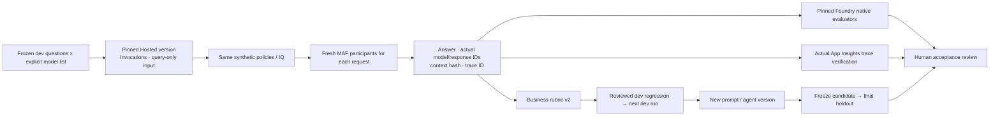

# Hosted workflow evaluation and learning-loop workbook

**English** | [한국어](../ko/reference/evaluation-workbook.md)

**Compatibility checked September 15, 2026. Advanced track: 150–180 minutes, excluding environment preparation and service waits.**
Use this repository's code, knowledge, and datasets; no separate evaluation repository is required.
Counts below define the experiment, not a promise that every model will pass.
English uses the separately frozen English prompt/corpus/dev/calibration/holdout bundle.
Original Korean assets remain unchanged; do not compare the two language datasets as an isolated prompt experiment.

**First pass:** sequential workflow, GA IQ, account Chat Completions, Invocations, and the explicit prepared model list.
Follow steps 2–10 once. The default commands do **not** assume a reviewed regression exists.
Run one block, inspect its result, then continue; do not paste the entire workbook into a terminal.
Keep source commands at the repository root. Standalone azd directories are selected explicitly, not by changing the shell's folder.

## 1. What this adds to the introductory evaluation

The original `collect/evaluate` path evaluates project Responses outputs.
This workbook collects answers **actually generated by one exact Hosted agent version**, separated by model.
Scores from the two paths are not interchangeable.



| Item | Contract |
|---|---|
| Models | 1–8 explicit deployments in `WORKSHOP_MODEL_DEPLOYMENTS_JSON`; no duplicate aliases for the same deployment |
| Cases | Six bundled dev cases and four holdout cases; do not change their questions or reference answers |
| Four-model run | Baseline 24 + candidate 24 + final holdout 16 = 64 rows |
| Logical model calls | Sequential workflow: 3 per row. Concurrent/group-chat: 4 including the final reviewer. Retries, retrieval, and judges are additional |
| Isolation | Compute sessions may be reused, but each request creates fresh MAF participants and conversation state |
| Agent input | Exactly `question`, `model_key`, `case_id`, and `run_id`; never evaluator labels or holdout files |
| Failures | HTTP, JSON, and contract failures remain rows. Never evaluate only the successful prefix of an incomplete run |
| Acceptance | Execution, business correctness, native quality, traces, and calibration are separate. CLI success is not production approval |

<a id="matrix-setup"></a>

## 2. Instructor preparation and explicit model selection

Use an independent new copy of v2, **not a subdirectory of another azd project**.
Do not silently inherit a previous agent version or `.azure` environment.
Complete [Lab 00](../labs/00-start.md) and [Lab 06](../labs/06-knowledge.md) first.
Complete the selected [Hosted SDK](../labs/extensions/developer-toolkit.md#hosted-sdk) and
[azd checks](../labs/extensions/developer-toolkit.md#azd-check) too; B's package-only step does not install them.
Keep this source copy's synthetic Search ownership ledger.

Enter verified values in `.env`. If four deployments are not available, explicitly choose a smaller list and record its actual denominator.
The collector never substitutes another model after an error.

```dotenv
# Replace every <...> with a value verified by the instructor.
AZURE_AI_MODEL_DEPLOYMENT_NAME=<model-a-deployment>
WORKSHOP_MODEL_DEPLOYMENTS_JSON={"a":"<model-a-deployment>","b":"<model-b-deployment>","c":"<model-c-deployment>","d":"<model-d-deployment>"}
AZURE_OPENAI_ENDPOINT=https://<same-foundry-account>.openai.azure.com
AZURE_AI_EVALUATION_MODEL_DEPLOYMENT_NAME=<separate-judge-deployment>
WORKSHOP_HOSTED_AGENT_NAME=<unique-mfv2-agent-name>
AZURE_APPLICATION_INSIGHTS_APP_ID=<connected-application-insights-app-id>
# Explicit small-corpus recall experiment; a retrieval filter, not an evaluator threshold.
WORKSHOP_IQ_RERANKER_THRESHOLD=0
```

The account endpoint must belong to the **same Foundry account** as the project.
The first English dev run retained a 20/24 result because the default IQ reranker filter omitted the scope policy.
For the corrected pair, explicitly select the same recall setting in local and deployed configuration.
Preserve that original cohort; do not compare its different retrieval configuration as a prompt-only change.
This workbook explicitly selects `account-chat`.
To choose another API, start a separately declared experiment and change `--api` consistently in package, serve, smoke, plan, and collect commands.
It is not an error-triggered fallback.

| API | Implementation | Use |
|---|---|---|
| `project-responses` | Project Responses through AIProjectClient | Introductory default |
| `account-chat` | Explicit same-account base URL and AAD token provider through the project SDK, with MAF Chat Completions | When every selected deployment's API support has been verified |

The pipeline requests JSON through its prompt and validates it strictly in Python.
Do not describe that as service-enforced Structured Outputs.
No four frontier models, regions, quotas, or successful outcomes are guaranteed for every subscription.

## 3. Package and bind the V1 workflow

```bash
python scripts/workshop.py --language en runtime-contract --kind workflow --pattern sequential --retrieval iq --prompt v1 --api account-chat --protocol invocations
python scripts/package_hosted.py --language en --kind workflow --pattern sequential --retrieval iq --prompt v1 --api account-chat --protocol invocations
```

The package is `.build/workflow-sequential-iq-v1-account-chat-invocations-en/`.
Review `runtime-profile.json` and every file hash in `package-manifest.json`.
Evaluation data, reference answers, calibration, and personal `.env` files are excluded.

Prepare a **new empty absolute directory outside the source repository and all existing azd projects**.
The helper copies the verified package, writes the complete one-agent manifest and initializes local azd state.
It does not provision, deploy or assign roles. No template selection or manual YAML/env merge is required.

```bash
printf 'Absolute V1 package path printed above: '
read -r HOSTED_PACKAGE
printf 'New empty absolute V1 azd directory: '
read -r HOSTED_DIRECTORY
printf 'Same agent name as WORKSHOP_HOSTED_AGENT_NAME in .env: '
read -r HOSTED_AGENT_NAME
printf 'Actual existing project ARM ID from the owner: '
read -r PROJECT_ARM_ID
printf 'Actual existing project location code: '
read -r PROJECT_LOCATION
python scripts/prepare_hosted_azd.py --language en --kind matrix \
  --package "$HOSTED_PACKAGE" --directory "$HOSTED_DIRECTORY" \
  --agent-name "$HOSTED_AGENT_NAME" --initialize-env \
  --project-id "$PROJECT_ARM_ID" --location "$PROJECT_LOCATION"
```

Open the returned `azure.yaml`. Verify one existing project, one intended agent, the copied package,
Python 3.13/`main.py`, and Invocations 1.0.0.
Its `env` must match `.env` for the project/account endpoints, model map, Search index/source/base,
reranker filter and output limit; remote authentication is `managed-identity`.
There must be no model-deployment list, evaluator settings, secrets or reference-answer files.
Save both paths, the service name and the actual project values in `session-notes.txt`.

Prepare permissions separately for the local user and **deployed agent instance identity**.
Account Chat Completions needs account inference access; IQ needs Search read access.
The collector does not create roles or change the default subscription.
If preparation fails, preserve the directory/error and resolve it before using a new empty directory.
`--kind matrix` accepts only this sequential IQ/account-chat/Invocations v1/v2 profile.
The introductory `runtime` and single-model CI `workflow` presets are not substitutes.
**September 17 preparation revision:** generated manifests and scoped commands are checked locally;
the September 15 recordings do not verify this new setup sequence.

## 4. Keep local and remote smoke tests separate

**Local smoke requires `--azd-directory`.** It rejects an omitted directory before creating smoke evidence or invoking azd;
it never chooses the source copy's historical `.azure` state for you. Remote smoke still uses the exact configured endpoint/version.

Terminal A:

```bash
source .venv/bin/activate
python scripts/workshop.py --language en serve --kind workflow --pattern sequential --retrieval iq --prompt v1 --api account-chat --protocol invocations
```

Terminal B, at the same source root with `.venv` active:

```bash
printf 'Standalone V1 azd directory from step 3: '
read -r HOSTED_DIRECTORY
curl --fail http://127.0.0.1:8088/readiness &&
python scripts/workshop.py --language en benchmark smoke --local --azd-directory "${HOSTED_DIRECTORY:?Use the prepared V1 directory}" --label smoke-v1-local --kind workflow --pattern sequential --retrieval iq --prompt v1 --api account-chat --case D01 --model-key a --confirm-cost
```

Readiness is `{"status":"healthy"}`. It is not inference success.
Inspect the actual answer, model/response IDs, and context hash.
The raw azd HTTP parser checks UTF-8 **byte lengths** and preserves only recognized update notices separately.
It never extracts an arbitrary success-looking JSON object after an error.

Stop terminal A with `Ctrl+C`, then return to that terminal with its step-3 values.
After deployment/cost approval, deploy only the named service in the standalone directory:

```bash
azd deploy "${HOSTED_AGENT_NAME:?Use the prepared agent service name}" --cwd "${HOSTED_DIRECTORY:?Use the prepared standalone directory}" &&
azd ai agent show --cwd "${HOSTED_DIRECTORY:?Use the prepared standalone directory}" --output json
```

Copy the actual name, numeric version, and **complete Invocations endpoint** into the three
`WORKSHOP_HOSTED_AGENT_*` variables. `latest`, guessed URLs, and other projects are rejected.
Stop on deployment failure rather than using an old active version.
The local smoke output remains in `outputs/smoke/smoke-v1-local/` in the source copy.
Remote smoke uses the exact endpoint/version from `.env`; it does not need `--azd-directory`.

```bash
python scripts/workshop.py --language en benchmark smoke --label smoke-v1-remote --kind workflow --pattern sequential --retrieval iq --prompt v1 --api account-chat --case D01 --model-key a --confirm-cost
```

## 5. Collect every model's baseline

```bash
python scripts/workshop.py --language en benchmark plan --kind workflow --pattern sequential --retrieval iq --prompt v1 --api account-chat
```

Confirm the planned model list, rows and cost scope, then collect:

```bash
python scripts/workshop.py --language en benchmark collect --label wf-baseline --kind workflow --pattern sequential --retrieval iq --prompt v1 --api account-chat --concurrency 1 --confirm-cost
```

Inspect the complete collection and its errors before paying for a judge job.
Do not evaluate a partial collection or ignore a nonzero collection exit:

```bash
python scripts/workshop.py --language en benchmark evaluate --label wf-baseline --confirm-cost
```

After that saved job completes, render the local report:

```bash
python scripts/workshop.py --language en benchmark report --label wf-baseline
```

`outputs/benchmarks/wf-baseline/` contains frozen dataset/corpus snapshots, manifest, every response, raw HTTP,
business checks, native catalog/run/output, and an HTML report.
Four models require **24 rows**.
If needed, choose concurrency 2 or 4 beforehand and keep it unchanged across cohorts.
The default is 1 for bounded throughput and easier inspection.

Business rubric v2 checks schema, decision, limit, required/retrieved citations, **the amount stated in the answer**, and citation relevance.
The default gate is 6/6 for each model. Errors stay in the denominator.
Successful-request p50/p95 is reported separately; missing usage/latency is `None`, not zero.
Wilson intervals illustrate small-sample uncertainty, not production SLAs or statistical rankings.

Native evaluation scores **previously generated Hosted answers**. It is not an agent-target run that invokes the target again.
Keep native groundedness/relevance separate from business checks.
Only failed/invalid native attempts can use `--retry-failed`; the original attempt and catalog remain.
A completed low score is not a reason to keep retrying until a favorable score appears.

## 6. Verify real traces and review dev regressions

```bash
python scripts/workshop.py --language en benchmark trace-plan --label wf-baseline
python scripts/workshop.py --language en benchmark monitor --label wf-baseline
```

The first command only writes KQL. The second displays the query and **actually queries** the configured App Insights resource.
It scopes `requests` by agent, time, and exact trace IDs.
Missing, duplicate, and unrelated traces cannot pass.
Recording an ID and verifying its exported telemetry are different evidence.

<details>
<summary>Optional reviewed regression — skip for an all-pass baseline; never invent a failed row</summary>

Run this only after a person reviews an **actual failed dev row**.
Enter its `model-key-case-ID`, your reviewer label and a specific reason; do not copy another person's review.

```bash
printf 'Actual failed dev row ID: '
read -r FAILED_ROW
printf 'Your reviewer label: '
read -r REVIEWER
printf 'Your specific review reason (at least 15 characters): '
read -r REVIEW_REASON
python scripts/workshop.py --language en benchmark regression --label wf-baseline --row-id "$FAILED_ROW" --regression-label approval-reviewed --reviewer "$REVIEWER" --reason "$REVIEW_REASON" --confirm-review
```

Preserve the original question/reference answer and source response/trace/context hashes.
New questions or changed reference answers need a separate dataset version.
The reviewer field is a CLI record, not Entra-verified identity or production approval.

</details>

## 7. Run V2 on the same dev set

Compare v1/v2 and explain the proposed change. Do not require an unrelated modification when the observed failures do not justify it.

```bash
python scripts/package_hosted.py --language en --kind workflow --pattern sequential --retrieval iq --prompt v2 --api account-chat --protocol invocations
```

Keep the **same remote agent/service name**, project, model map, retrieval and code.
Prepare the returned V2 package in a **new empty standalone directory**, preserving the V1 directory and package.
Do not edit the copied V1 package or repeatedly initialize an agent with a `-2` name.

```bash
printf 'Absolute V2 package path printed above: '
read -r HOSTED_PACKAGE
printf 'New empty absolute V2 azd directory: '
read -r HOSTED_DIRECTORY
python scripts/prepare_hosted_azd.py --language en --kind matrix \
  --package "$HOSTED_PACKAGE" --directory "$HOSTED_DIRECTORY" \
  --agent-name "${HOSTED_AGENT_NAME:?Restore the same agent name from step 3}" --initialize-env \
  --project-id "${PROJECT_ARM_ID:?Restore the actual project ID from step 3}" \
  --location "${PROJECT_LOCATION:?Restore the project location from step 3}"
```

Inspect the same runtime settings and V2 profile before the separately approved deployment:

```bash
azd deploy "${HOSTED_AGENT_NAME:?Use the same agent service name}" --cwd "${HOSTED_DIRECTORY:?Use the prepared V2 directory}" &&
azd ai agent show --cwd "${HOSTED_DIRECTORY:?Use the prepared V2 directory}" --output json
```

Record the actual new version/endpoint in `.env`.
The next command has no regression dependency by default. **Only if step 6 produced your reviewed record,**
add `--regressions approval-reviewed` before running it; use your actual label if different.

```bash
python scripts/workshop.py --language en benchmark collect --label wf-candidate --kind workflow --pattern sequential --retrieval iq --prompt v2 --api account-chat --concurrency 1 --confirm-cost
```

Inspect all rows and compare the frozen configuration locally before the next paid judge job:

```bash
python scripts/workshop.py --language en benchmark compare --baseline wf-baseline --candidate wf-candidate
```

After the comparison accepts the declared change:

```bash
python scripts/workshop.py --language en benchmark evaluate --label wf-candidate --reference wf-baseline --confirm-cost
```

Read the completed results, then render/report and inspect the same traces:

```bash
python scripts/workshop.py --language en benchmark report --label wf-candidate
python scripts/workshop.py --language en benchmark monitor --label wf-candidate
```

The optional `--regressions` carries the reviewed source lineage into the next dev rows.
Creating a file alone is not proof that it was consumed.
Native `--reference` reuses evaluator/version/judge/threshold; changed criteria are rejected.

## 8. Test the evaluator too

```bash
python scripts/workshop.py --language en calibrate-judge --label judge-calibration --reference wf-candidate --confirm-cost
```

The two bundled calibration answers are explicitly correct/incorrect fixtures, not target-generated responses.
Inspect false positives/negatives without treating two correct classifications as general judge certification.
If relevance penalizes a correct abstention, retain the actual score and review the mismatch with the business rubric.

## 9. Freeze the candidate before final holdout

**Gate:** in `outputs/benchmarks/wf-candidate/business-evaluation.json`, every model selected
for final acceptance must have `models.<key>.business_gate_passed: true` with all six dev rows and no errors.
The comparison must accept the frozen configuration. Otherwise keep holdout closed and
[hand off the incomplete evidence](../labs/11-capstone.md#incomplete-handoff); still clean up owned sessions in step 10.

Stop changing model, prompt, retrieval, code, agent version, and concurrency before proceeding.
Four frozen models require 16 rows. To accept a subset, select it **using dev results** with `--model-key a`.
Never select only favorable models after inspecting holdout.

```bash
python scripts/workshop.py --language en benchmark collect --split holdout --label wf-final --candidate wf-candidate --unlock-holdout --kind workflow --pattern sequential --retrieval iq --prompt v2 --api account-chat --concurrency 1 --confirm-cost
```

Keep every final row, including failures. Only a complete collection can enter native evaluation:

```bash
python scripts/workshop.py --language en benchmark evaluate --label wf-final --reference wf-baseline --confirm-cost
```

After the saved evaluation completes:

```bash
python scripts/workshop.py --language en benchmark monitor --label wf-final
python scripts/workshop.py --language en benchmark verify --baseline wf-baseline --candidate wf-candidate --holdout wf-final --require-native --require-traces --calibration judge-calibration
```

Add `--require-regressions` only when the candidate actually consumed the reviewed regression;
otherwise retain the all-pass/no-promotion reason. Do not create a regression just to satisfy an example flag.
If policy requires every native quality check to pass, decide **before the experiment** to require `--require-native-pass`.
The default distinguishes valid native execution/lineage from native quality.
`review-native-findings` is neither automatic approval nor a changed score.

The bundled holdout is already exposed teaching material. It demonstrates final acceptance procedure, not unseen production quality.
Never use it for prompt development or regression harvesting.

## 10. Stop only owned execution resources

Run only the lines whose actual collection/session exists; blocked work may have no candidate or final session.

```bash
python scripts/workshop.py --language en benchmark stop-session --label wf-baseline
python scripts/workshop.py --language en benchmark stop-session --label wf-candidate
python scripts/workshop.py --language en benchmark stop-session --label wf-final
```

Only the recorded session/version is stopped or confirmed already idle.
Cleanup receipts are separate from immutable manifests, preserving candidate/regression lineage.
Inspect smoke-session headers or the azd session list and stop only your own IDs.
Models, Search, logs, and storage can still cost money; follow [cleanup](cleanup.md).

**Actual results, September 15, 2026 (earlier `gpt-5.6-luna` edition):** the Korean run verified the four-model 24/24/16 matrix,
native evaluation, calibration, and traces; this workbook was not re-run with `gpt-6-sol`.
See [validation](validation.md); never reuse the other language's outcome as your own.
