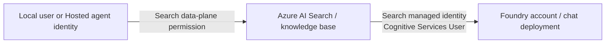

# Foundry IQ chat model with managed identity

**English** | [한국어](../ko/reference/iq-model-identity.md)

**Verified September 15, 2026: managed identity is a supported, working way to configure the IQ Chat completion model.**
Do not confuse authentication with the optional model-based retrieval mode.
The workshop's default model-free GA path is a curriculum choice, not evidence that managed identity or the portal model setting is unsupported.

## 1. Separate the callers and permissions



| Connection | Identity | Required check |
|---|---|---|
| Workshop client → Search | Signed-in user or the Hosted agent identity | Search query permission; object creation needs separate management permission |
| Search → IQ chat model | **The Search service's system-assigned or explicitly attached user-assigned identity** | `Cognitive Services User` on the target Foundry account; supported deployment and network access |
| Separate answer-generation step → model | The workshop client/Hosted identity | Its own model access, independent of the Search identity |

Giving a role to the user or Hosted agent does not give that role to Search.
`WORKSHOP_AUTH_MODE` and `AZURE_CLIENT_ID` configure this repository's Python caller; they do not configure Search's outbound model identity.
Managed identity support requires a Basic-or-higher Search service.

## 2. Normal portal configuration

After the instructor approves the configuration and costs:

1. Enable the Search service's managed identity if it is not already enabled.
2. On the **Foundry account hosting the model**, assign `Cognitive Services User` to that Search identity.
   Keep the scope at the training account, not the whole subscription. Allow RBAC propagation.
3. In the knowledge base, use **Chat completion model → Add model deployment**, choose the actual account/project and a supported deployment,
   and select **System assigned identity**. Foundry portal wording can differ.
4. Save the model binding. With API-key authentication disabled, the notice that Search will use managed identity is informational—not a reason to enable API keys.
5. For model-based planning, choose an appropriate reasoning effort such as `low`.
   Choose `answerSynthesis` if Search should generate the final answer, or `extractiveData` if another agent should do so.
6. Submit a synthetic question and inspect actual `modelQueryPlanning` activity.
   When synthesis is selected, also verify `modelAnswerSynthesis`, references, and the returned answer.

**`Chat completions model is required` means the form has no selected model; it is not proof of MI authentication failure.**
The old screenshot shows that missing-model state. It did not test an MI-backed model call.
Use a separate owned base when changing the execution path of a frozen evaluation.

## 3. Keep API mode separate from identity

| Path | Configuration and behavior |
|---|---|
| Default workshop, `2026-04-01` GA | Existing Search index source, explicit semantic `intents`, no KB model. Returns extractive evidence; the next workshop step generates the answer |
| Model-based Search-index retrieval, `2026-08-01-preview` | Model binding plus `messages` and reasoning effort such as `low`; Search invokes the model for planning |
| Same Preview path with `answerSynthesis` | Search also invokes the model for a citation-backed answer |

The current official guide requires a Preview API for an LLM with a **non-web Search-index source**.
The GA schema contains `models`, but that does not make every source/model operation generally available.
Likewise, Preview status does not mean managed identity is broken.
Check source type, API version, supported model, region, and selected mode separately.
`minimal` disables LLM query planning and requires extractive output; merely saving a model is not proof that it was invoked.

## 4. Keyless binding and the tested request

The following is a **configuration example**, not an automatically executed deployment.
Replace placeholders, use a new owned base, and get approval before sending a write.
The tested underlying model was `gpt-5.6-luna`, supported by the documented `2026-08-01-preview` contract.

```json
{
  "name": "<new-owned-knowledge-base>",
  "knowledgeSources": [{"name": "<existing-synthetic-source>"}],
  "models": [{
    "kind": "azureOpenAI",
    "azureOpenAIParameters": {
      "resourceUri": "https://<foundry-account>.openai.azure.com",
      "deploymentId": "<verified-chat-deployment>",
      "modelName": "gpt-5.6-luna",
      "authIdentity": null
    }
  }],
  "retrievalReasoningEffort": {"kind": "low"},
  "outputMode": "answerSynthesis"
}
```

Omit `apiKey`. With `authIdentity: null`, this binding uses the Search service's system-assigned identity.
For a user-assigned identity, attach it to Search and use the documented `DataUserAssignedIdentity` object with its full ARM resource ID.
Do not put a client secret, API key, or token into the model binding.
Use the account endpoint, not the project's `/api/projects/...` endpoint.

The successful test sent this request to the new base's `/retrieve?api-version=2026-08-01-preview`:

```json
{
  "messages": [{
    "role": "user",
    "content": [{"type": "text", "text": "<synthetic travel-policy question>"}]
  }],
  "retrievalReasoningEffort": {"kind": "low"},
  "outputMode": "answerSynthesis",
  "includeActivity": true,
  "maxRuntimeInSeconds": 60,
  "maxOutputSize": 6000,
  "knowledgeSourceParams": [{
    "kind": "searchIndex",
    "knowledgeSourceName": "<existing-synthetic-source>",
    "includeReferences": true,
    "includeReferenceSourceData": true
  }]
}
```

Our first request returned **HTTP 400** because the endpoint rejected `maxOutputSizeInTokens`.
That original request/error is retained. The corrected request used `maxOutputSize`, as in the Preview REST example.
The reference table also lists `maxOutputSizeInTokens`; do not assume a field works in every request mode merely because it appears in a combined schema.
This is a dated request-contract observation, not an MI failure or a change to the default GA request.
Do not assume the two size fields have interchangeable units or behavior.

## 5. Actual verification and cleanup

| Check | Observed result |
|---|---|
| Initial existing bases | Both Korean and English bases had `models: []`; neither exercised Search-to-model authentication |
| Search identity | System-assigned identity enabled on Basic Search in Sweden Central |
| Initial model role | No assignment for the Search identity was found; the Hosted identity's role was a different principal |
| Approved change | Added `Cognitive Services User` only on the existing workshop Foundry account |
| Key authentication | Disabled on Search and Foundry; no API key in the new binding |
| Temporary base | Preview, existing synthetic source, Luna model, `low`, `answerSynthesis` |
| Requests | First: parameter-validation 400. Second: **HTTP 200**, actual planning and answer synthesis |
| Model activity | Planning: 1,207 input / 101 output tokens; synthesis: 1,891 input / 370 output tokens, both reporting Luna |
| Answer | Correctly identified the KRW 150,000 lodging limit and advance approval for a KRW 170,000 hotel, with source references |
| Cleanup | Temporary base deleted and GET 404 confirmed; both original bases' ETags/configurations remained unchanged |

The explicitly approved Search model-access role remains. No model was deployed, no default subscription changed,
and no prompt/dataset/benchmark score or published recording was replaced.
This is a separate integration check, not an additional benchmark result.

[Verification record](../assets/iq-mi-20260915/verification.json) ·
[Official portal setup](https://learn.microsoft.com/azure/search/get-started-portal-agentic-retrieval#create-a-knowledge-base) ·
[Model support and identity prerequisites](https://learn.microsoft.com/azure/search/agentic-retrieval-how-to-create-knowledge-base) ·
[Reasoning modes](https://learn.microsoft.com/azure/search/agentic-retrieval-how-to-set-retrieval-reasoning-effort) ·
[Preview retrieve schema/example](https://learn.microsoft.com/rest/api/searchservice/knowledge-retrieval/retrieve?view=rest-searchservice-2026-08-01-preview&preserve-view=true)
