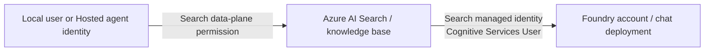

# Foundry IQ chat model with managed identity

**English** | [한국어](../ko/reference/iq-model-identity.md)

**Use this preset for the optional IQ Chat: deployment/model `gpt-5.6-luna`, version `2026-07-09`, authenticated with the
Search service's managed identity.** It is separate from the `gpt-6-sol` answer preset because Search rejected a GPT-6
knowledge-base binding on September 23, 2026. Prepare that deployment only for this optional branch ([model choice](model-choice.md)).

Managed identity is a supported, working way to configure the IQ Chat completion model. Do not confuse this authentication
with the optional model-based retrieval mode: the workshop keeps a model-free GA retrieval path and a separate Preview chat path,
and for the synthetic Search-index source the GA API does not support an LLM inside the KB.

<details>
<summary>Evidence history, September 15–23, 2026</summary>

- **September 15:** managed identity was verified as a supported, working way to configure the IQ Chat completion model.
- **September 17 portal check:** the already prepared English chat KB displayed **`gpt-5.6-luna` / Low / Answer synthesis**
  without the missing-model error ([configured screen](../labs/06-knowledge.md#iq-chat-model), not the old GA screenshot).
  The Luna deployment read back as model version **`2026-07-09`**, state **`Succeeded`**. That check did not save a KB,
  change roles, deploy a model or perform inference.
- **September 23:** the answer preset moved to `gpt-6-sol`; Search rejected a GPT-6 binding with
  `Unsupported model type in Knowledge Base Model Configuration`, and its accepted list ended with `gpt-5.6-luna`.

</details>

## First pass: use the fixed executable preset

Use **deployment/model `gpt-5.6-luna`, model version `2026-07-09`, Search system-assigned identity**.
Do not make a first-time learner choose among arbitrary chat models.
After [the owner prerequisites and synthetic seed](../setup.md#4-environment-owner-checklist) are complete,
use the original working copy with its matching `.env` and ownership ledger. First inspect:

```bash
python scripts/workshop.py --language en iq-chat check
```

If `ready_for_setup: true` and `configured: false`, the owner runs the following **only after approval to create the separate chat KB**.
If `configured: true`, keep that existing configuration and skip setup.

```bash
python scripts/workshop.py --language en iq-chat setup --confirm-create
```

Record the returned `knowledge_base` on the setup card and open **that exact name** in the portal.
Only after configuration checks pass and a new request is approved:

```bash
python scripts/workshop.py --language en iq-chat ask --label iq-chat-first --confirm-cost
```

This is the same sequence as the setup card, not another mandatory test. Do not repeat the paid request if it is already recorded.
`check` verifies the exact underlying model/version, Search identity/role and source without changing Azure.
`setup` creates a **separate owned** `<prefix>-chat-en-kb` (override: `AZURE_SEARCH_CHAT_KNOWLEDGE_BASE_NAME`).
It will not overwrite an unowned/mismatched base, deploy models, grant roles, or change the GA base.
`ask` preserves request/response/evidence under `outputs/iq-chat/<label>/` and requires actual `gpt-5.6-luna` planning **and** synthesis.
It rechecks the underlying model/version before the paid POST and rejects evidence that differs from the selected canonical language corpus.
`model-preflight.json`, `knowledge-base-response.json` and failure stages distinguish model preparation, KB reads, retrieval and answer validation.
The existing source returns `id`, `title`, and `content`, not separate date fields.
Only returned fields are compared with the canonical policy; missing date metadata is never invented.
The preset uses the tested `maxOutputSize` field. All new requests need a new label.

| Result/error | Do this next |
|---|---|
| `ready_for_setup: true`, `configured: false` | Owner runs the authorized `setup`; no chat base exists yet |
| `configured: true`, `model_inference_verified: false` | Configuration is ready; only the explicitly paid `ask` verifies inference |
| Wrong model/version or missing Search role | Owner fixes that prerequisite; do not switch deployment, identity or API key |
| Missing ownership ledger | Return to the same workshop copy that seeded the synthetic source; do not invent ownership |
| Existing base has another model/mode | Review it and choose a new owned name; no automatic rewrite |
| 403 / 429 / service error | Preserve `failure.json`; check RBAC propagation/network/quota before an explicitly new attempt |

A fixed model prevents avoidable mismatches, not outages or quota exhaustion.
The new command's live check on September 15 was **read-only** (`configured: false`); it did not create a permanent chat base.
The earlier actual model-call evidence below belongs to the separately approved temporary MI test.

## 1. Separate the callers and permissions



| Connection | Identity | Required check |
|---|---|---|
| Workshop client → Search | Signed-in user or the Hosted agent identity | Search query permission; object creation needs separate management permission |
| Search → IQ chat model | **The Search service's system-assigned or explicitly attached user-assigned identity** | `Cognitive Services User` on the target Foundry account; supported deployment and network access |
| Separate answer-generation step → model | The workshop client/Hosted identity | Its own model access, independent of the Search identity |

Giving a role to the user or Hosted agent does not give that role to Search.
`WORKSHOP_AUTH_MODE` and `AZURE_CLIENT_ID` configure this repository's Python caller; they do not configure Search's outbound model identity.
Managed identity support requires a Basic-or-higher Search service.

**Local preset caller:** `Reader` on the training Foundry account and Search service for model/role/object preflight,
plus `Search Index Data Reader` for retrieval. Existing Foundry project/model permissions still apply.
Reader alone cannot retrieve; the data-reader role alone cannot inspect object definitions.
Writers need their separately approved Search contributor roles. See the [official role matrix](https://learn.microsoft.com/azure/search/search-security-rbac#summary-of-permissions).
Do not add subscription-wide Owner merely to run a read-only check.

## 2. Normal portal configuration

Use the prepared preset rather than turning a model-free GA base into a different experiment:

1. The owner verifies the existing `gpt-5.6-luna` deployment, Search managed identity and the Search identity's
   `Cognitive Services User` role on the **model's Foundry account**. Only missing prerequisites need separately approved changes.
   A role assigned to the learner or Hosted identity is not a role assigned to Search.
2. Complete the **check → authorized setup** sequence above when the chat base does not yet exist.
   This saves the `gpt-5.6-luna`/MI/Low/Answer synthesis binding without deploying another model.
3. Open **Knowledge → Knowledge bases → the returned chat-base name**. Keep its model selection;
   confirm **`gpt-5.6-luna`**, **Low**, **Answer synthesis** and the correct synthetic source.
   No additional Save is needed to inspect an already prepared KB.
4. The gray API-key-disabled/managed-identity notice is informational. Do not enable keys to remove it.
   A red **`Chat completions model is required`** instead means no model is selected; first check that you opened the chat base, not `<prefix>-kb`.
5. Do not use **Browse more models → Deploy** to repair that form. On September 17, the Foundry picker offered a limited catalog,
   while the already saved `gpt-5.6-luna` binding rendered correctly. Catalog selection, deployment and opening a saved binding are different actions.
6. For an approved new request, use `iq-chat ask` and retain actual `modelQueryPlanning`, `modelAnswerSynthesis`,
   references and the answer. A filled form does not prove model invocation or role propagation.

If the correct chat base is missing or has different fields, stop and use the owner preparation above.
Do not clear the saved model, substitute a catalog recommendation, or change the old GA base just to remove a validation message.

## 3. Keep API mode separate from identity

| Path | Configuration and behavior |
|---|---|
| Default workshop, `2026-04-01` GA | Existing Search index source, explicit semantic `intents`, no KB model. Returns extractive evidence; the next workshop step generates the answer |
| Model-based Search-index retrieval, `2026-08-01-preview` | Model binding plus `messages` and reasoning effort such as `low`; Search invokes the model for planning |
| Same Preview path with `answerSynthesis` | Search also invokes the model for a citation-backed answer |

The current official guide requires a Preview API for an LLM with a **non-web Search-index source**.
The GA schema contains `models`, but that does not make every source/model operation generally available.
Likewise, Preview status does not mean managed identity is broken.
Check source type, API version, supported model, region, and selected mode separately.
`minimal` disables LLM query planning and requires extractive output; merely saving a model is not proof that it was invoked.

## 4. Keyless binding and the tested request

The following is a **configuration example**, not an automatically executed deployment.
Replace placeholders, use a new owned base, and get approval before sending a write.
The tested underlying model was `gpt-5.6-luna`, supported by the documented `2026-08-01-preview` contract.

```json
{
  "name": "<new-owned-knowledge-base>",
  "knowledgeSources": [{"name": "<existing-synthetic-source>"}],
  "models": [{
    "kind": "azureOpenAI",
    "azureOpenAIParameters": {
      "resourceUri": "https://<foundry-account>.openai.azure.com",
      "deploymentId": "gpt-5.6-luna",
      "modelName": "gpt-5.6-luna",
      "authIdentity": null
    }
  }],
  "retrievalReasoningEffort": {"kind": "low"},
  "outputMode": "answerSynthesis"
}
```

Omit `apiKey`. With `authIdentity: null`, this binding uses the Search service's system-assigned identity.
For a user-assigned identity, attach it to Search and use the documented `DataUserAssignedIdentity` object with its full ARM resource ID.
Do not put a client secret, API key, or token into the model binding.
Use the account endpoint, not the project's `/api/projects/...` endpoint.

The successful test sent this request to the new base's `/retrieve?api-version=2026-08-01-preview`:

```json
{
  "messages": [{
    "role": "user",
    "content": [{"type": "text", "text": "<synthetic travel-policy question>"}]
  }],
  "retrievalReasoningEffort": {"kind": "low"},
  "outputMode": "answerSynthesis",
  "includeActivity": true,
  "maxRuntimeInSeconds": 60,
  "maxOutputSize": 6000,
  "knowledgeSourceParams": [{
    "kind": "searchIndex",
    "knowledgeSourceName": "<existing-synthetic-source>",
    "includeReferences": true,
    "includeReferenceSourceData": true
  }]
}
```

Our first request returned **HTTP 400** because the endpoint rejected `maxOutputSizeInTokens`.
That original request/error is retained. The corrected request used `maxOutputSize`, as in the Preview REST example.
The reference table also lists `maxOutputSizeInTokens`; do not assume a field works in every request mode merely because it appears in a combined schema.
This is a dated request-contract observation, not an MI failure or a change to the default GA request.
Do not assume the two size fields have interchangeable units or behavior.

## 5. Actual verification and cleanup

| Check | Observed result |
|---|---|
| Initial existing bases | Both Korean and English bases had `models: []`; neither exercised Search-to-model authentication |
| Search identity | System-assigned identity enabled on Basic Search in Sweden Central |
| Initial model role | No assignment for the Search identity was found; the Hosted identity's role was a different principal |
| Approved change | Added `Cognitive Services User` only on the existing workshop Foundry account |
| Key authentication | Disabled on Search and Foundry; no API key in the new binding |
| Temporary base | Preview, existing synthetic source, Luna model, `low`, `answerSynthesis` |
| Requests | First: parameter-validation 400. Second: **HTTP 200**, actual planning and answer synthesis |
| Model activity | Planning: 1,207 input / 101 output tokens; synthesis: 1,891 input / 370 output tokens, both reporting Luna |
| Answer | Correctly identified the KRW 150,000 lodging limit and advance approval for a KRW 170,000 hotel, with source references |
| Cleanup | Temporary base deleted and GET 404 confirmed; both original bases' ETags/configurations remained unchanged |

The explicitly approved Search model-access role remains. No model was deployed, no default subscription changed,
and no prompt/dataset/benchmark score or published recording was replaced.
This is a separate integration check, not an additional benchmark result.

[Verification record](../assets/iq-mi-20260915/verification.json) ·
[Official portal setup](https://learn.microsoft.com/azure/search/get-started-portal-agentic-retrieval#create-a-knowledge-base) ·
[Model support and identity prerequisites](https://learn.microsoft.com/azure/search/agentic-retrieval-how-to-create-knowledge-base) ·
[Reasoning modes](https://learn.microsoft.com/azure/search/agentic-retrieval-how-to-set-retrieval-reasoning-effort) ·
[Preview retrieve schema/example](https://learn.microsoft.com/rest/api/searchservice/knowledge-retrieval/retrieve?view=rest-searchservice-2026-08-01-preview&preserve-view=true)
